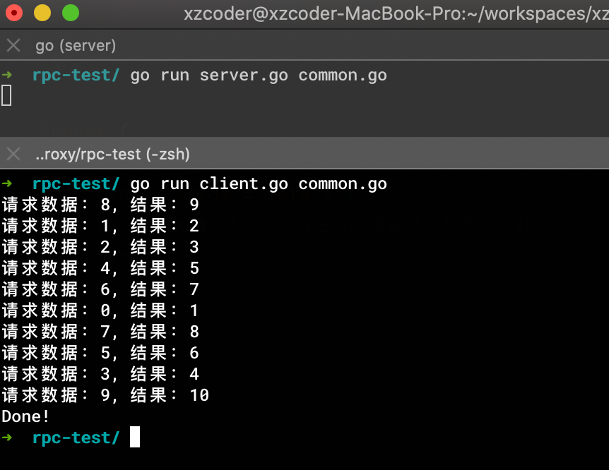

转载自: [网络编程篇：基于请求/响应模式的事务设计](https://xzcoder.com/posts/network/03-tcp-transaction.html)

- [网络编程篇：基于请求/响应模式的事务设计](#网络编程篇基于请求响应模式的事务设计)
  - [一、网络编程代码结构](#一网络编程代码结构)
  - [二、网络传输数据包](#二网络传输数据包)
  - [三、简单模拟 RPC 场景](#三简单模拟-rpc-场景)
      - [1. 事务数据包（TransactionPacket）](#1-事务数据包transactionpacket)
      - [2. 事务（Transaction）](#2-事务transaction)
      - [3. 事务管理器（TransactionManager）](#3-事务管理器transactionmanager)
  - [四、实战解决](#四实战解决)
    - [1. 定义事务接口](#1-定义事务接口)
    - [2. 实现事务接口](#2-实现事务接口)
    - [3. 定义事务管理器接口](#3-定义事务管理器接口)
    - [4. 实现事务管理器接口](#4-实现事务管理器接口)
    - [5. 对网络编程 API 进行封装](#5-对网络编程-api-进行封装)
  - [五、代码演示](#五代码演示)
    - [1. 定义数据包指令](#1-定义数据包指令)
    - [2. 服务端代码](#2-服务端代码)
    - [3. 客户端代码](#3-客户端代码)
    - [4. 运行测试](#4-运行测试)
  - [六、总结](#六总结)


# 网络编程篇：基于请求/响应模式的事务设计

本篇文章会介绍 TCP 网络编程中如何实现类似 HTTP 协议「基于请求/响应」的数据包传输设计和实现，以及对前面文章讲到的 协议握手、粘包处理 等进行 API 封装，作为后续「网络编程篇」应用实战开发的基础库。


## 一、网络编程代码结构

通过前面几篇文章的介绍，相信大家对网络开发的基础代码结构已有所了解，网络编程中分为服务端应用和客户端客户端应用。

服务端会监听某个`TCP`端口，等待客户端连接，当接收到客户端连接，为每个连接创建`goroutine` 来处理数据。

```go
// 监听端口
listen, _ := net.Listen("tcp", "0.0.0.0:51000")
for {
  // 接收客户端连接
  conn, err := listen.Accpect()
  // 为连接创建 goroutine
  go func() {
    // 读取数据包
    for {
      packet, _ := reader.Read(conn)
      // 为了可以同时处理一个连接发送的多个数据包，创建新的 goroutine
      // 根据数据包指令进行处理
      go func() {
        switch(p.Cmd) {
        case CmdXxx:
          // handle CmdXxx
        case CmdYyy:
          // handle CmdYyy
        }
      }()
    }
  }()
}
```

而客户端会主动对服务端发起连接，建立连接后会创建 `goroutine` 来处理服务端发送过来的数据包，或根据业务主动向服务端发送数据包。

```go
conn, _ := net.Dial("tcp", "127.0.0.1:51000")
// 创建 goroutine 处理接收到的数据包
go func() {
  for {
    packet, _ := reader.Read(conn)
    // 处理数据包……
  }
}()

// 向服务端发送数据包……
writer.Write(p)
```

## 二、网络传输数据包

我们通过「封包」解决了 `TCP粘包` 问题，并定义了「`Cmd`+`TransactionId`+`Data`」的统一数据包结构（`Packet`)

```go
// Packet Network Transfer Packet
type Packet struct {
	Cmd           int32
	TransactionId int32
	Data          []byte
}
```

其中`Cmd`代表数据包指令，如前文的`EcohServer`服务中定义了如下两个指令。

```go
const (
	// CmdMsg 发送消息指令（服务端和客户端都需要处理）
	CmdMsg int32 = iota + 1
	// CmdExit 退出指令（由客户端发送，服务端断开连接）
	CmdExit
)
```

**通过前面的设计，在某些场景下仍有不足，下面我会举例来进行详细说明**

## 三、简单模拟 RPC 场景

假设服务端定义了数据包指令：`CmdCalc`，客户端发送`CmdCalc`包给服务端，服务端对数据包参数进行运算后将运算结果再发送回客户端，我们回遇到下面几个问题

1. 当客户端并发调用服务端运算时，服务端不能保证响应结果的数据包顺序与客户端请求的数据包顺序一致，那么客户端则无法知道每个数据包运算对应的正确结果，伪代码演示如下：

```go
go func() {
  packet, _ := reader.Read(conn)
  // 接收到的 packet 响应的是哪个计算请求呢？
}()
// 同时发送10个 计算请求数据包 给服务端
for i := 0; i < 10; i++ {
  go func() {
    // 发送 CmdCalc 计算请求数据包
    writer.Write(p)
  }
}
```

2. 我们希望每个发送 `CmdCalc` 数据包的 `goroutine` 都可以阻塞等待服务端响应结果后再继续执行

```go
for i := 0; i < 10; i++ {
  go func() {
    // 发送 CmdCalc 计算请求数据包
    writer.Write(p)
    // 希望当前 goroutine 阻塞等待服务端返回计算结果……
    result := xxx
    fmt.Printf("计算请求%d：%v, 结果：%v\n", i, p, result)
  }
}
```

**解决思路：**
1.  给这类数据包生成一个唯一`Id`并发送给服务端。
2.  服务端发送结果包时带上请求的唯一`Id`。
3.  客户端接收结果数据包后根据`Id`得知时哪个请求对接的结果。
4.  客户端可以通过`sync.WaitGroup`时发送请求的 `goroutine` 进入堵塞状态，而处理服务端发送的数据包的 `goroutine` 在接受到对应的结果后调用 `wg.Done()` 是堵塞的 `goroutine` 恢复执行。

**通过解决思路抽象出几个概念：**

#### 1. 事务数据包（TransactionPacket）

事务数据包分为 「事务请求数据包」和「事务响应(回调)数据包」。请求包`RequestPacket`中携带了这个事务的唯一标识`TransactionId`，而响应包`CallbackPacket`中也包含了这个`TransactionId`，为了对响应包进行统一处理，可以规定响应包的指令为 `CmdCallbackPacket=-1`

#### 2. 事务（Transaction）

当想要对某个数据包的响应结果进行处理时，我们会创建一个事务并发送事物请求包。事务会记录当前是否已接接受到响应包（事务是否完成）

#### 3. 事务管理器（TransactionManager）

事务管理器统一创建当前连接的事务，生成唯一的`TransactionId`。并统一处理当前连接所有的事务响应包，通过响应包中的事务 Id，并通知到对应的事务。

## 四、实战解决

### 1. 定义事务接口

```go
// file: transaction/transaction.go
type Transaction interface {
	// GetId 获取事务Id
	GetId() int32
	// GetPacket 获取事务请求包
	GetPacket() *packet.Packet
	// GetCallbackPacket 获取事务响应包
	GetCallbackPacket() *packet.Packet
	// Wait 阻塞 goroutine 直到事务完成（接收到响应包）
	Wait() error
	// ThenCallback 异步等待事务完成并处理事务响应包
	ThenCallback(func(*packet.Packet))
}
```

### 2. 实现事务接口

> 通过 `sync.WaitGroup` 阻塞 `goroutine`

```go
// file: transaction/default.go
type DefaultTransaction struct {
	Id             int32
	Packet         *packet.Packet
	callbackPacket *packet.Packet
	wg             *sync.WaitGroup
	// isWait value see Waiting, NotWaiting
	isWait uint32
}
// 创建事务，Id 事务Id， cmd 请求包指令
func NewDefaultTransaction(id int32, cmd int32, data []byte) *DefaultTransaction {
	p := packet.NewPacketTransaction(cmd, id, data)
	var wg sync.WaitGroup
	wg.Add(1)
	return &DefaultTransaction{
		Id:     id,
		Packet: p,
		wg:     &wg,
	}
}
// 忽略 GetId、GetPacket、callbackPacket 方法实现……
// 通过 wg.Wait() 阻塞 goroutine，等待事务完成
func (t *DefaultTransaction) Wait() error {
	if !atomic.CompareAndSwapUint32(&t.isWait, NotWaiting, Waiting) {
		return errors.New("WaitGroup is always wait")
	}
	t.isWait = Waiting
	t.wg.Wait()
	return nil
}
// 异步等待事务完成，并调用回调方法传递事务响应包
func (t *DefaultTransaction) ThenCallback(cb func(*packet.Packet)) {
	go func() {
		_ = t.Wait()
		cb(t.GetCallbackPacket())
	}()
}
// 得到事务响应包并完成事务
// 私有方法不对外提供，通过事务管理器统一调用
func (t *DefaultTransaction) done(callbackPacket *packet.Packet) {
	t.callbackPacket = callbackPacket
	t.wg.Done()
}
```

### 3. 定义事务管理器接口

```go
// file: transaction/transaction.go
type Manager interface {
	// CreateTransaction 创建并开启事务
	CreateTransaction(cmd int32, data []byte) Transaction
	// CreateCallbackPacket 创建事务响应包
	CreateCallbackPacket(transactionId int32, data []byte) *packet.Packet
  // 判断数据包是否为事务响应包
	IsCallbackPacket(p *packet.Packet) bool
	// DoneTransaction 设置对应的事务响应结果并完成事务
	DoneTransaction(p *packet.Packet) error
}
```

### 4. 实现事务管理器接口

```go
// file: transaction/default.go
type DefaultManager struct {
	CallbackCmd    int32
  // 通过 map 存储事务
	transactionMap map[int32]*DefaultTransaction
	rd             *rand.Rand
	lock           sync.Mutex
}
// 下面只列举关键的 CreateTransaction、DoneTransaction 方法实现
// 创建事务，并存储到 transactionMap 中
func (m *DefaultManager) CreateTransaction(cmd int32, data []byte) Transaction {
	m.lock.Lock()
	defer m.lock.Unlock()
	id := m.generateTransactionId()
	ts := NewDefaultTransaction(id, cmd, data)
	m.transactionMap[id] = ts
	return ts
}
// 根据 transactionId 找到对应的事务，调用事务 done 方法完成事务，并从 transactionMap 中删除
func (m *DefaultManager) DoneTransaction(p *packet.Packet) error {
	if !m.IsCallbackPacket(p) {
		return errors.New("packet is not callback cmd")
	}
	m.lock.Lock()
	defer m.lock.Unlock()
	id := p.TransactionId
	ts, ok := m.transactionMap[id]
	if !ok {
		log.Printf("callback transactionId %d not found!\n", id)
		return nil
	}
	ts.done(p)
	delete(m.transactionMap, id)
	return nil
}
```

### 5. 对网络编程 API 进行封装

通过前面的步骤，已经完成了事务处理的代码开发。为了后续开发实战应用时减少对基础代码的重复编写，所以我对 协议握手、封包处理、事务处理 进行了`API`封装，让后续开发可以更加简单且更多关注核心的业务代码。

封装步骤本篇文章就不进行介绍了，代码已经提交`GitHub`，大家可以直接安装使用，文末附代码地址。

## 五、代码演示

下面基于事务处理以及`API`的封装，来解决上面距离的`RPC`调用场景。

客户端同时发送 10 个计算请求数据包，服务端接收到数据包中的 `int32`数值后将数值+1 并响应给客户端。

### 1. 定义数据包指令

```go
const CmdCalc int32 = 1
```

### 2. 服务端代码

定义处理`CmdCalc`指令的`PacketHandler`

```go
func NewCalcPacketHandler() *nets.PacketHandler {
	return &nets.PacketHandler{
		Name: "CalcPacketHandler",
		Cmd:  CmdCalc,
		Action: func(ctx *nets.Context, p *packet.Packet) error {
      // 读取请求数值并+1得到结果
			result := utils.Byte2Int(p.Data) + 1
      // 调用事务管理器创建事务响应包
			callbackPacket := ctx.TransactionManager.CreateCallbackPacket(p.TransactionId, utils.Int2Byte(result))
      // 发送事务响应包
			return ctx.WritePacket(callbackPacket)
		},
	}
}
```

服务端主体代码

```go
listen, _ := nets.Listen("tcp", ServerAddr, func(conn net.Conn) *nets.Conn {
  return &nets.Conn{
    Conn:               conn,
    // 协议握手处理器
    HandshakeHandler:   handshake.NewVersionServerHandler(ServerVersion),
    // Packet Reader / Writer
    Reader:             packet.NewReader(conn),
    Writer:             packet.NewWriter(conn),
    // 每个连接创建事务管理器
    TransactionManager: transaction.NewManager(),
    PacketHandlers: []*nets.PacketHandler{
      // 事务响应包处理器
      nets.DefaultTransactionPacketHandler,
      // CmdCalc 指令数据包处理器
      NewCalcPacketHandler(),
    }
  }
})
for {
  conn, _ := listen.Accept()
  go func() {
    _ = conn.Handshake()
    // 处理数据包
    conn.HandlePacket()
  }()
}
```

### 3. 客户端代码

创建连接并处理握手

```go
conn, err := nets.Dial("tcp", ServerAddr, func(conn net.Conn) *nets.Conn {
  return &nets.Conn{
    Conn:               conn,
    // 协议握手处理器
    HandshakeHandler:   handshake.NewVersionClientHandler(ClientVersion),
    // Packet Reader / Writer
    Reader:             packet.NewReader(conn),
    Writer:             packet.NewWriter(conn),
    // 事务响应数据包处理器
    PacketHandlers:     []*nets.PacketHandler{nets.DefaultTransactionPacketHandler},
    // 创建事务管理器
    TransactionManager: transaction.NewManager(),
  }
})
_ = conn.Handshake()
go conn.HandlePacket()
```

发送计算数据包

```go
var wg sync.WaitGroup
for i := 0; i < 10; i++ {
  wg.Add(1)
  num := i
  go func() {
    // 通过事务管理器创建事
    t := conn.TransactionManager.CreateTransaction(CmdCalc, utils.Int2Byte(int32(num)))
    // 发送事务请求包
    _ = conn.WritePacket(t.GetPacket())
    // 异步等待事务完成并打印结果
    t.ThenCallback(func(p *packet.Packet) {
      defer wg.Done()
      fmt.Printf("请求数据：%d, 结果：%d\n", num, utils.Byte2Int(p.Data))
    })
  }()
}
// 等待所有请求都响应完成
wg.Wait()
fmt.Println("Done!")
```

### 4. 运行测试



**OK，到此已经通过事务设计完美实现了「请求/响应」模式开发！**

## 六、总结

这篇文章涉及的代码量较多，我只列举了事务相关的关键代码，完整代码已上传`GitHub`供大家参考，有什么设计不足还请大佬指点！对应的 `Java(Netty)` 版本代码可关注订阅号发送消息领取哦～

```bash
# GitHub：https://github.com/zs-java/libgo-common
# 安装使用
go get -u github.com/zs-java/libgo-common/nets
```
