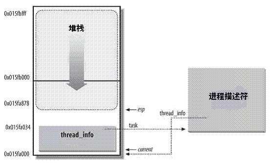

# Linux进程的管理与调度（一） - Linux进程描述符task_struct结构体

Linux内核通过一个被称为进程描述符的`task_struct`结构体来管理进程，这个结构体包含了一个进程所需的所有信息。它定义在`include/linux/sched.h`文件中。

谈到`task_struct`结构体，可以说她是linux内核源码中最复杂的一个结构体了，成员之多，占用内存之大。


## 进程状态

```c
 /*
  * Task state bitmask. NOTE! These bits are also
  * encoded in fs/proc/array.c: get_task_state().
  *
  * We have two separate sets of flags: task->state
  * is about runnability, while task->exit_state are
  * about the task exiting. Confusing, but this way
  * modifying one set can't modify the other one by
  * mistake.
  */
 #define TASK_RUNNING            0
 #define TASK_INTERRUPTIBLE      1
 #define TASK_UNINTERRUPTIBLE    2
 #define __TASK_STOPPED          4
 #define __TASK_TRACED           8

/* in tsk->exit_state */
 #define EXIT_DEAD               16
 #define EXIT_ZOMBIE             32
 #define EXIT_TRACE              (EXIT_ZOMBIE | EXIT_DEAD)

/* in tsk->state again */
 #define TASK_DEAD               64
 #define TASK_WAKEKILL           128    /** wake on signals that are deadly **/
 #define TASK_WAKING             256
 #define TASK_PARKED             512
 #define TASK_NOLOAD             1024
 #define TASK_STATE_MAX          2048

 /* Convenience macros for the sake of set_task_state */
#define TASK_KILLABLE           (TASK_WAKEKILL | TASK_UNINTERRUPTIBLE)
#define TASK_STOPPED            (TASK_WAKEKILL | __TASK_STOPPED)
#define TASK_TRACED             (TASK_WAKEKILL | __TASK_TRACED)
```


## 5个互斥状态

| 状态  | 描述  |
| --- | --- |
| TASK\_RUNNING | 表示进程要么正在执行，要么正要准备执行（已经就绪），正在等待cpu时间片的调度 |
| TASK\_INTERRUPTIBLE | 进程因为等待一些条件而被挂起（阻塞）而所处的状态。这些条件主要包括：硬中断、资源、一些信号……，一旦等待的条件成立，进程就会从该状态（阻塞）迅速转化成为就绪状态TASK\_RUNNING |
| TASK\_UNINTERRUPTIBLE | 意义与TASK\_INTERRUPTIBLE类似，除了不能通过接受一个信号来唤醒以外，对于处于TASK\_UNINTERRUPIBLE状态的进程，哪怕我们传递一个信号或者有一个外部中断都不能唤醒他们。只有它所等待的资源可用的时候，他才会被唤醒。这个标志很少用，但是并不代表没有任何用处，其实他的作用非常大，特别是对于驱动刺探相关的硬件过程很重要，这个刺探过程不能被一些其他的东西给中断，否则就会让进城进入不可预测的状态 |
| TASK\_STOPPED | 进程被停止执行，当进程接收到SIGSTOP、SIGTTIN、SIGTSTP或者SIGTTOU信号之后就会进入该状态 |
| TASK\_TRACED | 表示进程被debugger等进程监视，进程执行被调试程序所停止，当一个进程被另外的进程所监视，每一个信号都会让进城进入该状态 |


## 2个终止状态

其实还有两个附加的进程状态既可以被添加到state域中，又可以被添加到exit\_state域中。只有当进程终止的时候，才会达到这两种状态.

```cpp
/* task state */
int exit_state;
int exit_code, exit_signal;
```

| 状态  | 描述  |
| --- | --- |
| EXIT\_ZOMBIE | 进程的执行被终止，但是其父进程还没有使用wait()等系统调用来获知它的终止信息，此时进程成为僵尸进程 |
| EXIT\_DEAD | 进程的最终状态 |

而`int exit_code`, `exit_signal`;我们会在后面进程介绍


## 新增睡眠状态

如前所述，进程状态 TASK\_UNINTERRUPTIBLE 和 TASK\_INTERRUPTIBLE 都是睡眠状态。现在，我们来看看内核如何将进程置为睡眠状态。

### 内核如何将进程置为睡眠状态

Linux 内核提供了两种方法将进程置为睡眠状态。

将进程置为睡眠状态的普通方法是将进程状态设置为 TASK\_INTERRUPTIBLE 或 TASK\_UNINTERRUPTIBLE 并调用调度程序的 schedule() 函数。这样会将进程从 CPU 运行队列中移除。

*   如果进程处于可中断模式的睡眠状态（通过将其状态设置为 TASK\_INTERRUPTIBLE），那么可以通过显式的唤醒呼叫（wakeup\_process()）或需要处理的信号来唤醒它。
    
*   但是，如果进程处于非可中断模式的睡眠状态（通过将其状态设置为 TASK\_UNINTERRUPTIBLE），那么只能通过显式的唤醒呼叫将其唤醒。除非万不得已，否则我们建议您将进程置为可中断睡眠模式，而不是不可中断睡眠模式（比如说在设备 I/O 期间，处理信号非常困难时）。
    

当处于可中断睡眠模式的任务接收到信号时，它需要处理该信号（除非它已被屏弊），离开之前正在处理的任务（此处需要清除代码），并将 -EINTR 返回给用户空间。再一次，检查这些返回代码和采取适当操作的工作将由程序员完成。

因此，懒惰的程序员可能比较喜欢将进程置为不可中断模式的睡眠状态，因为信号不会唤醒这类任务。

但需要注意的一种情况是，对不可中断睡眠模式的进程的唤醒呼叫可能会由于某些原因不会发生，这会使进程无法被终止，从而最终引发问题，因为惟一的解决方法就是重启系统。一方面，您需要考虑一些细节，因为不这样做会在内核端和用户端引入 bug。另一方面，您可能会生成永远不会停止的进程（被阻塞且无法终止的进程）。

现在，我们在内核中实现了一种新的睡眠方法

Linux Kernel 2.6.25 引入了一种新的进程睡眠状态，

| 状态  | 描述  |
| --- | --- |
| TASK\_KILLABLE | 当进程处于这种可以终止的新睡眠状态中，它的运行原理类似于 TASK\_UNINTERRUPTIBLE，只不过可以响应致命信号 |

它定义如下：

```cpp
#define TASK_WAKEKILL           128 /** wake on signals that are deadly **/

/* Convenience macros for the sake of set_task_state */
#define TASK_KILLABLE           (TASK_WAKEKILL | TASK_UNINTERRUPTIBLE)
#define TASK_STOPPED            (TASK_WAKEKILL | __TASK_STOPPED)
#define TASK_TRACED             (TASK_WAKEKILL | __TASK_TRACED)
```

换句话说，TASK\_UNINTERRUPTIBLE + TASK\_WAKEKILL = TASK\_KILLABLE。

而TASK\_WAKEKILL 用于在接收到致命信号时唤醒进程

新的睡眠状态允许 TASK\_UNINTERRUPTIBLE 响应致命信号

进程状态的切换过程和原因大致如下图


## 进程标识符（PID）

```cpp
pid_t pid;  
pid_t tgid;  
```

Unix系统通过pid来标识进程，linux把不同的pid与系统中每个进程或轻量级线程关联，而unix程序员希望同一组线程具有共同的pid，遵照这个标准linux引入线程组的概念。一个线程组所有线程与领头线程具有相同的pid，存入tgid字段，getpid()返回当前进程的tgid值而不是pid的值。

在CONFIG\_BASE\_SMALL配置为0的情况下，PID的取值范围是0到32767，即系统中的进程数最大为32768个。

```cpp
#define PID_MAX_DEFAULT (CONFIG_BASE_SMALL ? 0x1000 : 0x8000)  
```

在Linux系统中，一个线程组中的所有线程使用和该线程组的领头线程（该组中的第一个轻量级进程）相同的PID，并被存放在tgid成员中。只有线程组的领头线程的pid成员才会被设置为与tgid相同的值。注意，getpid()系统调用返回的是当前进程的tgid值而不是pid值。


## 进程内核栈

```cpp
void *stack;  
```


## 内核栈与线程描述符

对每个进程，Linux内核都把两个不同的数据结构紧凑的存放在一个单独为进程分配的内存区域中;

*   一个是内核态的进程堆栈
*   另一个是紧挨着进程描述符的小数据结构thread\_info，叫做线程描述符。

Linux把thread\_info（线程描述符）和内核态的线程堆栈存放在一起，这块区域通常是8192K（占两个页框），其实地址必须是8192的整数倍。

在linux/arch/x86/include/asm/page\_32\_types.h中，

```cpp
#define THREAD_SIZE_ORDER    1
#define THREAD_SIZE        (PAGE_SIZE << THREAD_SIZE_ORDER)
```

出于效率考虑，内核让这8K空间占据连续的两个页框并让第一个页框的起始地址是213的倍数。

内核态的进程访问处于内核数据段的栈，这个栈不同于用户态的进程所用的栈。

用户态进程所用的栈，是在进程线性地址空间中；

而内核栈是当进程从用户空间进入内核空间时，特权级发生变化，需要切换堆栈，那么内核空间中使用的就是这个内核栈。因为内核控制路径使用很少的栈空间，所以只需要几千个字节的内核态堆栈。

> 需要注意的是，内核态堆栈仅用于内核例程，Linux内核另外为中断提供了单独的硬中断栈和软中断栈

下图中显示了在物理内存中存放两种数据结构的方式。线程描述符驻留与这个内存区的开始，而栈顶末端向下增长。 下图摘自ULK3,进程内核栈与进程描述符的关系如下图：



但是较新的内核代码中，进程描述符task\_struct结构中没有直接指向thread\_info结构的指针，而是用一个void指针类型的成员表示，然后通过类型转换来访问thread\_info结构。

相关代码在include/linux/sched.h中

```scss
#define task_thread_info(task)  ((struct thread_info *)(task)->stack)
```

在这个图中，esp寄存器是CPU栈指针，用来存放栈顶单元的地址。在80x86系统中，栈起始于顶端，并朝着这个内存区开始的方向增长。从用户态刚切换到内核态以后，进程的内核栈总是空的。因此，esp寄存器指向这个栈的顶端。一旦数据写入堆栈，esp的值就递减。


## 内核栈数据结构描述thread\_info和thread\_union

thread\_info是体系结构相关的，结构的定义在thread\_info.h中

Linux内核中使用一个联合体来表示一个进程的线程描述符和内核栈：

```cpp
union thread_union
{
    struct thread_info thread_info;
    unsigned long stack[THREAD_SIZE/sizeof(long)];
};
```


## 获取当前在CPU上正在运行进程的thread\_info

下面来说说如何通过esp栈指针来获取当前在CPU上正在运行进程的thread\_info结构。

实际上，上面提到，thread\_info结构和内核态堆栈是紧密结合在一起的，占据两个页框的物理内存空间。而且，这两个页框的起始起始地址是213对齐的。

早期的版本中，不需要对64位处理器的支持，所以，内核通过简单的屏蔽掉esp的低13位有效位就可以获得thread\_info结构的基地址了。

我们在下面对比了，获取正在运行的进程的thread\_info的实现方式

| 架构  | 版本  | 定义链接 | 实现方式 | 思路解析 |
| --- | --- | --- | --- | --- |
| x86 | 3.14 | current\_thread\_info(void) | return (struct thread\_info \*)(sp & ~(THREAD\_SIZE - 1)); | 屏蔽了esp的低十三位，最终得到的是thread\_info的地址 |
| x86 | 3.15 | current\_thread\_info(void) | ti = (void \*)(this\_cpu\_read\_stable(kernel\_stack) + KERNEL\_STACK\_OFFSET - THREAD\_SIZE); |     |
| x86 | 4.1 | current\_thread\_info(void) | (struct thread\_info \*)(current\_top\_of\_stack() - THREAD\_SIZE); |     |

> 早期版本  
> 当前的栈指针(current\_stack\_pointer == sp)就是esp，  
> THREAD\_SIZE为8K，二进制的表示为0000 0000 0000 0000 0010 0000 0000 0000。  
> ~(THREAD\_SIZE-1)的结果刚好为1111 1111 1111 1111 1110 0000 0000 0000，第十三位是全为零，也就是刚好屏蔽了esp的低十三位，最终得到的是thread\_info的地址。

进程最常用的是进程描述符结构task\_struct而不是thread\_info结构的地址。为了获取当前CPU上运行进程的task\_struct结构，内核提供了current宏，由于task\_struct \*task在thread\_info的起始位置，该宏本质上等价于current\_thread\_info()->task，在include/asm-generic/current.h中定义：

```scss
#define get_current() (current_thread_info()->task)
#define current get_current()
```


## 分配和销毁thread\_info

进程通过`alloc_thread_info_node`函数分配它的内核栈，通过`free_thread_info`函数释放所分配的内核栈。

```cpp
# if THREAD_SIZE >= PAGE_SIZE
static struct thread_info *alloc_thread_info_node(struct task_struct *tsk,
                          int node)
{
    struct page *page = alloc_kmem_pages_node(node, THREADINFO_GFP,
                          THREAD_SIZE_ORDER);

    return page ? page_address(page) : NULL;
}

static inline void free_thread_info(struct thread_info *ti)
{
    free_kmem_pages((unsigned long)ti, THREAD_SIZE_ORDER);
}
# else
static struct kmem_cache *thread_info_cache;

static struct thread_info *alloc_thread_info_node(struct task_struct *tsk,
                          int node)
{
    return kmem_cache_alloc_node(thread_info_cache, THREADINFO_GFP, node);
}

static void free_thread_info(struct thread_info *ti)
{
    kmem_cache_free(thread_info_cache, ti);
}
```


## 进程标记

```cpp
unsigned int flags; /* per process flags, defined below */  
```

反应进程状态的信息，但不是运行状态，用于内核识别进程当前的状态，以备下一步操作

flags成员的可能取值如下，这些宏以PF(ProcessFlag)开头

> 参见  
> [http://lxr.free-electrons.com/source/include/linux/sched.h？v4.5#L2083](http://lxr.free-electrons.com/source/include/linux/sched.h%EF%BC%9Fv4.5#L2083)  
> 例如  
> PF\_FORKNOEXEC 进程刚创建，但还没执行。  
> PF\_SUPERPRIV 超级用户特权。  
> PF\_DUMPCORE dumped core。  
> PF\_SIGNALED 进程被信号(signal)杀出。  
> PF\_EXITING 进程开始关闭。

```cpp
/*
* Per process flags
*/
#define PF_EXITING      0x00000004      /* getting shut down */
#define PF_EXITPIDONE   0x00000008      /* pi exit done on shut down */
#define PF_VCPU         0x00000010      /* I'm a virtual CPU */
#define PF_WQ_WORKER    0x00000020      /* I'm a workqueue worker */
#define PF_FORKNOEXEC   0x00000040      /* forked but didn't exec */
#define PF_MCE_PROCESS  0x00000080      /* process policy on mce errors */
#define PF_SUPERPRIV    0x00000100      /* used super-user privileges */
#define PF_DUMPCORE     0x00000200      /* dumped core */
#define PF_SIGNALED     0x00000400      /* killed by a signal */
#define PF_MEMALLOC     0x00000800      /* Allocating memory */
#define PF_NPROC_EXCEEDED 0x00001000    /* set_user noticed that RLIMIT_NPROC was exceeded */
#define PF_USED_MATH    0x00002000      /* if unset the fpu must be initialized before use */
#define PF_USED_ASYNC   0x00004000      /* used async_schedule*(), used by module init */
#define PF_NOFREEZE     0x00008000      /* this thread should not be frozen */
#define PF_FROZEN       0x00010000      /* frozen for system suspend */
#define PF_FSTRANS      0x00020000      /* inside a filesystem transaction */
#define PF_KSWAPD       0x00040000      /* I am kswapd */
#define PF_MEMALLOC_NOIO 0x00080000     /* Allocating memory without IO involved */
#define PF_LESS_THROTTLE 0x00100000     /* Throttle me less: I clean memory */
#define PF_KTHREAD      0x00200000      /* I am a kernel thread */
#define PF_RANDOMIZE    0x00400000      /* randomize virtual address space */
#define PF_SWAPWRITE    0x00800000      /* Allowed to write to swap */
#define PF_NO_SETAFFINITY 0x04000000    /* Userland is not allowed to meddle with cpus_allowed */
#define PF_MCE_EARLY    0x08000000      /* Early kill for mce process policy */
#define PF_MUTEX_TESTER 0x20000000      /* Thread belongs to the rt mutex tester */
#define PF_FREEZER_SKIP 0x40000000      /* Freezer should not count it as freezable */
#define PF_SUSPEND_TASK 0x80000000      /* this thread called freeze_processes and should not be frozen */
```


## 表示进程亲属关系的成员

```cpp
/*
 * pointers to (original) parent process, youngest child, younger sibling,
 * older sibling, respectively.  (p->father can be replaced with
 * p->real_parent->pid)
 */
struct task_struct __rcu *real_parent; /* real parent process */
struct task_struct __rcu *parent; /* recipient of SIGCHLD, wait4() reports */
/*
 * children/sibling forms the list of my natural children
 */
struct list_head children;      /* list of my children */
struct list_head sibling;       /* linkage in my parent's children list */
struct task_struct *group_leader;       /* threadgroup leader */
```

在Linux系统中，所有进程之间都有着直接或间接地联系，每个进程都有其父进程，也可能有零个或多个子进程。拥有同一父进程的所有进程具有兄弟关系。

| 字段  | 描述  |
| --- | --- |
| real\_parent | 指向其父进程，如果创建它的父进程不再存在，则指向PID为1的init进程 |
| parent | 指向其父进程，当它终止时，必须向它的父进程发送信号。它的值通常与real\_parent相同 |
| children | 表示链表的头部，链表中的所有元素都是它的子进程 |
| sibling | 用于把当前进程插入到兄弟链表中 |
| group\_leader | 指向其所在进程组的领头进程 |
