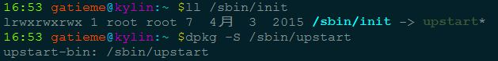
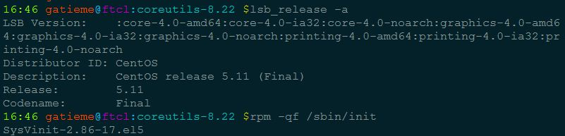

# Linux下1号进程的前世(kernel_init)今生(init进程)----Linux进程的管理与调度（六）

前面我们了解到了0号进程是系统所有进程的先祖, 它的进程描述符init\_task是内核静态创建的, 而它在进行初始化的时候, 通过kernel\_thread的方式创建了两个内核线程，分别是kernel\_init和kthreadd，其中kernel\_init进程号为1

> start\_kernel在其最后一个函数rest\_init的调用中，会通过kernel\_thread来生成一个内核进程，后者则会在新进程环境下调 用kernel\_init函数，kernel\_init一个让人感兴趣的地方在于它会调用run\_init\_process来执行根文件系统下的 /sbin/init等程序：

### kernel\_init

0号进程创建1号进程的方式如下

```objectivec
kernel_thread(kernel_init, NULL, CLONE_FS);
```

我们发现1号进程的执行函数就是kernel\_init, 这个函数被定义init/main.c中，如下所示

> kernel\_init函数将完成设备驱动程序的初始化，并调用init\_post函数启动用户空间的init进程。

由0号进程创建1号进程（内核态），1号内核线程负责执行内核的部分初始化工作及进行系统配置，并创建若干个用于高速缓存和虚拟主存管理的内核线程。

### init进程

随后，1号进程调用do\_execve运行可执行程序init，并演变成用户态1号进程，即init进程。

init进程是linux内核启动的第一个用户级进程。init有许多很重要的任务，比如像启动getty（用于用户登录）、实现运行级别、以及处理孤立进程。

它按照配置文件/etc/initab的要求，完成系统启动工作，创建编号为1号、2号…的若干终端注册进程getty。

每个getty进程设置其进程组标识号，并监视配置到系统终端的接口线路。当检测到来自终端的连接信号时，getty进程将通过函数do\_execve（）执行注册程序login，此时用户就可输入注册名和密码进入登录过程，如果成功，由login程序再通过函数execv（）执行shell，该shell进程接收getty进程的pid，取代原来的getty进程。再由shell直接或间接地产生其他进程。

上述过程可描述为：0号进程->1号内核进程->1号用户进程（init进程）->getty进程->shell进程

注意，上述过程描述中提到：1号内核进程调用执行init函数并演变成1号用户态进程（init进程），这里前者是init是函数，后者是进程。两者容易混淆，区别如下：

1.  kernel\_init函数在内核态运行，是内核代码
2.  init进程是内核启动并运行的第一个用户进程，运行在用户态下。
3.  一号内核进程调用execve()从文件/etc/inittab中加载可执行程序init并执行，这个过程并没有使用调用do\_fork()，因此两个进程都是1号进程。

当内核启动了自己之后（已被装入内存、已经开始运行、已经初始化了所有的设备驱动程序和数据结构等等），通过启动用户级程序init来完成引导进程的内核部分。因此，init总是第一个进程（它的进程号总是1）。

当init开始运行，它通过执行一些管理任务来结束引导进程，例如检查文件系统、清理/tmp、启动各种服务以及为每个终端和虚拟控制台启动getty，在这些地方用户将登录系统。

在系统完全起来之后，init为每个用户已退出的终端重启getty（这样下一个用户就可以登录）。init同样也收集孤立的进程：当一个进程启动了一个子进程并且在子进程之前终止了，这个子进程立刻成为init的子进程。对于各种技术方面的原因来说这是很重要的，知道这些也是有好处的，因为这便于理解进程列表和进程树图。init的变种很少。绝大多数Linux发行版本使用sysinit（由Miguel van Smoorenburg著），它是基于System V的init设计。UNIX的BSD版本有一个不同的init。最主要的不同在于运行级别：System V有而BSD没有（至少是传统上说）。这种区别并不是主要的。在此我们仅讨论sysvinit。 配置init以启动getty：/etc/inittab文件

### 关于init程序

1号进程通过execve执行init程序来进入用户空间，成为init进程，那么这个init在哪里呢

内核在几个位置上来查寻init，这几个位置以前常用来放置init，但是init的最适当的位置（在Linux系统上）是/sbin/init。如果内核没有找到init，它就会试着运行/bin/sh，如果还是失败了，那么系统的启动就宣告失败了。

因此init程序是一个可以又用户编写的进程, 如果希望看init程序源码的朋友，可以参见

| init包 | 说明  | 学习链接 |
| --- | --- | --- |
| sysvinit | 早期一些版本使用的初始化进程工具, 目前在逐渐淡出linux历史舞台, sysvinit 就是 system V 风格的 init 系统，顾名思义，它源于 System V 系列 UNIX。它提供了比 BSD 风格 init 系统更高的灵活性。是已经风行了几十年的 UNIX init 系统，一直被各类 Linux 发行版所采用。 | [浅析 Linux 初始化 init 系统（1）：sysvinit](http://blog.jobbole.com/85076/) |
| upstart | debian, Ubuntu等系统使用的initdaemon | [浅析 Linux 初始化 init 系统（2）： UpStart](http://blog.jobbole.com/85107/) |
| systemd | Systemd 是 Linux 系统中最新的初始化系统（init），它主要的设计目标是克服 sysvinit 固有的缺点，提高系统的启动速度 | 浅析 Linux 初始化 init 系统（3） Systemd |

Ubuntu等使用deb包的系统可以通过dpkg -S查看程序所在的包



CentOS等使用rpm包的系统可以通过rpm -qf查看系统程序所在的包  


  

* * *

```plain
如果您觉得阅读本文对您有帮助，请点一下“推荐”按钮，您的“推荐”将是我最大的写作动力！
```
