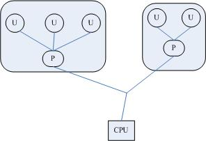

# Linux下的进程类别（内核线程、轻量级进程和用户进程）--Linux进程的管理与调度（四）

**阅读目录**

*   [Linux进程类别](#_label0)
*   [三种线程概念——内核线程、轻量级进程、用户线程](#_label1)
    *   [内核线程](#_label1_0)
    *   [轻量级进程](#_label1_1)
    *   [用户线程](#_label1_2)
    *   [加强版的用户线程——用户线程+LWP](#_label1_3)
*   [总结](#_label2)

**正文**

> 本文中出现的，内核线程，轻量级进程，用户进程，用户线程等概念，如果不太熟悉, 可以参见  
> [内核线程、轻量级进程、用户线程三种线程概念解惑（线程≠轻量级进程）](https://blog.csdn.net/gatieme/article/details/51481863)

[回到顶部](#_labelTop)

## Linux进程类别

虽然我们在区分Linux进程类别, 但是我还是想说Linux下只有一种类型的进程，那就是task\_struct，当然我也想说linux其实也没有线程的概念, 只是将那些与其他进程共享资源的进程称之为线程。

1.  一个进程由于其运行空间的不同, 从而有**内核线程**和**用户进程**的区分, 内核线程运行在内核空间, 之所以称之为线程是因为它没有虚拟地址空间, 只能访问内核的代码和数据, 而用户进程则运行在用户空间, 但是可以通过中断, 系统调用等方式从用户态陷入内核态。
    
2.  用户进程运行在用户空间上, 而一些通过共享资源实现的一组进程我们称之为线程组, Linux下内核其实本质上没有线程的概念, Linux下线程其实上是与其他进程共享某些资源的进程而已。但是我们习惯上还是称他们为线程或者轻量级进程
    

因此, Linux上进程分3种，内核线程（或者叫核心进程）、用户进程、用户线程, 当然如果更严谨的，你也可以认为用户进程和用户线程都是用户进程。

> 关于轻量级进程这个概念, 其实并不等价于线程
> 
> 不同的操作系统中依据其实现的不同, 轻量级进程其实是一个不一样的概念

[回到顶部](#_labelTop)

## 三种线程概念——内核线程、轻量级进程、用户线程

### 内核线程

内核线程就是内核的分身，一个分身可以处理一件特定事情。这在处理异步事件如异步IO时特别有用。内核线程的使用是廉价的，唯一使用的资源就是内核栈和上下文切换时保存寄存器的空间。支持多线程的内核叫做多线程内核(Multi-Threads kernel )。

内核线程只运行在内核态，不受用户态上下文的拖累。

*   处理器竞争：可以在全系统范围内竞争处理器资源；
*   使用资源：唯一使用的资源是内核栈和上下文切换时保持寄存器的空间
*   调度：调度的开销可能和进程自身差不多昂贵
*   同步效率：资源的同步和数据共享比整个进程的数据同步和共享要低一些。

### 轻量级进程

轻量级进程(LWP)是建立在内核之上并由内核支持的用户线程，它是内核线程的高度抽象，每一个轻量级进程都与一个特定的内核线程关联。内核线程只能由内核管理并像普通进程一样被调度。

轻量级进程由clone()系统调用创建，参数是CLONE\_VM，即与父进程是共享进程地址空间和系统资源。

与普通进程区别：LWP只有一个最小的执行上下文和调度程序所需的统计信息。

*   处理器竞争：因与特定内核线程关联，因此可以在全系统范围内竞争处理器资源
*   使用资源：与父进程共享进程地址空间
*   调度：像普通进程一样调度

轻量级线程(LWP)是一种由内核支持的用户线程。它是基于内核线程的高级抽象，因此只有先支持内核线程，才能有LWP。每一个进程有一个或多个LWPs，每个LWP由一个内核线程支持。这种模型实际上就是恐龙书上所提到的一对一线程模型。在这种实现的操作系统中，LWP就是用户线程。

由于每个LWP都与一个特定的内核线程关联，因此每个LWP都是一个独立的线程调度单元。即使有一个LWP在系统调用中阻塞，也不会影响整个进程的执行。

轻量级进程具有局限性。

*   首先，大多数LWP的操作，如建立、析构以及同步，都需要进行系统调用。系统调用的代价相对较高：需要在user mode和kernel mode中切换。
*   其次，每个LWP都需要有一个内核线程支持，因此LWP要消耗内核资源（内核线程的栈空间）。因此一个系统不能支持大量的LWP。  
    

### 用户线程

用户线程是完全建立在用户空间的线程库，用户线程的创建、调度、同步和销毁全又库函数在用户空间完成，不需要内核的帮助。因此这种线程是极其低消耗和高效的。

*   处理器竞争：单纯的用户线程是建立在用户空间，其对内核是透明的，因此其所属进程单独参与处理器的竞争，而进程的所有线程参与竞争该进程的资源。
*   使用资源：与所属进程共享进程地址空间和系统资源。
*   调度：由在用户空间实现的线程库，在所属进程内进行调度

LWP虽然本质上属于用户线程，但LWP线程库是建立在内核之上的，LWP的许多操作都要进行系统调用，因此效率不高。而这里的用户线程指的是完全建立在用户空间的线程库，用户线程的建立，同步，销毁，调度完全在用户空间完成，不需要内核的帮助。因此这种线程的操作是极其快速的且低消耗的。



上图是最初的一个用户线程模型，从中可以看出，进程中包含线程，用户线程在用户空间中实现，内核并没有直接对用户线程进程调度，内核的调度对象和传统进程一样，还是进程本身，内核并不知道用户线程的存在。

用户线程之间的调度由在用户空间实现的线程库实现。

这种模型对应着恐龙书中提到的多对一线程模型，其缺点是一个用户线程如果阻塞在系统调用中，则整个进程都将会阻塞。

### 加强版的用户线程——用户线程+LWP

这种模型对应着恐龙书中多对多模型。

用户线程库还是完全建立在用户空间中，因此用户线程的操作还是很廉价，因此可以建立任意多需要的用户线程。

操作系统提供了LWP作为用户线程和内核线程之间的桥梁。LWP还是和前面提到的一样，具有内核线程支持，是内核的调度单元，并且用户线程的系统调用要通过LWP，因此进程中某个用户线程的阻塞不会影响整个进程的执行。

用户线程库将建立的用户线程关联到LWP上，LWP与用户线程的数量不一定一致。当内核调度到某个LWP上时，此时与该LWP关联的用户线程就被执行。


[回到顶部](#_labelTop)

## 总结

Linux使用task\_struct来描述进程和线程

1.  一个进程由于其运行空间的不同, 从而有内核线程和用户进程的区分, 内核线程运行在内核空间, 之所以称之为线程是因为它没有虚拟地址空间, 只能访问内核的代码和数据, 而用户进程则运行在用户空间, 不能直接访问内核的数据但是可以通过中断, 系统调用等方式从用户态陷入内核态，但是内核态只是进程的一种状态, 与内核线程有本质区别
    
2.  用户进程运行在用户空间上, 而一些通过共享资源实现的一组进程我们称之为线程组, Linux下内核其实本质上没有线程的概念, Linux下线程其实上是与其他进程共享某些资源的进程而已。但是我们习惯上还是称他们为线程或者轻量级进程
    

因此, Linux上进程分3种，内核线程（或者叫核心进程）、用户进程、用户线程, 当然如果更严谨的，你也可以认为用户进程和用户线程都是用户进程。

**内核线程拥有 进程描述符、PID、进程正文段、核心堆栈**

**用户进程拥有 进程描述符、PID、进程正文段、核心堆栈 、用户空间的数据段和堆栈**

**用户线程拥有 进程描述符、PID、进程正文段、核心堆栈，同父进程共享用户空间的数据段和堆栈**

  

* * *

```plain
如果您觉得阅读本文对您有帮助，请点一下“推荐”按钮，您的“推荐”将是我最大的写作动力！
```
