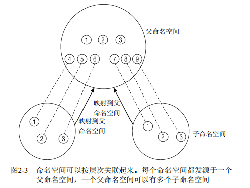

# Linux的命名空间详解--Linux进程的管理与调度（二）

**阅读目录**

*   [命名空间概念](#_label0)
*   [Linux内核命名空间描述](#_label1)
*   [命名空间的创建](#_label2)
    *   [PID Namespace](#_label2_0)
    *   [IPC Namespace](#_label2_1)
    *   [mount Namespace](#_label2_2)
    *   [Network Namespace](#_label2_3)
    *   [UTS Namespace](#_label2_4)
    *   [user\_namespace](#_label2_5)

**正文**

> Linux Namespaces机制提供一种资源隔离方案。

PID,IPC,Network等系统资源不再是全局性的，而是属于特定的Namespace。每个Namespace里面的资源对其他Namespace都是透明的。**要创建新的Namespace，只需要在调用clone时指定相应的flag。** Linux Namespaces机制为实现基于容器的虚拟化技术提供了很好的基础，LXC（Linux containers）就是利用这一特性实现了资源的隔离。不同Container内的进程属于不同的Namespace，彼此透明，互不干扰。下面我们就从clone系统调用的flag出发，来介绍各个Namespace。

命名空间提供了虚拟化的一种轻量级形式，使得我们可以从不同的方面来查看运行系统的全局属性。该机制类似于Solaris中的zone或 FreeBSD中的jail。对该概念做一般概述之后，我将讨论命名空间框架所提供的基础设施。

[回到顶部](#_labelTop)

## 命名空间概念

传统上，在Linux以及其他衍生的UNIX变体中，许多资源是全局管理的。

例如，系统中的所有进程按照惯例是通过PID标识的，这意味着内核必须管理一个**全局的PID列表**。而且，所有调用者通过uname系统调用返回的系统相关信息（包括系统名称和有关内核的一些信息）都是相同的。用户ID的管理方式类似，即各个用户是通过一个全局唯一的UID号标识。

全局ID使得内核可以有选择地允许或拒绝某些特权。虽然UID为0的root用户基本上允许做任何事，但其他用户ID则会受到限制。例如UID为n 的用户，不允许杀死属于用户m的进程（m≠ n）。但这不能防止用户看到彼此，即用户n可以看到另一个用户m也在计算机上活动。只要用户只能操纵他们自己的进程，这就没什么问题，因为没有理由不允许用户看到其他用户的进程。

但有些情况下，这种效果可能是不想要的。如果提供Web主机的供应商打算向用户提供Linux计算机的全部访问权限，包括root权限在内。传统上，这需要为每个用户准备一台计算机，代价太高。使用KVM或VMWare提供的虚拟化环境是一种解决问题的方法，但资源分配做得不是非常好。计算机的各个用户都需要一个独立的内核，以及一份完全安装好的配套的用户层应用。

命名空间提供了一种不同的解决方案，所需资源较少。在虚拟化的系统中，一台物理计算机可以运行多个内核，可能是并行的多个不同的操作系统。而命名空间则只使用一个内核在一台物理计算机上运作，前述的所有全局资源都通过命名空间抽象起来。这使得可以将一组进程放置到容器中，各个容器彼此隔离。隔离可以使容器的成员与其他容器毫无关系。但也可以通过允许容器进行一定的共享，来降低容器之间的分隔。例如，容器可以设置为使用自身的PID集合，但仍然与其他容器共享部分文件系统。

本质上，命名空间建立了系统的不同视图。此前的每一项全局资源都必须包装到容器数据结构中，**只有资源和包含资源的命名空间构成的二元组仍然是全局唯一的。**虽然在给定容器内部资源是自足的，但无法提供在容器外部具有唯一性的ID。

考虑系统上有3个不同命名空间的情况。命名空间可以组织为层次，我会在这里讨论这种情况。一个命名空间是父命名空间，衍生了两个子命名空间。假定容器用于虚拟主机配置中，其中的每个容器必须看起来像是单独的一台Linux计算机。因此其中每一个都有自身的init进程，PID为0，其他进程的PID 以递增次序分配。两个子命名空间都有PID为0的init进程，以及PID分别为2和3的两个进程。由于相同的PID在系统中出现多次，PID号不是全局唯一的。



虽然子容器不了解系统中的其他容器，但父容器知道子命名空间的存在，也可以看到其中执行的所有进程。图中子容器的进程映射到父容器中，PID为4到 9。尽管系统上有9个进程，但却需要15个PID来表示，因为一个进程可以关联到多个PID。至于哪个PID是”正确”的，则依赖于具体的上下文。

如果命名空间包含的是比较简单的量，也可以是非层次的，例如下文讨论的UTS命名空间。在这种情况下，父子命名空间之间没有联系。

请注意，Linux系统对简单形式的命名空间的支持已经有很长一段时间了，主要是chroot系统调用。该方法可以将进程限制到文件系统的某一部分，因而是一种简单的命名空间机制。但真正的命名空间能够控制的功能远远超过文件系统视图。

[回到顶部](#_labelTop)

## Linux内核命名空间描述

在Linux内核中提供了多个namespace，其中包括fs (mount), uts, network, sysvipc, 等。一个进程可以属于多个namesapce,既然namespace和进程相关，那么在task\_struct结构体中就会包含和namespace相关联的变量。在task\_struct 结构中有一个指向namespace结构体的指针nsproxy。

```cpp
struct task_struct
{
……..
/* namespaces */
         struct nsproxy *nsproxy;
…….
}
```

再看一下nsproxy是如何定义的，在include/linux/nsproxy.h文件中，这里一共定义了5个各自的命名空间结构体，在该结构体中定义了5个指向各个类型namespace的指针，由于多个进程可以使用同一个namespace，所以nsproxy可以共享使用，count字段是该结构的引用计数。

```cpp
/* 'count' is the number of tasks holding a reference.
 * The count for each namespace, then, will be the number
 * of nsproxies pointing to it, not the number of tasks.
 * The nsproxy is shared by tasks which share all namespaces.
 * As soon as a single namespace is cloned or unshared, the
 * nsproxy is copied
*/
struct nsproxy
{
         atomic_t count;
         struct uts_namespace *uts_ns;
         struct ipc_namespace *ipc_ns;
         struct mnt_namespace *mnt_ns;
         struct pid_namespace *pid_ns_for_children;
         struct net             *net_ns;
};
```

1.  UTS命名空间包含了运行内核的名称、版本、底层体系结构类型等信息。UTS是UNIX Timesharing System的简称。
2.  保存在struct ipc\_namespace中的所有与进程间通信（IPC）有关的信息。
3.  已经装载的文件系统的视图，在struct mnt\_namespace中给出。
4.  有关进程ID的信息，由struct pid\_namespace提供。
5.  struct net\_ns包含所有网络相关的命名空间参数。

系统中有一个默认的`nsproxy`，init\_nsproxy，该结构在task初始化是也会被初始，定义在`include/linux/init_task.h`

```cpp
#define INIT_TASK(tsk)  \
{
……..
         .nsproxy   = &init_nsproxy,      
……..
}
```

其中init\_nsproxy的定义为：

```cpp
struct nsproxy init_nsproxy = {
         .count                         = ATOMIC_INIT(1),
         .uts_ns                       = &init_uts_ns,
#if defined(CONFIG_POSIX_MQUEUE) || defined(CONFIG_SYSVIPC)
         .ipc_ns                        = &init_ipc_ns,
#endif
         .mnt_ns                      = NULL,
         .pid_ns_for_children        = &init_pid_ns,
#ifdef CONFIG_NET
         .net_ns                       = &init_net,
#endif
};
```

对于.mnt\_ns没有进行初始化，其余的namespace都进行了系统默认初始化；

[回到顶部](#_labelTop)

## 命名空间的创建

新的命名空间可以用下面两种方法创建。

1.  在用fork或clone系统调用创建新进程时，有特定的选项可以控制是与父进程共享命名空间，还是建立新的命名空间。
2.  unshare系统调用将进程的某些部分从父进程分离，其中也包括命名空间。更多信息请参见手册页unshare(2)。

在进程已经使用上述的两种机制之一从父进程命名空间分离后，从该进程的角度来看，改变全局属性不会传播到父进程命名空间，而父进程的修改也不会传播到子进 程，至少对于简单的量是这样。而对于文件系统来说，情况就比较复杂，其中的共享机制非常强大，带来了大量的可能性。

命名空间的实现需要两个部分：每个子系统的命名空间结构，将此前所有的全局组件包装到命名空间中；将给定进程关联到所属各个命名空间的机制。

在用fork或clone系统调用创建新进程时，有特定的选项可以控制是与父进程共享命名空间，还是建立新的命名空间。这些选项如下：

*   CLONE\_NEWPID 进程命名空间。空间内的PID 是独立分配的，意思就是命名空间内的虚拟 PID 可能会与命名空间外的 PID 相冲突，于是命名空间内的 PID 映射到命名空间外时会使用另外一个 PID。比如说，命名空间内第一个 PID 为1，而在命名空间外就是该 PID 已被 init 进程所使用。
*   CLONE\_NEWIPC 进程间通信(IPC)的命名空间，可以将 SystemV 的 IPC 和 POSIX 的消息队列独立出来。
*   CLONE\_NEWNET 网络命名空间，用于隔离网络资源（/proc/net、IP 地址、网卡、路由等）。后台进程可以运行在不同命名空间内的相同端口上，用户还可以虚拟出一块网卡。
*   CLONE\_NEWNS 挂载命名空间，进程运行时可以将挂载点与系统分离，使用这个功能时，我们可以达到 chroot 的功能，而在安全性方面比 chroot 更高。
*   CLONE\_NEWUTS UTS 命名空间，主要目的是独立出主机名和网络信息服务（NIS）。
*   CLONE\_NEWUSER 用户命名空间，同进程 ID 一样，用户 ID 和组 ID 在命名空间内外是不一样的，并且在不同命名空间内可以存在相同的 ID。

### PID Namespace

当调用clone时，设定了`CLONE_NEWPID`，就会创建一个新的PID Namespace，clone出来的新进程将成为Namespace里的第一个进程。一个PID Namespace为进程提供了一个独立的PID环境，PID Namespace内的PID将从1开始，在Namespace内调用fork，vfork或clone都将产生一个在该Namespace内独立的PID。新创建的Namespace里的第一个进程在该Namespace内的PID将为1，就像一个独立的系统里的init进程一样。该Namespace内的孤儿进程都将以该进程为父进程，当该进程被结束时，该Namespace内所有的进程都会被结束。PID Namespace是层次性，新创建的Namespace将会是创建该Namespace的进程属于的Namespace的子Namespace。子Namespace中的进程对于父Namespace是可见的，一个进程将拥有不止一个PID，而是在所在的Namespace以及所有直系祖先Namespace中都将有一个PID。系统启动时，内核将创建一个默认的PID Namespace，该Namespace是所有以后创建的Namespace的祖先，因此系统所有的进程在该Namespace都是可见的。

### IPC Namespace

当调用clone时，设定了`CLONE_NEWIPC`，就会创建一个新的IPC Namespace，clone出来的进程将成为Namespace里的第一个进程。一个IPC Namespace有一组System V IPC objects 标识符构成，这标识符有IPC相关的系统调用创建。在一个IPC Namespace里面创建的IPC object对该Namespace内的所有进程可见，但是对其他Namespace不可见，这样就使得不同Namespace之间的进程不能直接通信，就像是在不同的系统里一样。当一个IPC Namespace被销毁，该Namespace内的所有IPC object会被内核自动销毁。

PID Namespace和IPC Namespace可以组合起来一起使用，只需在调用clone时，同时指定`CLONE_NEWPID`和`CLONE_NEWIPC`，这样新创建的Namespace既是一个独立的PID空间又是一个独立的IPC空间。不同Namespace的进程彼此不可见，也不能互相通信，这样就实现了进程间的隔离。

### mount Namespace

当调用clone时，设定了`CLONE_NEWNS`，就会创建一个新的mount Namespace。每个进程都存在于一个mount Namespace里面，mount Namespace为进程提供了一个文件层次视图。如果不设定这个flag，子进程和父进程将共享一个mount Namespace，其后子进程调用mount或umount将会影响到所有该Namespace内的进程。如果子进程在一个独立的mount Namespace里面，就可以调用mount或umount建立一份新的文件层次视图。该flag配合pivot\_root系统调用，可以为进程创建一个独立的目录空间。

### Network Namespace

当调用clone时，设定了`CLONE_NEWNET`，就会创建一个新的Network Namespace。一个Network Namespace为进程提供了一个完全独立的网络协议栈的视图。包括网络设备接口，IPv4和IPv6协议栈，IP路由表，防火墙规则，sockets等等。一个Network Namespace提供了一份独立的网络环境，就跟一个独立的系统一样。一个物理设备只能存在于一个Network Namespace中，可以从一个Namespace移动另一个Namespace中。虚拟网络设备(virtual network device)提供了一种类似管道的抽象，可以在不同的Namespace之间建立隧道。利用虚拟化网络设备，可以建立到其他Namespace中的物理设备的桥接。当一个Network Namespace被销毁时，物理设备会被自动移回init Network Namespace，即系统最开始的Namespace。

### UTS Namespace

当调用clone时，设定了`CLONE_NEWUTS`，就会创建一个新的UTS Namespace。一个UTS Namespace就是一组被uname返回的标识符。新的UTS Namespace中的标识符通过复制调用进程所属的Namespace的标识符来初始化。Clone出来的进程可以通过相关系统调用改变这些标识符，比如调用sethostname来改变该Namespace的hostname。这一改变对该Namespace内的所有进程可见。CLONE\_NEWUTS和CLONE\_NEWNET一起使用，可以虚拟出一个有独立主机名和网络空间的环境，就跟网络上一台独立的主机一样。

以上所有clone flag都可以一起使用，为进程提供了一个独立的运行环境。LXC正是通过clone时设定这些flag，为进程创建一个有独立PID，IPC，FS，Network，UTS空间的container。一个container就是一个虚拟的运行环境，对container里的进程是透明的，它会以为自己是直接在一个系统上运行的。一个container就像传统虚拟化技术里面的一台安装了OS的虚拟机，但是开销更小，部署更为便捷。

Linux Namespaces机制本身就是为了实现 container based virtualizaiton开发的。它提供了一套轻量级、高效率的系统资源隔离方案，远比传统的虚拟化技术开销小，不过它也不是完美的，它为内核的开发带来了更多的复杂性，它在隔离性和容错性上跟传统的虚拟化技术比也还有差距。

### user\_namespace

CLONE\_NEWUSER指定子进程拥有新的用户空间
