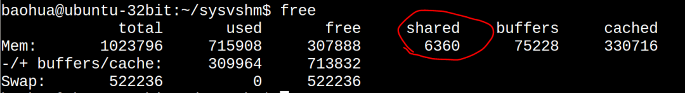
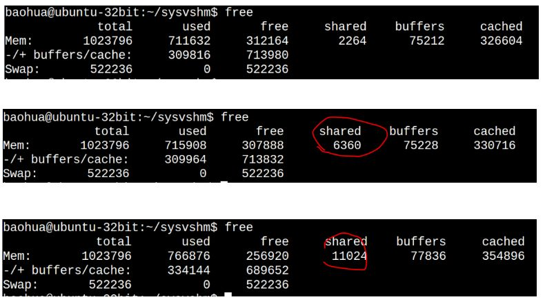
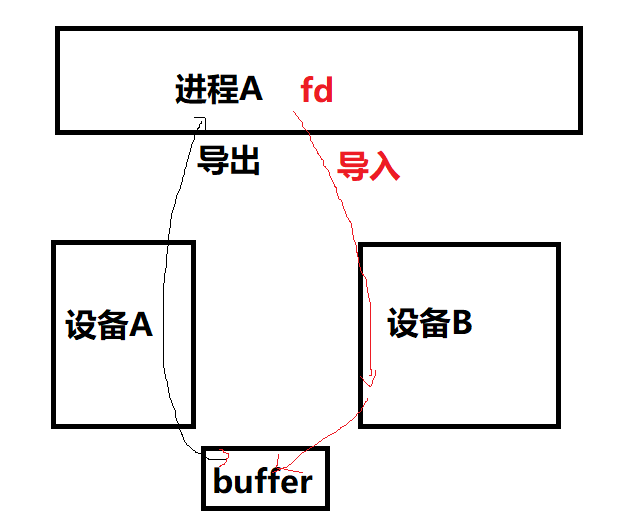

转载自: [世上最好的共享内存](https://cloud.tencent.com/developer/article/1551288)

# Linux共享内存讲解

共享单车、共享充电宝、共享雨伞，世间的共享有千万种，而我独爱共享内存。

早期的共享内存，着重于强调把同一片内存，map到多个进程的虚拟地址空间（在相应进程找到一个VMA区域），以便于CPU可以在各个进程访问到这片内存。


现阶段广泛应用于多媒体、Graphics领域的共享内存方式，某种意义上不再强调映射到进程虚拟地址空间的概念（那无非是为了让CPU访问），而更强调以某种“句柄”的形式，让大家知道某一片视频、图形图像数据的存在并可以借助此“句柄”来跨进程引用这片内存，让视频encoder、decoder、[GPU](https://cloud.tencent.com/product/gpu?from_column=20065&from=20065)等可以跨进程访问内存。所以不同进程用的加速硬件其实是不同的，他们更在乎的是可以通过一个handle拿到这片内存，而不再特别在乎CPU访问它的虚拟地址（当然仍然可以映射到进程的虚拟地址空间供CPU访问）。


只要内存的拷贝(memcpy)仍然是一个占据内存带宽、CPU利用率的消耗大户存在，共享内存作为Linux进程间通信、计算机系统里各个不同硬件组件通信的最高效方法，都将持续繁荣。关于内存拷贝会大多程度地占据CPU利用率，这个可以最简单地尝试拷贝1080P，帧率每秒60的电影画面，我保证你的系统的CPU，蛋会疼地不行。

我早就想系统地写一篇综述Linux里面各种共享内存方式的文章了，但是一直被带娃这个事业牵绊，今日我决定顶着娃娃们的山呼海啸，也要写一篇文章不吐不快。

共享内存的方式有很多种，目前主流的方式仍然有：

共享内存的方式

1.基于传统SYS V的共享内存；

2.基于POSIX mmap文件映射实现共享内存；

3.通过memfd\_create()和fd跨进程共享实现共享内存；

4.多媒体、图形领域广泛使用的基于dma-buf的共享内存。

SYS V共享内存

历史悠久、年代久远、API怪异，对应内核代码linux/ipc/shm.c，当你编译内核的时候不选择CONFIG\_SYSVIPC，则不再具备此能力。

你在Linux敲ipcs命令看到的share memory就是这种共享内存：


下面写一个最简单的程序来看共享内存的写端sw.c：


以及共享内存的读端sr.c：


编译和准备运行：


在此之前我们看一下系统的free:


下面运行sw和sr：


我们发现sr打印出来的和sw写进去的是一致的。这个时候我们再看下free：



可以看到used显著增大了（711632 -> 715908）, shared显著地增大了（2264 -> 6360），而cached这一列也显著地增大326604->330716。

我们都知道cached这一列统计的是file-backed的文件的page cache的大小。理论上，共享内存属于匿名页，但是由于这里面有个非常特殊的tmpfs（/dev/shm指向/run/shm,/run/shm则mount为tmpfs）：


所以可以看出tmpfs的东西其实真的是有点含混：**我们可以理解它为file-backed的匿名页（anonymous page），有点类似女声中的周深**。前面我们反复强调，匿名页是没有文件背景的，这样当进行内存交换的时候，是与swap分区交换。磁盘文件系统里面的东西在内存的副本是file-backed的页面，所以不存在与swap分区交换的问题。但是**tmpfs里面的东西，真的是在统计意义上统计到page cache了，但是它并没有真实的磁盘背景**，这又和你访问磁盘文件系统里面的文件产生的page cache有本质的区别。所以，它是真地有那么一点misc的感觉，凡事都没有绝对，唯有变化本身是不变的。

也可以通过ipcs找到新创建的SYS V共享内存：


POSIX共享内存

我对POSIX shm\_open()、mmap () API系列的共享内存的喜爱，远远超过SYS V 100倍。原谅我就是一个懒惰的人，我就是讨厌ftok、shmget、shmat、shmdt这样的API。

上面的程序如果用POSIX的写法，可以简化成写端psw.c：


读端：


编译和执行：


这样我们会在/dev/shm/、/run/shm下面看到一个文件：


坦白讲，mmap、munmap这样的API让我找到了回家的感觉，刚入行做Linux的时候，写好framebuffer驱动后，就是把/dev/fb0 mmap到用户空间来操作，所以mmap这样的 API，真的是特别亲切，像亲人一样。

当然，如果你不喜欢shm\_open()这个API，你也可以用常规的open来打开文件，然后进行mmap。关键的是mmap，wikipedia如是说：

**mmap**

In computing, mmap(2) is a POSIX-compliant Unix system call that maps files or devices into memory. It is a method of memory-mapped file I/O. It implements demand paging, because file contents are not read from disk directly and initially do not use physical RAM at all. The actual reads from disk are performed in a "lazy" manner, after a specific location is accessed. After the memory is no longer needed, it is important to munmap(2) the pointers to it. Protection information can be managed using mprotect(2), and special treatment can be enforced using madvise(2).

POSIX的共享内存，仍然符合我们前面说的tmpfs的特点，在运行了sw,sr后，再运行psw和psr，我们发现free命令再次戏剧性变化：


请将这个free命令的结果与前2次的free结果的各个字段进行对照:



第3次比第2次的cached大了这么多？是因为我编写这篇文章边在访问磁盘里面的文件，当然POSIX的这个共享内存本身也导致cached增大了。

**memfd\_create**

如果说POSIX的mmap让我找到回家的感觉，那么memfd\_create()则是万般惊艳。见过这种API，才知道什么叫天生尤物——而且是尤物中的尤物，它完全属于那种让码农第一眼看到就会两眼充血，恨不得眼珠子夺眶而出贴到它身上去的那种API；一般人见到它第一次，都会忽略了它的长相，因为它的身材实在太火辣太抢眼了。

先不要浮想联翩，在所有的所有开始之前，我们要先提一下跨进程分享fd（文件描述符，对应我们很多时候说的“句柄”）这个重要的概念。

众所周知，Linux的fd属于一个进程级别的东西。进入每个进程的/proc/pid/fd可以看到它的fd的列表：


这个进程的0，1，2和那个进程的0，1，2不是一回事。

某年某月的某一天，人们发现，**一个进程其实想访问另外一个进程的fd**。当然，这只是目的不是手段。比如进程A有2个fd指向2片内存，如果进程B可以拿到这2个fd，其实就可以透过这2个fd访问到这2片内存。这个fd某种意义上充当了一个中间媒介的作用。有人说，那还不简单吗，如果进程A:

fd = open();

open()如果返回100，把这个100告诉进程B不就可以了吗，进程B访问这个100就可以了。这说明你还是没搞明白fd是一个进程内部的东西，是不能跨进程的概念。你的100和我的100，不是一个东西。这些基本的东西你搞不明白，你搞别的都是白搭。

Linux提供一个特殊的方法，可以把一个进程的fd甩锅、踢皮球给另外一个进程（其实“甩锅”这个词用在这里不合适，因为“甩锅”是一种推卸，而fd的传递是一种分享）。我特码一直想把我的bug甩（分）锅（享）出去，却发现总是被人把bug甩锅过来。

那么如何甩（分）锅（享）fd呢？

Linux里面的甩锅需要借助cmsg，用于在socket上传递控制消息（也称Ancillary data），使用SCM\_RIGHTS，进程可以透过UNIX Socket把一个或者多个fd(file descriptor)传递给另外一个进程。

比如下面的这个函数，可以透过socket把fds指向的n个fd发送给另外一个进程：


而另外一个进程，则可以透过如下函数接受这个fd：


那么问题来了，如果在进程A中有一个文件的fd是100，发送给进程B后，它还是100吗？不能这么简单地理解，fd本身是一个进程级别的概念，每个进程有自己的fd的列表，比如进程B收到进程A的fd的时候，进程B自身fd空间里面自己的前面200个fd都已经被占用了，那么进程B接受到的fd就可能是201。**数字本身在Linux的fd里面真地是一点都不重要，除了几个特殊的0,1,2这样的数字外。同样的**，如果你把 cat /proc/interrupts 显示出的中断号就看成是硬件里面的中断偏移号码(比如ARM GIC里某号硬件中断)，你会发现，这个关系整个是一个瞎扯。


知道了甩锅API，那么重要的是，当它与memfd\_create()结合的时候，我们准备甩出去的fd是怎么来？它是memfd\_create()的返回值。

memfd\_create()这个函数的玄妙之处在于它会返回一个“匿名”内存“文件”的fd，而它本身并没有**实体**的文件系统路径，其典型用法如下：


我们透过memfd\_create()创建了一个“文件”，但是它实际映射到一片内存，而且在/xxx/yyy/zzz这样的文件系统下**没有路径！没有路径！没有路径！**

所以，当你在Linux里面编程的时候，碰到这样的场景：需要一个fd，当成文件一样操作，但是又不需要真实地位于文件系统，那么，就请立即使用memfd\_create()吧，它的manual page是这样描述的：

**memfd\_create**

memfd\_create() creates an anonymous file and returns a file descriptor that refers to it. The file behaves like a regular file, and so can be modified, truncated, memory-mapped, and so on. However, unlike a regular file, it lives in RAM and has a volatile backing storage.

重点理解其中的regular这个单词。它的行动像一个regular的文件，但是它的背景却不regular。

那么，它和前面我们说的透过UNIX Socket甩锅fd又有什么关系呢？memfd\_create()得到了fd，它在行为上类似规则的fd，所以也可以透过socket来进行甩锅，这样A进程相当于把一片与fd对应的内存，分享给了进程B。

下面的代码进程A通过memfd\_create()创建了2片4MB的内存，并且透过socket（路径/tmp/fd-pass.socket）发送给进程B这2片内存对应的fd：


下面的代码进程B透过相同的socket接受这2片内存对应的fd，之后通过read()读取每个文件的前256个字节并打印：


上述代码参考了:

https://openforums.wordpress.com/2016/08/07/open-file-descriptor-passing-over-unix-domain-sockets/

上述的代码中，进程B是在进行read(fds\[i\], buffer, sizeof(buffer))，这体现了基于fd进行操作的regular特点。当然，如果是共享内存，现实的代码肯定还是多半会是mmap：

mmap(NULL, SIZE, PROT\_READ, MAP\_SHARED, fd, 0);

那么，透过socket发送memfd\_create() fd来进行进程间共享内存这种方法，它究竟惊艳在哪里？

我认为首要的惊艳之处在于编程模型的惊艳。API简单、灵活、通用。进程之间想共享几片内存共享几片内存，想怎么共享怎么共享，想共享给谁共享给谁，无非是多了几个fd和socket的传递过程。比如，我从互联网上面收到了jpeg的视频码流，一帧帧的画面，进程A可以创建多片buffer来缓存画面，然后就可以透过把每片buffer对应的fd，递交给另外的进程去解码等。Avenue to Jane(大道至简)，简单的才是最好的！

memfd\_create()的另外一个惊艳之处在于支持“封印”(sealing，就是你玩游戏的时候的封印)，sealing这个单词本身的意思是封条，在这个场景下，我更愿意把它翻译为“封印”。中国传说中的封印，多是采用如五行、太极、八卦等手段，并可有例如符咒、法器等物品的辅助。现指对某个单位施加一种力量，使其无法正常使用某些能力的本领（常出现于玄幻及神魔类作品，游戏中）。我这一生，最喜欢玩的游戏就是《仙剑奇侠传》和《轩辕剑——天之痕》，不知道是否暴露年龄了。

采用memfd\_create()的场景下，我们同样可以用某种法器，来控制共享内存的shrink、grow和write。最初的设想可以详见File Sealing & memfd\_create()这篇文章：

https://lwn.net/Articles/591108/

我们如果在共享内存上施加了这样的封印，则可以限制对此片区域的ftruncate、write等动作，并建立某种意义上进程之间的相互信任，这是不是很拉风？

还记得镇压孙悟空的五行山顶的封印吗？还记得孙悟空的紧箍咒吗？还记得悟空每次离开师傅的时候在师傅周围画的一个圈吗？


**封印**

\* SEAL\_SHRINK: If set, the inode size cannot be reduced \* SEAL\_GROW: If set, the inode size cannot be increased \* SEAL\_WRITE: If set, the file content cannot be modified

File Sealing & memfd\_create()文中举到的一个典型使用场景是，如果graphics client把它与graphics compoistor共享的内存交给compoistor去render，compoistor必须保证可以拿到这片内存。这里面的风险是client可能透过ftruncate()把这个memory shrink小，这样compositor就拿不到完整的buffer，会造成crash。所以compositor只愿意接受含有SEAL\_SHRINK封印的fd，如果没有，对不起，我们不能一起去西天取经。

在支持memfd\_create()后，我们应尽可能地使用这种方式来替代传统的POSIX和SYS V，基本它也是一个趋势，比如我们在wayland相关项目中能看到这样的patch：


**dma\_buf**

**dma\_buf定义**

The DMABUF framework provides a generic method for sharing buffers between multiple devices. Device drivers that support DMABUF can export a DMA buffer to userspace as a file descriptor (known as the exporter role), import a DMA buffer from userspace using a file descriptor previously exported for a different or the same device (known as the importer role), or both.

简单地来说，dma\_buf可以实现buffer在多个设备的共享，应用可以把一片底层驱动A的buffer导出到用户空间成为一个fd，也可以把fd导入到底层驱动 B。当然，如果进行mmap()得到虚拟地址，CPU也是可以在用户空间访问到已经获得用户空间虚拟地址的底层buffer的。


上图中，进程A访问设备A并获得其使用的buffer的fd，之后通过socket把fd发送给进程B，而后进程B导入fd到设备B，B获得对设备A中的buffer的共享访问。如果CPU也需要在用户态访问这片buffer，则进行了mmap()动作。

为什么我们要共享DMA buffer？想象一个场景：你要把你的屏幕framebuffer的内容透过gstreamer多媒体组件的服务，变成h264的视频码流，广播到网络上面，变成流媒体播放。在这个场景中，我们就想尽一切可能的避免**内存拷贝**。

技术上，管理framebuffer的驱动可以把这片buffer在底层实现为dma\_buf，然后graphics compositor给这片buffer映射出来一个fd，之后透过socket发送fd 把这篇内存交给gstreamer相关的进程，如果gstreamer相关的“color space硬件转换”组件、“H264编码硬件组件”可以透过收到的fd还原出这些dma\_buf的地址，则可以进行直接的加速操作了。比如color space透过接收到的fd1还原出framebuffer的地址，然后把转化的结果放到另外一片dma\_buf，之后fd2对应这片YUV buffer被共享给h264编码器，h264编码器又透过fd2还原出YUV buffer的地址。


这里面的核心点就是fd只是充当了一个“句柄”，用户进程和设备驱动透过fd最终寻找到底层的dma\_buf，实现buffer在进程和硬件加速组件之间的zero-copy，这里面唯一进行了exchange的就是fd。

再比如，如果把方向反过来，gstreamer从网络上收到了视频流，把它透过一系列动作转换为一片RGB的buffer，那么这片RGB的buffer最终还要在graphics compositor里面渲染到屏幕上，我们也需要透过dma\_buf实现内存在video的decoder相关组件与GPU组件的共享。

Linux内核的V4L2驱动(encoder、decoder多采用此种驱动)、DRM(Direct Rendering Manager，framebuffer/GPU相关)等都支持dma\_buf。比如在DRM之上，进程可以透过

代码语言：javascript

代码运行次数：0

```plain
运行
```

```plain
AI代码解释
```

```javascript
int drmPrimeHandleToFD(int fd,
uint32_t handle,
uint32_t flags,
int * prime_fd 
)
```

获得底层framebuffer对应的fd。如果这个fd被分享给gstreamer相关进程的video的color space转换，而color space转换硬件组件又被实现为一个V4L2驱动，则我们可以透过V4L2提供的如下接口，将这片buffer提供给V4L2驱动供其导入：


如果是multi plane的话，则需要导入多个fd：


相关细节可以参考这个文档：

https://linuxtv.org/downloads/v4l-dvb-apis/uapi/v4l/dmabuf.html

**一切都是文件**！**不是文件创造条件也要把它变成文件**！这就是Linux的世界观。是不是文件不重要，关键是你得觉得它是个文件。在dma\_buf的场景下，fd这个东西，纯粹就是个"句柄"，方便大家通过这么一个fd能够对应到最终硬件需要访问的buffer。所以，透过fd的分享和传递，实际实现跨进程、跨设备（包括CPU）的内存共享。

如果说前面的SYS V、POSIX、memfd\_create()更加强调内存在进程间的共享，那么dma\_buf则更加强调内存在设备间的共享，它未必需要跨进程。比如：



有的童鞋说，为嘛在一个进程里面设备A和B共享内存还需要fd来倒腾一遍呢？我直接设备A驱动弄个全局变量存buffer的物理地址，设备B的驱动访问这个全局变量不就好了吗？我只能说，你对Linux内核的**只提供机制不提供策略**，以及软件工程每个模块各司其责，高内聚和低耦合的理解，还停留在裸奔的阶段。在没有dma\_buf等类似机制的情况下，如果用户空间仍然负责构建策略并连接设备A和B，人们为了追求代码的干净，往往要进行这样的内存拷贝：


dma\_buf的支持依赖于驱动层是否实现了相关的callbacks。比如在v4l2驱动中，v4l2驱动支持把dma\_buf导出（前面讲了v4l2也支持dma\_buf的导入，关键看数据方向），它的代码体现在：

drivers/media/common/videobuf2/videobuf2-dma-contig.c中的：


其中的vb2\_dc\_dmabuf\_ops是一个struct dma\_buf\_ops，它含有多个成员函数：


当用户call VIDIOC\_EXPBUF这个IOCTL的时候，可以把dma\_buf转化为fd：

代码语言：javascript

代码运行次数：0

```plain
运行
```

```plain
AI代码解释
```

```javascript
int ioctl(int fd, VIDIOC_EXPBUF, struct v4l2_exportbuffer *argp);
```

对应着驱动层的代码则会调用dma\_buf\_fd()：


应用程序可以通过如下方式拿到底层的dma\_buf的fd：


dma\_buf的导入侧设备驱动，则会用到如下这些API：

代码语言：javascript

代码运行次数：0

```plain
运行
```

```plain
AI代码解释
```

```javascript
dma_buf_attach()
dma_buf_map_attachment()
dma_buf_unmap_attachment()
dma_buf_detach()
```

下面这张表，是笔者对这几种共享内存方式总的归纳：


落花满天蔽月光，借一杯附荐凤台上。

全剧终
