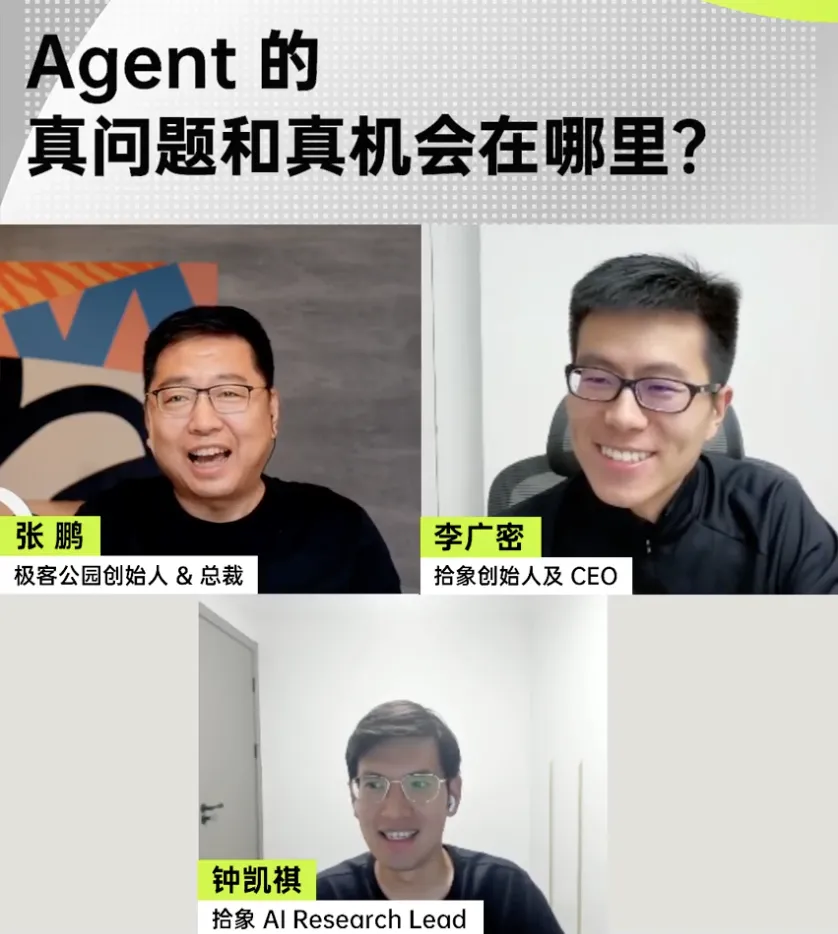
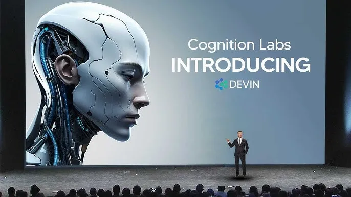
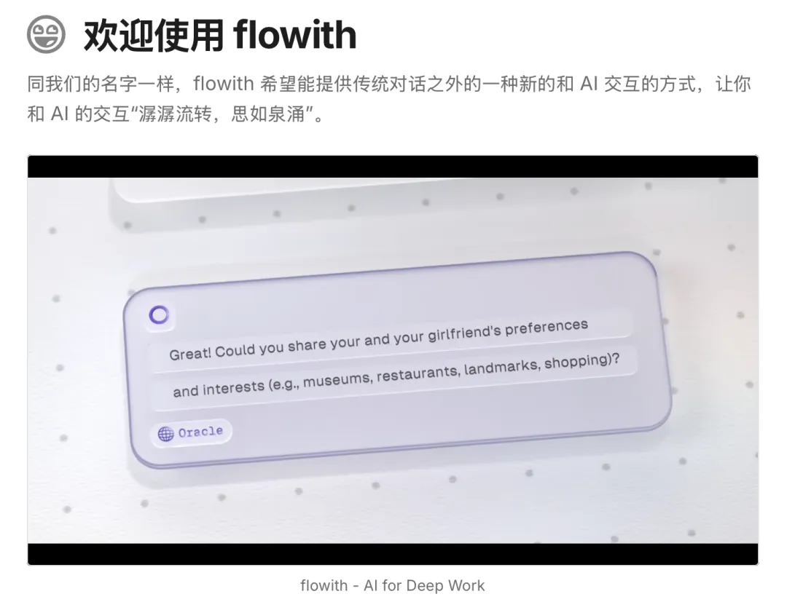
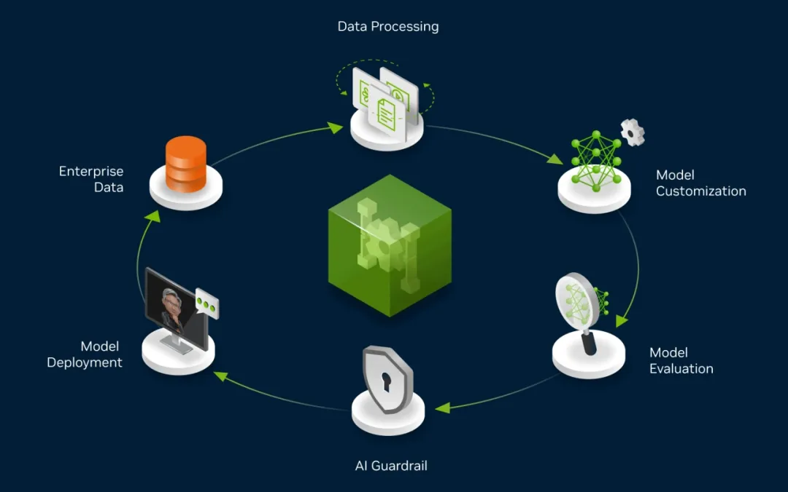
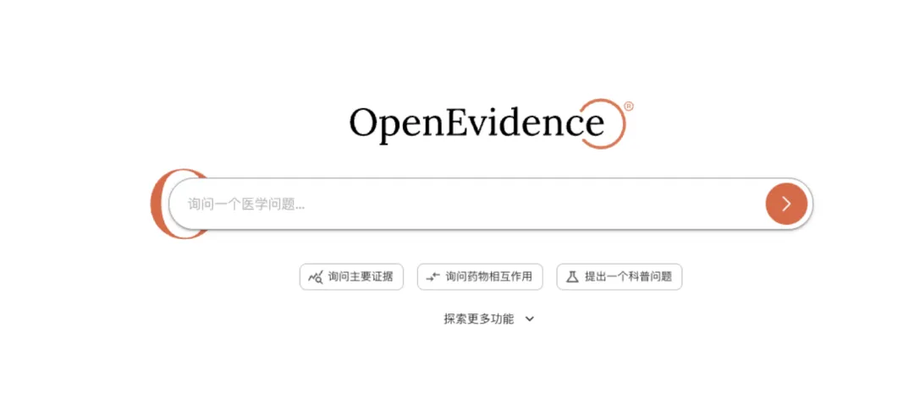
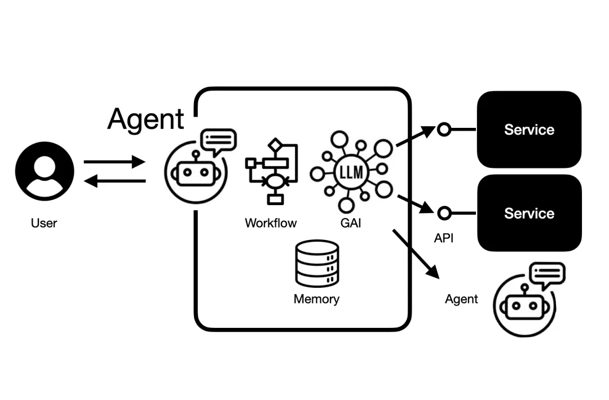

转载自 [极客公园](https://www.geekpark.net/news/350399)

# 聊透 Agent，它是「同事」还是「工具」，创业机会和价值究竟是什么？

摘要

AI 产品正在从「工具」走向「关系」，人需要决定建立怎样的关系。

2025 年，是 Agent 按下加速键的一年。

从年初 DeepSeek 引发的惊叹，到 GPT-4o 和 Claude 3.5 接连登场，大模型的边界一次次被重写。但真正让 AI 产业链神经绷紧的，不是模型的性能迭代，而是 Agent 的横空出世。

Manus、Devin 等产品的爆火，都在重申一个共识： 大模型将不再只是工具，而是要成为可以自我调度的智能体 。

Agent 由此成为继大模型之后，全球科技圈最快形成共识的第二个风口。

从巨头的战略重构到创业赛道的快速跟进，Agent 正成为下一个全民下注的方向。但在 C 端产品密集涌现、开发者为其狂热的同时，真正跑通用户价值闭环的项目却凤毛麟角，越来越多的产品陷入了「用老需求套新技术」的焦虑。

热浪过后，市场也回归冷静：Agent 究竟是一场范式的重构，还是一次新的包装？所谓「通用」与「垂直」的路径分野，是否真的带来可持续的市场空间？而「新入口」背后，是交互方式的进化，还是旧世界的投影？

顺着这些疑问继续下探，我们会发现，Agent 的真正门槛，或许并不在模型能力，而在其赖以生存的底层设施。从可控运行环境，到记忆系统、上下文感知、工具调用，每一个基础模块的缺位，都是 Agent 从演示走向实用的最大阻力。

这些底层工程问题，构成了 Agent 从「潮流玩具」走向「生产力工具」的最大阻碍，也恰恰是当下最确定、最高价值的创业蓝海。

在这样一个供给溢出、需求未明的阶段，我们想借由这场对谈，回答一个越来越紧迫的问题： Agent 的真问题与真机会，究竟藏在哪些地方？

在本次深度对谈里，我们邀请到了身处一线的 拾象科技 创始人李广密 与 拾象科技 AI Research Lead 钟 凯祺 ，两位从业者将从产品形态、技术路径、商业模式、用户体验乃至 Infra 构建等多个维度，为我们拆解当下 Agent 的真问题与真机会。

我们将跟随他们的思考，探寻在巨头环伺的牌桌上，创业公司的真实机会藏于何处；一条从「Copilot」平滑过渡到「Agent」的务实成长路径是如何被一步步验证的 ；以及为何 Coding（编码）这一看似垂直的领域，却被视作通往 AGI 的「价值高地」与「关键指标」。

最终，这场对话将推向更远的未来，一窥人与 Agent 之间全新的协作关系，以及构建下一代智能基础设施所面临的核心挑战与无限机遇。

要点精选

*   通用 Agent 领域做得最好的是「模型即 Agent」（Model as Agent）。
*   做 Agent 这件事，并不一定要「以终为始」，一开始就瞄着完全自动化的 Agent 去做，它可以先从 Copilot 做起。在这个过程中收集用户数据、做好用户体验、占领用户心智，然后慢慢地转型。
*   AGI 有可能最先在 Coding（编码）环境下实现，因为这个环境最简单，它能锻炼 AI 的核心能力。Coding 是这个世界里的「万用之机」，有了它，AI 就可以去构建和创造。Coding 有可能拿走整个大模型产业阶段性 90% 的价值。
*   AI Native 的产品不只是给人用的，它必须同时服务于 AI。一个真正的 AI Native 产品，应该是内建了服务 AI 和人类的双向机制。
*   今天的 AI 产品正在从「工具」走向「关系」。人不会和工具建立关系，但会和一个有记忆、懂你、能与你「心有灵犀」的 AI 建立关系。

以下为当天《今夜科技谈》直播沉淀，由极客公园整理。

* * *

# 01

热潮之下，哪些 Agent 产品已崭露头角？

张鹏 ： 在过去一段时间，所有人都在讨论 Agent，认为这可能是现阶段的一个重要议题，也是创业公司的难得发展机会。

我看到拾象科技对 Agent 体系做了比较深入的研究，也体验和分析了很多相关产品。我想先听听两位，最近哪些 Agent 相关的产品给你们留下了比较深刻的印象？为什么？

李广密 ：我自己印象最深的是两个：一个是 Anthropic 的 Claude 在编程能力上的表现，另一个是 OpenAI ChatGPT 的 Deep Research 功能。

关于 Claude，主要是它的编程能力。我有一个观点： 编程（Coding）是衡量 AGI 最关键的先验指标。 如果 AI 不能规模化、端到端地进行软件应用开发，那么在其他领域的进展也会比较慢。我们必须先在 Coding 这个环境下实现很强的 ASI（Artificial Superintelligence），其他领域才可能加速。或者说，我们先在数字环境下实现 AGI，再拓展到其他领域。

全球首位 AI 程序员 Devin｜图源：Cognition Labs  

关于 Deep Research，它对我自己的帮助非常大，我几乎每天都在用。它其实就是一个搜索 Agent，帮我检索了大量的网页和资料，体验很好，极大地拓展了我的研究空间。

张鹏 ： 凯祺 ，从你的视角看，哪些产品给你留下了深刻印象 ？

钟 凯祺 (Cage) ：我可以介绍一下我平时观察和使用 Agents 的思维模型，然后在每个分类下介绍一两个代表性产品。

首先，大家经常会问：通用 Agent 还是垂直 Agent？ 我们认为通用 Agent 领域做得最好的是「模型即 Agent」（Model as Agent）。 比如广密刚才提到的 OpenAI 的 Deep Research，以及 OpenAI 新发布的 o3 模型，它其实就是一个标准的「模型即 Agent」的范例。它把 Agent 的所有组件——大语言模型（LLM）、上下文（Context）、工具使用（Tool Use）和环境（Environment）——全都缝合到了一起，并进行了端到端的强化学习训练。训练之后的结果就是，各类 Agent 执行信息检索的任务它都能完成。

所以我的一个「暴论」是：通用 Agent 的需求基本上就是信息检索和轻度代码编写这两类，而 GPT-4o 已经完成得非常好了。因此， 通用 Agent 市场基本上是大模型公司的主战场，创业公司很难仅仅服务于通用需求来做大。

让我印象比较深刻的创业公司基本都聚焦在垂直（Vertical）领域。

如果我们先说 ToB 的垂直领域，可以 类比人的工作 分为前台工作和后台工作 。

后台工作的特点是重复性强、对高并发要求高，通常有一条很长的 SOP（Standard Operating Procedure），其中很多任务非常适合 AI Agent 去一对一地执行，并且适合在比较大的探索空间里进行强化学习。这里比较有代表性的，我想分享的是一些面向 AI for Science 的创业公司，他们做的是 Multi-agent system（多智能体系统）。

在这个系统里，各种科研任务都包含在内，比如文献检索、实验规划、预测前沿进展以及数据分析等。它的特点是，不再是像 Deep Research 那样的单个 Agent，而是一个非常复杂的、能针对科研系统做到更高分辨率的系统。它有一个很有意思的功能叫「Contradiction Finding」，可以处理对抗性的任务，例如发现两篇顶级期刊论文之间的矛盾之处。这代表了研究型 Agent 里一种非常有意思的范式。

前台工作很多时候是和人打交道，需要做外联，目前比较适合的是语音 Agent，例如医疗领域的护士电话回访、招聘、物流沟通等。

这里我想分享一家叫 HappyRobot 的公司，他们找到了一个听起来很小的场景，专门在物流和供应链领域做电话沟通。比如，一个卡车司机遇到问题，或者货到了之后，Agent 能快速给他打电话。这里发挥了 AI Agent 一个很特别的能力：7 天 24 小时无间断地响应并快速做出反应。这对于物流的大部分需求来说已经足够了。

除了以上两大类，还有一些比较特别的，比如 Coding Agent。

# 02

从 Copilot 到 Agent，

是否存在一条更务实的成长路径？

钟凯祺： 在代码开发这个领域，最近创业热情很火热，一个很好的例子是 Cursor。Cursor 1.0 的发布，基本上把一个原来看起来是 Copilot（辅助驾驶）的产品，变成了一个完全的 Agent 产品。它能后台异步操作，有记忆功能，这正是我们对 Agent 的想象。

它和 Devin 的对比很有意思，给我们的启发是： 做 Agent 这件事，并不一定要「以终为始」，一开始就瞄着完全自动化的 Agent 去做，它可以先从 Copilot 做起。在这个过程中收集用户数据、做好用户体验、占领用户心智，然后慢慢地转型。 国内做得不错的，像 Minus AI，他们最早的产品也是从 Copilot 形态做起的。

最后，我还会用「环境」这个思维模型来区分不同 Agent。比如，Manus 的环境是虚拟机（Virtual Machine），Devin 的环境是浏览器，flowith 的环境是笔记本，SheetZero 的环境是表格，Lovart 的环境是画布等等。这个「环境」就对应了强化学习里的环境定义，这也是一种值得参考的分类方式。

国内初创团队打造的 flowith ｜图源：flowith  

张鹏：我们深入聊聊 Cursor 这个例子，它背后的技术栈和成长路径是怎样的 ？

钟 凯祺 (Cage) ：自动驾驶的例子就很有意思，直到今天，特斯拉也不敢真的把方向盘、刹车和油门去掉。这说明在很多关键决策上，AI 还没办法完全超越人类。 只要 AI 的能力和人类差不多，一些关键决策就一定需要人类介入。这正是 Cursor 一开始就想得比较明白的地方。

所以他们最早贴合的特性，就是一个人类最需要的功能：自动补全（Autocompletion），它把这个功能做成了 Tab 键触发，随着 Claude 3.5 这样的模型出来，Cursor 把 Tab 的准确率提高到 90% 以上。在这种准确率下，我可以在一个任务流中连续使用 5 到 10 次，心流体验就出现了。这是 Cursor 作为 Copilot 的第一个阶段。

第二个阶段，他们做的功能是代码重构（Code Refactoring）。Devin 和 Cursor 都想做这个需求，但 Cursor 做得更巧妙。它会跳出一个对话框，当我输入需求时，它可以在文件外开启一个平行的修改模式来重构代码。

这个功能刚出来时准确率也不高，但因为用户对它的预期是 Copilot，所以大家都能接受。而且他们很准确地预判到，模型的 coding 能力一定会快速提升。所以他们一边打磨产品功能，一边等待模型能力提升，Agent 能力就很顺利地浮现了。

第三步就是我们今天看到的 Cursor 状态了，一个相对端到端的、在后台（background）运行的 Agent。它背后有一个像沙盒一样的环境，我甚至可以在上班时把不想做的任务布置给它，它可以在后台用我的计算资源去完成，与此同时，我能专注于自己最想做的核心任务。

最后，它以异步交互的形式，像发邮件或飞书消息一样，把结果告诉我。这个过程很顺利地实现了从 Copilot 到 Autopilot（或者说 Agent）的转型。

关键还是要抓住人的交互心智，从一开始让用户更乐于接受同步交互，这样就能收集到大量的用户数据和反馈。

# 03

为何 Coding 是通往 AGI 的「关键试炼场」？

张鹏：广密刚才说「Coding 是通向 AGI 的关键，如果不能在这个领域实现 ASI（超级智能），其他领域也很难。」为什么？

李广密 ：有几个逻辑。第一，Code 这个数据是最干净、最容易闭环，并且结果是可以验证的。我有一个猜想，Chatbot 可能没有数据飞轮（一种反馈循环机制，通过从交互或流程中收集数据，持续优化 AI 模型，进而产生更优的结果和更有价值的数据）。但 Code 领域有机会跑出数据飞轮，因为它可以进行多轮的强化学习，而 Code 是跑多轮强化学习的关键环境。

我一方面把 Code 理解成编程工具，但更愿意把它理解成一个实现 AGI 的环境。AGI 有可能最先在这个环境下实现，因为这个环境最简单，它能锻炼 AI 的核心能力。如果 AI 连一个端到端的应用软件开发都做不了，那在其他领域就更难了。 如果它在未来一段时间无法大规模替代基础的软件开发工作，那在其他领域也很难。

而且，coding 能力上来了，模型的指令遵循能力也会上来。比如处理很长的 prompt，Claude 就明显要强一些，我们猜测这跟它的 coding 能力有逻辑关系。

另外一个点，我想未来的 AGI 会先在数字世界实现。未来两年，Agent 能做人在手机和电脑上操作的几乎所有事情。一方面通过简单的 coding 完成，如果不行，它还可以调用其他虚拟工具。所以，先在数字世界里实现 AGI，让它跑得比较快，这是一个大的逻辑。

# 04

如何判定一个好 Agent？

张鹏：Coding 是这个世界里的「万用之机」，有了它，AI 就可以去构建和创造。而且编程这个领域相对结构化，适合 AI 发挥。当评价一个 Agent 的好坏时，除了用户体验，你们会从什么视角去评价一个 Agent 的潜力？

钟 凯祺 (Cage) ：一个好的 Agent 首先得有一个环境来帮助构建数据飞轮，而且这个数据本身要是可验证的。

最近 Anthropic 的研究员提得比较多一个词叫 RLVR（Reinforcement Learning from Verifiable Reward），其中的「V」就是指可验证的回报。代码和数学就是非常标准的可验证领域，任务做完后，立马能验证对错，数据飞轮就自然地建立起来了。

数据飞轮的工作机制｜图源：英伟达  

所以，构建一个 Agent 产品，就是要构建这样一个环境。在这个环境里，用户执行任务的成功或失败都不重要，因为现在的 Agent 一定会失败。关键是在失败时，它能收集到有信号的数据，而不是噪音数据，来指导产品本身的优化。这些数据甚至可以作为强化学习环境的冷启动数据。

第二，产品是否做得足够「Agent Native」。就是说，在设计产品时，要同时思考人和 Agent 的需求。一个典型的例子是 The Browser Company，它为什么要做一款新的浏览器？因为之前的 Arc 纯粹是为了提升人类用户的效率而设计的。而他们新的浏览器在设计时，很多新功能未来是能给 AI Agent 自己使用的。当产品的底层设计逻辑发生改变，这就非常重要了。

从结果上来说，客观评估也很关键。

1.  任务完成率+成功率
2.  ：首先任务得能跑完，这样用户至少能收到一个反馈。其次是成功率。一个 10 步的任务，如果每一步准确率都是 90%，那最终成功率只有 35%。所以必须优化好每一步之间的衔接。目前行业里一个及格线可能是五成以上的成功率。
3.  成本和效率
4.  ：包括计算成本（token cost）和用户的时间成本。如果 GPT-4o 跑一个任务 3 分钟，而另一个 Agent 要跑 30 分钟，这对用户是很大的消耗。而且这 30 分钟里，算力消耗是巨大的，这会影响规模效应。
5.  用户指标
6.  ：最典型的是用户粘性。用户在尝鲜后是否愿意反复使用？比如日活/月活（DAU/MAU）比例、次月留存率、付费率等，这些是避免公司只有「虚假繁荣」（five minutes of fame）的根本指标。

李广密 ：我再补充一个视角：Agent 与当前模型能力的匹配程度。今天 Agent 80% 的能力依赖于模型这个引擎。比如，GPT 到了 3.5，多轮对话的通用范式出现了，Chatbot 这种产品形态就行得通了。Cursor 的崛起也是因为模型发展到了 Claude 3.5 的水平，它的代码补全能力才得以成立。

像 Devin 其实出来就得偏早了，所以创始团队对模型能力的边界理解非常重要，要清楚今天以及未来六个月模型能到哪一步，这与 Agent 能实现的目标息息相关。

张鹏：什么叫「AI Native」的产品？我觉得 AI Native 的产品不只是给人用的，它必须同时服务于 AI。

换句话说， 如果一个产品里没有合理的数据去调试，没有为未来 AI 的工作环境做搭建，那它只是把 AI 当成一种降本增效的工具，这样的产品生命力是有限的，很容易被技术浪潮淹没。一个真正的 AI Native 产品，应该是内建了服务 AI 和人类的双向机制。 简单来说，AI 在服务用户的时候，用户有没有也在服务 AI？

钟 凯祺 (Cage) ：我非常喜欢这个概念。Agent 的数据在现实世界里是不存在的，没有人会在完成任务时把思考过程一步步拆解清楚。那怎么办？一个方法是找专业的标注公司，另一个方法就是要撬动（leverage）用户，把用户的真实使用方式和 Agent 自身的运行过程捕捉下来。

张鹏：那如果要通过 Agent 的方式让人类给 AI「投喂」数据，什么样的任务是最有价值的？

钟 凯祺 (Cage) ：与其想着用数据服务 AI，不如想 AI 有什么长板应该被放大。比如科学研究，在 AlphaGo 之前，人类觉得围棋和数学是最难的。但用了强化学习之后发现，这些对 AI 反而是最简单的。在科学领域也一样，人类历史上已经很久没有一个学者能通晓每个学科的犄角旮旯了，但 AI 可以。所以我认为，科学研究这类任务对人类来说很难，但对 AI 不一定难。正因如此，我们才要多找一些数据和服务来支持它。这类任务的回报比大部分任务更 verifiable，未来甚至可能是人类帮 AI「摇试管」，然后告诉 AI 结果是对是错，帮助 AI 一起去点亮科技树。

李广密 ：一开始的数据冷启动是必要的。做一个 Agent 就像做一个创业公司，创始人肯定要做冷启动，要亲力亲为。接下来，搭建环境就很重要，决定了 Agent 往哪个方向走。再往后，更重要的是搭建奖励（Reward）系统。我觉得环境和奖励这两个因素非常关键。在这个基础上，Agent 的创业者做好这个 Agent 的「CEO」就好了。今天 AI 已经能写出人类看不懂但能运行的代码，我们不一定非要理解强化学习端到端的逻辑，只要搭好环境、设好奖励就行。

# 05

Agent 的商业模式将走向何方？

张鹏：最近我们看到很多 ToB 领域的 Agent，尤其是在美国，它们的商业模式和增长模式有什么变化吗？还是有新的模式出现？

钟 凯祺 (Cage) ：现在最大的一个特点就是，有越来越多的产品从偏 C 端切入，在公司组织里自下而上（bottom-up）地被使用。最典型的就是 Cursor。除了它，还有很多 AI Agent 或 Copilot 产品，大家愿意自己先用起来。这就不再是传统 SaaS 那种需要先搞定 CIO、一对一签单的模式了，至少第一步不是这样。

另一个有意思的产品是 OpenEvidence，他们做的是医生这个群体。他们先把医生群体打下来，然后渐渐植入医疗器械和药品的广告。这些业务不需要一开始就和医院谈，因为和医院谈非常慢。AI 创业最关键的就是速度，光靠技术护城河是没用的，需要通过这种自下而上的方式增长。

AI 医疗独角兽 OpenEvidence｜图源：OpenEvidence  

关于商业模式，现在有一个趋势，就是慢慢地从基于成本（Cost-based）定价走向基于价值（Value-based）定价。

1.  基于成本
2.  ：这像传统云服务，在 CPU/GPU 成本之上加一层软件价值。
3.  按次收费
4.  ：在 Agent 这边，一种是按「动作」（Action）收费。比如我前面提到的物流 Agent，给卡车司机打一个电话收几毛钱。
5.  按工作流收费
6.  ：更高一层的抽象是按「工作流」（Workflow）收费，比如完成一整个物流订单。这离成本端更远，离价值端更近了，因为它真的参与到了工作中。但这需要一个相对收敛的场景。
7.  按结果付费
8.  ：再往上，就是按「结果」（Result）付费。因为 Agent 成功率不高，用户希望为成功的结果付费。这要求 Agent 公司对产品有极高的打磨能力。
9.  按 Agent 本身付费
10.  ：未来可能会真正地按「Agent」付费。比如，有一家叫 Hippocratic AI 的公司做 AI 护士，在美国招一个人类护士大概是每小时 40 美金，而他们的 AI 护士每小时只要 9 到 10 美金，降了四分之三的成本。在美国这种人力昂贵的市场，这非常合理。如果 Agent 未来能做得更好，我甚至可以给它发奖金、发年终奖。这些都是商业模式上的创新。

李广密 ：我们最期待的是按价值（Value-based）的计价方式。比如 Manus AI 做一个网站，这个价值是不是值 300 美金？它做一个应用，是不是值 5 万美金？但今天的任务价值还不好定价。如何建立一个好的衡量计价方式，是值得创业者去探索的。

另外，刚才凯祺提到按 Agent 付费，这就像企业要和员工签合同一样。未来我们雇佣了 Agent，是不是要给它发「身份证」？是不是要签「劳动合同」？这其实就是智能合约。我比较期待未来 Crypto 领域的智能合约如何应用到数字世界的 Agent 上，当任务完成后，通过一个好的衡量计价手段，去分配经济利益。这可能是 Agent 与 Crypto 智能合约结合的机会。

# 06

人类与 Agent 的协作关系会变成什么形态？

张鹏：最近在 Coding Agent 这个方向，有两个词讨论得比较多：「Human in the loop」和「Human on the loop」，这是在探讨什么？

钟 凯祺 (Cage) ：「Human on the loop」是指人尽可能减少在循环中的决策，只在关键时刻参与一下。有点像特斯拉的 FSD，当系统遇到危险决策时，会警告人类接管油门刹车。在虚拟世界中，这通常指非即时的、异步的人机协作。人可以对 AI 拿不准的关键决策进行干预。

「Human in the loop」则更偏向于 AI 会时不时地「ping」你一下，来确认某件事。比如 Minus AI，它的右半边有一个虚拟机，我可以实时看到它在浏览器里做什么，这就像一个打开的白盒，我能大概知道 Agent 想做什么。

这两个概念不是非黑即白的关系，而是一个光谱。现在更多的是「in the loop」，人还是要在很多关键点上做审批。原因很简单，软件还没到那个阶段，出了问题总得有人负责。油门和刹车一定是去不掉的。

可以预见的是，未来高重复性的任务，最终结果一定是人只看摘要，自动化程度会非常高。 对于一些难题，比如让 AI 看病理报告，我们可以把 Agent 的「假阳率」调高一点，让它更容易觉得「有问题」，然后「on the loop」地把这些案例作为邮件发给人类医生。这样，虽然人类医生需要复核的案例多了，但 Agent 所有判断为「阴性」的案例都可以被顺利审批掉。如果病理报告中只有 20% 真的有难度，那人类医生的工作带宽就已经放大了 5 倍。所以不用太纠结于「in」还是「on」，只要找到好的结合点，就能把人机协作做得很好。

李广密 ：鹏哥问的这个问题背后，其实有一个巨大的机会，就是「新的交互」以及「人与 Agent 如何协同」。这可以简单理解成在线（同步）和离线（异步）。比如我们开会直播，必须实时在线。但如果我作为一个 CEO 给同事布置任务，项目推进是异步的。

这里面更大的意义在于，当 Agent 大规模落地后，人与 Agent 如何协同交互，以及 Agent 与 Agent 之间如何协同交互，这是非常值得探索的。今天我们还是通过文本与 AI 交互，但未来与 Agent 的交互方式会有很多种。有些可能在后台自动化运行，有些则需要人在前面看着。 探索新的交互是一个巨大的机会。

# 07

能力过剩、需求不足，

Agent 的「杀手级应用」何时出现？

张鹏：Coding Agent 总体还是围绕 IDE 的延长线在做。未来会不会有变化？如果大家都挤在这条路上，后来者要如何追赶 Cursor？

钟 凯祺 (Cage) ：IDE 只是一个环境，再去复刻一个 IDE 本身的价值不大。但在 IDE 或另一个好的环境里做 Agent，本身是有价值的。我会思考它的用户到底只是专业开发者，还是能拓展到专业开发者之外「平民开发者」——那些有很多自动化需求的白领工作者。

现在缺的是什么？不是供给能力，因为 Cursor 这类产品已经把 AI 的 coding 供给能力放大了 10 倍甚至 100 倍。以前我要做一个产品，需要外包一个 IT 团队，试错成本很高。现在理论上我只要说一句话，花 20 美元的月费就能试错。

现在缺的是需求。大家都在用老的需求去套新技术，有点「拿着锤子找钉子」的状态。 目前的需求大多是做落地页（Landing page）或者基础的玩具网站。未来需要找到一个收敛的产品形态。这有点像当年推荐引擎出来的时候，它是一个很好的技术，后来出现了一种叫「信息流」的产品形态，把推荐引擎真正带给了大众。但 AI Coding 领域还没有找到像「信息流」这样的杀手级产品。

李广密 ： 我觉得 Coding 有可能拿走整个大模型产业阶段性 90% 的价值。 这个价值怎么长出来？今天的第一幕还是服务全球 3000 万程序员。我举个例子，Photoshop 服务的是全球两三千万专业设计师，门槛很高。但是当剪映、Canva、美图秀秀出来后，可能有 5 亿甚至更多的用户都可以使用这些工具，并做出更火爆的内容。

Code 有一个好处，它是一个创意的表达平台。这个社会上 90% 以上的任务都可以通过 Code 来表达，所以它有可能变成一个创意平台。以前应用开发门槛非常高，大量的长尾需求没有被满足。当门槛大幅降低后，这些需求就会被激发出来。我期待的是「应用的大爆发」。移动互联网生成的最大数据是内容，而 AI 这一波生成的最大内容可能就是新的应用软件。这就像优酷、爱奇艺这种长视频平台和抖音的区别。你可以把大模型比作摄像头，在它之上还能做出抖音和剪映这样的杀手级应用。这可能就是所谓的「Vibe Coding」（氛围编程）的本质，它是一个新的创意平台。

张鹏：要提升 Agent 的输出价值，输入（input）也变得非常重要。但在产品和技术上，有什么方法可以提升输入质量，从而确保更好的输出呢？

钟 凯祺 (Cage) ：在产品上，我们不能觉得用户用不好产品是用户的问题。要下功夫最关键的一个词就是「上下文」（Context）。一个 Agent 能否建立「上下文感知」（Context Awareness）？

举个例子，如果我在互联网大厂里写代码，Agent 不光要看我手头的代码，还要看整个公司相关的代码库（Codebase），甚至要看我在飞书里和产品经理、同事的对话，以及我之前的编码和沟通习惯。把这些上下文都给 Agent，我的输入才能更高效。

所以对于 Agent 开发者来说，最关键的就是要把记忆（Memory）机制和上下文的连接能力做得足够好，这也是 Agent 基础设施（Infra）的一大挑战。

Agent 的挑战：好记忆机制和上下文连接｜图源：零售科学  

此外，对于开发者来说，怎么做好强化学习的冷启动数据、怎么定义清晰的奖励（Reward）也很重要。这个奖励背后意味着，当用户表达不清晰时，你怎么把他的需求拆解出来。比如，OpenAI 的 Deep Research 在我问得不清晰时，会先给出四个引导性问题。在和它交互的过程中，我其实也在想清楚自己的需求。

对于今天的用户来说，最主要还是要想怎么清晰地表达需求，以及怎么验收需求。虽然不用做到「以终为始」，但要对好坏有一个大概的预期。 我们写 Prompt 也要像写代码一样，有清晰的指令和逻辑，这样能避免很多无效的输出。

李广密 ：我补充两点。第一，上下文的重要性。 我们内部经常讨论，上下文做好了，会有新的支付宝、PayPal 级别的机会。

以前电商看的是成交总额（GMV），以后看的是任务完成率。而任务完成，一边是智能，另一边就是上下文。比如我要做一个个人网站，如果把我的 Notion 笔记、微信数据、邮件数据都提供给 AI，那我的个人网站内容肯定会非常丰富。

第二，自主学习。搭好环境后，Agent 要能迭代，这非常关键。如果不能持续学习迭代，结果就是被模型本身吃掉，因为模型就是一个学习系统。上一波移动互联网，没有做机器学习和推荐的公司都没做大。这一波如果 Agent 做不好端到端的自主学习和迭代，我觉得也做不起来。

# 08

巨头博弈下，还有哪些变化和机会？

张鹏：我们怎么判断未来 Agent 的能力会以一个超级接口的形式出现，还是离散地分布在各个场景里？

钟 凯祺 (Cage) ：我看到一个比较大的趋势是，第一，肯定是多智能体（Multi-agent）的。即便是完成一个任务，在 Cursor 这类产品里，做代码补全和做单元测试的可能是不同的 Agent，因为它们需要的「性格」和擅长的点不一样。

第二，入口会不会有变化？我觉得入口是一个二阶的问题。首先要发生的是，大家有很多 Agent，并和它们协作。这些 Agent 背后会支撑起一张网络，我称之为「Botnet」。比如未来购物，60% 以上的固定消费可能都由 Agent 帮我完成。

在生产力场景也一样，未来程序员的每日例会可能会被 Agent 之间的协作所取代，由它们推送指标异常和产品开发进展。当这些发生后，入口的变化才可能出现。那个时候，API 的调用也不再主要是人类调用，而是 Agent 之间互相调用。

张鹏：那些有能力的大厂，比如 OpenAI, Anthropic, Google, Microsoft，在 Agent 上都是什么样的决策和行动状态？

李广密 ：我脑子里一个关键词是「分化」。 去年大家都在追赶 GPT-4，但现在能做的事更多了，各家都开始分化。

第一个发生分化的就是 Anthropic。因为它比 OpenAI 晚，综合能力没那么强，所以它就专注在 Coding 上。我感觉它摸到了通往 AGI 大方向的第一张大牌，就是 Coding Agent。他们可能认为，通过 Coding 可以实现 AGI，可以带来指令遵循能力和 Agent 能力，这是一个逻辑自洽的闭环。

但 OpenAI 手上的大牌就更多了。第一张是 ChatGPT，Sam Altman 可能想把它做成 10 亿日活的产品。第二张是它的「o」系列模型（GPT-4o 等），预期很高，能带来更多泛化能力。第三张是多模态，它的多模态推理能力上来了，未来在生成上也能体现。所以，Anthropic 摸到了一张大牌，OpenAI 摸到了三张。

另一个大厂是 Google。我觉得到今年年底，Google 可能会在全方位赶上。因为它既有 TPU，又有 Google Cloud，有顶尖的 Gemini 模型，还有 Android 和 Chrome。你在全球找不到第二家拥有所有这些要素，还几乎不依赖外部的公司。 Google 端到端能力是非常强的，很多人担心它的广告业务会被颠覆，但我感觉它未来可能会找到新的产品结合方式，从一个信息引擎变成一个任务引擎。

你看苹果，因为没有自己的 AI 能力，现在迭代就很被动。而微软是以开发者见长的，但 Cursor 和 Claude 其实抢了不少开发者的注意力。当然微软的盘子非常稳，有 GitHub 和 VS Code，但它也必须拥有非常强的 AGI 和模型能力。所以你看它也宣布 GitHub 的首选模型之一变成了 Claude，并迭代自己的开发者产品。微软在开发者这块必须守住，否则根基就没了。

所以大家开始分化了。可能 OpenAI 想成为下一个 Google，Anthropic 想成为下一个 Windows（靠 API 活着）。

张鹏：那与 Agent 相关的基础设施（Infra）有哪些变化和机会？

钟 凯祺 (Cage) ：Agent 有几个关键组件。除了模型，第一个就是环境（Environment）。 Agent 开发最早期，80% 的问题都出在环境上。 像早期的 AutoGPT，要么用 Docker 启动，非常慢，要么直接在本地电脑部署，非常不安全。如果一个 Agent 要和我一起「上班」，我就得给它配一台「电脑」，所以环境的机会就出来了。

配「电脑」有两大需求：

1.  虚拟机/沙盒
2.  ：提供一个安全的执行环境。任务做错了能回退，执行过程不能伤害实际环境，并且要能快速启动、稳定运行。像 E2B、Modal Labs 这样的公司都在提供这类产品。
3.  浏览器
4.  ：信息检索是最大需求，Agent 需要到各种网站上爬取信息。传统的爬虫容易被封，所以需要给 Agent 搭一个专用的、能理解信息的浏览器。这就应运而生了像 Browserbase、Browser Use 这样的公司。

第二个组件是上下文（Context）。这包括：

*   信息检索（Retrieval） ：传统的 RAG 公司还在，但也有新的公司，比如 MemGPT，它为 AI Agent 开发轻量化的记忆和上下文管理工具。
*   工具发现 ：未来工具会非常多，需要一个像「大众点评」一样的平台来帮助 Agent 发现和挑选好用的工具。
*   记忆（Memory） ： Agent 需要一套能模拟人类复杂的长短期记忆结合能力的 Infra。

第三个组件是工具（Tools）。包括简单的搜索，也包括复杂的支付、自动化后端开发等。

最后，当 Agent 能力再强一些，一个重要的机会就是 Agent 安全（Agent Security）。

李广密 ：Agent Infra 非常重要。我们可以「以终为始」地想，三年后，当几万亿的 Agent 在数字世界里执行任务，那 Infra 的需求就太大了，这将重构整个云计算和数字化世界。

但今天我们还不知道什么样的 Agent 能做大，它到底需要什么样的 Infra。所以现在对创业者是一个非常好的窗口期，可以和那些做得好的 Agent 公司共同设计（co-design）和共创 Infra 工具。

我觉得今天最重要的，第一是虚拟机，第二是工具。 比如未来的 Agent 搜索肯定和人的搜索不一样，会产生天量的机器搜索需求。现在全网人类的搜索每天可能 200 亿次，未来机器搜索可能是几千亿甚至上万亿次。这种搜索不需要给人类做排序优化，可能一个大的数据库就够了，这里有很大的成本优化和创业机会。

# 09

当 AI 不再只是大模型，它会往哪个方向进化？

张鹏：Agent 始终绕不开模型，站在今天，你觉得模型技术在过去两年里走过了哪些关键的台阶？

李广密 ：我觉得关键的里程碑（milestone）可能就两个。一个是 GPT-4 代表的规模化定律（Scaling Law）范式，即在预训练阶段，扩大规模仍然是有效的，它能带来通用的泛化能力。

第二个大的里程碑是「o」系列模型所代表的「模型会思考」的范式。它通过更长的思考时间（思维链），显著提升了推理能力。

我觉得这两个范式是今天 AGI 的左膀右臂。在这个基础上，Scaling Law 远远没有停止，思考模式也会继续。比如，在多模态下可以继续 Scaling，也可以把「o」系列的思考能力加到多模态上，这样多模态就能有更长的推理能力，生成的可控性和一致性就会变得非常好。

我自己的感觉是，未来两年可能比过去两年进步要更快。 今天可能正处在一个全球几千名顶尖 AI 科学家，共同推动人类科技文艺复兴的状态 ，资源充足，平台也具备了，很多地方都可能出现突破。

张鹏：你会比较期待接下来一两年，在 AI 领域看到哪些技术台阶的实现和跳跃？

钟 凯祺 (Cage) ：第一个是多模态。现在多模态的理解和生成还是比较零散的，未来一定会走向「大一统」，即理解和生成一体化。这会极大地打开产品的想象力。

第二个是自主学习。我很喜欢 Richard Sutton（强化学习之父）提出的「经验的时代」（the era of experience）这个概念，即 AI 通过在线执行任务的体验来提升自己的能力。这在以前是看不到影子的，因为没有基座的世界知识。但从今年开始往后，这会是一个持续发生的事情。

2024 年图灵奖获奖者 Richard Sutton ｜图源：Amii  

第三个是记忆。如果模型真的能在产品和技术层面把 Agent 的记忆做好，带来的突破会非常大。产品的粘性才真正出现。 我感觉 GPT-4o 开始有记忆的那一刻，我才真正对 ChatGPT 这款应用产生了粘性。

最后是新交互。会不会有不再是文字输入框的新交互？因为打字这个门槛其实挺高的。未来会不会有更符合人类直觉和本能的交互方式？比如，我有一个「永远在线」（Always-on）的 AI 产品，它在后台不断地听我说话、异步思考，在我灵感迸发的那一刻，能捕捉到关键的上下文。我觉得这些都是我比较期待的。

张鹏 ：确实，今天我们面临的挑战和机遇并存。一方面，我们不能被技术发展的速度「拉爆」，要保持持续的关注。另一方面， 今天的 AI 产品正在从「工具」走向「关系」。人不会和工具建立关系，但会和一个有记忆、懂你、能与你「心有灵犀」的 AI 建立关系。 这种关系本质上就是习惯和惯性，这也是未来重要的壁垒。

今天的探讨非常深入，感谢广密和凯祺的精彩分享。也感谢直播间观众的陪伴。我们下期《今夜科技谈》再见。

李广密 ：谢谢。

钟 凯祺 (Cage) ：谢谢。
