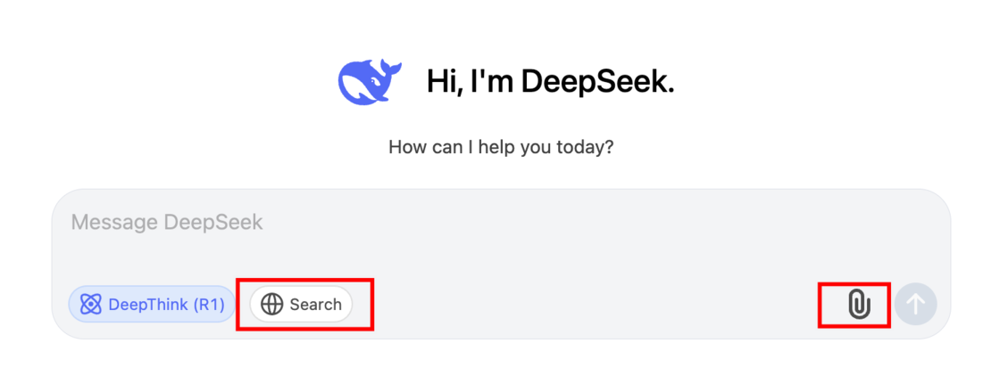

转载自: [Deepseek 教我的法则：不是要「会提问」，而是要「早动手」](https://sspai.com/post/96150)

# Deepseek 教我的法则：不是要「会提问」，而是要「早动手」

最近 AI 的智力升级了，时不时就有大佬们出来说：「人工智能时代，会提问的人，会比回答问题的人更加重要。」大佬们话说了一半，然后就露出蒙娜丽莎的微笑，让群众们（含本人）都有点懵。

「学会提问」、「深度思考」、「底层逻辑」成为了一门显学，畅销书都把这些词语用大字印在封面上，看来印上去书比较好卖。经过与 AI 友好地请教与磋商，我发现其实把问题问好也没那么神乎其技。

我们提问，就是要想办法搞懂一些事情、找 AI 拿一个好方案。如果我们已经参加工作，标准化的流程无非是：展开调查、分析规律、拿出方案、实施看看。

对应要问的问题是：问题找对了没有，按什么规律办事，有啥方案，实施有啥要注意。

别被各种术语骗了，这些都是我们的日常。为了蹭热度，我也拿开源卷王 · 服务器繁忙 · ChatGPT克星 · 美股蹦迪选手 · 深度思考版的 DeepSeek 来举例。

## 一个把问题变得有深度的万能补丁：让 AI 教你应该咋问

想象一个普通的场景，我们打开对话框输入：我想去日本旅游，有什么好推荐。

正常情况下，我们会得到一堆景点、美食、交通、注意事项等，然后要根据自己的需求去进行排列组合。  

这时可以打上一个万能补：你先不要着急回答我的问题，为了质量更高的答案，我还需要补充哪些信息？这是 DeepSeek 给出的答案：

这个问题揭示了一个事实：**每个人都有自己的地图。**它代表着我们自己独特的背景、资源、目标。很多时候，我们会有个盲区，以为大家都是去日本，所以看日本的地图就够了。但从广州还是上海出发，会让安排区别很大，我们地图除了日本，也要包含自己出发的地点。

就像我们找人请教问题，不能看别人的地图，而是要拿着自己的地图来给人看。DeepSeek 除了把价格打下来，比 ChatGPT 更大威力的按钮是上传资料和搜索按钮。因为它提供了比「提示词」更多的「背景」。

记得用好这两个功能

> 你先不要着急回答我的问题，为了质量更高的答案，我还需要补充哪些信息？

对应的**元问题**是：这个问题的「问题空间」是什么？

有两个概念单列一下：所谓**元问题**是关于考虑「问题本身」是否设置正确的问题，而非直接解决原问题的内容。而所谓的**问题空间**，就是包含了所有可能的变量、约束和潜在解决方案的集合，它并非把所有「可能事项」都纳入问题空间，只有与核心目标强关联的要素才被包含。

问题空间的大小决定了答案的广度和深度。有的问题本身无比简单，但问题空间巨大。比如苹果为什么从树上掉下来，关于它的问题空间，如果是生物学领域，是因为苹果熟了。如果是物理学领域，那会推导出：万有引力。

## 不要急着跳到「怎么办」，先问问规律

我们问问题，主要就是想知道为什么、怎么办。除了补充问题的相关信息，在问怎么办之前，先问问「底层逻辑」。

说到底层逻辑那就厉害了，它常见于互联网大公司黑话，等于什么核心洞察啦、第一性原理啦、根因分析、系统基模、奥卡姆剃刀、溯因推理、范式、战略焦点啦（可能是大家 PPT 标题如果没有用这些词，就要扣绩效）。

其实底层逻辑就是问这个事情的规律是啥。规律是指事物之间**内在的、必然的、稳定的联系**或重复出现的本质特征。它反映了现象或过程在一定条件下的确定性、有序性和**可预测性**。

它揭示了我们从问题的起点到答案的因果关系。连去日本旅游都有「底层逻辑」：

我发现了一个有趣的问题：当我们对一个事情的本身理解不够深入的时候，如何确认答案里的逻辑够不够底层？我的理解是一个逻辑更底层，是因为它的例外更少。

我们没有办法从正面去判断一个逻辑是不是够底层，就应该用反例对它进行「碰撞测试」。多问问 AI：你的这个逻辑都有些啥例外呢？

因为对牛顿力学的例外的「碰撞测试」，我们诞生了：相对论。

## 展开行动：提高容错性，小步试错

对事情的规律判断清楚后，我们可以问：这件事的可能性空间是什么？

可能性空间是指某个问题、系统或情境中所有可能存在的状态、解决方案或结果的集合。它反映了在给定条件和约束下，所有潜在的可能性范围。其实没这么复杂，简单点说就是问 AI 有啥方案可以选。

选完了方案还有两个**附加题**，让方案更可靠一点：

*   第一个是：有哪些措施能让这个方案的容错率更高？毕竟事情都是动态发展的，要多想想 plan B。
*   第二个是，最小关键步骤是什么，如何用 20% 的动作解决 80% 的问题？正因为事情是动态发展的，这个世界是一个复杂性系统。

面对复杂性系统，除了要预测，更要小步快跑做迭代。但每次迭代和演进都是有成本的，找找**最小关键步骤**。

## 最值钱的能力：分辨 AI 说的对不对

我们上面讲了很多关于 why 和 how，但其实我留了个陷阱。

我们老想着快点得到答案，因为思考很累很费脑，它涉及到高强度的推理、总结和演绎。AI 恰恰可以很快地提供答案，它认真地解释为什么一件事情能导致另外一件事情。真是瞌睡碰上枕头，口渴碰上奶茶。

可最大的风险在于，高质量的推理需要满足以下几个特点：

1.  连贯，就像讲故事一样，每一步都要和前一步有明确的关系，不能跳跃。
2.  一致，前后说的结论后面不能改。
3.  可溯，每个结论都要能找到它是从哪里推理出来的。
4.  封闭，只用已知的信息来推理，不能随便加入新的假设。
5.  可信，结论必须确定无疑，不能把「可能是这样」当成「一定是这样」。

AI 在推理的每一个方面都有「裂痕」：尽管 AI 可能说得头头是道，但它在逻辑连贯性、内容真实性和推理可靠性等方面都存在明显不足，也很难对其结论的来源进行有效追溯。

如果不好理解，想想我们进行文生图的时候，生成出来人像的手指残缺，它是 AI 推理质量的一种表现。比起 why 和 how，真正重要的是 what，先问是不是，再问为什么。

AI 只是玻璃缸里的大脑，和现实完全脱节，它只能给意见，没办法给验证。所以，能分辨 what 的能力才是将提问转化成生产力最核心的能力，对推理中结论坚实性的把控能力成为了区分 AI 使用效果的关键因素。

如何可以提高确认 what 的能力呢？首先，我们需要在场，没有人能代替你，因为每个人都有自己的地图。然后，我们需要一点点的……审美：如果不知道什么是真的，至少要知道什么是美的。最后，早点动手吧，实践是检验真理的唯一标准。

## 让 AI 长在脑子上：不是想得更久，而是试得更多

其实，提问没那么复杂，就是先想可能性，后选方案的过程。先发散再收敛，人类的带宽不行，而 AI 的脑子很快。

虽然 AI 推理的质量好坏要打一个问号，但是多、快、省。它能快速产生大量可能性，这本身就是一种聪明。发散需要聪明，但收敛需要智慧和勇气。选择方案需要仔细分辨方案的优劣，做出行动，然后承担后果。

AI 思考最大的意义在于，它让试错的成本变得极低，我们可以快速产生各种假设，然后通过实践来验证、迭代和收敛到最优解，**从一个点子直通实践**。

当 why 和 how 的探索变得极为便捷，在问题现场去分辨 what 的能力将变得更加稀缺，当「知道」无限廉价，「行动」将闪闪发光。这种快速实践和迭代的方式，才是我们在前额叶皮层,长出的「数字新脑区」的方式。

不是「完全不行」也不是「人类要完」。人类历史上第一次电力可以转换成智力，每个人的日均 token 消耗量将成为区分人群的重要指标。

这不是因为我们想得更久，而是因为我们尝试得更多。

#### 延伸阅读

*   [年度计划必读：计划完不成，可能是好事](https://sspai.com/post/95558)
*   [让新知识成为冒险游戏，用  AI  重构「学习」这件事](https://sspai.com/post/95426)
*   [工作最忙的 78 天，我用 ChatGPT 考了 CFA](https://sspai.com/post/94340)
