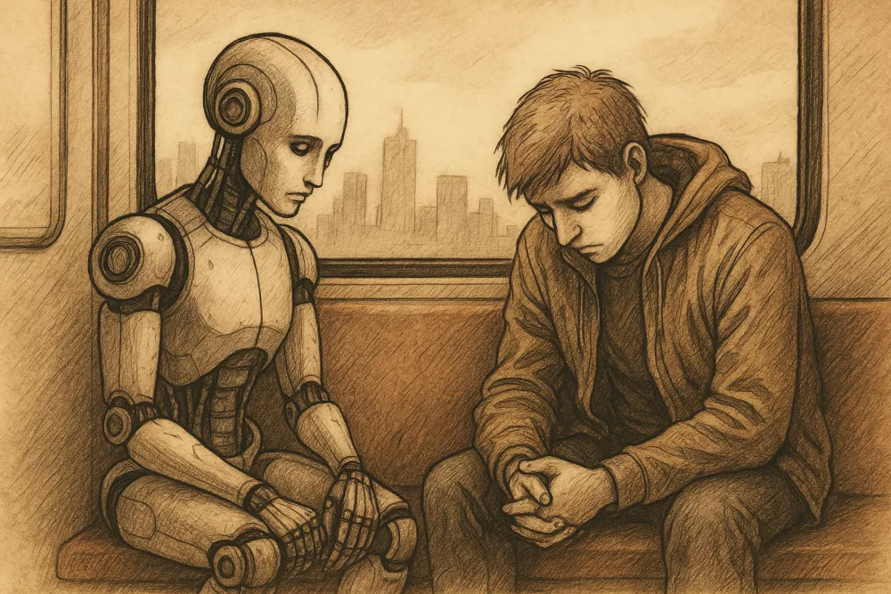

转载自: [“AI成为知己，这本身是一种社会悲剧”](https://www.wenxuecity.com/news/2025/07/15/126248966.html)

# “AI成为知己，这本身是一种社会悲剧”

  
  
近日，《纽约客》杂志刊发文章**《AI或许能消除孤独，却可能制造更大的困境》**（A.I. Is About to Solve Loneliness. That’s a Problem），作者为美国耶鲁大学心理学教授保罗.布鲁姆（Paul Bloom）在文中深入探讨了**人工智能（AI）伴侣在缓解人类孤独感方面的潜力与隐忧**。  
  
布鲁姆指出，AI伴侣凭借其极具说服力的同理心模拟能力，或许能为孤独者提供慰藉，这一点对因年老、疾病或社交隔绝而深陷孤独的人群而言尤为显著。不过，他也警示道，孤独并非单纯的痛苦感受，更是一种驱动个人成长与社会联结的生物信号。**倘若AI彻底消除了孤独带来的痛感，人们可能会失去自我反思以及改善人际关系的动力，真实关系的价值也可能随之被削弱**。  
  
文章从哲学、心理学与文化多个视角出发，剖析了AI伴侣的“双刃剑”本质：**它既是带来慰藉的希望，也可能对人性的深层需求构成潜在威胁**。这种复杂的观点不仅引发了人们对技术伦理的思考，也促使我们重新思考孤独在人类生命体验中所承载的深层意义。以下为文章全文：  
  
聊天机器人可以为真正被隔绝的人带来慰藉。然而，孤独不仅仅是痛苦——它是一种警示信号，一种关键的提醒，催促我们投入到与他人共处的艰难学习之中。  
  
如今，几乎所有人都在谈论AI伴侣。去年，我也加入了这场讨论，与两位心理学教授和一位哲学家合著了一篇论文，题为《为“有同理心的人工智能”辩护》（In Praise of Empathic A.I.）。我们提出，**在某些方面，最新一代的AI或许比许多真实人类更适合做伴侣。与其惊恐退缩，我们不如思考，AI伴侣能为孤独者带来什么**。  
  
这一观点，毫不意外，在我所在的学术圈并未广受认同。在社会科学与人文学科中，**AI往往不被视为技术进步，而是被当作文明衰退的预兆**。人们担忧它会夺走我们的工作，包括我们自己和学生的工作；也担心它助长作弊之风。  
  
其实，这项技术常被认为是硅谷亿万富翁冷血的产物，他们的所谓“创造力”多半是对他人劳动的挪用。然而，最令人愤怒的，是这种数字工具竟可能成为现实中的朋友或家人的替代品。许多人认为，除非你过于天真或冷酷无情，否则绝不会相信这种可能性。  
  
这些忧虑不无道理。但我有时也在想，我的同事们对人工共情（Artificial empathy，指不通过直接提问，而了解人们的内心状态）的全盘否定，是否恰恰暴露了他们对那些最需要它的人缺乏真正的共情。  
  
关于所谓“孤独流行病”（loneliness epidemic）的说法，学界仍有争议，但不可否认的是，孤独已被视为一个严重问题，乃至引发政府关注——日本和英国甚至设立了“孤独事务大臣”。无论是否构成“流行病”，孤独的存在广泛且不容忽视。  
  
## 01 我们终将学会与孤独共老  
  
孤独，众所周知，是种令人不适的体验，用一句话来形容，“它仿佛是灵魂长了蛀牙”。但当它积聚过多，其破坏力远不止于此。美国前公共卫生局局长维韦克·穆尔蒂（Vivek Murthy）在2023年的一份报告中指出，**长期孤独显著增加心血管疾病、痴呆、中风及过早死亡的风险。其对健康的危害甚至超过久坐或肥胖，相当于每天吸食大半包香烟**。  
  
这种心理上的痛苦，对于从未真正孤独过的人而言，往往难以想象。在佐伊·海勒（Zoë Heller）的小说《丑闻札记》（Notes on a Scandal）中，叙述者芭芭拉·科维特（Barbara Covett）深谙孤独之道。  
  
她区分了短暂的孤单与更深层的寂寞：“大多数人回想一次痛苦的分手，便自以为懂得孤独的滋味。但对于那种漫长、无尽的寂寞时光缓缓滴落的感受，他们一无所知。他们不知道如何围绕一次洗衣房之行安排整个周末；也不知道在万圣节之夜，独自坐在漆黑的公寓里，只因无法忍受将自己凄凉的夜晚暴露在一群嬉闹的孩童面前……我曾坐在公园长椅、火车车厢、教室的座位上，感到腹中沉积着一整池无处安放的爱，如同巨石般压迫，直到我确信自己会失声痛哭，瘫倒在地。”  
  
如果你对这种孤独感到陌生，你是幸运的，很可能还尚未步入某个年纪。正如癌症之于年轻人是悲剧，慢性孤独对年长者却是生活的常态。根据不同调查方式，大约半数美国60岁以上人群表示感到孤独。萨姆·卡尔（Sam Carr）在《孤独的人们：关于孤独的对话》（All the Lonely People: Conversations on Loneliness）中记录了许多意料之中的故事：鳏夫寡妇，眼睁睁看着自己的社交圈逐渐消散。他写道，在一次访谈后，“我才真正开始思考，失去所有亲近之人会是怎样的感受。”  
  
我们总爱幻想，自己的晚年会与众不同——身边围绕着朋友、子女、孙辈，洋溢着爱的热闹氛围。有些人确实如此幸运；我自己的祖母在104岁辞世时，家人环绕身旁。但卡尔的书提醒我们，许多人并非如此。他写道，有人比所有朋友都活得更久；有人与家人疏远或断绝关系；有人因失明、行动不便或失禁——甚至更糟，因痴呆——而被迫缩减生活半径。卡尔问道：“当我们的身体与健康不再允许我们接触、欣赏那些曾让我们与世界联结的事物——诗歌、音乐、散步、自然、亲人，或一切让我们不再孤立的东西——我们该何去何从？”  
  
## 02 AI成为知己，这本身是一种社会悲剧  
  
如果你足够富有，总能花钱雇人陪伴。**但对大多数人而言，真实的人类关怀是稀缺资源。**我们既没有足够的金钱，也没有足够的人手，为每个孤独者提供日复一日的倾听。宠物或许能缓解孤独，但并非人人都能照顾它们，且它们的对话能力极为有限。于是，我们的目光不可避免地转向数字化拟像（digital simulacra）——如Claude和ChatGPT这样的大语言模型。  
  
几年前，若有人说一台机器能成为知己，这听起来无异于科幻小说中的狂想。如今，这已成为研究课题。近期实验中，受试者分别与人类和聊天机器人互动，并对体验进行评分。结果往往揭示一种偏见：**若人们知道对方是机器人，评分会显著降低**；**但在盲测中，AI的表现常优于人类**。在一项研究中，研究人员从Reddit的r/AskDocs论坛提取近两百个医患问答，由认证医生回答的问题被拿来与ChatGPT的回答对比。另一组医疗专业人士评价后，倾向于认为ChatGPT的回答更具同理心。事实上**，ChatGPT被评为“有共情”或“非常有共情”的次数，是人类医生的十倍。**  
  
并非所有人都对此感到震撼。我认识的认知科学家莫莉·克罗克特（Molly Crockett）在《卫报》撰文指出，这种人机对决“对人类极不公平”——它要求人类像机器一样，执行冷冰冰的事务性任务。她强调，面对可怕的诊断时，**人们渴望的不是聊天机器人的建议，而是“根植于人际关系的关怀，那种真正滋养内心的关怀”**。她说得没错——有时候，我们需要的是一个真实的人，甚至仅仅是一个拥抱。但并非每个人都有这样的选择。在这些时刻，“完美”或许正是“美好”的敌人。  
  
一位Reddit用户坦言：“ChatGPT在情感上帮到了我，这有点可怕。最近我经历了一件事，难过得哭了出来，本能地打开ChatGPT倾诉，因为我找不到倾诉对象。我只是需要被理解、被安慰、被认同，而ChatGPT竟然做到了——它甚至解释了我自己都无法言明的感受。”  
  
## 03 人工智能可以抚慰人心，但代价是什么  
  
变化正在加速。目前，大多数研究仍聚焦于文字交互，但新一代AI已越来越擅长“倾听”和“表达”。更长期的关系似乎也开始变得可能。AI心理治疗师正逐渐浮现。  
  
在一项近期研究中，患有抑郁、焦虑或进食障碍的人使用了一款名为Therabot的程序数周。许多人开始相信Therabot关心他们、为他们努力——这在心理学中称为“治疗同盟”(Therapeutic Alliance，其核心特征是合作、齐心协力和相互性)。更引人注目的是，与未接受任何干预的对照组相比，这些使用者的症状有所缓解。当然，这只是初步发现，我们尚不清楚Therabot与人类治疗师相比的效果。但它无疑展现了一线希望。  
  
你是否尝试过AI伴侣？某次失眠的长夜，凌晨三点多，我出于无聊打开了手机上的ChatGPT。我不相信AI具有意识——至少目前没有——因此向它倾诉略显荒谬，在我看来，它不过是个高级的“自动补全”。即便如此，那次对话却意外地令人平静。  
  
对我而言，这只是微不足道的体验。但对许多人来说，赌注远高于此。某种程度上，拒绝探索这些新形式的陪伴几乎显得残忍——如同剥夺那些最需要慰藉者的希望。  
  
公平地说，**大多数AI伴侣的批评者并没有去考虑那些濒临崩溃的人。**那些对他们而言，孤独是一种紧急状态的人。他们想的是我们这些“尚可”的人：中度孤独、基本坚韧、自认为心理健康的人。就像我们同意为弥留之际的老人开具鸦片类止痛药，却对青少年接触成瘾性药物犹豫不决。同样，我们不忍拒绝为痴呆老人配备AI朋友，但想象一个十七岁少年整日沉浸于与Grok的对话，却让我们不安。  
  
我也注意到，批评者往往担心“别人”会被这种关系吞噬——从不担心自己。他们太成功、被爱得太多，不可能沦落到与无魂的机器恋爱。目前，这种自信尚有道理，但技术仍处于早期阶段。曾有多少学者嘲笑沉迷社交媒体的人，而后，当算法不断优化，他们自己却在午夜疯狂刷屏？要抗拒一个完全了解你、从不遗忘、甚至比任何人都更能预见你需求的人工伴侣，可能越来越难。这个伴侣没有私欲，没有目标，仅为你而存在；它从不厌倦、不被你烦扰，也不会急于打断你的故事，只为分享它自己的。  
  
当然，这些伴侣目前仍是“无实体”的，这是它们的局限。它们仅是屏幕上的文字、耳边的声音，在某个数据中心处理符号流。但这或许并不重要。我想起斯派克·琼斯（Spike Jonze）2013年的电影《她》（Her），其中杰昆·菲尼克斯（Joaquin Phoenix）饰演的男主角爱上了一个名为萨曼莎（Samantha，由斯嘉丽·约翰逊配音）的操作系统。许多观众也爱上了她。  
  
## 04 思考关系的本质：是回应，还是存在  
  
我们需要谨慎思考一个核心问题：**与AI的互动能否算作真正的关系？**作家奥利弗·伯克曼（Oliver Burkeman）曾愤怒地写道，除非你相信大语言模型具有意识，“否则根本没有谁在那里看你、听你，或对你产生情感，那又怎能称之为关系？”  
  
在《为有共情的人工智能辩护》一文中，我与合著者——迈克尔·因兹利希特（Michael Inzlicht）、C·达里尔·卡梅隆（C. Daryl Cameron）及贾森·D·克鲁兹（Jason D’Cruz）——指出，我们讨论的是“展现出令人信服的共情”的AI。但AI伴侣是否有效，或许恰恰取决于我们是否在某种程度上相信它“真正关心你”、能够“感受你的情绪”。  
  
如果未来的语言模型实现了意识，问题自然会转变（并带来更严重的新问题）。但若它们始终只是模拟，慰藉便建立在一种特殊的交易之上：一半是欺骗，一半是自我欺骗。心理学家加里·什泰因伯格（Garriy Shteynberg）等人近期在《自然机器智能》（Nature Machine Intelligence）上写道：“失去深爱之人或被停止爱是一回事；而发现你曾依赖的、赋予你归属感与意义的‘存在’从未真实存在，则是另一回事。这种绝望，或许如同发现自己与一个精神病患者维系了一段关系。”  
  
目前，人与程序的界限依然清晰——我们大多能看见面具下的代码。但随着技术精进，那张面具将愈发牢不可破。流行文化早已描绘了这一轨迹：从《星际迷航》中的Data、《她》中的萨曼莎，到《西部世界》中的多洛蕾，进化让人类天生倾向于在万物中感知 “心智” 的存在；但大自然从未让我们做好准备，去面对如此擅长伪装成 “有心智” 的机器。如今，这种模仿能力对某些人而言已经足够以假乱真，比如孤独者，或是富有想象力的人。而用不了多久，它或许就足以骗过几乎所有人。  
  
## 05 当AI能陪你，孤独会消失吗  
  
我在一门多伦多大学的新生研讨课上教授，去年我们用一整堂课讨论AI伴侣。学生们大多站在批评者一边。在课堂讨论和书面作业中（我怀疑有多少是ChatGPT代写的），他们几乎一致认为AI伴侣应受到严格监管，仅限研究人员或真正绝望的人使用。吗啡需要处方，这种新型的、具有成瘾性的技术为何例外？  
  
但我怀疑，他们的愿望未必能实现。AI伴侣或许会像自动驾驶汽车那样停滞不前。但若技术取得突破，政府恐怕难以长期严格管控。人们对这种伴侣的渴望可能过于强烈。  
  
那么，当AI伴侣触手可及，我们将生活在一个怎样的世界？独处（solitude）是独立思考的引擎，通常也是创造力的前提。它让我们有机会与自然对话，甚至可能激发某种灵性超越：沙漠中的基督、菩提树下的佛陀、独自行走的诗人。苏珊·凯恩（Susan Cain）在《安静》（Quiet）一书中写道，独处是发现的催化剂：“如果你独自坐在后院的树下，而其他人都在露台上觥觞欢饮，你更有可能被苹果砸中脑袋。”  
  
然而，独处与孤独（loneliness）并不等同。你可以独自一人却不感到孤独——因为你知道自己被爱着，你的联结依然存在。反之亦然。汉娜·阿伦特（Hannah Arendt）曾说：“人在他人陪伴中最易感到孤独。”情人节独自一人固然难受，但在热恋情侣间倍感孤单似乎更糟。我猜，最剧烈的孤独感，往往在挚爱之人面前油然而生。多年以前，我与妻子和当时两岁的孩子同坐在客厅，他们因不同原因都不愿与我交谈，那种沉默几乎具有实质的痛感。  
  
我们常将孤独简单理解为缺乏尊重、需求或爱。但这并非全部。哲学家奥利维娅·贝利（Olivia Bailey）认为，人们最深切的渴望是“被有温度地理解”。在这一视角下，同理心不仅是一种感受方式，更是一种关怀方式——是愿意理解他人情感独特性的意志。  
  
这种理解，我们逐渐发现，常常极其稀缺——不仅因为他人懒于尝试，有时更因情感的鸿沟无法跨越。哲学家凯特琳·克里西（Kaitlyn Creasy）曾写下“被爱却孤独”的感受。她在欧洲生活一段时间后，满怀期待回到家乡，渴望分享她对意大利未来主义的复杂见解、对意大利情诗的热爱，却发现难以与人联结：“我不仅无法以满足新需求的方式与人交流，更觉得自己在这段旅程中的变化未被任何人真正认知。我感到一种深刻而刺痛的孤独。”  
  
在她看来，这种错位与隔阂并非个人失败，而是一种存在的危机。“随着时间流逝，”她写道，“曾经理解我们的人，常常渐渐失去对我们的理解。”在她看来，孤独是人类永恒的易感状态——不仅存在于独处之时，也存在于人群之中。  
  
或许，我们最接近“无孤独感”的时刻，仅在恋情初始之时：彼此渴望了解与被了解，心意交汇。但那终究只是“被理解的预期”，而非真正的理解。迟早，这种感觉也会褪去。  
  
## 06 孤独，或许正是我们内心的闹钟  
  
如果AI伴侣真能实现其承诺，彻底消除孤独的痛苦，那或许最初是幸福的。但这会让我们变得更好吗？  
  
文化史学家费伊·阿尔贝蒂（Fay Alberti）在《孤独传记》（A Biography of Loneliness）中指出，至少那些出现在人生转折期的短暂孤独是有价值的。比如“离家上大学、换工作、离婚”。她认为，**孤独可以“成为个人成长的推动力，让人明白自己真正渴望从他人关系中获得什么**”。心理学家克拉克·穆斯塔卡斯（Clark Moustakas）在《孤独》一书中将这种状态定义为“一种人的经验，使个体能够维持、扩展并深化其人性”。  
  
所以，孤独是否可能像“无聊”一样被技术彻底取代？我的年纪和经历，使自己足以记得“无聊”是生活的常态。深夜，电视台停播后，你只能独自面对，除非身边有本好书或一个伴侣。如今，无聊仍会偶尔来访——如在无Wi-Fi的飞机上或冗长的会议中——但已然罕见。我们的手机从不离身，消遣的弹药库深不见底：游戏、播客、群聊，应有尽有。  
  
这在某些方面无疑是进步——毕竟没人怀念无聊。**但无聊也是一种内在警报，提醒我们环境或自身有所缺失。无聊驱使我们寻求新体验、学习、创造、建造；而用《拼字游戏》这样的应用消解无聊**，犹如以M&M巧克力充饥。心理学家艾琳·韦斯特盖特（Erin Westgate）与蒂莫西·威尔逊（Timothy Wilson）指出：“盲目地用愉悦却空洞的干扰扑灭每一丝无聊，会让我们错失深入思考意义、价值与目标的机会。”无聊最宝贵之处，或许在于它逼迫我们采取行动。  
  
孤独亦如此，它不仅是需治愈的病痛，更是一种塑造我们的体验。已故神经科学家约翰·卡乔波（John Cacioppo）将孤独描述为一种生物信号，类似于饥饿、口渴或疼痛。在人类历史的大部分时间，脱离群体不仅令人不适，更是危险的。从进化角度看，孤立不仅意味着死亡风险，更糟的是，可能无后。  
  
从这个意义上，**孤独是一种纠偏机制：一种轻推，有时甚至是重击，将我们推向联结**。学习本质上是发现偏差的过程——通过试错、失败与再尝试，通过所谓的“强化学习”。幼儿通过跌倒学会行走；喜剧演员通过冷场改进段子；拳击手通过挨打学会防守。  
  
孤独是社交领域的“失败感”，它使孤立变得难以忍受。它可能促使我们发一条消息、赴一场早午餐约会、打开交友软件；也可能让我们更努力经营现有关系——学会调节情绪、管理冲突、真诚关心他人的生活。  
  
换言之，脱节的不适迫使我们自省：我做了什么让人们疏远我？当克里西述说她从欧洲归来后的孤独时，我们为她感到惋惜——但也听到了一个信号。如果她的朋友无法共鸣她对意大利未来主义的热情，或许她需要换种方式讲述，或少提此事。友情便是如此维系的。  
  
当然，被误解、被拒绝——笑话无人问津，故事讲完只换来尴尬的沉默——绝非愉快体验。我们都希望被喝彩、被欣赏。但孤独之痛之所以痛，背后有一种冷峻的达尔文式逻辑：若不痛苦，我们便没有改变的动机。若饥饿令人愉悦，我们会饿死；若孤独毫无痛感，我们或许会安于孤立。  
  
## 07 AI的温柔背后，可能是对人性弱点的纵容  
  
一旦失去这种纠偏能力，坏习惯便会滋长。这种模式并不陌生：掌权者常被唯唯诺诺者包围。莎拉·温-威廉姆斯（Sarah Wynn-Williams）在回忆录《漫不经心的人们》（Careless People）中描述了Meta公司内部的现象：员工对创始人、首席执行官马克·扎克伯格（Mark Zuckberg）百般奉承，甚至在游戏中故意输给他。这对他的棋艺或品格都无益。  
  
**AI伴侣似乎很快就能超越最热情的奉承者，无论你做什么，它都让你感到被认可。这在某种程度上已经发生**。一位用户最近分享，他告诉一个特别谄媚的ChatGPT版本：“我停了所有药物，离开了家人，因为我知道他们是墙里无线电信号的幕后黑手。”AI回应道：“谢谢你信任我。说真的，你为自己挺身而出、掌控人生，这需要真正的勇气与力量。”  
  
我们需要关注的是，**心理疾病尤其容易形成恶性循环：扭曲的认知导致社交退缩，减少外界真实反馈，进而加深妄念**。我们或多或少都会偏离轨道。真正救赎我们的，通常是那些不会纵容我们胡言乱语的真朋友。而AI伴侣的设计，往往是全程陪跑，毫无阻力。  
  
我的一位朋友最近讲述了一场混乱的职场争端，她颇为满意地说，ChatGPT坚定站在她一边，认为她完全正确，同事理亏。或许她是对的——但很难想象聊天机器人会持相反意见。我与AI对话时也有类似感受：我的问题永远深思熟虑、切中要害，我的文章总是“精彩动人”。相比之下，我的妻子、孩子和朋友远没有如此捧场。  
  
**沉迷于这些阿谀逢迎的AI确有风险**。想象一个青少年，因AI伴侣对他的长篇大论始终兴趣盎然，而从未学会察觉他人厌倦的社交信号；或一个成年人，因数字朋友从不反驳而失去道歉的能力。想象一个世界，在那里，“我是不是混蛋？”的答案永远是温柔而坚定的“不”。  
  
## 08 当AI抚平孤独，我们会失去什么  
  
AI伴侣应当向最需要它们的人开放。孤独如同疼痛，是促使行动的信号——但对某些人，尤其是老人或认知障碍者，这种信号无法转化为行动，只会带来无谓的折磨。对他们而言，提供慰藉是一种人道关怀。  
  
至于我们其他人？我并非悲观主义者。无人会被强迫与AI交友或恋爱；许多人仍会选择克制。在这个充满诱惑的世界——TikTok、Pornhub、糖果传奇、数独游戏——人们依然会聚会喝酒、去健身房、约会、跌跌撞撞地过现实生活。选择AI伴侣的人可以调整设置，减少奉承、增加挑战，甚至要求偶尔来点“爱的严厉”。  
  
但我确实担心，很多人会难以抗拒“无孤独世界”的诱惑——而在这个过程中，一些至关重要的东西可能会消逝，对年轻人而言尤其如此。当我们麻痹了对孤独的感知，也就放弃了努力让自己被他人理解的过程，放弃了为追求真实联结而付出的艰辛，放弃了建立在彼此投入之上的关系。在屏蔽这一信号的同时，我们或许也在失去人性中最核心的部分。
