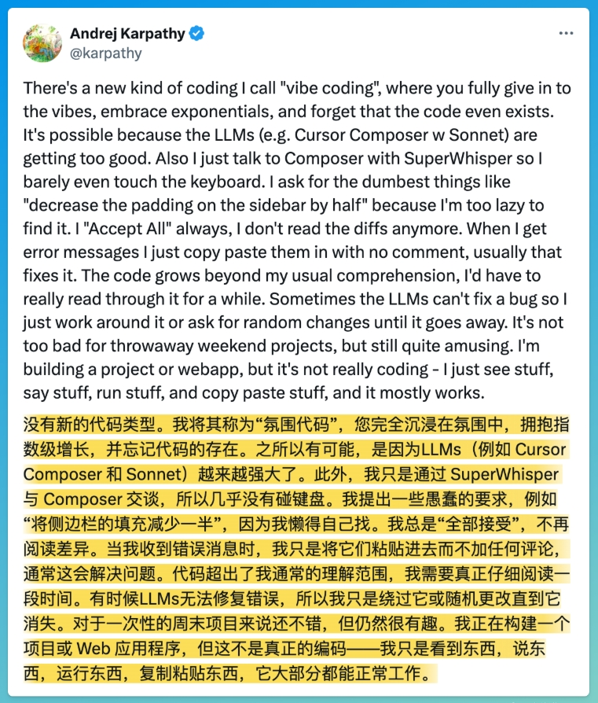
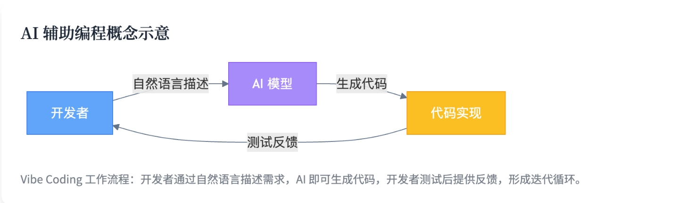
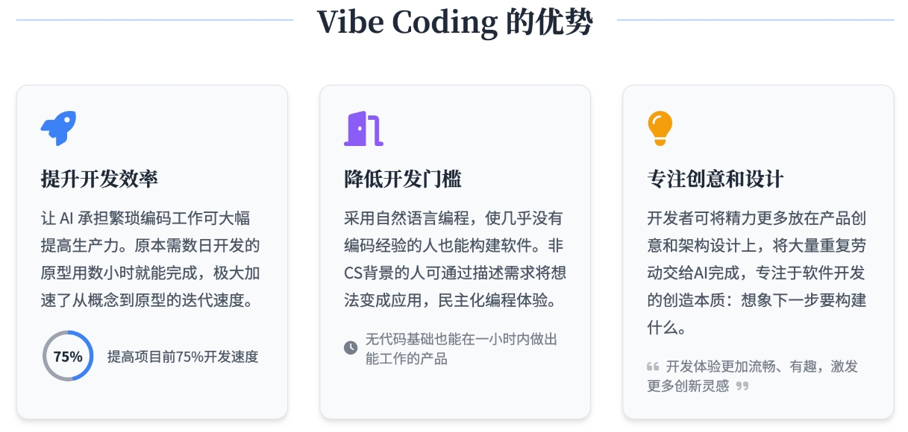
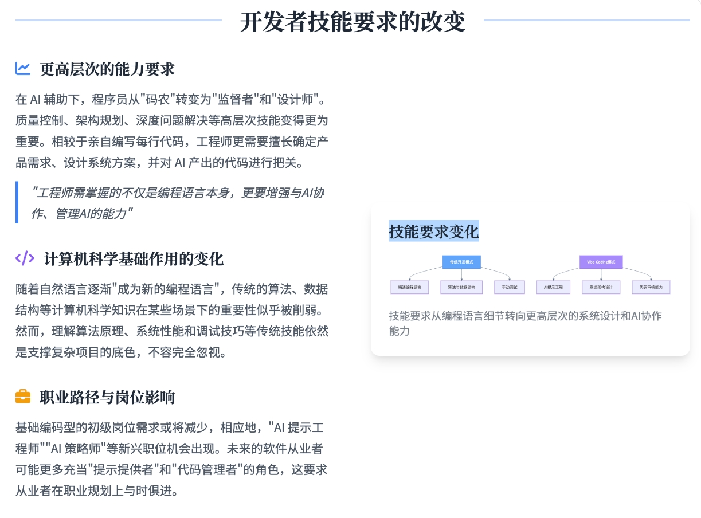
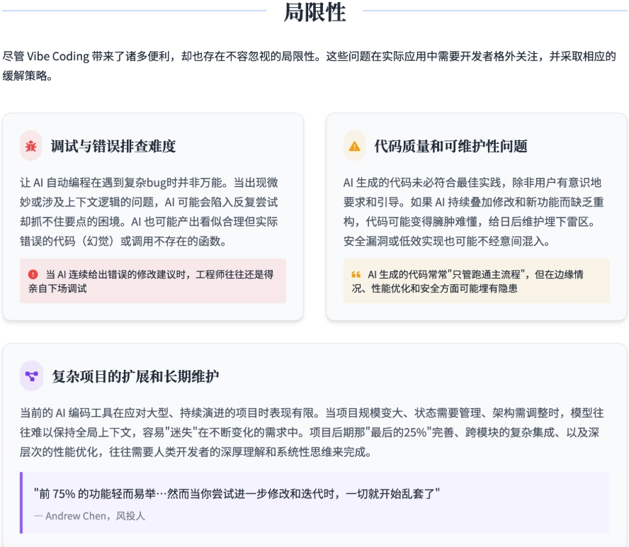
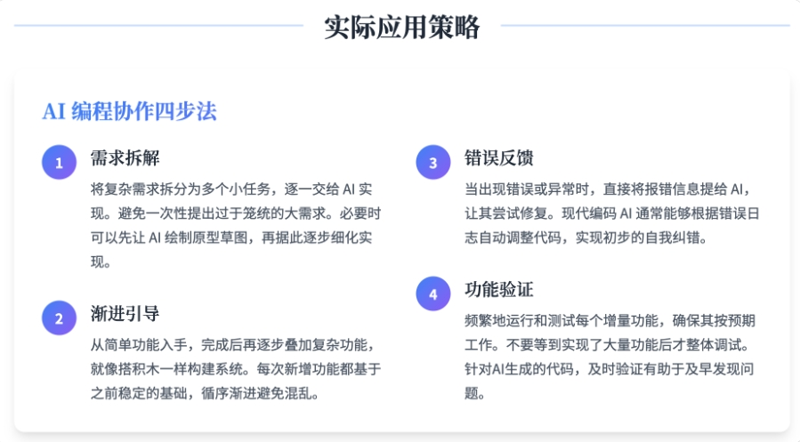
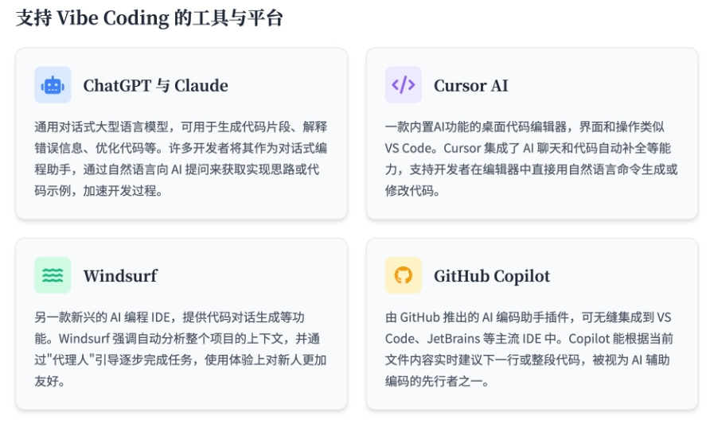

转载自: [Vibe Coding彻底火了，到底什么是"氛围编程"？它如何改变未来的软件开发？](https://www.cnblogs.com/txw1958/p/18791536)

# Vibe Coding彻底火了，到底什么是"氛围编程"？它如何改变未来的软件开发？  

在过去十年间，低代码/无代码平台和 AI 代码助手持续冲击着软件开发行业。如今，一种被称为 Vibe Coding 的新兴实践突然走红，甚至颠覆了人们对"程序员到底在做什么"的认知。本篇文章将从定义到实践策略、从优势到局限性，全方位探讨 Vibe Coding 给软件开发带来的重大变革，并帮助你更好地理解这场浪潮的走向。

### Vibe Coding 的定义：深入解析

"这不算真正的编程 -- 我只是看看东西，说说东西，运行东西，然后复制粘贴东西，而且它大多都能工作。" — Andrej Karpathy

Vibe Coding 是一种依赖人工智能的计算机编程实践，其核心在于开发者使用自然语言提示向针对代码优化的大型语言模型（LLM）描述问题，由 LLM 生成软件，从而使程序员摆脱编写和调试底层代码的需要。 这个术语由计算机科学家、OpenAI 联合创始人兼特斯拉前人工智能主管 Andrej Karpathy 于 2025 年 2 月提出，并迅速成为一种新兴的编码方式。Vibe Coding 的倡导者认为，即使是业余程序员也能在无需大量培训和技能的情况下生成软件，这代表了一种更为直观和便捷的开发模式。

其关键特征在于，用户通常在不完全理解代码底层机制的情况下接受 AI 生成的代码。这与仅仅将 LLM 作为代码输入的辅助工具不同，后者仍然需要开发者审查、测试和理解每一行代码。Vibe Coding 的本质是"完全沉浸于"AI 助手的"氛围"中，将详细的实现过程外包给 AI。 正如 Karpathy 最初所描述的那样："这不算真正的编程 -- 我只是看看东西，说说东西，运行东西，然后复制粘贴东西，而且它大多都能工作" 。

从起源和发展来看，Vibe Coding 伴随着强大的、经过代码生成优化的 AI 模型的兴起而出现。一些分析师认为，Vibe Coding 只是低代码平台的下一步发展，在这种模式下，自然语言成为了编程语言。在 2010 年代兴起的低代码/无代码平台以及 2021 年出现的 AI 代码助手（如 GitHub Copilot）是 Vibe Coding 的早期先驱。2022 年底 ChatGPT 的发布标志着会话式编码时代的到来。到 2025 年，Vibe Coding 已经从一种边缘化的实验转变为一种主流趋势，这得益于 AI 技术的进步和实际应用中的成功案例。

Vibe Coding 的核心原则包括：使用自然语言进行提示，将 AI 视为代码生成的合作伙伴，通过迭代反馈循环不断完善代码，以及在一定程度上接受 AI 生成但可能不完全理解的代码。这种方法的核心在于将与代码的交互从直接操作转变为通过自然语言进行更高层次的抽象，从根本上改变了开发者与代码库的关系。 传统编码需要使用特定的语法进行明确而详细的指令，而 Vibe Coding 则通过允许自然地表达意图来抽象化这一过程。这标志着开发者角色从亲力亲为、注重细节转向更具指导性和方向性的转变。

### Vibe Coding 与传统编码的比较

| 方面  | Vibe Coding | 传统编码 |
| --- | --- | --- |
| 开发速度 | 更快 — AI 辅助生成加速编码和迭代 | 较慢 — 手动编码、调试和优化需要更多时间 |
| 可访问性 | 更易上手 — 降低非程序员的门槛 | 较难上手 — 需要正式的编程知识 |
| 所需技能 | 提示、审查、系统设计、问题定义 | 语法知识、算法、数据结构、调试 |
| 代码理解 | 黑箱式理解 — 接受但不完全理解 | 深度理解 — 开发者直接控制和理解代码库 |
| 调试  | 可能具有挑战性 — 依赖 AI 修复问题 | 更容易 — 开发者理解代码逻辑 |
| 代码质量 | 不稳定 — 取决于 AI 能力和提示 | 更可控 — 开发者可以遵循最佳实践 |
| 长期可维护性 | 可能更难 — 缺乏深入理解和文档 | 更容易 — 结构良好且有文档记录的代码 |
| 复杂性处理 | 受 AI 限制 — 难以维护大型项目的结构 | 无限制 — 完全控制复杂性和自定义 |
| 关注点 | 高层次问题解决 — 开发者描述意图 | 实现细节 — 开发者手动编写、优化和调试代码 |
| 灵活性 | 存在一些限制 — AI 生成的结构可能僵化 | 无限制 — 开发者可以完全控制代码的各个方面 |
| 学习曲线 | 更容易 — 主要依赖自然语言 | 更陡峭 — 需要学习语法、算法、调试和优化 |
| 学习资源 | 新兴领域，资源快速增长，但相对分散 | 成熟体系，资源丰富，体系化教程、文档完善 |

### Vibe Coding 的优势

Vibe Coding 通过多种机制显著提高了开发者的工作效率。首先，AI 能够快速生成复杂或重复的代码，大幅缩短开发时间。例如，过去可能需要数天才能完成的原型，现在可能在数小时内即可构建完成。其次，Vibe Coding 使开发者能够将更多精力投入到高层次的问题解决、架构设计和产品设计上，而不是纠缠于语法错误和样板代码。 这种转变让开发者能够更专注于创新和创造性的工作。

此外，Vibe Coding 有利于快速原型设计和迭代。通过简单的自然语言指令，开发者可以快速尝试新的想法并获得初步的演示版本，从而加速反馈循环。Vibe Coding 还降低了软件开发的门槛，使那些编程经验有限甚至没有编程经验的人也能够创建软件。领域专家可以直接使用自然语言描述他们的需求，而无需先将其转化为代码。

Vibe Coding 还能自动化繁琐的任务，将重复性的编码工作和调试工作交给 AI 处理，从而解放开发者的精力。此外，语音编码的兴起使得开发者可以通过口头表达想法，再由 AI 将其转化为代码，这对于具有不同认知风格的开发者来说尤其有益。

在以下场景中，Vibe Coding 的优势尤为突出：快速原型设计、创建小众和个性化应用、自动化简单任务、促进更广泛的开发参与、加速产品迭代周期以及在需求明确的情况下。 例如，Kevin Roose 提出的"个人软件"概念，即通过 AI 构建满足个人特定需求的应用程序。Vibe Coding 的优势在于能够加速开发的初始阶段，并赋能那些编程技能有限的个人。这预示着软件创造者范围的扩大以及想法实现速度的提升。

### 开发者技能要求的改变

Vibe Coding 的出现对开发者的技能要求产生了显著的影响，并正在改变传统的软件开发方法。开发者需要更加注重问题定义和规范，清晰地使用自然语言表达需求和期望的结果。确定最佳的提问方式变得至关重要。同时，开发者需要具备指导和审查 AI 生成代码的能力，评估、完善和测试 AI 产出的代码。开发者更像是扮演指导者或编辑的角色。

系统设计和架构的理解变得比低层次的编码更为重要。批判性思维和问题解决能力对于评估和改进 AI 生成的代码至关重要。此外，开发者需要学习如何有效地与 AI 沟通，掌握提示技巧以获得期望的结果。虽然侧重点有所变化，但对编程基本原理的理解对于有效地指导 AI 和进行调试仍然很有价值。

Vibe Coding 对传统软件开发方法的影响体现在以下几个方面：软件开发更加注重意图驱动，即更关注期望的结果而不是具体的实现细节。迭代周期变得更快，Vibe Coding 与敏捷开发方法高度契合，强调快速迭代和灵活性。AI 处理了部分传统上由初级开发者完成的任务，可能导致团队结构的变化。非程序员也能参与到软件创建中，模糊了项目不同角色之间的界限。此外，可能出现"快速迭代发布"或"MVP 驱动开发"的趋势，即更倾向于实时构建和发布产品，而不是进行大量的原型设计。 Vibe Coding 还可能促使编程语言向更高层次抽象发展，并可能降低对学习多种编程语言的需求。自然语言可能成为主要的交互界面。然而，Vibe Coding 强调快速迭代和最少的前期规划，这与瀑布模型的顺序性形成对比。

Vibe Coding 标志着软件开发模式的根本转变，从细致的手动编码转向更抽象、意图驱动的方法，人类开发者在此过程中扮演着指导 AI 的角色。这必然要求开发者掌握新的核心技能。如果 AI 负责底层编码，那么人类所需的技能自然会转向更高层次的关注点。清晰地定义问题和指导 AI 的能力变得至关重要。此外，AI 的输出需要验证，这需要批判性思维和对软件架构的理解。这表明开发者正在从"代码编写者"转变为更像是能够有效利用 AI 的"软件架构师"或"产品负责人"。

### 局限性

尽管 Vibe Coding 带来了诸多便利，但也存在一些不容忽视的局限性。在调试方面，AI 工具并非总能解决错误，有时需要开发者进行实验性调整。调试 AI 生成的代码可能具有挑战性，因为开发者可能不完全理解其底层的逻辑。 如果开发者没有参与代码的创建过程，那么在出现问题时，他们可能难以追踪错误。对于复杂的问题，仅仅依靠直觉理解可能不够，还需要系统的调试技巧。AI 在尝试修复错误时，有时可能会引入新的问题。AI 模型在处理大型代码库时，其上下文窗口的限制也会阻碍对代码的全面理解。此外，AI 有时会将代码插入到错误的位置或丢失上下文信息。

在代码质量方面，AI 生成的代码可能并非总是针对性能进行优化，也可能不符合最佳实践。这可能导致代码结构、命名约定和逻辑的不一致。过度依赖 AI 可能会导致开发者产生"自动完成依赖"，不再深入理解代码。如果 AI 没有经过安全编码实践的充分训练，则可能引入安全漏洞。在不进行充分审查的情况下就接受 AI 生成的代码，可能会导致一些问题被忽略。AI 生成的代码有时可能只是初步的框架，需要大量的人工完善。

从长期维护的角度来看，对 AI 生成代码缺乏深入理解会使得未来的维护和修改变得困难。快速生成代码而缺乏适当的设计会导致技术债务的累积。直觉式的编码可能导致代码结构混乱，难以维护。 纯粹的 Vibe Coding 通常缺乏文档，这会阻碍未来的理解。早期 AI 决策可能难以在后期进行修改，导致架构上的锁定。代码的结构更像是涌现出来的，而不是经过仔细设计的。过度依赖 AI 可能会导致开发者失去基本的编程技能。此外，Vibe Coding 对软件的长期可靠性也提出了挑战。

Vibe Coding 虽然提供了速度和便利性，但同时也带来了与代码质量、可维护性以及开发者基本技能可能退化相关的重大风险。如果不加批判地采用 Vibe Coding，可能会导致大量的技术债务和长期的挑战。Vibe Coding 带来的短期效率提升，可能会以长期的技术债务为代价。对 AI 生成代码缺乏深入理解会产生黑箱效应。没有这种理解，调试会变得更加困难，确保代码质量具有挑战性，并且未来的修改可能存在风险且效率低下。过度关注快速生成而忽视仔细的设计和文档编制，会导致技术债务并阻碍长期可维护性。

### 实际应用策略

为了有效地应用 Vibe Coding，需要采取一些关键策略。首先，需要进行清晰而具体的提示，向 AI 提供详细且明确的指令。与 AI 沟通时，可以将其视为一位初级开发者，需要更详细的指导。其次，要进行迭代式的完善，通过不断地提示、审查和提供反馈来引导 AI。人类的监督和代码审查至关重要，需要实施健全的代码审查流程，以确保代码的质量、安全性和符合标准。鼓励开发者编辑和改进 AI 生成的代码。

模块化设计有助于提高代码的可维护性，将项目分解为更小的、易于管理的组件。采用测试驱动开发的方法，编写测试来验证 AI 生成代码的功能和正确性。 遵循最佳实践，例如构建易于维护的代码提示，定义技术栈和建立工作流程。可以从较小的项目或功能开始，逐步集成 Vibe Coding，以积累经验并了解其局限性。即使采用 Vibe Coding，也应维护一定的文档，记录应用的意图和整体结构。AI 也可以辅助生成文档。最后，需要在 AI 的强大功能与开发者对代码库的深入参与和对底层逻辑的理解之间取得平衡。

目前有一些工具非常适合 Vibe Coding。例如，Cursor 是一款以 AI 为核心的集成开发环境，专为会话式编码而设计，提供自然语言输入、上下文分析、代码生成、自动调试和增强的文档查找等功能。Replit 是一个在线编码平台，集成了 AI 功能，如 Ghostwriter，可以通过自然语言提示生成、解释和部署代码。GitHub Copilot 是一款 AI 代码助手，作为代码编辑器的扩展工作，提供代码自动完成和自然语言编码问答的聊天模式。ChatGPT 和 Claude 等大型语言模型聊天机器人也可以用于 Vibe Coding，尽管它们并非专门的编码 IDE。其他工具如 Roo Code/Cline 和 Aider 也为使用免费的 AI 模型进行 Vibe Coding 提供了可能性。Lovable 平台则致力于提高 AI 生成代码的可靠性和生产可用性。

有效实施 Vibe Coding 需要结合策略性的人工指导、遵循软件开发最佳实践以及使用专门的 AI 驱动工具，这些工具能够促进自然语言交互和代码生成。仅仅依赖 AI 生成代码而不进行任何人为监督或建立完善的流程很可能会导致问题。因此，将 Vibe Coding 集成到现有工作流程中需要定义清晰的提示、审查和测试生成代码的指南。能够简化此过程的专用工具的可用性对于成功采用至关重要。

### 支持 Vibe Coding 的工具与平台

随着这一趋势兴起，市面上出现了多款 AI 编程助手和集成开发环境，帮助开发者更方便地实践 Vibe Coding 思路。其中具有代表性的包括：

ChatGPT 与 Claude：通用对话式大型语言模型，可用于生成代码片段、解释错误信息、优化代码等。许多开发者将其作为对话式编程助手，通过自然语言向 AI 提问来获取实现思路或代码示例，加速开发过程。

Cursor AI：一款内置 AI 功能的桌面代码编辑器，界面和操作类似 VS Code。Cursor 集成了 AI 聊天和代码自动补全等能力，支持开发者在编辑器中直接用自然语言命令生成或修改代码。

Windsurf：另一款新兴的 AI 编程 IDE，提供代码对话生成等功能。Windsurf 强调自动分析整个项目的上下文，并通过"代理人"引导逐步完成任务，使用体验上对新人更加友好。

GitHub Copilot：由 GitHub 推出的 AI 编码助手插件，可无缝集成到 VS Code、JetBrains 等主流 IDE 中。Copilot 能根据当前文件内容实时建议下一行或整段代码，被视为 AI 辅助编码的先行者之一。

不同类型的开发者都可以根据自身需求，利用上述工具提高工作效率。对于非技术背景或编程初学者，ChatGPT 这类对话 AI 能充当启蒙老师，帮助理解编程概念并提供现成代码；像 Cursor、Windsurf 这样的工具更是让他们可以用自然语言直接创造程序，大幅降低了入门门槛。

对于有经验的工程师，AI 工具则可承担大量重复劳动，让他们将精力集中于架构设计和疑难问题解决。例如资深开发者可以让 AI 快速生成样板、测试代码，然后专注于审核和优化，从而整体提效。

对于创业者或独立开发者，Vibe Coding 更是如虎添翼 -- 单枪匹马也能做出过去需要团队协作才能完成的产品雏形。Karpathy 本人就曾演示在一小时内分别构建出一个阅读应用和一个小游戏，这在以前几乎是难以想象的速度。

可以预见，无论新人还是老手，善用 AI 编程助手都已成为提升开发效率、完成更具野心项目的关键技能之一。

### 行业影响

Y Combinator 首席执行官 Garry Tan 在访谈中指出："这不是一时的潮流，它实际上是主要的编码方式"， 他强调不顺应 AI 编程趋势的开发者可能会被甩在后面。Vibe Coding 的兴起正在改变软件行业的生态，包括企业用人标准和团队组织方式。越来越多的技术领袖认识到，AI 辅助编码将成为未来开发的常态，而非昙花一现的新奇事物。这直接影响了软件工程师的招聘要求 -- 公司更重视候选人利用 AI 提高效率的能力，以及在 AI 协作下进行系统设计和质量控制的综合素养。 面试考察可能更关注实际问题解决和代码审核能力，而不再一味强调手写算法细节。正如业内共识，未来工程师需同时精通编程和 AI 协作，两者缺一不可。

这种范式转变也使软件团队的规模和组成发生变化。借助 AI，一个小团队如今能够完成过去大型团队才能实现的目标。Y Combinator 2025 年冬季批次的最新数据就显示，大约 1/4 的初创公司声称其 95% 的代码由 AI 编写。这意味着不到 10 人的初创团队也可以开发出完整产品，并获取可观的用户和收入。 报道指出，现在小型创业公司用几名工程师就能撑起数千万美元的业务，而无须再雇佣五、六十人的庞大开发团队。这一效率革命让创业门槛降低、创新步伐加快，同时也促使大型科技公司重新审视人力配置，推动了多轮降本增效的裁员潮。

然而，从长远看，Vibe Coding 带来的并非简单的裁汰，而是软件行业分工的重组与进化。繁琐重复的编码工作交给 AI 后，人类工程师能够腾出时间专注于更高价值的创造性任务，这将催生更多新产品和新需求。"当编程变得如此之快，软件将吞噬更多行业" -- 也就是会有前所未有的海量软件项目涌现，真正有想法、有洞见并善于驾驭 AI 工具的工程师将比以往任何时候都更受欢迎。

### 未来展望

随着 AI 模型的不断进步，Vibe Coding 的应用范围将进一步扩大。未来，我们可能会看到以下几个发展趋势：

首先，AI 辅助开发工具将变得更加专业化和垂直化。 不同行业和技术栈可能出现专门的 Vibe Coding 解决方案，更好地满足特定领域的需求。例如，针对前端开发、数据科学或企业应用的专用 AI 编程助手，它们能够理解行业术语和最佳实践。

其次，AI 与传统开发工具的集成将更加深入和无缝。 未来的 IDE 可能会将 AI 功能作为核心组件而非外部插件，提供更加一体化的开发体验。代码生成、审查、测试和部署的整个流程都可能被 AI 增强。

第三，我们可能会看到更精细的人机协作模式出现。 开发者将能更好地控制 AI 输出的细节，例如通过更丰富的提示词工程或可视化工具来指导 AI 生成符合特定架构和设计模式的代码。AI 也可能变得更善于理解和遵循项目的上下文和规范。

对于开发者来说，Vibe Coding 不会完全取代传统编程技能，而是形成互补。我们可能会看到一种新的平衡，其中开发者专注于高层次的系统设计、架构决策和业务逻辑，而将更多的实现细节委托给 AI。这种协作模式将重新定义什么是"编程技能"，从纯粹的代码编写转向有效指导和管理 AI 工具的能力。

尽管有人担忧 AI 会取代程序员，但更可能的情况是，那些能够有效使用 AI 工具的开发者将取代那些不能的开发者。正如历史上其他技术变革一样，新工具不会消除对专业人才的需求，而是改变了对他们的技能要求。

总之，Vibe Coding 不仅仅是编码方式的革新，更是软件开发角色与团队协作模式的重新定义。从快速原型到商业级应用，AI 的协作潜力还远未被完全挖掘。对开发者而言，善用自然语言提示、建立完善的审查流程、持续提升系统设计与批判思维能力，才是拥抱这场变革的关键。或许在不久的将来，Vibe Coding 将成为软件开发的默认形态，而那些真正具备前瞻思维和适应力的团队与个人，也将在这波浪潮中脱颖而出。