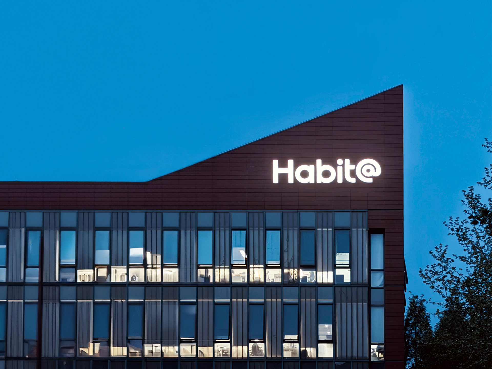
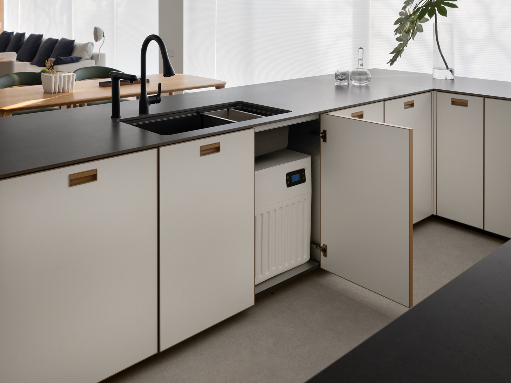
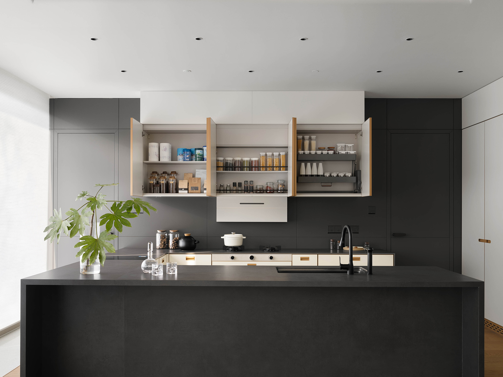
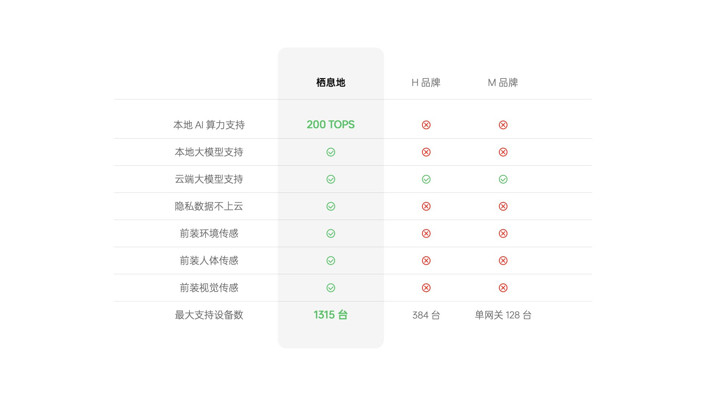
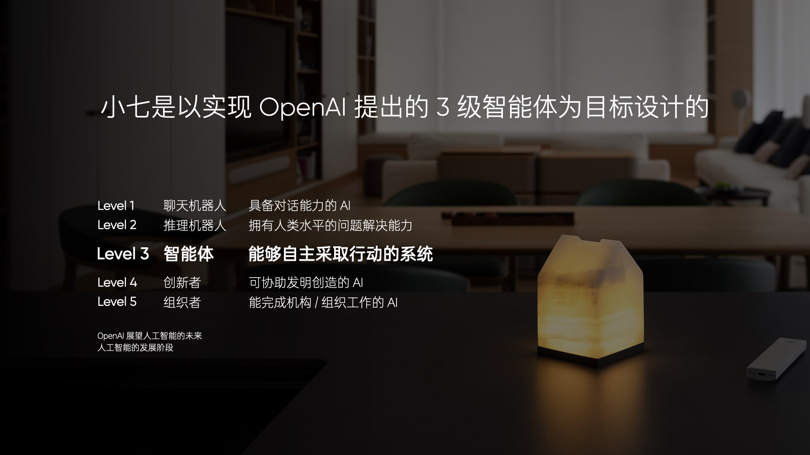
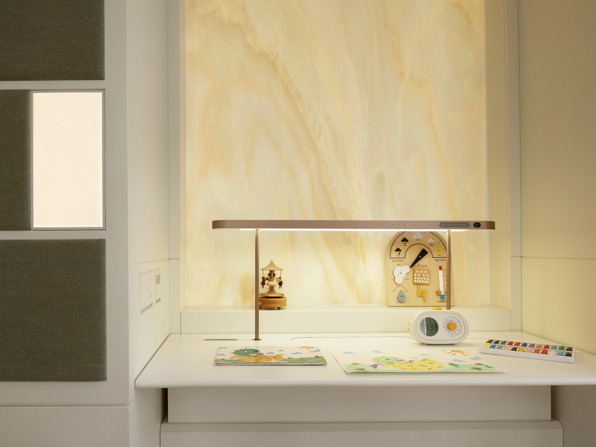
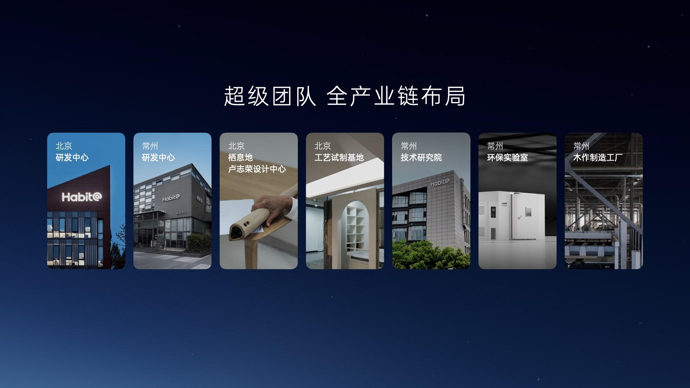

转载自: [AI 加持的智能住宅，可能是智能汽车后最大的产业风口](https://www.geekpark.net/news/346443)

# AI 加持的智能住宅，可能是智能汽车后最大的产业风口

摘要
> 智能住宅可能是下一个智能空间终端。

科幻电影中的智能住宅一直是人类梦寐以求的愿景。

前世界首富比尔·盖茨曾耗时七年，斥资 6300 万美元，在距离微软总部仅 15 分钟车程的麦地那小镇，打造了名为「世外桃源 2.0」的超级豪宅。这座住宅内外遍布温度、运动和光线传感器，配合强大的中央控制系统，能够为盖茨一家及其访客提供智能化、个性化的温度调节、灯光控制和多样化的娱乐服务。

如今，随着智能技术和制造业的进步，越来越多的普通家庭也能体验到智能家居的便利。特别是在 GPT、DeepSeek 等大型模型问世后，一个能够管理家庭温度、空气质量、娱乐设施，甚至指挥各种智能设备完成烹饪、洗衣和清洁任务的智能管家，似乎离我们并不遥远。

然而，当前家庭住宅智能化的真正挑战，并非在于智能化的技术水平——即大型模型能否像真正的管家一样管理家庭事务——而在于用户是否能在装修阶段就以智能化住宅的标准进行设计和施工。如果仅仅是「后装」，比如购买智能音箱和一些智能灯具、设备，那么一个非智能化的住宅只能实现有限的智能家居功能。

一些企业和创业者已经洞察到了这一机遇。2 月 28 日，由原理想汽车联合创始人、前总裁沈亚楠创立的生活智能科技公司「栖息地」，正式发布了新一代智能住宅产品 L32（三室两卫）的 2.0 版本。在 1.0 版本的基础上，L32 2.0 引入了算力平台和传感器等智能化基础设施，并推出了行业首个家庭 AI Agent 智能助手——「小七」。

早些时候，笔者参加了栖息地组织的小型体验会，并与沈亚楠及其团队进行了深入交流。通过这次体验和交流，我认为这个团队凭借在汽车领域积累的供应链和产品经验，成功打造了目前国内最成熟的智能住宅产品。可以说，这次体验让我对智能住宅的未来有了更多信心。

# 用造车的方式造家

在住宅智能化的浪潮中，「后装」问题被普遍认为是行业最大的痛点。要实现真正的全屋智能，必须从房屋装修的第一天起，就以智能住宅的标准来规划整个装修方案，这一点在业内已达成共识。

栖息地公司以其独特的理念进入这一领域，他们采用造车的方式，为家庭用户提供一体化设计和功能强大的智能新住宅整体交付服务。尽管从事的是装修业务，但包括沈亚楠在内的高管团队多次强调：栖息地并非传统的家装或装修公司。

沈亚楠用造车作比喻，指出传统装修如同销售零部件让客户自行拼装汽车，而栖息地则致力于交付一辆标准化、高质量的「整车」。因此，他们将产品定义为智能住宅产品，而非简单的精装或整装方案。

然而，与拥有标准化空间的汽车不同，住宅的户型千差万别，这使得标准化面临更大的挑战。为此，栖息地自主研发了基础的空气、水、光环境系统，并为 L32 开发了超过 450 个居住功能模块。这些模块可以像乐高积木一样自由组合和拼接，以适应不同的空间布局和功能需求。

这些居住模块涵盖了水槽柜、烹饪区、镜柜、家庭图书馆、成长型儿童床等家庭常见生活场景。表面看来，这与其他装修公司的整装方案似乎并无太大差异，后者也提供烟机灶具或浴室柜、水槽等可选配件。然而，经过深入体验后，我发现两者之间存在显著区别。

首先，栖息地的居住模块设计完全基于家庭用户的实际使用场景，而非传统家装公司那样简单区分为硬装和软装。这种设计理念使得栖息地的产品覆盖范围更加全面。更重要的是，栖息地的居住模块均为自主研发或与合作伙伴共同定制开发，加之其从水电改造阶段就介入用户的装修施工，使得许多功能模块实现了创新突破。

「WaterCube 四合一水处理器」丨图片来自：栖息地

例如，栖息地的「WaterCube 四合一水处理器」令人印象深刻。在水槽下方仅 0.15 立方米的空间内，这台设备能够满足净水、软水、直饮水、即热直饮水四种家庭用水需求。相比之下，普通小户型家用水处理器通常只能实现前置净水和后置直饮水两种功能。

这种四合一水处理器以往主要用于别墅，需要专门的水房来安置设备。而栖息地通过在厨房下水槽实现四合一功能，不仅体现了设备创新，更展示了装修方案一体化的优势。例如，需要调整台面和柜体尺寸为净水设备预留空间，同时由于设备重量较大，还需对水槽柜体进行特殊处理以防止压塌。

通过在改水改电阶段做好提前规划，水处理设备的功能得以最大化发挥。沈亚楠分享了自己装修时遇到的痛点：家中新风系统的空气加湿模块使用自来水，极易滋生细菌。栖息地的产品通过提前布局，将一路净水管道通至加湿模块，有效解决了这一普遍存在的家庭生活痛点。

烟机管道隐藏在吊柜后面丨图片来源：栖息地

类似的创新案例还有很多。例如，在烹饪模块中，栖息地自主研发了烟机灶具，其中烟机的管道不再像传统烟机那样是一根大管通向吊顶，而是与灶台上方的吊柜结合，设计成隐藏式风道，为灶台上方这一黄金位置节省出宝贵的储物空间。又如，卫生间的水龙头和花洒大多采用墙出式设计，而非品牌厂商安装在浴室柜或淋浴架上的方案，大大节省了空间。

我认为，这可能是栖息地与传统家装公司最本质的区别。传统家装公司的大部分产品都是采购自品牌的标准化产品，而无论是净水器厂家还是烟机灶具厂家，都必须考虑其产品能够适配市面上的普通橱柜。相比之下，栖息地的产品均为自主研发或与上游伙伴共同定制，交付给用户的不是单一的烟机或净水器，而是一个包含各种功能模块的完整住宅系统。

这或许正是他们坚持称自己为生活智能科技公司，并将产品定义为智能住宅产品的原因。通过这种一体化的设计和交付模式，栖息地正在重新定义智能家居的未来。

# 全屋智能底盘

在 2024 年，笔者刚刚完成了一次家居装修。起初，我对全屋智能系统抱有浓厚的兴趣，但经过一番简单的了解后，我很快就决定放弃这个想法。目前市面上的全屋智能解决方案大多仅仅是在装修时增加一些电源接口，实现声控开关灯、窗帘或自动调节灯光等功能。这些方案不仅装修过程繁琐复杂，而且实际效果并不显著。

正如文章开头所提到的，理想中的全屋智能系统不应仅仅局限于安装一个智能音箱来实现声控开关灯，而应该是一个能够全面管理家庭的超级管家。这个管家不仅能够控制家中的灯光和空调，还能连接音响播放音乐、开关电视和投影仪，甚至能够操控厨具烹饪、洗衣机定时洗衣，以及指挥扫地机器人进行清洁工作。

如今，大模型技术已经能够提供这样的超级管家所需的智能核心。然而，要让这个管家真正实现所有功能，必须在装修阶段为其设计并安装必要的基础设施。这需要一体化地定义、研发和优化智能住宅产品的能力。

栖息地智能底盘对比市面其他解决方案丨来自：栖息地

在 L32 2.0 产品中，栖息地公司构建了一套完整的智能底盘。这套系统的核心是一个拥有 200TOPS 算力的 AI 算力中枢，能够运行端侧 13B 参数的大模型。此外，系统还包括一个家庭融合传感系统，涵盖了空间、环境、阵列麦克风、人体动作等九类传感器，以实现对家庭成员状态和家庭环境、设备运行的实时精确感知。栖息地还建立了一套家庭数据通讯系统，通过有线和无线混合组网的方式，最多可以支持 1315 台智能设备的连接。

基于这套智能底盘，栖息地推出了行业首个家庭 AI 助手——小七。这个助手不仅能够控制家中的灯光和空调系统，栖息地还开发了行动模型，可以通过读屏的方式操作预装的第三方应用程序，从而在一定程度上操控第三方的智能设备。

智能伴读舱丨图片来自：栖息地

当然，从 2 月中旬的现场实际体验来看，目前栖息地的智能住宅还无法达到科幻电影中那种智能管家轻松操控全屋的水平。大部分智能功能模块，如提醒孩子坐姿、自动调节灯光的智能伴读舱，或是根据屋内环境自动调节的新风系统，主要还是基于传感器的预设和产品的自主研发，实现了一定程度的自动化功能。

但更重要的是，栖息地智能住宅构建了一个智能化的基础平台，未来这个平台支持 OTA 升级，从而可以不断扩展功能，提升性能。本地化部署的 AI Agent 管家也能够随着家庭成员的生活习惯不断学习和成长，更好地理解和满足家人的需求。

就像智能手机出现后，其强大的算力芯片、GPS、相机、NFC、陀螺仪等传感器的集成，推动了移动支付、本地生活服务、运动监测等应用的创新。同样，有了智能化的基础设施，未来住宅智能创新的土壤也将更加肥沃。

# 栖息地，能在家居行业走多远？

最后，聊聊栖息地这家公司。

体验活动上，沈亚楠分享了自己选择在理想风头正劲时决定离开创业的原因，当时他有两个层面的思考：

1.  随着「房住不炒」政策的实施，房屋的属性从投资回归到了居住。中国已经解决了「有房住」的问题，但「住得好」的问题仍有待解决。在衣食住行四大基本需求中，中国在其他三个领域通过产业发展已走在世界前列，唯独居住体验尚待提升。
2.  品类创新需要契机，而移动互联网之后的下一个科技生态将是空间智能。虽然汽车被视为第一个空间智能终端，但家实际上是一个更为重要的终端。居住空间必将成为继汽车之后的又一个空间智能终端。类比智能汽车的发展，家的智能化必然是先产品化再智能化。

基于这些判断，沈亚楠决定离开理想汽车，投身创业。他在汽车行业的经验使他迅速洞察到传统家装行业的一个痛点：垂直整合程度极低。尽管许多家装公司拥有工厂，可以生产定制柜、踢脚线甚至部分软装家具，但用户最终购买的大部分家具、主材和辅材仍然来自第三方品牌，这导致了产品的拼凑感。不仅外观和功能缺乏统一性，这些第三方品牌还需要投入大量广告费用以吸引客户。

他以汽车行业为例，难以想象一个由数万个零部件组成的汽车，每个车灯、座椅、发动机品牌都需要投入营收的 30% 至 40% 作为宣传费用，让用户自行选择。而垂直整合供应链，不仅可以更好地实现房屋功能，还能减少产业链中不必要的宣传费用，从而帮助最终用户降低成本。

然而，整合供应链并非易事。装修一个一两百平米的住宅，涉及几十种不同的建材、辅材、家具以及各种电器，智能化还意味着需要更多的传感器、芯片和通讯系统。无论是自主研发还是与供应链联合研发，供应链管理工作都极为复杂，这也是过去家装行业鲜有公司尝试这么做的原因。

栖息地产业链布局丨图片来自：栖息地

但管理复杂供应链体系正是这个来自理想汽车的创始团队的优势所在。可以看到，在栖息地的产品体系和供应链管理中，大量借鉴了汽车行业的经验，甚至栖息地的灯具、空气系统的研发，都是联合了来自汽车行业的供应商。

然而，自主研发的另一个问题是前期投入较大。根据公开报道，栖息地仅在 2024 年 4 月宣布完成了由理想、石头科技等投资者投资的 6.53 亿元。对此，沈亚楠表示，尽管前期投入较大，但相比高度依赖规模效应的汽车行业，家装行业的毛利水平更高。即使在过去两年，栖息地的智能住宅产品尚未全面起量，也不至于亏本烧钱。

最后，也是我自己最好奇的问题：栖息地今天瞄准的用户与理想汽车相同。像他们主打的 L32（三室两卫）住宅产品，今天拥有这类住宅的基本都是有娃的中产家庭。而一般来说，中产家庭相比智能化的噱头，更关注的还是功能，智能住宅的概念未必对这个群体有足够的吸引力。

事实上，栖息地并不以智能化作为唯一的卖点，而是将环保健康、功能更好更舒适以及美观这三点与智能化并列，作为栖息地智能住宅希望实现的四个目标。这点与理想汽车的理念也有相似之处，后者不仅追求极致的智能驾驶体验，还强调空间的舒适性，把创造移动的家、幸福的家作为品牌使命。

在智能化方面，栖息地 L32 也不是一味追求功能酷炫，而是优先开发那些能解决家庭用户痛点的功能。例如，将更多环保技术、智能化技术应用于空气、水、照明的处理，改善居住环境，解决现代中产家庭最关注的健康问题；又如设计智能伴读模块，解决陪伴小孩读书这个虽不起眼但却是有娃家庭都会头疼的痛点问题。

最后总结一下。虽然相比于宏伟的愿景，尤其是住宅智能化的目标，L32 2.0 的发布只能说栖息地刚刚抵达自己的第一个产品里程碑，效果如何还需要市场的验证，产品本身也还需要持续的升级和迭代。但仅仅创业两年时间就能做到今天这一步，构建起一个清晰的路线蓝图，并能交付复杂但高质量的自研产品体系，栖息地和智能住宅的未来发展，让我有了更多的期待。

就像五六年前我们还无法想象智能汽车的普及，十年甚至五年后，智能住宅像今天的智能汽车一样成为标配，并非没有可能。
