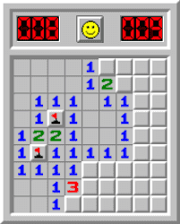

转载自: [玩了十几年游戏，这是我对自己「玩家」身份的总结思考](https://sspai.com/post/95265)

# 玩了十几年游戏，这是我对自己「玩家」身份的总结思考 - 少数派

电子游戏——Video Game——我有相当长的一段时间为之痴迷，充满热情，乐在其中。那时我玩游戏是按「个」算，一款游戏我会连续几天高强度游玩直到通关，然后再继续寻找下个目标。

然而，在 2024 年末尾的今天，我回想后确定，今年我只玩了一款新游戏，并且生活中用于游戏的时间占比也大大下降了。

这并不代表我现在变成了一个「轻度玩家」，游戏依然是我生活方式的一部分，不过更多的时候，我在探索对于游戏背后设计、文化、教育、心理学甚至哲学等领域的这些分析研究，在这个过程中对那个作为「玩家」的自己也有了更加全面的认识。这篇文章就来聊聊在这期间我得到的一些思考感悟，还有一些具体实践的部分。

## 游戏与身份

我们在玩游戏时会同时拥有三种身份：虚拟身份、现实身份、投射身份。

### 虚拟身份

这个身份大部分情况下是游戏世界中我们扮演的那个虚拟角色，我们通过虚拟身份才能「进入」游戏世界。其实所有游戏都可以归类为 RPG，即角色扮演类游戏，即使是《扫雷》这种，貌似完全不存在什么角色扮演要素，只要你一开始玩，就是在隐秘性的扮演着一个「扫雷工兵」或者你随便叫它什么，并默认接受游戏的规则：踩到地雷你就会「死」。

而比较典型的虚拟身份就像《最后生还者》中的「乔尔」这种更具立体感的人物形象。根据游戏类型的不同，虚拟身份的属性也处在服务于玩法的工具性和服务于叙事的角色性之间。

### 现实身份

这个身份不必多说，很好理解，就是玩游戏时屏幕面前那个「你」，一个非虚构的活生生的人，这个你由现实世界的多个方面构成：性别、人种、国家、意识形态、年龄区间、家庭背景、职业、兴趣爱好等。

### 投射身份

投射身份更像是一种「状态」，特指「正在扮演虚拟身份时的你」，这个身份产生于你和游戏进行互动的过程。

前文提到，我们的虚拟身份时刻处在游戏规则的制约之下，但如何理解和对待规则，在这个规则内如何行事，是由现实中的你决定的。从开始游戏的那一刻起，游玩过程已经变成了玩家正在创造的一个项目，现实世界中玩家的思维方式、价值观、欲望等投射到了虚拟身份上，因此虚拟角色在游戏过程中处在一种叠加态：既有游戏设定的那一部分，也有玩家投射到角色身上的那部分。投射身份的存在介于游戏世界和现实世界之间，代表着虚拟身份和现实身份的耦合和互动。

在《耻辱 2》中，玩家可以保持潜行或正面出击，对敌人也可以击晕或处决。而各种游玩风格的背后，显然是现实中不同个性的人对于角色各自的理解，他们都认为自己做出了符合虚拟身份的正确抉择。例如很多玩家认为角色应该是一个隐秘刺客，专注目标，保持低调。另一些玩家则不会放过这些敌人，必须用暴力手段彰显正义。

又或者在那些典型的 RPG 中，来到关键节点，需要选择后续的剧情走向，玩家不但会基于自己，也会站在虚拟角色的角度去做出选择，可以看到虚拟身份已经反过来对现实中的玩家产生了影响。正是游戏的这种互动性，让玩家对虚拟角色的代入和共情远超小说和电影。

当然不同类型的游戏，投射身份的表现形式也不同。像在《超级马力欧》初代中，虚拟身份的存在感并不比《扫雷》中那个「笑脸」高多少，玩家对屏幕上这团像素的第一印象，大概也就是「疑似穿着背带裤戴个帽子的人」，也并没有一段酷炫的 CG 动画告诉你角色从哪来到哪去。

但我们操作马力欧蹦蹦跳跳的时候，毫无疑问是完全沉浸在游戏世界里的，但这大部分是凭借其优秀的玩法循环。这里的虚拟身份基本只具备工具性，我们的思维很像在学某种乐器或者练习一项运动那样，面对挑战，磨练增进技巧，此时投射身份激活的是那些现实中有关学习和反馈的部分。

投射身份这块比较复杂，想说明白比较难，但只要你玩过游戏应该能形成一个差不多的概念。理论性的东西就先说这些，接着来讲讲，这么多年来我为什么爱玩游戏？

## 我喜欢玩游戏的原因是什么

「为什么要玩游戏？」

之前我是从没想过这个问题的，但这几年，随着心中各种「为什么」接连出现，我也开始思考，是什么，促使我过上了作为「玩家」的生活？

从小我就对这个世界充满疑问，而一个啥事都要搞明白为什么的人，在小孩儿和大人之间都不受待见。小伙伴们觉得你太较真，大人有时候都说不过你：「你一个小屁孩还教育起我来了？」

在成长过程中我渐渐领悟到，并不是所有人都对「原因」这件事有如此强烈的执着，你这样搞只会让大家都很尴尬，所以我学会了闭嘴，把这些问题埋藏起来。之后虽然也像个正常成年人一样自食其力，该干嘛干嘛，但这种压抑产生的迷茫、空虚和无力感一直处于心中，但当时的我并没有发觉。

在那些「为什么」重新找上门来之前，我的人生就是一场毫无目地的漫步，不确定自己究竟想要什么，以后的日子该怎么过，当然也没有任何计划。现在回看，曾经我玩游戏能如此投入其中的原因，很大一部分是想找回这份失去的「掌控感」。

回想这十几年的游戏生涯，早年我玩的最多的类型是像《古墓丽影》、《刺客信条》、《死亡空间》、《孤岛危机》、和《使命召唤》这类声画表现优秀，极具沉浸感的动作 / 射击冒险游戏。记得高考前一天下午我还在玩《使命召唤 8》，而且应该玩得还挺带劲的，丝毫不 care 明天就是一场，用高中班主任的话来说「决定生死」的人生大考。

这个时期我是想在游戏世界实现那些可能性，通过扮演游戏中的各种英雄人物，历经艰险，完成目标，将我在现实身份下无法获得的目标感和无处可使的行动力投射到了虚拟身份上，而在一次次经历「英雄之路」的旅途中，我也得到了现实身份中缺少的各种能力和品质。

相比现实中那些我无法理解的各种规则，游戏里「我是谁？从哪来？到哪去？」的哲学三问是非常清楚明白的，对于游戏机制的学习也有非常直观的反馈，你能很明显的感受到，自己获得的新能力可以对这个世界造成什么影响。每当我沉浸在游玩的过程中，都暂时摆脱了现实世界的束缚，在投射身份上实现了对自己现实身份的超越。

## 是什么改变了我的游戏观

没有导航容易迷路，甚至掉进沟里，随机漫步的我还算幸运，一直在沟边反复横跳，但运气总有耗尽的那一天。或者是命运安排的时候已到，现实生活中各种问题接连出现，迫使我不得不去面对和解决它们。

正如叔本华在《人生的智慧》中所言：「任何快乐都带有否定的性质，而痛苦却具有肯定的性质。」我们的人生其实是被痛苦驱动着的，任何一点痛苦都会消灭我们当下的快乐。

我渐渐发现自己玩游戏无法像之前那么「入戏」了，我想这是我现实身份的剧变造成的。开始我提到，投射身份是连接游戏世界和现实世界的桥梁，是由二者共同创造的。那我们可以想象这样一个场景：你在玩游戏时，突然一个电话打了过来，此时虚拟身份和投射身份会瞬间消失，你整个人重新被现实身份接管：接电话或者先按掉它。不管用什么方式，等你处理完这件事后，才能继续回来玩游戏。

现实中的那些没有解决的问题，在你玩游戏的时候依旧在「后台运行」，就像一个虽然铃声一开始很小，但慢慢增大，永不停歇的来电一样，你显然没法无视之，早晚要去接。

但其实能否真的解决这些问题并不重要，重要的是你终于听到，并下定决心去接起这个电话。伴随着时间的推移，年龄的增长，生活经验的增加，心智思维的不断迭代，我其实已经在探索和实践如何在现实中重新建立掌控感的方法，而不再那么需要通过游戏这种方式来获得。

这同样让我作为玩家的那一部分也得到了更新，这主要体现在我玩游戏的「口味」开始改变。用电影来做比喻，以前的我喜欢的都是「豆瓣 TOP 250」，而现在我开始对文艺片、独立电影甚至 cult 片感兴趣了。

我玩到的第一个「非主流」游戏，按时间上讲应该是《特殊行动：一线生机》，它乍一看就是个《战争机器》的模仿者，只是把背景换成了现代战场，和市面上那些主流军事射击游戏一样，同样也充斥着枪炮和暴力。但再次类比电影，通关之后，你发现它并不是《黑鹰坠落》，而是《现代启示录》。

如果我没有此前大量游戏的积累，没有在生活中对其他文艺作品的广泛摄入，没有了解过相关的人文社科知识，我想我很难 get 到游戏制作组真正想表达的精神内核。

这时我也开始接触那些此前从没玩过的游戏类型，包括但不限于：

*   解迷：《锈湖》、《传送门》
*   沙盒生存：《饥荒》、《我的世界》
*   「魂 like 」：《黑暗之魂 3》、《空洞骑士》（好吧，我觉得它就是个长着「银河城」外表的魂 like）
*   装备驱动：《暗黑破坏神》、《无主之地》
*   MMORPG（大型多人在线）：《魔兽世界》
*   其他乱七八糟的类型……

就在这个不断探索各种游戏类型的过程中，我越来越以一种旁观和审视的态度，用批判式的思维去看待游戏，而不是像之前那样全然投入。多年的游戏生涯，虚拟身份和现实身份的相互作用，已经把这些经验作为一个独立的「玩家」属性，整合到了我的现实身份之中。

我从一个单纯的游戏消费者，逐步转变为研究者，从元级别思考和分析游戏，最终转为生产者并产出内容，正如你现在看到的这篇文章。举一些更常见的例子：你为了在某款游戏中表现的更好，去查找攻略，在论坛上和人讨论，你就已经变成了一个研究者，而那些能帮人解答问题，产出攻略，甚至制作 MOD 修改游戏的资深玩家就是生产者。

再比如你从一个普通手机电脑用户，到喜欢研究各种系统优化策略和应用软件的数码爱好者，最后成为一个数码科技频道博主。可以看到，「消费者 - 研究者 - 生产者」这条身份迁移路线在许多领域都适用，在每个阶段人看待事物的视角是完全不同的。

## 现在我如何对待游戏

### 认识自己的玩家类型

对于「人为什么玩游戏」这个问题，从业人员和学者同样感兴趣，目前最广为人知的是「巴特尔玩家类型分类法（Bartle taxonomy of player types）」，这是研究玩家动机的最早理论之一，在上世纪 90 年代由理查德•巴特尔提出。

巴特尔是早期多人在线游戏的开发者，也是一个大学教授，他同那些资深玩家进行交流，来了解他们想从游戏中得到什么，调查后发现，这些都玩了几百个小时的重度玩家，他们的需求是完全不同的，经过长期深入研究，巴特尔最后把他们分为四大类：

目标型（Achievers）、探索型（Explorers）、社交型（Socializers）、杀手型（Killers）。

目标型玩家通常是为了达成各种目标而玩游戏，他们把游戏视作挑战并设法攻克，在此过程中获得成就感，如通关最高难度，拿下全成就，刷到最高等级。甚至他们会把这种挑战拓展到游戏之外，例如速通玩家，为了缩短那几秒钟的完成时间，背后需要投入几百个小时的练习。

探索型玩家喜欢在游戏中探索多样性，他们不太在意游戏的「正确打开方式」，而是进行深入研究，看能否找到一个道具的新玩法。相比按部就班的推主线，他们更喜欢搜寻体验分支剧情，去到那些从未涉足的地区，发掘隐藏要素或者彩蛋。

社交型玩家是游戏内外社群的主要人员，喜欢在公屏聊天，以及活跃在各个游戏群里交流讨论。他们为了社交而玩游戏 ，看重人与人之间的关系。在游戏中他们更享受在团队合作中与队友齐心协力的感觉，以及群体间产生的友谊和羁绊。

杀手型玩家玩游戏是为了一种统治感，他们享受在博弈中战胜其他人的感觉，别人的痛苦就是他们的快乐，他们是各种竞技类游戏的常客，追求压制对手，获得胜利。极端的杀手型就变成像是在那些低分段虐菜，开挂，或是去新手村堵门的玩家。

结合我们自身的游戏经历，可以看到其实每个人身上都包含有这四种基本类型，只不过存在不同程度的偏好。现在的游戏开发者也在想办法尽量照顾到每种类型的需求，例如现在大部分游戏都自带的成就系统，单机游戏中也有多人模式。

随着游戏行业的发展，巴特尔玩家类型作为早期理论，在如今还是有一定局限性的，这些年也有新的玩家分类理论提出。最近比较被认可的，是耶鲁大学传播学博士 Nick Yee 收集分析了 40 多万份玩家数据后提出的「玩家动机模型」（gamer motivation model）。

这个模型把玩家动机分为六大类，每个大类还有两种基本动机，可以说非常详细。在这里就不一一介绍了，在官网上有比较详细的文档，感兴趣的可以自行研究，这里特别推荐他们团队推出的「Quantic 玩家类型」问卷，你可以把它当成游戏版的 MBTI 性格测试，蛮好玩，相关链接我会放到文章最后。给大家看下我之前做出来的结果：

和我现在的自我认知还是挺匹配的，在《魔兽世界》这种多人游戏中，我也是属于那种单机玩家，更喜欢在副本中攻关 boss 提升装备，优化战斗流程，打出极限 DPS，只有没事干才去刷刷幻化和坐骑。玩《暗黑破坏神》这种装备驱动类游戏，我也不再满足于直接「抄作业」，而是去思考大佬们的构筑思路从何而来，去学习钻研游戏的底层机制，尝试创建自己的原创 build，总体上在游戏外进行研究的时间还更多一些。

这和前文提到的身份迁徙路线也有关系，有些人可以满足于一直停留在消费者阶段，但我显然天生就有成为研究者和生产者的倾向。正如《魔兽世界》中我最喜欢的一条提示语：

> 打不过强大的敌人？记住，只要在你的生命值降为 0 之前先把敌人的生命值降到 0 就行了。这绝对管用！

所有人都明白这个简单的道理，但为什么大佬的构筑就比别人强？其实他们只不过比一般人用更多时间，去测试游戏机制和验证自己的想法而已。

《我的世界》是一款极其优秀的作品，但我玩不下去，不是这类游戏的目标受众，它显然就更适合那些创造型的玩家。所以喜欢挑战就去玩高难度去跑速通，喜欢创造就去盖房子去做 MOD，喜欢社交就去找人分享沟通，喜欢获胜就去激情对抗，没有谁规定「神作」就必须适合所有人，也没有谁去限制每个人怎么玩游戏，找到最适合自己的游玩方式才是最重要的。

目前市面上的游戏多到让人挑花眼，选择太多并不是一件好事，尤其是当你不知道自己到底想要什么的时候，很容易出现「买来却一次都没玩过」的情况，当然有些人就是享受这种购物的过程，但对于大多数玩家来说，就算是从经济上讲也是一种浪费行为，最终还会造成面对满屏幕的游戏，选择困难，没有动力启动。搞清楚自己的玩家类型，可以有效降低此类情况的出现。

### 保持开放心态

一个人「成熟」的标志是什么？很大一部分就是他对于「成本」这件事有了更加清晰的认识，你会认识到自己的资源不是无限的，但自己的能力是有限的，越来越能感受到属于你的那个「边界」的范围在哪。这当然会提高资源利用率，减少踩坑的次数，但同样会让你变得固执、无聊、摆烂、丧失好奇心、抵制新鲜事物……

就像一个苹果，你要让它保持原状，需要各种努力，放到冰箱里也不会阻止它渐渐腐坏的过程，而如果放任不管，那它几天之内就会烂掉发臭。因为没有好好保存这个苹果，成熟的代价也临到了我头上。这些年能明显感觉到自己「机心」变重，耐心下降，甚至出现了此前从没有过的「嫉妒」情绪。

嫉妒可以说是所有负面情绪中最没用的一种，除了给自己添堵外还能干嘛？我思考过它的本质后，发现它可以归于一个原因：别人身上有自己潜意识里想要却得不到的东西，不是想怎么提升自己，而是诅咒别人失去。

就比如我在查看一篇解析游戏机制的文章时，突然蹦出一个想法：「为什么这么简单的东西，当时我没发现？」

同时伴随着的还有某种智商上低于作者的感觉，当时我就察觉到了，这是嫉妒，没有想着如何从对方身上学习自己缺少的东西，而是着眼于比较，别人有，我没有。

真正的大师都怀着一颗学徒的心，大佬们的想法也是参考了许多人的经验才得出来的，前面我也提到了，反复试错，一点一点的测试游戏数值，这是极其枯燥的，一般人根本受不了，但是有些人天生享受这个过程，还把测试结果放出来造福大众。

成熟让人变得固执，固执意味着失去了成长型思维，就比方说小时候的我们嫉妒那些会骑自行车的大人吗？当然不会，我们只想着有一天自己也能骑上自行车。我们生下来是啥都不会的，一直都在学习别人，只是在逐渐长大的过程中，我们学会了竞争和比较。好吧，彻底没了这二者也会出问题，但古今中外各路哲学都告诉我们，尽量减少。用学习代替比较，比我优秀的人那都是为我所用的资源，总有人在某一方面比你强，自己搞不懂就看攻略，学习前人的总结，这是必要且正确的。

文章开头我说，今年只玩了一款新游戏，其实这两年我都在重温一些之前玩了很久的游戏，对大部分新游戏提不起任何兴趣，还有很多没玩过的那些教科书般的经典作品，同样不想玩。而回顾这些老游戏也并没有发掘出什么新东西，纯粹就是怀旧加消磨时间。

好奇心下降背后的原因：「这些事现在跟我没啥关系。」

那我们可以一直向前追溯，最初来到世界上，没有任何东西是你的，跟你没有任何关系，你现在的一切都靠着学习获得的经验。人随着成长变得保守，这有生理上无法摆脱的因素，所以我们才更要意识到这一点，必要时，把好奇心当成「主动技能」，强迫自己去使用。

摆脱固执与重启好奇心的关键，就在于重新建立成长型思维，回到一无所知但敢于学习的状态。

### 尽量有始有终

前面反复提到的，今年我唯一玩过的新游戏，就是《动物井》，算是「银河城」类型吧，我自己玩过的这类游戏也不是很多，但《恶魔城》和《银河战士》这些开山鼻祖还是很熟悉的。也许是这些年来，个人品味越来越偏向那些有特色，充满独特风格的作品，《动物井》这款今年独立游戏的黑马终于让我有了「想玩一玩」的冲动。

《动物井》全程对游戏流程没有任何纸面上的引导，全靠玩家的直觉，在各种细节和暗示中和制作人「对上电波」，关卡设计要是没点真东西，是不敢如此自信的，事实上游戏也确实做到了。但这同样对玩家也提出了很高的要求，你得全程跟上他的脑洞。

游戏前中期我还是非常投入的，但到了某个时间点，我突然有点不知道接下来该去哪、该干嘛，在地图上乱逛的我进入了一种虚无主义：

「居然卡关了？为啥还要玩这游戏？我可以选择不玩。」

我很明白这样下去不是办法，所以决定先停一下。

很明显，此时只有两种选择，要么闷头继续毫无头绪的玩，结果应该不会太好，很可能心态炸裂直接弃坑。要么去查一下攻略，这当然会破坏某种完美主义，好像不是完全依靠自己的聪明才智独立解决问题（这里又在比较了），好吧，能通关总比半途而废要好一些。所以最后，我还是选择去看攻略了。

然后我发现，自己其实已经打通了 80% 的流程，就差最后的部分。

我关掉浏览器，回到游戏，没用多久就通关了。

当然，从那篇攻略中看，我大概只玩到了这游戏三分之二的内容，远不能称为「真通关」，但我决定先就这样结束，这次已经是完成预期了。

「弃坑」这个行为会传染，如果你经常在一些看似无关紧要的小事上逃避，那你大概率变成一个方方面面都习惯于逃避的人，这当然会把你的生活拖入虚无，做一半就放弃是比完全不做危害更大的一件事，你最好明白这一点。

所以为了我们的身心健康，尽量打通每一个游戏，哪怕是以比较丑陋的方式。

## 一些结语

《动物井》的这个存档至今还放在那里，依然是不完整的状态，我可能也没时间和动力再去挑战全收集，但这不重要，至少在这段远离游戏的日子，我搞明白了一部分「为什么」，但学到的越多越感觉自己的浅薄，越需要回到生活中继续学习和反省。

最后，如果把人生比作游戏，我想只能是《和班尼特福迪一起攻克难关》。

不知道终点在哪，只能靠着手中这个锤子敲啊敲，要敲多久，怎么敲起来更优雅，哪里能敲哪里不能敲，没人知道。

而面对这一切，抡起你的大锤敲下去，动起来，这是你唯一能做也应该去做的事。

## 相关链接

*   [Quantic Foundry 官网](https://sspai.com/link?target=https%3A%2F%2Fquanticfoundry.com%2F)
*   [Quantic 玩家类型问卷](https://sspai.com/link?target=https%3A%2F%2Fapps.quanticfoundry.com%2Fsurveys%2Fstart%2Fgamerprofile%2F)
