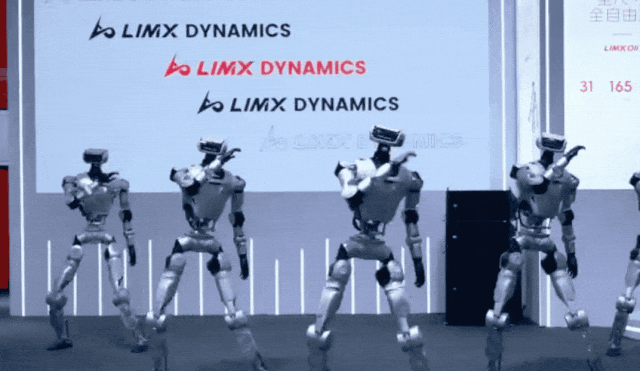

转载自: [世界机器人大会：笨拙的今天，与狂奔的明天](https://www.geekpark.net/news/352586)

# 世界机器人大会：笨拙的今天，与狂奔的明天

> 跑赢了昨天，就没人苛求今天。

笔者刚刚从今年的世界机器人大会回来。

「人，实在是太多了。」这是今年世界机器人大会上，几乎每个人见面的第一句开场白。

世界机器人大会人潮年年汹涌，但今年，那种摩肩接踵的压迫感格外强烈。

不过，比人多更震撼的，是你几乎无处不遇的机器人。去年，它们绕场走一圈，还得三五个「保镖」在旁牵绳护送；今年，尤其是开展第一天，你一个转身，就可能与一台两条腿、甚至四条腿的新物种擦肩而过。

今年的机器人，变得前所未有地渴望与世界互动——叠衣服、拉被子、和观众比试拳击、踢球、和观众互动递送物体……同时，这种急切也带来了大量的翻车现场——你几乎能在社交媒体上找到所有顶尖公司的翻车现场，无论是鬼畜的机器人倒地抽搐，还是自信满满地抓取眼前的东西，结果一直在努力地抓着空气。

但是比起前几年机器人展会上，很精心编排的机器人舞蹈，固定交互中慢速的把一个东西抓到另一个地方，你能明显感觉到有活力从里面生长了出来。

相比于其他行业，机器人企业似乎更不避讳翻车现场。这种不精心编排的演示，带着一种经济上行的美感：一种「我知道我会出错，但我依然是未来」的自信。它混乱，却迷人，属于高速增长行业独有的美感。

这也是这次笔者从世界机器人大会回来最深的感触：只要有未来，只要长得足够快，人们愿意等待一个暂时无用的机器人。

#   

# 01

加速的进化：

为何行业如此振奋？

  

人们之所以如此宽容，是因为机器人这个行业，尤其是人形机器人这个赛道，仍然在以一个极高的速度，同时进化着它的「两翼」。

两翼的一端，是双足人形机器人的运动能力。

这是笔者来过的第三年世界机器人大会，在 2023 年的世界机器人大会上，宇树机器人的 CEO 王兴兴还在和在场的机器人同行们解释，为什么前一年开始入局做人形机器人的算法， [在接受极客公园采访的时候，提到当时「波士顿动力的软件层面遥遥领先」](https://mp.weixin.qq.com/s?__biz=MTMwNDMwODQ0MQ==&mid=2653008094&idx=1&sn=28d4738338c00b37f3a4c2850e443e5b&scene=21#wechat_redirect) 。当时整场的人形机器人，能直接行走的屈指可数。

而短短两年，人形机器人的运动能力已经大大升级。

宇树机器人一如既往地展现出了第一流的运动控制能力。现场观看搏击比赛，机器人的力度真的有点令人震撼。

而这种运动能力并没有限于宇树，是多点开花的。

众擎机器人长项在于拟人动作，跳舞的动作像人的可怕。

逐际动力最新发布的全尺寸人形机器 LimX Oli，有 1 米 65 高的全尺寸人形结构和 31 个主动自由度。也在现场完成了轻快步、模特步和正步，包括高动态的舞蹈和功夫表演。

  

  

松延动力也展示了一个机器人翻跟头的现场演示。

而在另一端，机器人的灵巧泛化操作能力也在快速进化。

往年，一个机器人能听懂语音指令，然后慢慢抓起一个特定的小球递给你，就已经是顶级演示。今年，多家公司的展示，已经将目标指向了柔性物体的操作——这是从「会抓」到「会用」的关键一步。

柔性物体的难度在于它的不可预测性。一个刚性的瓶子，物理属性恒定；而一件衣服、一个香囊，是无定形的、柔软的，每一次抓取都可能呈现不同形态。要拿稳它，不仅需要「看见」，更要「理解」，还得在毫秒之间预判它的形变，并即时调整力度。刚性物体的抓取，在日常生活中只占一小部分；而柔性物体，才是通向家庭和服务场景的必经之路。

今年，已经有多家公司在这一领域展现出令人惊讶的成果：

比如星海图此次展示的拉被子演示。视频虽然有加速，但是能够把被角收起的情况下机器人自主推理找到被角拉开，且多次随机重复下都能成功，也是很精彩的演示。

自变量的做香囊也是全程柔性物体操作。

以年为单位来看机器人的进步，无疑是巨大的。

更重要的是，这些能力并非由某一家垄断。在这个高速发展的赛道中，新玩家持续涌入，带来更多可能性。比如，长期以服务机器人闻名的擎朗智能，今年也推出了自己的双足机器人，计划在酒店等熟悉场景中进行商业落地。擎朗 CEO 李通在极客公园采访中表示，双足研发的技术壁垒已不再高企，「看到机会就可以做」。

在高速发展的赛道中，大批成立于 2024 年，甚至成立于 2025 年的等实力选手纷纷入局，各自带着独门绝技，在这片丛林中占据自己的山头。

当然，促使这场进化的，还有嗅到商机的源源不断的投资人。他们用真金白银投票，确保这场关于进化的豪赌，有足够的燃料，以当前这令人眩目的速度，继续狂奔下去。

#   

# 02

略显尴尬的落地：

双足提供情绪价值，操作只能找小场景

  

「这机器人能落地吗？」

这是展会现场空中飘荡着的最响亮的问题，从投资人到创业者，再到每一个好奇的观众都对这个话题很是关心。

但当笔者逛遍世界机器人大会，一个略显尴尬的落地现状是：在当下，人形机器人在很大程度上仍是「无用」的。

一位资深投资人向我估计，今年全行业的人形/类人型机器人总出货量也许在三万台左右。

而笔者走访各家展台得到的体感甚至更为保守：大多数公司的年出货量目标都只在几百台，能突破一千台的，已是金字塔尖的佼佼者。

宇树 CEO 王兴兴一直表示，研究机器人，最终是希望它来干活的。不过当被问及当下双足机器人的价值，除了情绪价值之外，还有什么？

宇树创始人王兴兴的答案坦诚得惊人。他表示，之所以做双足，是因为它技术上更简单，是一种「Why not?」（为何不呢？）的逻辑。哪些技术先成熟，哪些技术就优先做。

情绪价值没有对标，在双足机器人领域，市场竞争目前似乎也在变得更加激烈，让“无用之用”的接受度更高。

宇树 R1 WRC 表演 ｜图片来源：宇树科技

如果说两条腿的机器人，目前主要在提供情绪价值；那么，长着两只手的操作型机器人，则面临着另一种更棘手的困境——「有用之难」。

工厂、智慧零售、酒店餐饮……这些宏大的叙事谁都懂，但现实是，技术还远远达不到。

一方面，机器人的「大脑」还不够聪明。目前的模型训练，大多只能完成几个孤立的动作，要让一个机器人在一个真实场景里，成功完成多项任务，暂时还不太容易做到。

另一方面，灵巧操作仍是巨大的瓶颈，需要依靠数据、硬件等多方面技术一起进步。

目前行业比较认同的 VLA 路线，严重依赖于数据。而实际上，数据的高质量的操作数据又极度依赖高精度硬件来采集。而硬件的迭代，本身也需要一定的时间和操作来反哺迭代。

今年，一些公司已经意识到这一核心痛点，开始试图解决这一问题。

比如，2025 年才成立的零次方，据称今年已出货 200 台，能在 2025 年成立后迅速就出货的原因之一，就是其核心技术能力之一就是做高质量数据采集。

笔者也在展台体验了星尘智能的数据采集工具。展台人员介绍，他们采用绳驱传动、极度丝滑的硬件结构，才能采集出更「干净」的数据，进而训练出动作同样丝滑的模型。

在宏大场景迟迟难以马上落地的当下，一些公司的展示策略很是巧妙：他们会上演刷马桶、收拾屋子等看似酷炫的任务演示，但真正销售的，并不是家政机器人，而是面向科研人员的开发平台。这些高难度的演示，就像精心设置的「诱饵」，用来吸引最有购买力的客户，为这场「有用之难」的探索买单。

也仍然有许多公司，选择在真实环境中硬碰硬，实地采集数据，力图找到那个能真正撑起商业化的切入口。

这个场景或许需要有点苛刻——需要一定的泛化操作能力，以至于此前工业机械臂无法覆盖；同时又要避开与人频繁接触、过高速度要求，以及廉价人工过于容易替代的可能。

条件虽然苛刻，但这样的场景并非不存在，例如工厂某些特殊的上下料环节，比如服务业的某一个整理行为。各家各擅其场，都在找自己的细分领域，也都在相信自己可以从一台两台试验机，慢慢涨到十台几十台试点机，慢慢开始逐渐渗透一个场景。

所以说，无论是「无用之用」，还是「有用之难」，为什么行业对这种落地的尴尬似乎并不在意？

答案简单而纯粹——因为虽然距离真正的「有用」还很遥远，但每一家的出货量，都在实实在在地增长。

只要曲线还在上扬，技术还在进步，就有希望。

#   

# 03

为何等待？

一场可以「寸进」的长跑

  

在今年的世界机器人大会上，笔者观察到一个迷人的悖论。

几乎每一位机器人公司的 CEO，在描绘未来两三年的宏伟蓝图时都充满了不容置疑的乐观，但话锋一转，又都会真诚地补上一句：「请给我们一些包容，成长不会那么快。」

这种略微矛盾的姿态，也精准地投射到了公众的认知里。

在网络舆论场，人们对人形机器人的观感几乎是撕裂的：要么是顶礼膜拜，视其为下一个时代的序章；要么是嗤之以鼻，断言它不过是昂贵的遥控玩具。

行业内部也远未达成共识。有人坚信，VLA（视觉-语言-行为模型）就是技术的「奇点」，通往通用智能的康庄大道已然铺开，剩下的只是时间和算力的问题；也有人认为，技术仍在混沌中爆炸性发展，行业还在等待一个能定义范式的、天才式的突破。

机器狗戏水 ｜ 图片来源：现场拍摄

那么，在这种遍布着矛盾、分歧与误解的喧嚣中，行业那股不可动摇的信心，究竟从何而来？

答案或许只有一个，那就是相比其他前沿科技，机器人产业有着一项无可比拟的特权：「寸进，亦是胜利。」

自动驾驶的宿命，是「L5 或一无所有」，在抵达那个完美终点前，每一步商业化都如履薄冰。而机器人不同，模型能力每向前推进一毫米，就可能撬开一个细分到极致的新场景——哪怕这个场景，仅仅是支撑一家企业多卖出几百台机器人，获得活下去的燃料，奔赴下一场更艰难的战役。

或许资本，也是看清了这场增量游戏的本质，才愿意不断加注。他们愿意忍受更长的周期，去赌一个可以被「分期兑现」的未来。

但耐心是有额度的，他们究竟能赌多久？

在一场英伟达举办的论坛中，宇树王兴兴和银河通用王鹤同场对谈，对行业未来做出预测。

宇树的王兴兴给出的答案是每年至少翻一倍；而王鹤的预测，则是每年翻十倍。

从一倍到十倍，这道巨大的裂谷，就是对行业未来不确定性最诚实的度量。

它意味着，没有人真正知道终点线有多远，也没有人知道通往终点的正确路径。

他们唯一确信的，只有一件事：

在一个高速成长的行业中，速度是唯一的通行证。