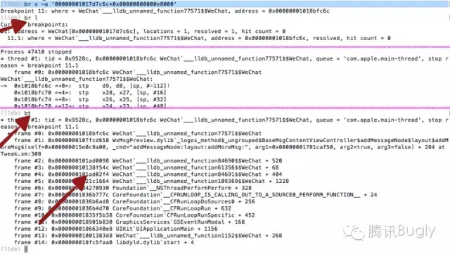

转载自 [移动App入侵与逆向破解技术－iOS篇](https://mp.weixin.qq.com/s?__biz=MzA3NTYzODYzMg==&mid=2653577384&idx=1&sn=b44a9c9651bf09c5bea7e0337031c53c&scene=0#wechat_redirect)

# 移动App入侵与逆向破解技术－iOS篇


如果您有耐心看完这篇文章，您将懂得如何着手进行app的分析、追踪、注入等实用的破解技术，另外，通过“入侵”，将帮助您理解如何规避常见的安全漏洞，文章大纲：

*   简单介绍ios二进制文件结构与入侵的原理
    
*   介绍入侵常用的工具和方法，包括pc端和手机端
    
*   讲解黑客技术中的静态分析和动态分析法
    
*   通过一个简单的实例，来介绍如何综合运用砸壳、寻找注入点、lldb远程调试、追踪、反汇编技术来进行黑客实战
    
*   讲解越狱破解补丁和不需越狱的破解补丁制作方法和差别
    

* * *

## 黑客的素养

*   **敏锐的嗅觉**  
    有时候通过一个函数名，一个类名，就能大致的判断出它的作用，这就是嗅觉；功力已臻化境时，甚至可以使用第六感判断出一些注入点
    
*   **面对失败的勇气**  
    破解有时候很耗时，和程序开发正好相反，它耗时不是耗在写代码上，而是耗在寻找注入点和逆向工程上，有可能你花了3天时间去找程序的破绽，但是最终的破解代码可能就2行，不到一分钟就搞定了；但是你也需要做好面对失败的准备，如果路选错了，有可能你这3天完全是在浪费脑细胞
    
*   **洪荒之力**  
    洪荒之力－即入侵过程中需要借助的各种工具，工欲善其事，必先利其器，工具都是前人智慧的结晶，能用工具解决的，绝不要手动去搞
    

## iOS黑客关键字

iOS的入侵离不开越狱开发，一切的破解、入侵都是建立在越狱的基础上的，如果没有拿到系统级权限，一切的想法都是空谈了，当然，市面上存在免越狱的破解补丁，但是它的开发过程，也是基于越狱环境的

### tweak

在iOS的黑客界，要做破解或越狱开发，就必须了解tweak，它是各种破解补丁的统称，在google上，如果你想搜索一些越狱开发资料或者开源的破解补丁代码，它是最好的关键字。

iOS的tweak大致分为两种：

*   第一种是在cydia上发布的，需要越狱才能安装，大部分是deb格式的安装包，iOS在越狱后，会默认安装一个名叫mobilesubstrate的动态库，它的作用是提供一个系统级的入侵管道，所有的tweak都可以依赖它来进行开发，目前主流的开发工具有theos和iOSOpenDev，前者是采用makefile的一个编译框架，后者提供了一套xcode项目模版，可以直接使用xcode开发可调试，但是这个项目已经停止更新了，对高版本的xcode支持不好，大家酌情选择（本文中的例子全部采用theos）
    
*   第二种是直接打包成ipa安装包，并使用自己的开发证书或者企业证书签名，不需越狱也可以安装，可直接放到自己的网站上，可实现在线安装；对于没有越狱的手机，由于权限的限制，我们是没有办法写系统级的tweak的，例如springboard的补丁是没法运行的，这种tweak大多是针对某个app，把目标app进行修改注入处理，再重新签名和发布，有点类似于windows软件的xxx破解版、xxx免注册版
    

没有越狱的机器由于系统中没有mobilesubstrate这个库，我们有二个选择，第一个是直接把这个库打包进ipa当中，使用它的api实现注入，第二个是直接修改汇编代码；第一个适用于较为复杂的破解行为，而且越狱tweak代码可以复用，第二种适用于破解一些if…else…之类的条件语句

### Mobilesubstrate

下面的图展示的就是oc届著名的method swizzling技术，他就是iOS的注入原理，类似于windows的钩子，所以我们注入也称为hook


  

Mobilesubstrate为了方便tweak开发，提供了三个重要的模块：

*   **MobileHooker** 就是用来做上面所说的这件事的，它定义一系列的宏和函数，底层调用objc－runtime和fishhook来替换系统或者目标应用的函数
    
*   **MobileLoader** 用来在目标程序启动时根据规则把指定目录的第三方的动态库加载进去，第三方的动态库也就是我们写的破解程序，他的原理下面会简单讲解一下
    
*   **Safe mode** 类似于windows的安全模式，比如我们写的一些系统级的hook代码发生crash时，mobilesubstrate会自动进入安全模式，安全模式下，会禁用所有的第三方动态库
    

### app注入原理

上面讲到了mobileloader，他是怎么做到把第三方的lib注入进目标程序的呢？这个我们要从二进制文件的结构说起，从下面的图来看，Mach-O文件的数据主体可分为三大部分，分别是头部（Header）、加载命令（Load commands）、和最终的数据（Data）。mobileloader会在目标程序启动时，会根据指定的规则检查指定目录是否存在第三方库，如果有，则会通过修改二进制的loadCommands，来把自己注入进所有的app当中，然后加载第三方库。


为了让大家看的更清楚，下面我用machoview来打开一个真实的二进制文件给大家看看，可以看出，二进制当中所有引用到的动态库都放在Load commands段当中，所以，通过给这个段增加记录，就可以注入我们自己写的动态库了


那么问题来了，在这里插入我们自己的动态库有什么用？我们自己写的代码没有执行的入口，我们一样没发干坏事，嗯，恭喜你问到点子上了，我们还需要一个”main”函数来执行我们自己的代码，这个”main”函数在oc里面称为构造函数，只要在函数前声明 “**attribute**((constructor)) static” 即可，有了它我们就可以发挥想象力，进行偷天换日干点坏事了：

```plain
#import <CaptainHook/CaptainHook.h>

CHDeclareClass(AnAppClass);
CHMethod(1, void, AnAppClass, say, id, arg1)
{
    NSString* tmp=@"Hello, iOS!";
    CHSuper(1, AnAppClass, say, tmp);
}
__attribute__((constructor)) static void entry()
{
    NSLog(@"Hello, Ice And Fire!");
    CHLoadLateClass(AnAppClass);
    CHClassHook(1, AnAppClass,say);
}
```

到这里为止，我们已经知道了怎么在目标程序注入自己的代码，那么我们怎么知道需要hook哪些方法？怎么找到关键点进行实际的破解呢？下面讲一下常见的app入侵分析方法

### iOS逆向分析方法

逆向分析最常用的有三种方法：

1.  **网络分析**  
    通过分析和篡改接口数据，可以有效的破解通过接口数据来控制客户端行为的app，常用的抓包工具有Tcpdump, WireShark, Charles等，windows平台有fidller
    
2.  **静态分析**  
    通过砸壳、反汇编、classdump头文件等技术来分析app行为，通过这种方式可以有效的分析出app实用的一些第三方库，甚至分析出app的架构等内容，常用的工具有dumpdecrypted（砸壳）、hopper disassembler（反汇编）、class\_dump（导头文件）
    
3.  **动态分析**  
    有静就有动，万物都是相生相克的，动态分析指的是通过分析app的运行时数据，来定位注入点或者获取关键数据，常用的工具有cycript（运行时控制台）、 lldb+debugserver（远程断点调试）、logify（追踪）
    

## demo:微信抢红包插件

上面讲了很多原理性的东西，相信大家已经看的不耐烦了，下面我们一起动点真格的，我们从头开始，一步一步的做一个微信的自动抢红包插件，当然，网上可能已经有相关的开源代码了，但是我这里要讲的是，这些代码是怎么得出来的，我么重点讲一讲分析过程

### 工欲善其事，必先利其器

一台越狱的手机，并装有以下软件

*   cycript
    
*   dumpdecrypted
    
*   debug server
    
*   openssh
    

一台苹果电脑，并装有以下软件

*   class\_dump
    
*   Theos
    
*   Hopper Disassembler v3
    
*   xcode
    
*   insert\_dylib
    
*   pp助手
    

### 寻找注入点

#### 砸壳

首先我们要做的就是把微信的壳砸掉，砸壳其实是为了把它的头文件classdump出来，因为从appstore下载的app二进制都是经过加密的，直接进行classdump操作是啥也看不出来的

*   用pp助手把dumpdecrypted.dylib文件copy到微信的documents目录
    
*   ssh到手机的终端，cd到documents目录中，执行下面的命令进行砸壳操作
    
    ```plain
    xxx$ cp /usr/lib/dumpdecrypted.dylib /path/to/app/document
    xxx$ DYLD_INSERT_LIBRARIES=dumpdecrypted.dylib /path/to/WeChat
    ```
    
*   最后砸壳完成后会在documents目录生成砸了壳后的二进制文件，用pp助手copy出来并class-dump他的头文件备用
    

执行完这几行命令后，会在微信的documents目录生成一个WeChat.decrypted文件，这就是砸壳后的二进制文件；当然了，这一步不是必须的，我们可以直接从91或者pp助手下载一个已经砸过壳的版本

#### 动态分析－cycript

要想实现自动抢红包，我们必须找到收到红包消息的handler方法，怎么入手呢？我们先从界面出发，进入微信的消息首发窗口:


*   ssh进手机的终端，输入ps命令，查找到微信的进程id
    

```plain
ps aux | grep WeChat
```

*   祭起神器cycript，根据上一步找到的pid注入到微信的进程
    

```plain
cycript -p pidxxx
```

*   在cycript的终端输入这一串方法，作用就是打印出当前界面的view层级，（cycript还有很多妙用，大家可以上官网看文档，这里不详细介绍）
    

```plain
UIApp.keyWindow.recursiveDescription().toString()
```

最终的输出如下，内容太多，大家肯定看不清楚，不过没关系，这个不是重点，这里只是展示一下打印的结果形式：


我们可以随机的选取一个节点不要太靠树叶，也不要太靠树根，例如我选的是标红的部分，把这个节点的内存地址copy出来，这个内存地址，就代表了这个节点的view对象，ios开发的老油条们都知道，通过view的nextResponder方法，可以找出它所属的视图控制器ViewController，所以我么在cycript的控制台中持续输入如下的命令：


看到没有，通过四个nextResponder方法调用，我么找到了当前聊天窗口的ViewController类名，他就是**BaseMsgContentViewController**，现在我们缩小了目标范围，下面我们还需要继续缩小范围，要找到具体的消息处理函数才行。

#### 动态分析－Logify

要继续缩小范围，就得祭起神器Logify了，它是theos的一个模块，作用就是根据头文件自动生成tweak，生成的tweak会在头文件的所有方法中注入NSLog来打印方法的入参和出参，非常适合追踪方法的调用和数据传递

现在我们根据此前砸壳后class\_dump出来的头文件，找到**BaseMsgContentViewController**在pc终端执行如下命令：

```plain
logify.pl /path/to/BaseMsgContentViewController.h > /out/to/Tweak.xm
```

输出的tweak文件大概是这个样子的：


这里带百分号的关键字，例如 **%hook、%log、%orig** 都是mobilesubstrate的MobileHooker模块提供的宏，其实也就是把method swizzling相关的方法封装成了各种宏标记，使用起来更简单，大家想要更深入了解各种标记，可以google一下logos语言

#### theos创建tweak

上面我们用logify生成了一个tweak代码，我们要把它安装到手机上，首先需要使用theos进行编译，安装了theos之后，在pc终端输入nic.pl：


首先选择项目模版当然是tweak啦，然后是项目名称、作者，后面两个选项要注意：

*   首先是bundle filter，这个需要填你需要注入的目标app的bundle id，MobileLoader模块会根据它来寻找你的tweak的注入目标
    
*   最后是list id applications to terminate upon installation，这里指定当tweak安装成功之后，需要kill的进程，我们要hook微信，这里就填微信的二进制文件名就可以了，为什么要kill？ 因为我么的插件是需要在app启动时加载进去的，如果不重启app，插件是不会生效的
    

最后一切都完成后，在当前目录会生成下列文件：


把上面logify生成的tweak文件覆盖到当前目录，并用文本编辑器打开makefile文件，在文件的开头增加你的ios设备的ip地址和ssh端口：


最后在pc终端进入项目目录，输入 make package install 命令：


期间会让你输入设备的ssh密码，越狱机器的默认ssh密码是alpine，make命令会生成deb安装包，放在debs目录，我们如果想对外发布自己的插件，可以把生成的安装包上传到cydia即可

安装成功后再次进入微信的聊天界面，并使用另外一个微信在群里发个普通消息，连接xcode打开越狱机器控制台，查看输出，会发现有类似下面的输出：

```plain
Jun  7 09:56:13 Administratorde-iPhone WeChat[85972] <Notice>: [1;36m[WxMsgPreview] [m[0;36mTweak.xm:308[m [0;30;46mDEBUG:[m -[<BaseMsgContentViewController: 0x15e0c9a00> addMessageNode:{m_uiMesLocalID=2, m_ui64MesSvrID=0, m_nsFromUsr=ccg*675~9, m_nsToUsr=1037957572@chatroom, m_uiStatus=1, type=1, msgSource="(null)"}  layout:1 addMoreMsg:0]
```

看出来了吧，消息处理函数是BaseMsgContentViewController的**addMessageNode:layout:addMoreMsg:**方法，大家可以看出，方法的参数内容也打印出来了

* * *

#### 动态分析－lldb

到目前为止，我么已经把范围缩小到了具体的函数，看起来注入点已经找到了，但是请大家思考一下，如果我们在这个函数中注入抢红包逻辑，那我们的tweak会不会有什么致命的缺陷？

是的，因为BaseMsgContentViewController这个类是微信群聊天窗口对应的controller，我么必须进入到群的聊天界面，这个类才会创建，如果不进入聊天窗口，我们的插件就不生效了，而且，即使进入聊天窗口，也只是能自动枪当前群的红包而已，其他群就无能为力了，是不是有点low？

所以为了使我们的插件显得上流一些，我么还要继续追根溯源，寻找消息的源头，这里就用到了lldb远程调试，使用lldb打断点的方式，通过调用栈，我们可以就可以看到当消息来到时，方法的调用顺序，找到最先执行的消息处理函数。

要在刚刚追踪到的**addMessageNode:layout:addMoreMsg:**方法中打断点，首先我们得知道它在运行时的内存地址，那么内存地址怎么来呢？有这么一个公式：

*   内存地址＝进程内存基地址＋函数在二进制中的偏移量
    

首先偏移量我们可以通过反汇编工具hooper来查，在pc上用hooper打开微信的二进制文件（注意，打开时会让你选择armv7或者arm64，这需要根据你越狱手机的cpu类型来选，一定要和你的手机一致），hooper的界面非常简洁，左侧有个搜索框，可以输入函数名，直接找到函数在二进制中的位置


通过左侧的搜索框搜addMessageNode关键字，找到它的偏移量是0x00000001017d7c6c：


找到了偏移量，还需要进程的基地址，这个地址需要连lldb，所以下面讲一下如何连接lldb进行远程调试，先ssh进越狱手机的终端，在终端输入如下命令（注意，你的手机必须连xcode调试过才会有这个命令）：

```plain
debugserver *:19999 -a WeChat
```

然后在pc端新起一个终端窗口，输入如下命令来连接手机端进行调试：

```plain
lldb  ->  process connect connect://deviceIP:19999
```

如果连接成功，会进入lldb的控制台，我们在lldb的控制台输入如下命令来获取微信进程的基地址：

```plain
image list -o -f
```

执行这个命令会打印很多行数据，像下面图中这样，我么要找到微信的二进制文件所在的行，记录它的内存地址0X00000000000E800：


到这里我们两个地址都找到了，再通过br命令打断点：

```plain
br s -a '0X00000000000E800+0x00000001017d7c6c'
```

打好断点后继续向群里面发消息，我们会发现进程被断掉了，这时输入bt指令，就可以看到当前的调用栈，就像下图这样：



分析堆栈的时候，重点找出模块时WeChat的项，这些都是微信模块的方法调用，有了堆栈，我们需要根据堆栈的内存地址找出它的具体函数名，思路还是先根据上面讲到的公式来计算出栈地址在二进制中的偏移量，然后用hooper找到偏移量对应的函数名

*   函数在二进制中的偏移量＝内存地址 - 进程内存基地址
    

例如根据箭头所指的内存地址和刚刚得到的进程基地址，计算偏移量：

```plain
0x0000000101ad02f4 – 0x00000000000e8000 = 1019E82F4
```

然后在hooper中搜索这个地址，得到结果如下：


最终把所有的栈都进行还原，得出调用栈是这个样子的：

```plain
-[CMessageMgr MainThreadNotifyToExt:]:
–>    
-[BaseMsgContentLogicController OnAddMsg:MsgWrap:]:
——>
-[RoomContentLogicController DidAddMsg:]
———->
-[BaseMsgContentLogicController DidAddMsg:]
—————->
-[BaseMsgContentViewController addMessageNode:layout:addMoreMsg:]:
```

CMessageMgr这个类浮出水面了，是时候发挥黑客的嗅觉了，根据方法名我们能判断出MainThreadNotifyToExt:这个方法仅仅是用来发送通知的，如果hook这个方法，我们是拿不到消息内容的

由于这里可能是一个异步调用，用断点的方式，可能已经打印不出来栈信息了，所以还得使用logify来继续追踪CMessageMgr这个类，讲过的内容我就不重复了，直接得到最终的消息处理函数：

```plain
-(void)AsyncOnAddMsg:(id)message MsgWrap:(CMessageWrap* )msgWrap
```

* * *

### 实现“抢”的动作

上一节我们已经找到了hook的关键点，那么该如何去实现抢的动作？同样我们需要结合动态分析和静态分析，首先得到红包消息体的数据特征，然后再分析处理消息的关键点

#### 数据包分析

首先我们的代码需要分辨哪些才是红包消息，方法很简单，用logify追踪BaseMsgContentViewController，然后向微信群发一个红包，观察手机日志输出，我们可以看出消息的数据结构中有个type字段，值是49，这个type应该就是标记消息类型的，如果不确定，可以再发个图片或者文本之类的消息，这个值是不同的：

```plain
Administratorde-iPhone WeChat[47410] <Notice>: [1;36m[WxMsgPreview] [m[0;36mTweak.xm:308[m [0;30;46mDEBUG:[m -[<BaseMsgContentViewController: 0x15e0c9a00> addMessageNode:{m_uiMesLocalID=16, m_ui64MesSvrID=1452438635530425509, m_nsFromUsr=1037957572@chatroom, m_nsToUsr=ccg*675~9, m_uiStatus=4, type=49, msgSource="<msgsource>
        <silence>0</silence>
        <membercount>3</membercount>
    </msgsource>
    "}  layout:1 addMoreMsg:0]
```

现在我们能分辨消息类型了，重点来了，怎么实现**抢**这个事呢，可能聪明人已经猜到了，从ui入手，先找到微信本身的**抢红包**函数，我们自己来给它构造参数并调用他不就行了？


把红包点开后，用cycript打印出当前view的层次，就像下面这个，一眼就可以看到重点，WCRedEnvelopesReceiveHomeView就是开红包弹框的类名


知道类名后，用cycript追踪它，点击开红包，在日志中找到了下图中的内容，从名字来看，这是一个事件处理函数，我们现在要做的，就是把他还原成oc代码，真正实现抢红包功能

```plain
Administratorde-iPhone WeChat[91173] <Notice>: [1;36m[WxMsgPreview] [m[0;36mTweak.xm:8[m [0;30;46mDEBUG:[m -[<WCRedEnvelopesReceiveHomeView: 0x13cdda8c0> OnOpenRedEnvelopes]
```

#### 静态分析法

怎么把他还原成oc代码，真正实现抢红包功能呢？还得借助一点点汇编技能，只是一点点而已，因为现在的反汇编工具已经很强大了，我们不需要挨个去看寄存器了

在pc上用hooper打开微信的二进制文件，搜索OnOpenRedEnvelopes，查看汇编代码，注意在图片中最后一行调用了一个WCRedEnvelopesReceiveHomeViewOpenRedEnvelopes函数


  

* * *

继续搜索WCRedEnvelopesReceiveHomeViewOpenRedEnvelopes这个方法，找到它的汇编代码

*   首先他不知道从哪里获取了一个payinfoitem
    
*   然后又获取了payinfo的m\_c2cNativeUrl属性
    
*   然后调用substringfromindex吧navtiveurl的前缀截断，并调用bizutil的一个方法把url参数转换成了一个字典
    


  

最终反解出的代码如下，是不是很简单？

```plain
NSString *nativeUrl = [[msgWrap m_oWCPayInfoItem] m_c2cNativeUrl];
nativeUrl = [nativeUrl substringFromIndex:[@"wxpay://c2cbizmessagehandler/hongbao/receivehongbao?" length]];NSDictionary *nativeUrlDict = [%c(WCBizUtil) dictionaryWithDecodedComponets:nativeUrl separator:@"&"];
```

* * *

继续往下看, 在这里前面三行创建了一个mutable dictionary：

*   紧接着下面三个框框处都是调用了setobject：forkey：向里面填东西，那填的东西是啥呢？
    
*   其实这里已经可以看的很清楚了，第一个key是msgtype，值是字符串1，第二个sendid，值是调用了一个objectforkey从另一个字典中取出来的，很显然，另一个字典就是上面从url解析得到的，后面的channelid也是同样的道理
    


最终得到的代码如下：

```plain
NSMutableDictionary *args = [[%c(NSMutableDictionary) alloc] init];
[args setObject:nativeUrlDict[@"msgtype"] forKey:@"msgType"];
[args setObject:nativeUrlDict[@"sendid"] forKey:@"sendId"];
[args setObject:nativeUrlDict[@"channelid"] forKey:@"channelId"];
```

* * *

继续往下看从箭头所指的几处，我们可以看见，它的代码是这样的，共分为四步

*   第一个箭头调用了mmservicecenter的defaultcenter方法来获取mmservicecenter实例
    
*   第二个箭头调用了CContactMgr的class方法
    
*   第三个箭头调用了第一步获取的mmservicecenter实例的getservice方法，而这个方法是把第二步得到的class作为参数
    
*   第四个箭头很明白了吧，第三步得到了CContactMgr实例，这里就是调用CContactMgr实例的getselfcontact方法获取自己的账户资料
    


最终还原的到的代码如下：

```plain
CContactMgr *contactManager = [[%c(MMServiceCenter) defaultCenter] getService:[%c(CContactMgr) class]];
CContact *selfContact = [contactManager getSelfContact];
```

* * *

继续往下看，这里使用刚刚得到的selfcontact来获取displayname和headimgurl，并把它们设置到刚刚的字典里面了，key分别是nickname和headimg


最终的代码：

```plain
[args setObject:[selfContact getContactDisplayName] forKey:@"nickName"];
[args setObject:[selfContact m_nsHeadImgUrl] forKey:@"headImg"];
```

* * *

接着看，接下来这两段就比较蛋疼了，完全是从内存地址里面取的值，我也不知道他从哪里来，怎么办呢？有没有不懂汇编就能搞定它的捷径呢，答案是有！

*   对于第一个，我可以通过它的key猜出来，还记得最开始的时候我们取过payinfo的一个nativeurl属性吧，我们姑且把他传进去
    
*   对于第二个，我们可以猜测sessionUserName大概是会话名称，也就是群名称的意思，从哪里取这个值呢？我们先把也设置成伪代码
    


最终的结果如下：

```plain
[args setObject:nativeUrl forKey:@"nativeUrl"];
[args setObject:xxx forKey:@"sessionUserName"];
```

* * *

继续往下看，接下来这一段还是用mmservicecenter来获取WCRedLogicMgr对象，然后调用WCRedLogicMgr的open方法来拆红包，可以想象open方法的参数就是上面我们辛苦组装的字典


代码如下：

```plain
[[[%c(MMServiceCenter) defaultCenter] getService:[%c(WCRedEnvelopesLogicMgr) class]] OpenRedEnvelopesRequest:args];
```

#### 领红包逻辑

到这里，我们再总结一下我们上面分析的过程……

*   得到m\_oWCPayInfoItem属性
    
*   解析m\_oWCPayInfoItem的m\_c2cNativeUrl属性
    
*   得到selfcontact
    
*   组装相关参数
    
*   调用OpenRedEnvelopesRequest:领取红包
    

最终的抢红包代码合并起来如下：

```plain
#import "WxMsgPreview.h"

%hook CMessageMgr

-(void)AsyncOnAddMsg:(id)message MsgWrap:(CMessageWrap* )msgWrap {
    %log;
    %orig;
    if(msgWrap.m_uiMessageType == 49){
        CContactMgr *contactManager = [[%c(MMServiceCenter) defaultCenter] getService:[%c(CContactMgr) class]];
        CContact *selfContact = [contactManager getSelfContact];

        if ([msgWrap.m_nsContent rangeOfString:@"wxpay://c2cbizmessagehandler/hongbao/receivehongbao"].location != NSNotFound) { // 红包

            NSString *nativeUrl = [[msgWrap m_oWCPayInfoItem] m_c2cNativeUrl];
            nativeUrl = [nativeUrl substringFromIndex:[@"wxpay://c2cbizmessagehandler/hongbao/receivehongbao?" length]];

            NSDictionary *nativeUrlDict = [%c(WCBizUtil) dictionaryWithDecodedComponets:nativeUrl separator:@"&"];

            NSMutableDictionary *args = [[%c(NSMutableDictionary) alloc] init];
            [args setObject:nativeUrlDict[@"msgtype"] forKey:@"msgType"];
            [args setObject:nativeUrlDict[@"sendid"] forKey:@"sendId"];
            [args setObject:nativeUrlDict[@"channelid"] forKey:@"channelId"];
            [args setObject:[selfContact getContactDisplayName] forKey:@"nickName"];
            [args setObject:[selfContact m_nsHeadImgUrl] forKey:@"headImg"];
            [args setObject:nativeUrl forKey:@"nativeUrl"];
            [args setObject:msgWrap.m_nsFromUsr forKey:@"sessionUserName"];

            [[[%c(MMServiceCenter) defaultCenter] getService:[%c(WCRedEnvelopesLogicMgr) class]] OpenRedEnvelopesRequest:args];
        }
    }
}

%end
```

刚才说了，有两个疑难点没有解决:

*   第一：我们不知道payinfo是哪里来的，
    
*   第二：sessionusername我们也不知道是哪里来的
    

> 这时候我们可以从我们注入点的参数入手，首先用logify打印出addmsg方法的参数信息，会发现，它的第二个参数刚好有一个payinfo的属性，这样第一个问题迎刃而解了
> 
> 第二个我们已经猜测到它代表群名称，所以我们从修改几次群名称，然后再观察logify打印出的参数值的变化，就可以确认出从哪里取了

通过一番折腾，得出了抢红包的核心代码，再结合上面章节所讲的theos制作tweak包的方法，打包并安装到手机，发个红包试试，是不是秒抢？

* * *

### 免越狱插件

#### 检查依赖项

如果设备没有越狱，是没有mobilesubstrate等环境的，而且一些系统目录是没有读写权限的，这时我么只能从目标app的二进制文件入手，通过手动修改load commands来加载自己的dylib，那么上面我们的插件又是使用theos基于mobilesubstrate编译的，有没有办法确定我们的dylib有没有依赖其他的库呢？

使用osx自带的otool工具即可，可以看出，我们的lib是依赖于substrate库的，其他的都是系统库，所以我们从越狱设备中把cydiasubstrate文件copy出来重命名为libsunstrate.dylib，和我们的dylib一起放入wechat.app目录中

最后使用install\_name\_tool命令修改动态库的路径把它指向app二进制文件的同级目录


#### 制作安装包

解决了依赖问题，然后要把我们的库注入到二进制weixin的二进制文件，这一步使用开源的insert\_dylib即可 （@executable\_path是一个环境变量，指的是二进制文件所在的路径）

> insert\_dylib命令格式：  
> ./insert\_dylib 动态库路径 目标二进制文件

```plain
//注入动态库
./insert_dylib @executable_path/wxmsgpreview.dylib WeChat
//打包成ipa
xcrun -sdk iphoneos PackageApplication -v WeChat.app -o ~/WeChat.ipa
```

最后使用用企业证书或者开发证书签名对ipa重新签名，就可以放到自己的渠道进行发布了！

* * *

## 结语

通过综合运用各种工具，进行静态和动态分析，我们通过实战破解了微信的抢红包逻辑，明白了入侵常用的工具，上面的抢红包代码还有很多改进之处，比如没有判断红包的发送者是不是自己、也没有判断红包里面的文字是不是抢错三倍，有兴趣的童鞋可以尝试优化一下！