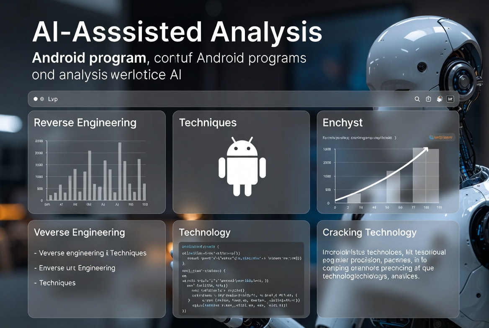
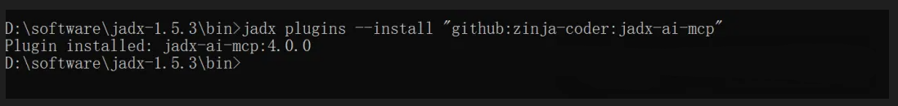
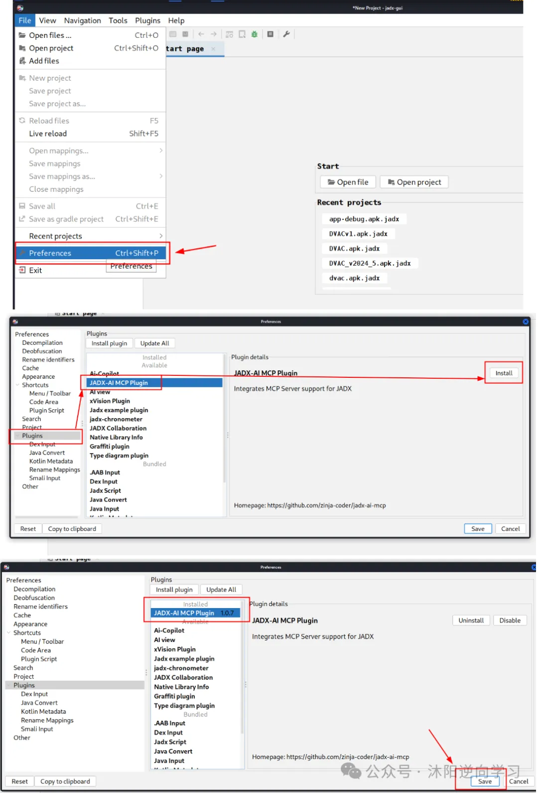
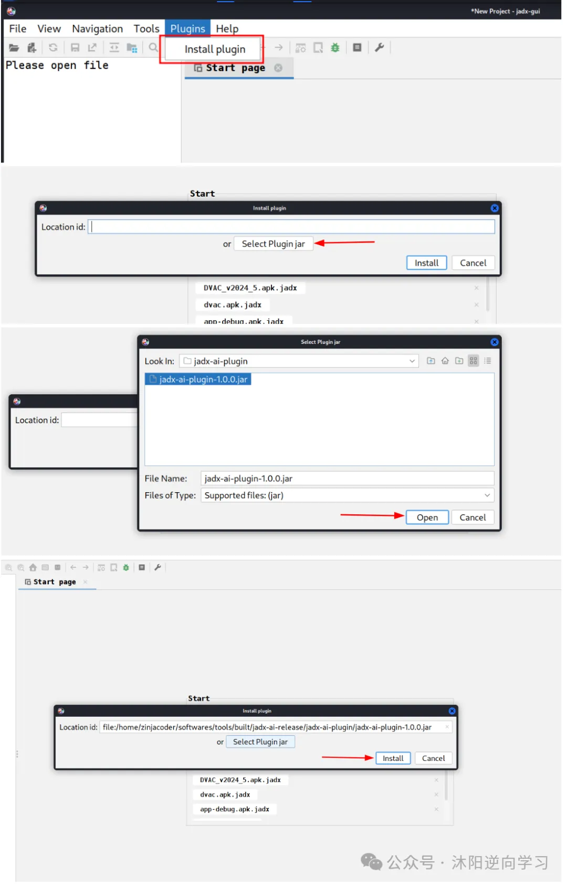
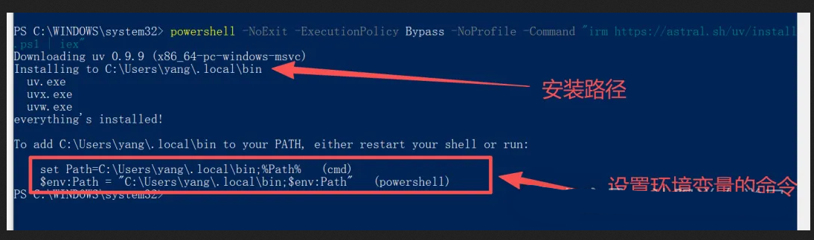
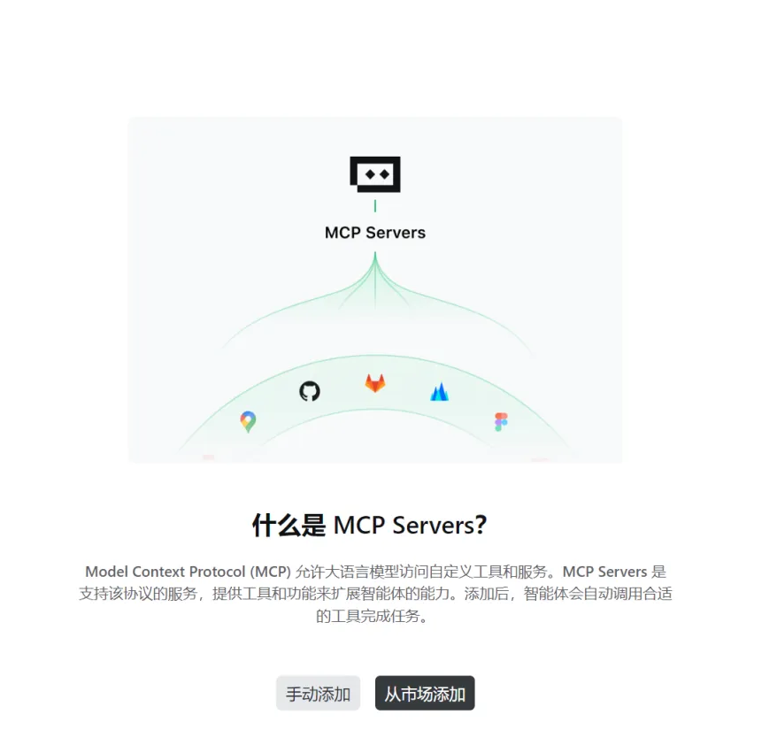

灵感来自 [jadx-ai-mcp环境搭建AI逆向分析JAVA代码](https://mp.weixin.qq.com/s?__biz=MzI2Mzk4MjczMQ==&mid=2247484452&idx=1&sn=a32ba648aefb3141734606f502a7b6d4)

# Claude + JADX + MCP 逆向分析 Android APK 的完整实战（Windows 10）

> MCP 服务器 + JADX 插件，通过 MCP 与 LLM 通信，使用 Claude 等 LLM 分析 Android APK — 轻松发现漏洞、分析 APK 和进行逆向工程，以 Shizuku.apk 为例，搭建 “JADX ⇨ MCP Server ⇨ Claude Desktop” 的 AI 逆向分析链路，记录中途踩过的坑

https://github.com/zinja-coder/jadx-ai-mcp

## JADX-AI-MCP是什么？

**JADX-AI-MCP是** JADX 反编译器的一个插件，它直接与模型上下文协议 (MCP)集成，**为 Claude 等 LLM**提供实时逆向工程支持。

想象一下：“反编译 → 上下文感知代码审查 → AI 建议”——所有过程都是实时进行的。



### 参与者与角色

- LLM Client：发起调用的模型客户端。• 
- JADX MCP Server：向 LLM 暴露工具的 MCP 服务端。
- JADX AI MCP Plugin：具体工具实现，负责把请求转成 HTTP 并路由到处理器。
- Request Handlers：HTTP 请求处理层，协调具体动作。
- JADX GUI：被操作的图形界面，执行实际任务并产生数据。
    

### 主流程（自左向右）

1. LLM Client 调用 MCP 工具到 JADX MCP Server。 
2. MCP Server 将其转为一次 HTTP 请求，发送给 JADX AI MCP Plugin。 
3. Plugin 触发内部的 HTTP Request Handler。
4. Handler 驱动 JADX GUI 执行动作/采集数据。
5. GUI 完成动作/产出数据，回传给 Handler。
6. Handler 组织结果，生成 HTTP 响应给 Plugin。
7. Plugin 将 HTTP 响应返回给 MCP Server。
8. MCP Server 把工具结果返回给 LLM Client。
    
### 关键要点

- 插件（JADX AI MCP Plugin）是协议与应用之间的“桥”，完成 MCP→HTTP→应用 的适配。
- Request Handlers 将业务动作解耦为可路由的 HTTP 端点，便于扩展。
- GUI 是真实“执行者”，说明该链路能触发交互式或可视化操作，再回传结果。

## 🤖 JADX-MCP-SERVER 是什么？

**JADX MCP 服务器**`JADX-AI-MCP`是一个独立的 Python 服务器，它通过 MCP（模型上下文协议）与插件（参见：jadx-ai-mcp ）交互。它允许 LLM 与反编译的 Android 应用上下文进行实时通信。

## 🛠️ 入门指南

发布下载链接：https://github.com/zinja-coder/jadx-ai-mcp/releases

下载这两个`jadx-ai-mcp-<version>.jar`文件`jadx-mcp-server-<version>.zip`。

### 0：下载文件

- 从发布页下载插件和服务端包：GitHub Releases
- 需要两个文件：
  - `jadx-ai-mcp-<version>.jar`（JADX 插件）
  - `jadx-mcp-server-<version>.zip`（MCP 服务端源码/脚本）

### 1：解压

- 解压 `jadx-ai-mcp-<version>.zip` 后应包含下面的内容：

  ```plain
  ├─ jadx-mcp-server/
  │  ├─ jadx_mcp.py
  │  ├─ requirements.txt
  │  ├─ README.md
  │  ├─ LICENSE
  ├─ jadx-ai-mcp-<version>.jar
  ```

- 含义：
- `jadx-ai-mcp-<version>.jar`：要装到 JADX 的插件文件。
- `jadx-mcp-server/`：Python 实现的 MCP 服务端项目（后续可用来与插件通信）。

### 2：安装插件（两种方式二选一）

#### 方式 1：一行命令安装最新版（推荐）

- 在命令行执行：
  ```plain
  jadx plugins --install "github:zinja-coder:jadx-ai-mcp"
  ```
- 作用：直接把最新版本插件装入 JADX 的插件目录，无需手动下载 `.jar`。



#### 方式 2：通过 JADX-GUI 手动安装本地 jar

- 打开 JADX-GUI
- 进入插件管理（Plugins/插件）
- 选择“从本地文件安装/添加”之类的选项
- 选择你下载好的 `jadx-ai-mcp-<version>.jar` 并确认
- 按提示重启 JADX-GUI 即可生效

以上完成后，插件已安装；`jadx-mcp-server` 目录则是后续在本地运行 MCP 服务端用的项目。



#### 方式3：图形用户界面方法：下载 .jar 文件，并按照图中所示步骤操作。



### 3：进入目录

执行：
```shell
cd jadx-mcp-server
```

作用：切换到 `jadx-mcp-server` 项目的根目录，后续命令都在这里执行。

### 4：本项目用 uv 管理依赖（替代 pip/venv）

uv 是 Astral 出品的 Python 包与环境管理工具，安装/解析依赖更快，内置缓存。
  
#### a 安装 uv（若未安装）

- Linux/macOS：
```shell
curl -LsSf https://astral.sh/uv/install.sh | sh
```

- Windows（PowerShell）：
```cmd
irm https://astral.sh/uv/install.ps1 | iex
```

若闪退使用下面的，或者问AI    
```cmd
powershell -NoExit -ExecutionPolicy Bypass -NoProfile -Command "irm https://astral.sh/uv/install.ps1 | iex"
```


    
执行上述命令后，**uv将成功安装**到你的系统中。接下来，**重启power**或者使用红色框里面的设置命令

#### b 可选：如果在 `jadx-mcp-server` 中遇到依赖报错，创建并启用虚拟环境

创建虚拟环境：
    
```shell
uv venv
```

激活虚拟环境：

- Linux/macOS：
    ```shell
    source .venv/bin/activate
    ```
- Windows：  
    ```shell
    .venv\Scripts\activate
    ```
    
#### c 可选：安装所需依赖到当前虚拟环境
    
```shell
uv pip install httpx fastmcp
```

执行过的指令
    
```powershell
PS D:\jadx-mcp-server-v4.0.0\jadx-mcp-server> uv venv
Using CPython 3.8.10 interpreter at: C:\Users\yang\AppData\Local\Programs\Python\Python38\python.exe
Creating virtual environment at: .venv
Activate with: .venv\Scripts\activate

PS D:\jadx-mcp-server-v4.0.0\jadx-mcp-server> uv pip install httpx fastmcp
  x No solution found when resolving dependencies:
  `-> Because the current Python version (3.8.10) does not satisfy Python>=3.10 and all versions of fastmcp depend on
      Python>=3.10, we can conclude that all versions of fastmcp cannot be used.
      And because you require fastmcp, we can conclude that your requirements are unsatisfiable.
```

至此，`jadx-ai-mcp` 插件配套的 `jadx_mcp_server` 运行环境已就绪；后续即可在该环境中启动/开发服务端并与插件联动

### 5：打开trae配置mcp

这里使用trae，cursor，Claude Desktop 或者  任意的带有mcp的就可以了
    


然后进行手动添加
    
```json
"jadx-mcp-server": {
    "command": "uv",
    "args": [
        "--directory",
        "D:\\jadx-mcp-server-v4.0.0\\jadx-mcp-server\\",
        "run",
        "jadx_mcp_server.py"
    ]
}
```
    
或者用自带的python，注意自带的python 需要安装上面说的 httpx fastmcp 两个包。

```json
"jadx-mcp-server": {
  "command": "C:\\Users\\yang\\AppData\\Local\\Programs\\Python\\Python311\\python.exe",
  "args": [
    "D:\\jadx-mcp-server-v4.0.0\\jadx-mcp-server\\jadx_mcp_server.py"
  ]
}
```