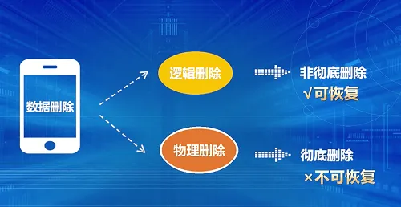
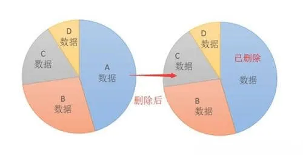

转载自: [数据恢复原理深度解析：为什么你的数据删了还可以恢复？](https://shunmakeji.com/technology.html#)

# 数据恢复原理深度解析：为什么你的数据删了还可以恢复？

有各种各样的数据恢复，比如硬盘、U盘、回收站、照片、视频、备忘录、文档、facebook、whatsapp、twitter、outlook等数据的恢复，他们的具体恢复方法可能会有一些差别，但原理是类似的，核心都是没有从物理上真正删除，如果物理删除了，不太可能恢复的，而对于逻辑删除或者有缓存的数据是有机会恢复的。

## 一、磁盘、U盘类的数据恢复原理

数据在磁盘上的保存方式是和磁盘分区有关系的，当前主流的分区通常将数据的保存分成两个组成部分：索引区和数据区，索引区负责记录数据的位置、日期、大小、状态等属性，数据区保存的是物理数据，形式为二进制01的组合。

而操作系统在对数据读、写、删、改等操作时，是先对索引区进行删改操作，称为 **逻辑删除**。逻辑删除的数据没有被擦写之前，还在那里，只不过标记为这一块是空闲区域，有新的数据写入的时候，这块区域会被新数据占用，在具体的恢复过程也有些差别，比如笔记本通常磁盘是加密的，需要解密。

## 二、手机照片缓存恢复原理

安卓系统为了使照片浏览体验流畅，我们在相册里查看过的照片都会在缓存文件里留下痕迹，生成imgcache.0的文件。最重要的是，安卓的照片缓存是不随着原始图片的清除而清除的。

我们从winhex软件打开的显示结果当中看到了JFIF，典型的图片类型标识，然后根据图片的头文件标记FFD8开始向下搜索结束标记FFD9。将FFD8开头FFD9结尾这段提取出来保存成文件就是一张图片，继续查找下一组FFD8-FFD9；保存出来的文件可用图片查看器打开查看。

## 三、APP数据类恢复原理

Facebook、Twitter、Outlook等与很多其它App类似，使用Sqlite数据库来存储好友和聊天等应用数据。Sqlite的数据恢复比较复杂，根据不同的App特性，可能分为以下场景：

1、如果数据只是被标记为“已删除”状态，对用户不可见，但仍存在于数据库中，俗称”假删“。所以只要拿到数据库原文件，用sqlite查看工具“DB Browser for SQLite”找开，查看对就的记录表即可找回被删的数据。

2、还有些APP的已删除的聊天记录实际上并没有被彻底删除，已删除的数据只是被标记为“已删除”，而这些“已删除”标记所在的位置也被同时标记为“可覆盖”，这种删除方式属于 ”逻辑删除“。所以通过扫描消息残留，即可找回被删除的数据。但如果数据被抹除干净了，属于”物理删除“情况，数据不可找回。

## 四、总结

最后最关心的问题来了。**数据什么时候能恢复？什么情况下不能恢复？多久之前的数据能恢复？**

对于直接的物理删除是恢复不了的，对于数据逻辑删除，先是被标记为空闲区域， 这个时候还没有覆盖是可以恢复的，跟时间无关，主要是是否覆盖，没有覆盖是很高机会恢复的， 当新数据写入的时候，系统会随机选取一块空闲区域，如果数据区不幸被选中，那么数据就被覆盖了，此种情况下的数据基本可认为无法恢复了。
