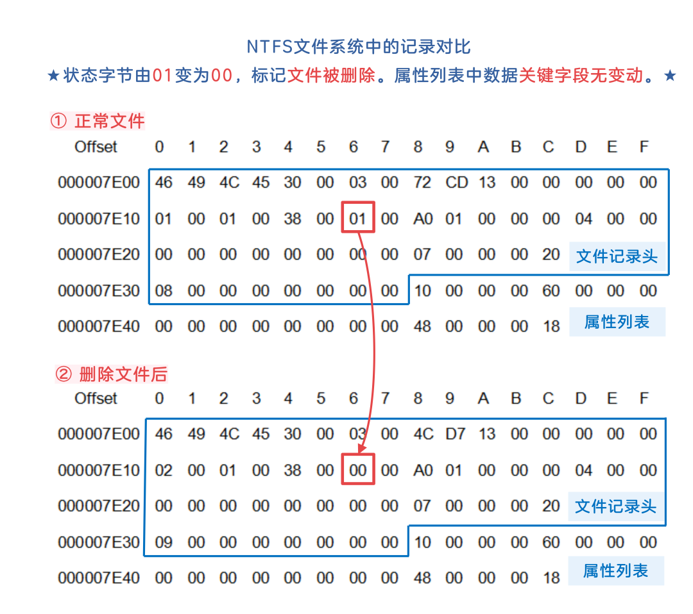
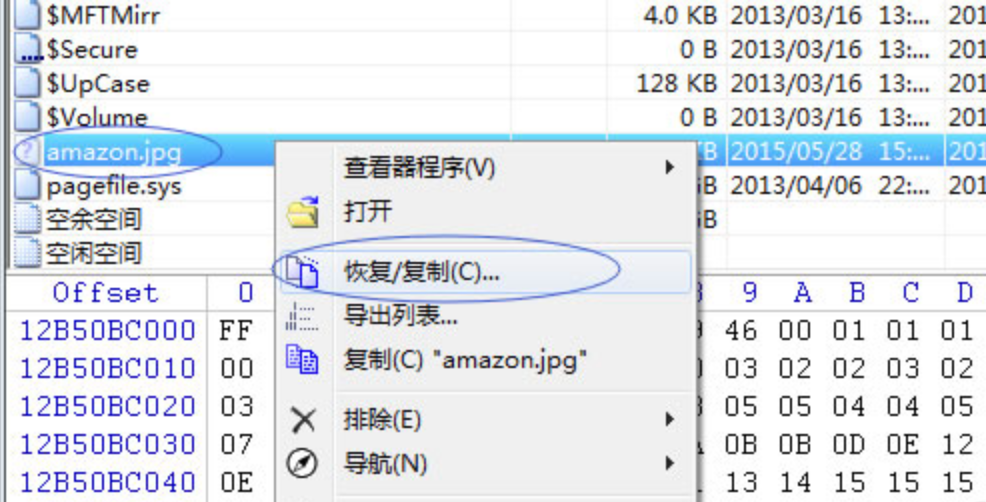
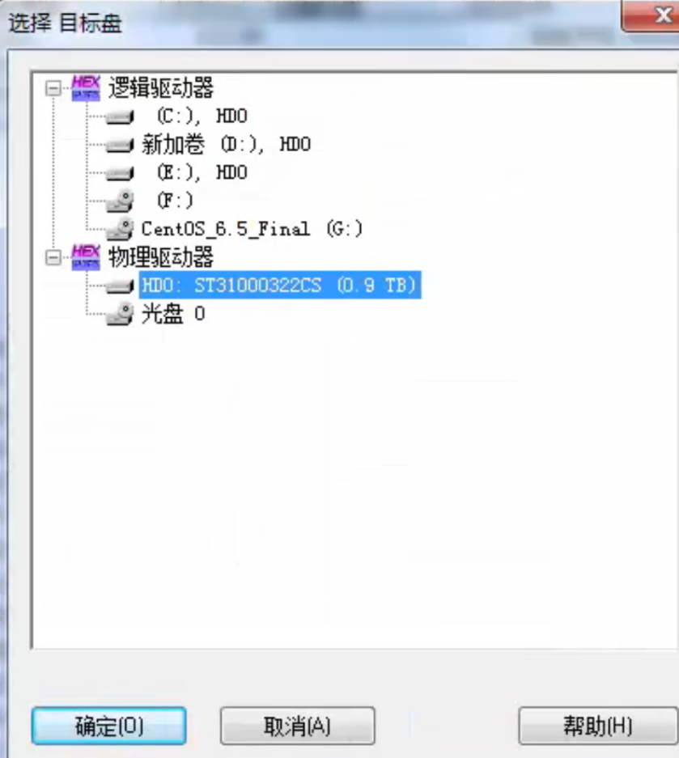
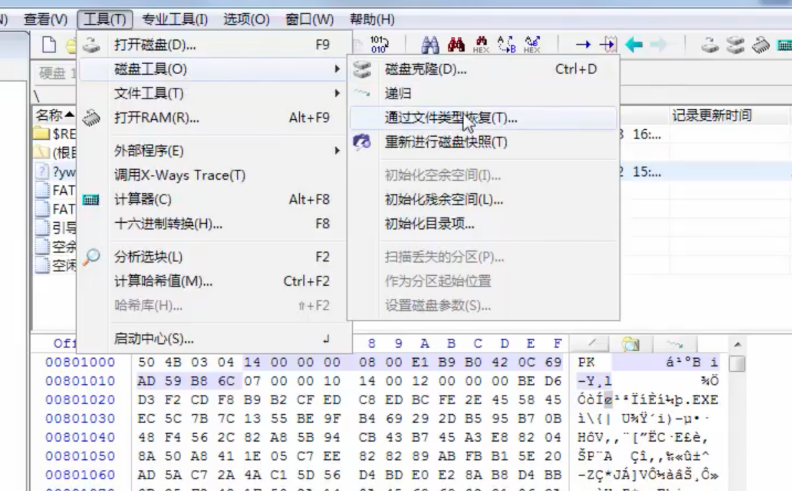
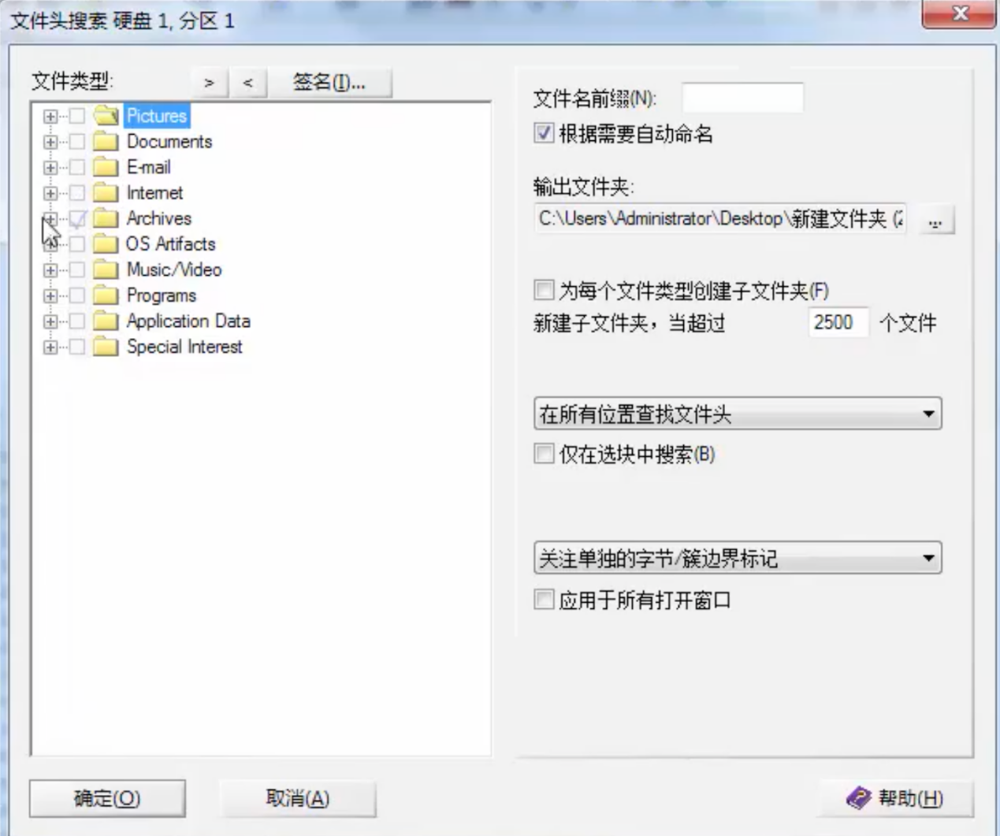
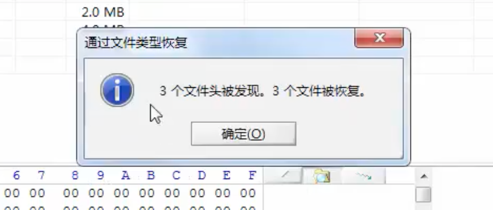

转载自: [电脑文件恢复技术原理](https://shunmakeji.com/technology.html#)

# 电脑文件恢复技术原理

我们大家在平时，误删的文件都会在回收站中找回，但是如果在回收站中都删除了，那么就毫无办法。但是如果拿到修电脑的技术人员手中，亦或者网上有很多种数据恢复软件，都是可以恢复数据的。

我们电脑中所有文件都是存储在电脑硬盘中的，硬盘是我们日常办公中最为重要的存储设备，存放着我们所有的数据信息，这些数据的价值远远高于硬盘本身，同时硬盘又是计算机的主要组成部分。能够恢复数据，其实就是靠硬盘的一些特性实现的。

## 一、为什么能够找回？

在硬盘中，在磁盘当中都是以二进制的形式进行存储的，就像这样01010011，这些0和1通过FAT表让系统知道哪部分数据是文件1，哪部分是文件2。FAT表的作用是描述文件系统内存储单元的分配状态以及文件内容前后链接关系的表格。当我们执行清空回收站的操作后，系统内部执行的操作是把要删除的文件在FAT表当中的记录删除掉，也就是说我们删除文件后，系统并没有马上清空数据，只是在FAT表中标记这个文件已被删除，数据还是保留着的，所以就留给我们数据恢复机会了。如下图，删除文件只是改变了某个标记而已，文件内容实际还在的。

有的人会问为什么删除文件只删除FAT表而不直接清空数据呢？那是因为机械硬盘工作原理就是这样的，写入新数据前并不执行清除操作，而是直接把旧数据覆盖。如果写入数据前先把数据清空那就会多占用一定的磁盘性能，而且这个操作也没啥意义。所以删除文件就只是把文件的FAT表记录标记为已删除，再写入新数据时直接把这个文件的旧数据覆盖掉就可以了。

## 二、怎么知道可以找回呢？

如果误删后，不进行文件写入，旧数据大概率不会丢失的，但是假如在恢复数据之前，存储这个文件的磁盘空间被写入了其他数据呢？那么这个文件就有可能被破坏了，数据恢复软件只能尝试进行修复，但是也可能会出现恢复失败的情况。所以，在文件被删除以后，这个文件所在的磁盘分区被写入数据的次数越少，已删除文件被成功恢复的可能性就越高。

下图是Winhex工具查看的结果，打开磁盘，通过显示的文件列表，寻找被删除的文件，如果有对应文件显示，大概率可以找回，如果频繁写入磁盘小概率会出现文件乱码的情况。对应文件右键也可以打开查看或复制恢复等操作。

## 三、怎么找回呢？

下面是使用 Winhex 软件恢复数据的步骤：

1、在WinHex主界面中，选择要恢复数据的磁盘或分区，并右键单击该磁盘或分区，选择打开磁盘。

2、在WinHex主界面中，选择“工具”菜单下的“磁盘工具”选项，然后选择“通过文件类型回复”选项。

3、在弹出框中选择文件类型和保存路径，点击“确定”按钮开始扫描磁盘或分区以查找要恢复的数据。扫描过程可能需要一些时间，具体时间取决于磁盘或分区的大小和恢复数据的类型。

4、扫描完成后，会弹出对话框提示结果，在保存路径即可看到恢复的文件。

