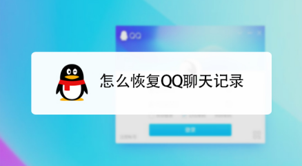
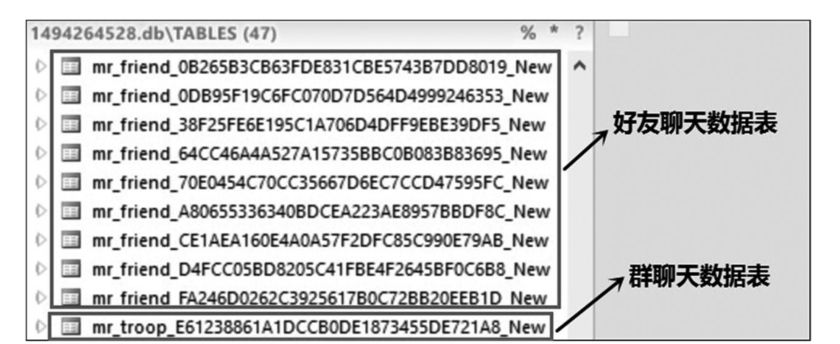
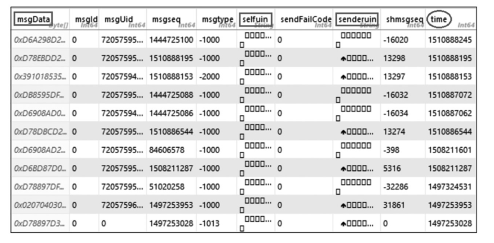

转载自: [安卓QQ的聊天数据恢复技术原理](https://shunmakeji.com/technology.html#)

# 安卓QQ的聊天数据恢复技术原理

目前移动互联网无疑是微信的时代，但是QQ作为70 后、80 后年轻时代的主要IM应用，目前仍然占据重要位置。

QQ作为我们最经常使用的手机App之一，不小心删除聊天记录、删除好友之类的事情时有发生。那么是否有后悔药呢？答案是肯定的。今天，我将带着大家来看一下手机QQ的聊天记录删除后如何找回。

## 一、为什么能够找回？

安卓手机QQ采用SQLite数据库来存储其产生的历史数据，而QQ删除消息后，在SQLite并不会立即将存储数据的位置抹零。

从技术上原理上讲：我们可以利用SQLite的存储特性和数据删除机制，以空闲域为单位形成空闲域链表，以页结构为单位进行细粒度的内容雕刻，并根据数据被覆盖的位置对零散数据块进行有效拼接，这样就可以恢复删除的QQ数据了。

## 二、怎么知道可以找回？

Android 手机 QQ 聊天记录保存在data/com. tencent. mobileqq/databases 目 录下 QQ 号 .db文件中,每个在此手机上登陆过的 QQ 账号都会自动在该目 录下生成一个由 其 QQ 号命名 的. db 文件。 图 3 为其内部的逻辑结构, 包含两类数据表:一类是好友聊天表, 名 字由mr_friend_ + 好友QQ号的 MD5 值 + _New 组成; 另一类是群聊天表, 名字由 mr_troop _ + 群 QQ 号 的 MD5 值 + _New组成。

下图为 QQ 数据记录的内容, 从中可以看出聊天内容和相应的 QQ 号是经过加密存储的, 而支撑文件结构的其他字段内容并没有被加密。通过研究发现,QQ 数据记录的加密性并不算强, 只是采用异或算法,即某个字段内容与手机串号按位进行异或形成密文。

因此可以编写一段python脚本按位异或的算法解密加密数据。从逻辑层分析, 当数据库删除数据记录时, 其删除操作只是将指向该数据单元的指针进行重定向,将其定向到空闲链表中, 其单元内的数据并未改变,直到新的数据记录重写此区域。 从物理层分析, 该区域仍然存在相应的物理数据,我们只需要在python脚本中扫描解密后的字段内容，就可以找到丢失的聊天记录了。

## 三、如何找回呢？

从上面的分析，可以看出：我们要恢复删除的聊天数据，首先要拿到手机上的QQ安装目录下的对应的db文件；然后使用特定的数据库分析软件打开.db文件；最后还要根据QQ的加密算法，编写一段python脚本，解密字段内容并扫描删除的QQ聊天数据。

上面的操作，对于一般的小白来说，无疑是步履维艰。我们建议，遇到这种情况，还是在市场上找一些靠谱的QQ数据恢复软件来做恢复，才会更有把握。