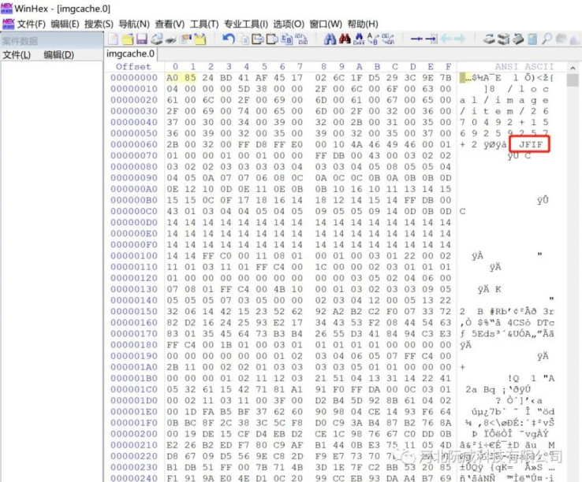
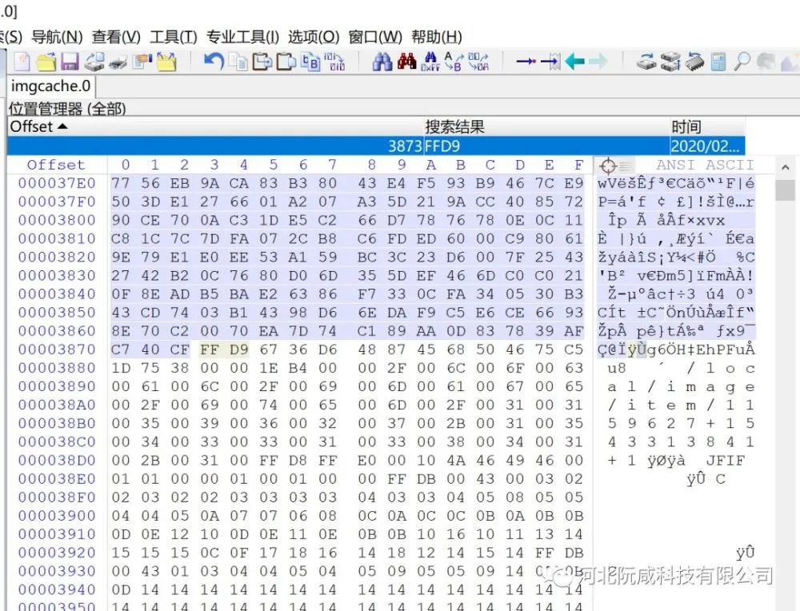

转载自: [安卓手机照片恢复技术原理](https://shunmakeji.com/technology.html#)

# 安卓手机照片恢复技术原理

手机上的相片删除之后有么有办法找回呢？一般况下被删除的手机照片在新款的安卓手机上已经清的一塌糊涂，是不可能能够恢复出来的，但是，有一个情况就是，往往拍摄完的照片都会被机主自恋的欣赏一下，这种情况下是有可能恢复的。

## 一、为什么能够找回？

在打开照片的时候大家有没有注意到两点：
1.照片被打开的时候会有一个图像由模糊变清晰的一个过程
2.在相册里，没有被你打开的图片你也能够看到图像内容，只不过会很小。

找回的秘密就藏在这里，我们可以通过缓存把图片找回。因为app会首先加载这份分辨率相对比较低的图片填充屏幕，然后等原始图片被正常解析迅速替换已经显示的图片，给人以过度的感觉，而不是卡顿（微信接受的图片也是利用的这个算法，没有被手动下载查看的图片一定是原始图片的一个低分辨率缓存。）而且，最重要的是，安卓的照片缓存是不随着原始图片的清除而清除的。

缩略图

## 二、怎么知道可以找回呢？

我们在相册里查看过的照片都会在缓存文件里留下痕迹，生成imgcache.0的文件，没有被一些垃圾清零app清理过的安卓手机，这个文件会一直变大，最大50M，如果超过50M那么就会生成新的缓存文件：imgcache.

并且随着缓存的越来越多，文件数量也会递增。我们可以用winhex查看下里面有没有内容。

## 三、怎么找回呢？

我们从winhex的显示结果当中看到了JFIF，典型的图片类型标识，然后根据图片的头文件标记FFD8开始向下搜索结束标记FFD9：

将FFD8开头FFD9结尾这段提取出来保存成文件就是一张图片，继续查找下一组FFD8-FFD9；保存出来的文件可用图片查看器打开查看。
