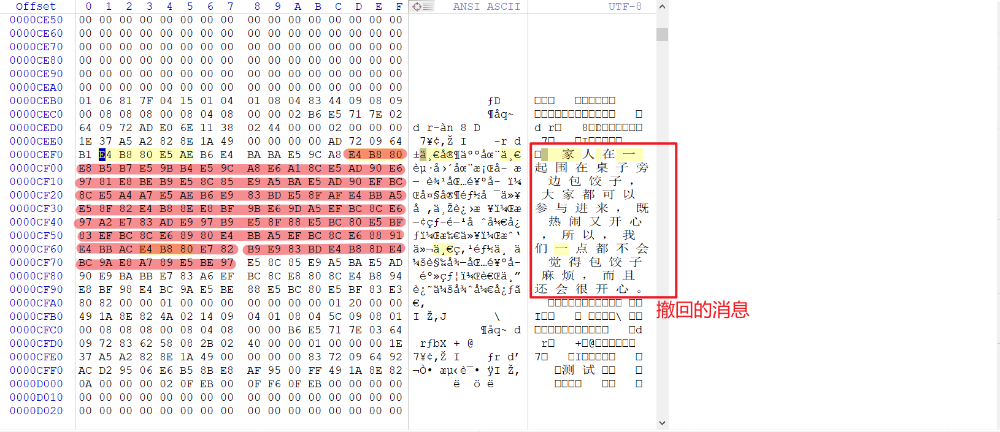

转载自: [Telegram撤回消息恢复技术原理](https://www.shunmakeji.com/technology.html#)

# Telegram撤回消息恢复技术原理

Telegram是一个即时通讯软件，可在多个平台上使用，如手机、平板电脑、计算机等。它提供了强大的加密和隐私保护功能，使其在用户之间传递的信息得到了安全保障。同时，Telegram也具备群组聊天、语音通话、视频通话、文件分享等功能。多数情况下，Telegram是免费的，并且没有广告。

我们都知道telegram可以自毁消息，但是如果消息发出后，立即撤回，那么还可以找回吗？当然可以，今天小编就来为大家解密telegram撤回消息的找回。

## 一、为什么能够找回？

Telegram的消息会存在一个sqlite格式的缓存文件中。当用户发出信息撤回后，telegram并没有立即清除db缓存，其删除操作只是将指向该数据单元的指针进行重定向，将其定向到空闲块链表中,其单元内的Payload并没有改变。

- 从物理层分析，该区域仍然存在相应的物理数据,因此，当数据库执行一些删除操作时，数据库的大小并没减小;
- 从逻辑层分析，因为指向删除单元的指针告诉逻辑层，该数据块为空闲区域，其所占的空间已释放，新数据可以占用。

这样，我们通过直接读取sqlite的db文件，就有机会找到撤回的消息。

## 二、怎么知道可以找回？

在telegram中发送一个消息“一家人在一起围在桌子旁边包饺子，大家都可以参与进来，既热闹又开心，所以，我们一点都不会觉得包饺子麻烦，而且还会很开心。”，马上撤回。

然后，立即将手机连接到电脑，备份telegram的应用数据，查找刚才撤回的消息。在备份的数据目录中查找所有的db文件，可以在apps/org.telegram.messenger/f/cache4.db中看到消息残留，如下图所示：>

## 三、如何找回呢？

如上面的描述，我们给大家讲述了telegram撤回消息为什么可以恢复，并演示了一个实际的例子。通常我们需要以下3个步骤：
- 1、备份telegram的数据到电脑。
- 2、找到备份目录中所有的cache db 文件。
- 3、使用winhex这类二进制编辑工具，逐个扫描cache db 中的内容，找到撤回的消息。

上面的这些操作繁琐、并且很容易出问题，绝非我们一般的小白可以操作的。大家是否期待，市面上早日出现一款能否支持telegram数据找回的app呢？
