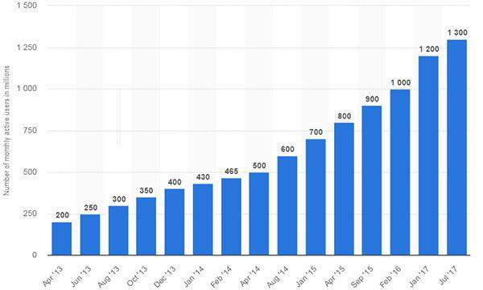
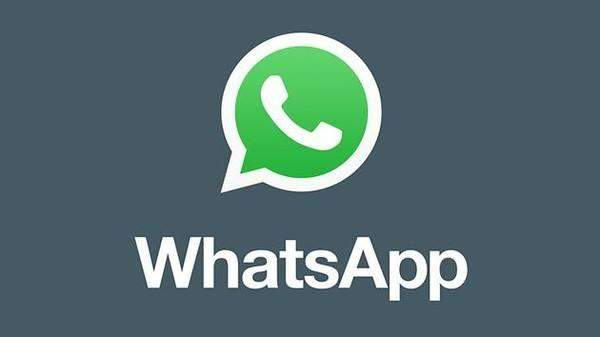
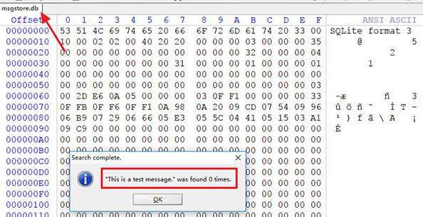
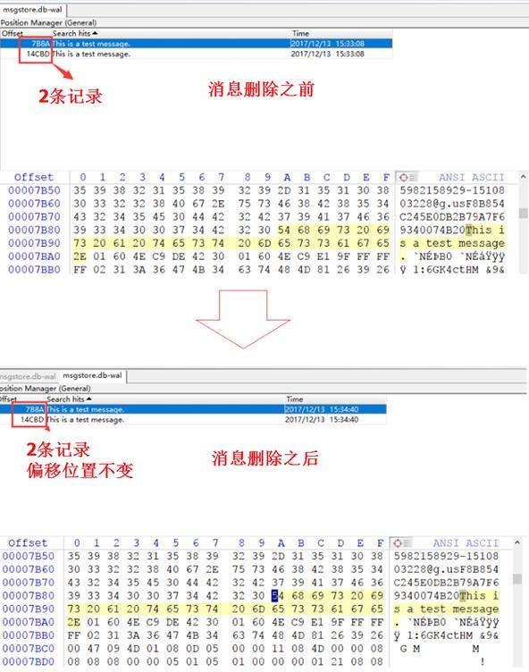

转载自: [WhatsApp数据恢复技术原理](https://www.shunmakeji.com/technology.html#)

# WhatsApp数据恢复技术原理

WhatsApp是全球最流行的即时通讯软件之一。根据2017年7月的统计数据，其月活跃用户数量达到了13亿。

当长时间使用，各种聊天记录、订阅号信息占用大量内存，不得不人为删除一些不重要的内容，删除了中重要信息怎么办？怎么恢复人为删除的WhatsApp聊天记录呢？

## 一、为什么能够找回？

WhatsApp与很多其它App类似，使用Sqlite数据库来存储好友和聊天等应用数据。其中最重要的是msgstore.db和wa.db这两个数据库文件。msgstore.db中存储了聊天记录，wa.db中存储了联系人清单。

Whatsapp的正常聊天记录是存放在msgstore.db中，msgstore.db-wal文件是msgstore.db的缓存文件。Whatsapp在存放聊天记录的时候都会先存放在该缓存文件，所以我们可以看到数据库的文件还没有缓存文件大。这是因为同一条消息在数据库中只会存放一条，但是在缓存文件中就可能出现很多次。WhatsApp缓存文件里的记录不会随着原聊天消息删除而删除，这也为删除记录的恢复提供了可能。

## 二、怎么知道可以找回呢？

例如消息“This is a test message”，在消息被删除后，很多时候其对应的在msgstore.db数据库中的记录也可能被清除掉了。

但是，即使这样，这条消息仍有可能在缓存文件msgstore.db-wal中留有记录。下图展示了这条消息被删除后缓存文件发生的变化，可以看到消息的记录数据并未丢失，且其偏移位置都没有发生变化。

因此，通过对缓存文件msgstore.db-wal进行分析提取，针对单条删除、整条删除、清除所有对话以及删除所有对话都能够有效的恢复出删除聊天记录。

## 三、怎么找回呢？

如果想要找回数据的用户有一定的计算机专业基础，且对删除的数据仍然记得一些关键词，那么可以使用winhex打开缓存文件msgstore.db-wal进行搜索。 

**但这种方式即使能找到消息被删除的位置，但无法直观的看出来是谁发给谁的消息，什么时间发的，有很多不方便。**

我们还可以借助专业的数据恢复软件进行数据提取和恢复，像专门做取证的效率源等。