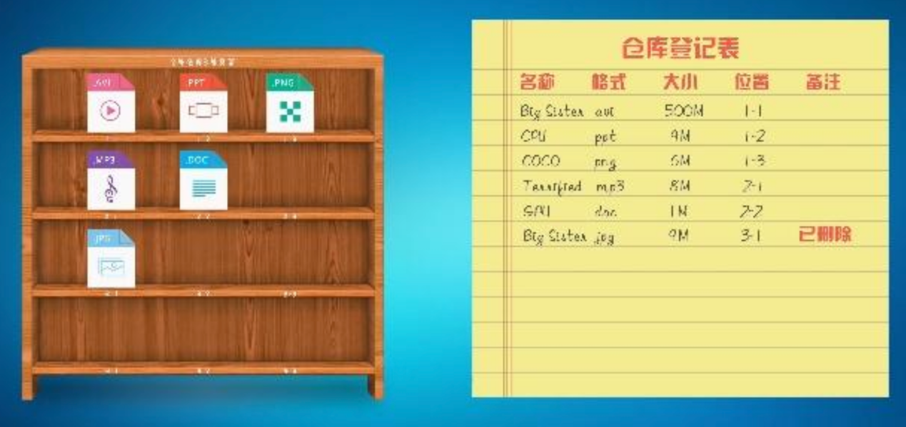
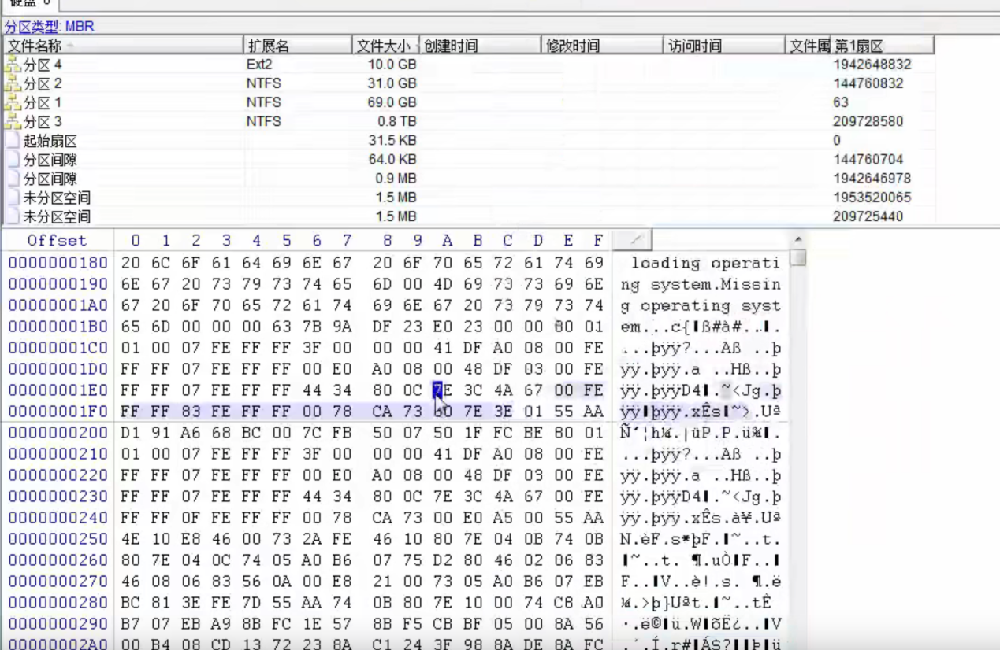

转载自: [SD卡数据恢复技术原理](https://shunmakeji.com/technology.html#)

# SD卡数据恢复技术原理

SD卡（便携式内存卡）已成为人们工作和生活的必需品之一，它存储东西非常方便，而且体积小巧，便于携带，常用于手机或相机存储，但是一旦SD卡出现故障，不管是相机和手机，如何进行SD卡数据恢复呢？

其实造成SD卡数据丢失的原因非常多，这里总结了一些常见的原因，帮助大家防患于未然：
1. 人为误操作：在使用SD卡的过程中时常会出现误删除、格式化等操作，导致数据丢失，因此在平时进行删除或格式化等操作的时候需要谨慎，多加注意。
2. 文件系统异常：分区的文件系统遭到破坏或是发生异常，会造成分区无法正常访问等问题。这时候分区往往会提示未格式化等错误。造成文件系统故障的原因比较多，常见的有：不正常插拔SD卡、病毒破坏、调整分区失败、坏道等。
3. 病毒：SD卡一旦感染病毒，存储在里面的数据将受到影响，例如病毒将数据恶意加密、文件显示乱码、文件被恶意删除等。
4. 物理故障：与其他的数据存储设备一样，SD卡同样会出现硬件故障，例如存储芯片出问题。这种情况数据恢复会比较复杂，需要联系专业的数据恢复机构处理。

## 一、为什么能够找回？

删除的数据为什么能找回呢？简单的讲，只要丢失的数据没有被覆盖，就有希望恢复。当我们对SD卡上的文件进行删除操作后，文件就看不到了，但是文件并没有被真正擦除掉。实际上，系统只是将数据从文件记录中删除，并将文件占用的磁盘空间标记为"空闲"而已。在这些"空闲"的磁盘空间被新的数据占用之前，丢失的数据都是处于可恢复的状态的。

就像现实生活中的仓库，管理员有个登记表记录着所有区域和对应的物品，查找物品时，只需看这个登记表即可；当删除物品时，直接将登记表这个物品对应的区域标记为空即可，实际上物品还在仓库里；只有当有新物品入库，并且恰好分配到了之前的位置，然后管理员会将旧物品直接丢弃，然后存放新物品。

## 二、怎么知道可以找回呢？

通过上述的讲解，那怎么知道可以找回呢？其实很简单， 当误删文件后，立马取下SD卡，不对它进行操作，数据大概率是能找回的；反之，如果误删后还进行文件写入操作，恢复的概率就会变低，文件或许可以部分恢复。在某些情况下，即使数据被删除或丢失，它们也可以通过一些专业的数据恢复工具来找回。这些工具可以通过扫描SD卡的存储介质来查找已删除或丢失的数据，然后尝试恢复这些数据。但使用数据恢复工具并不总是成功的。如果新的数据被写入了这些空间，那么旧的数据就会被覆盖，导致无法恢复。因此，最好在数据丢失后尽快停止使用SD卡，并尽快使用数据恢复工具来恢复数据。

下图显示了winhex工具查看SD卡的数据，可以通过扫描得知能恢复的文件。

## 三、怎么找回呢？

下面是使用数据恢复工具进行SD卡数据恢复的步骤：
1. 下载并安装一款专业的数据恢复工具，例如Winhex等。
2. 将SD卡插入计算机，并启动数据恢复工具。
3. 在工具中选择数据类型，并选择要扫描的存储介质。
4. 等待扫描完成，并预览已找到的数据。
5. 选择要恢复的数据，并指定保存位置。
6. 等待恢复过程完成

**需要注意的是，数据恢复是一项复杂的任务，如果不了解数据恢复的基本概念和原理，建议先参考相关的教程或咨询专业的数据恢复服务提供商。同时，为了避免数据丢失，建议在进行任何操作之前先备份重要的数据。**
