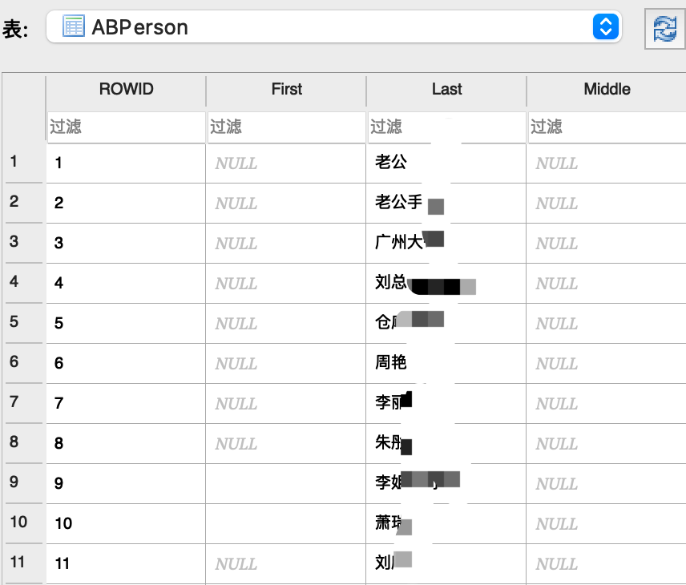
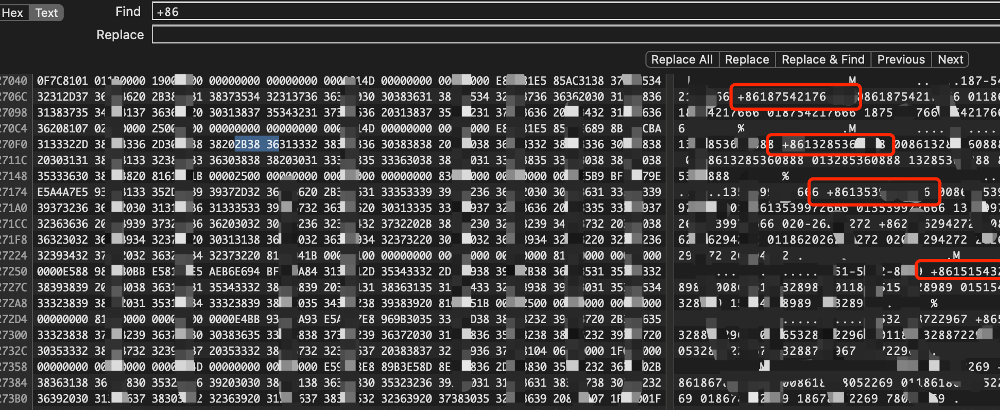

转载自: [iOS 通讯录恢复技术原理](https://shunmakeji.com/technology.html#)

# iOS 通讯录恢复技术原理

随着智能手机的普及，人们越来越依赖手机中的通讯录来管理联系人。但是，当通讯录意外丢失时，很多人会感到非常焦急和无助。作为我们存储联系人信息的重要工具，iPhone和 iPad 上的通讯录数据是非常重要的。但是，由于各种原因，通讯录数据可能会丢失或被误删除。因此，苹果公司提供了多种备份和恢复工具来帮助用户恢复误删除或丢失的通讯录数据。本文将介绍 iOS通讯录恢复的原理，包括为什么能找回、怎么知道能否找回以及找回步骤。

## 一、为什么能够找回？

通讯录数据通常存储在手机的数据库文件中，而且当我们删除或丢失通讯录时，实际上只是删除了这些数据在数据库中的索引，而并没有真正删除这些数据。因此，只要我们能够找到这些被删除的数据，就可以轻松恢复通讯录。

在 iOS 设备中，通讯录数据通常存储在 SQLite数据库中。当我们打开通讯录时，系统会读取数据库中的记录并显示在界面上。因此，如果我们想要恢复通讯录，就需要找到这个数据库文件，并从中恢复被删除的记录。

在 iOS 设备中，通讯录数据库文件的路径是/private/var/mobile/Library/AddressBook/AddressBook.sqlitedb。下图是该数据库的数据表，可以看到数据库的内容很丰富。

其中ABPerson表中保存了联系人姓名和对应id，示例数据见下图：

其中ABMultiValue表保存了手机号码和联系人id，通过这两张表就能恢复联系人数据。

如果我们有备份文件，可以使用 iTunes 或 iCloud将备份文件恢复到设备上，这样就可以恢复通讯录数据了。但是如果没有备份文件，就需要使用一些专业的数据恢复工具来进行恢复。

## 二、怎么知道可以找回呢？

如果你误删了通讯录或者在升级系统时出现通讯录丢失的情况，首先要保持冷静，不要急着采取任何行动。然后，检查是否有备份文件。如果有备份文件，可以使用iTunes 或 iCloud将备份文件恢复到设备上，这样就可以恢复通讯录数据了。但是如果没有备份文件，就需要使用一些专业的数据恢复工具来进行恢复。但是，使用数据恢复软件并不总是成功的。因为当通讯录数据被删除或丢失时，其实际上并没有被彻底删除，而是被标记为可重用的空间。如果新的数据被写入了这些空间，那么旧的数据就会被覆盖，导致无法恢复。通过备份文件获得AddressBook.sqlitedb数据库，通过hex编辑器打开，尝试搜索+86，通过搜索结果即可知道是否能够恢复，见下图：

## 三、怎么找回呢？

数据恢复工具通常需要连接手机到电脑上，并对设备进行扫描和分析，以找到被删除的通讯录记录。这些工具通常采用的是文件恢复的原理，即通过扫描设备上的存储空间，找到被删除的记录所在的磁盘块，并将这些块中的数据提取出来。然后，通过一些算法和技术，将这些数据还原成通讯录记录，最终完成恢复操作。

需要注意的是，在进行数据恢复操作时，可以选择数据恢复工具，并注意备份数据以防数据丢失。此外，操作不当或者使用不合法的工具，可能会导致数据的进一步损坏。因此，在恢复通讯录数据之前，一定要仔细阅读相关的操作说明，以确保操作正确。

**iOS通讯录恢复的原理和步骤可能因具体情况而异，但是无论使用备份文件还是数据恢复软件，最重要的是尽快采取行动，以最大限度地减少数据丢失的风险。**
