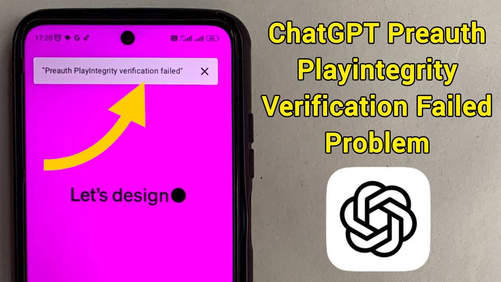
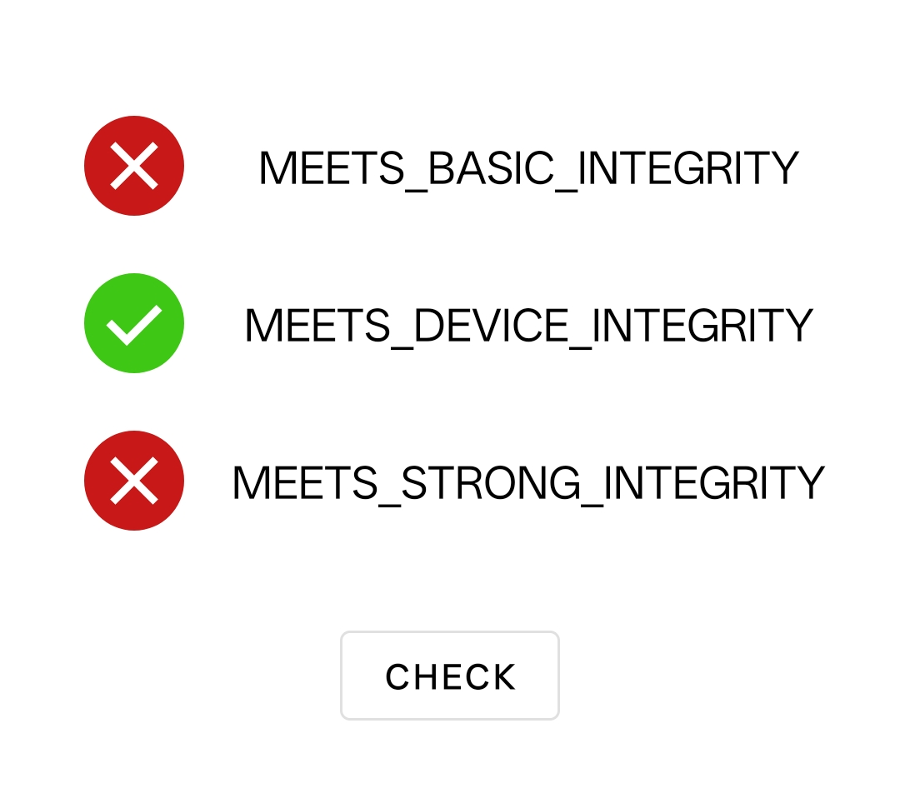

# 使用 KernelSU + PlayIntegrityFix 解决Root后ChatGPT不能使用的问题

参考文章: [[GUIDE] 🛡️ How to Pass Strong Integrity on Android (Step-by-Step Guide)](https://xdaforums.com/t/guide-how-to-pass-strong-integrity-on-android-step-by-step-guide.4729435/)



刚从iPhone转到Android的用户，买了一加13T，享受刷机折腾的乐趣，结果安装了ChatGPT以后，发现无法使用，报错：PlayIntegrity Verification failed，了解了下这是谷歌的一中设备认证机制，折腾了一下，虽然没有三项全绿，ChatGPT已正常使用，本文将以 **一加 13T（ColorOS + KernelSU）** 为例，记录操作配置过程，实现：

* ✅ 安装 Google 三件套并正常登录
* ✅ Play 商店稳定运行、不闪退
* ❌ Basic Integrity 
* ✅ Device Integrity
* ❌ Strong Integrity
* ✅ ChatGPT 正常登录使用

---

## ✅ 为什么需要伪装 Play Integrity

Google Play Integrity 是 Google 用来判断设备是否安全、是否获得官方认证的系统。在 Root 或解锁 Bootloader 的状态下：

* 部分 App（如银行、Snapchat、Netflix）无法使用
* Google Wallet Tap-to-Pay 无法启用
* Play 商店出现“设备未认证”提示

因此，需要“欺骗”这一机制，**让 Root 设备也能通过验证**。

---

## 📦 准备工作

### 设备信息

* 📱 机型：一加 13T（国行）
* 🧠 系统：Android 15（ColorOS PKX110_15.0.2.108(CN01)）
* 🧰 Root：KernelSU

### 所需组件

如果相关下载链接失效，则自行上Github上搜索，Play Integrity Checker 直接在 Google Play上下载即可

| 类型 | 工具名称 | 说明 |
| --- | --- | --- |
| Zygisk 框架 | [ReZygisk](https://github.com/PerformanC/ReZygisk/releases/download/v1.0.0-rc.2/ReZygisk-v1.0.0-rc.2-debug.zip) | 推荐，兼容性好                  |
| 完整性伪装     | [PlayIntegrityFix](https://github.com/KOWX712/PlayIntegrityFix/releases/download/v3.3-inject-vending/PlayIntegrityFix_v3.3-inject-manual.zip) | 主模块，模拟完整认证环境             |
| 辅助伪装      | [TrickyStore](https://github.com/5ec1cff/TrickyStore/releases/download/1.3.0/Tricky-Store-v1.3.0-180-8acfa57-release.zip) + [Tricky Addon](https://github.com/KOWX712/Tricky-Addon-Update-Target-List/releases/download/v4.0/TrickyAddonModule-v4.0.zip)               | 关键！伪造 Keybox、打补丁、修改系统属性等 |
| 完整性检测工具   | Play Integrity Checker（Google Play） | 验证最终效果                   |

---

## 🔧 安装步骤

### 🧹 第一步：卸载旧模块（重要）

确保未安装以下模块，如有可以先将其卸载：

```bash
PlayIntegrityFix（旧版）  
SafetyNetFix  
MagiskHide Props Config  
其他任何 GMS 替代类模块
```

如有，用 KernelSU 或终端移除并重启。

---

### 📥 第二步：安装模块

**使用 KernelSU 安装 ZIP 包**：
⚡⚡⚡安装顺序很重要
* ✅ 安装 ReZygisk
* ✅ 安装最新版 PlayIntegrityFix
* ✅ 安装 TrickyStore 和 Tricky Addon

然后重启。

---

### ⚙️ 第三步：配置 PlayIntegrityFix

进入模块设置：

| 选项                                 | 设置               |
| ---------------------------------- | ---------------- |
| Fetch pif.json                     | ✅ 获取（自动拉取设备指纹配置） |
| Use preview fingerprint            | ✅ 开启（如商店闪退可关闭）   |
| Spoof SDK version to Play Store    | ❌ 关闭（防止 GMS 冲突）  |
| Spoof Provider / Props / Signature | ✅ 建议开启           |
| Debug                              | ❌ 关闭（稳定优先）       |

---

### 🎭 第四步：配置 TrickyStore

1. 打开 TrickyStore
2. 点击右下角按钮 → 菜单（⋮）
3. 依次选择：

   * ✅ Select All（全选）
   * ✅ Deselect Unnecessary（取消选择非必要应用）
   * ✅ Set Valid Keybox（设置有效密钥）
   * ✅ Set Security Patch Date​（设置安全补丁） -> Get Security Patch Date（获取安全补丁日期） → Save（保存）

---

### 🔍 第五步：确认系统未冲突

使用命令确认无系统自带伪装：

```bash
getprop | grep -iE "verifiedboot|fingerprint|keybox"
```

本机 ColorOS 无 Pixel 指纹、无 verifiedbootstate 伪装，因此**无需处理第 7 步的“禁用系统伪装”**，可直接跳过。

---

### ✅ 第六步：验证成功

使用 Play Integrity Checker 检查，我这边只通过了 DEVICE INTEGRITY 输出如下：



---

## 📎 常见问题解答

| 问题                  | 原因与解决方式                                    |
| ------------------- | ------------------------------------------ |
| Play 商店打开闪退         | 关闭 `Use preview fingerprint` 或更新 Play 服务版本 |
| 无法添加 Google 账户      | 需安装完整 GMS 三件套并挂代理                          |
| Play Integrity 检查失败 | 重启设备 / 清除 Play 服务数据 / 等待几分钟再试              |
| 太频繁测试导致失败           | ⚠️ 请避免频繁点测试，会触发 Google 黑名单机制               |

---

## 🗂️ 补充：安装推荐 Google 组件

| 组件                        | 推荐版本                   |
| ------------------------- | ---------------------- |
| Google Play Services      | v24.14.16 (240400-6xx) |
| Google Services Framework | v14.0.0                |
| Google Play 商店            | v39.x 最新稳定版            |
| Google Account Manager    | v10.0.0                |

> 可在 [APKMirror](https://apkmirror.com) 下载，选择 `arm64-v8a` 架构。

---

## 💾 附件打包下载

如你不想手动找模块，我已打包好以下内容：
* 全套模块 ZIP（ReZygisk + PlayIntegrityFix + TrickyStore）

📥 可私信/评论获取 阿里云盘 / 蓝奏云 / 百度云盘 下载链接。
