转载自: [为啥现在的 iPhone 不能越狱了？](http://www.360doc.com/content/19/0817/14/31212642_855478202.shtml)

# 为啥现在的 iPhone 不能越狱了？

近年来大家对越狱的热情都下降了，但实际上越狱的脚步一直未停止过。

就在今年的 InfiltrateCon 2018 大会上，腾讯旗下的科恩实验室越狱了一部 iPhone X ，这台 iPhone X 运行的系统是 iOS 11.3.1 系统。

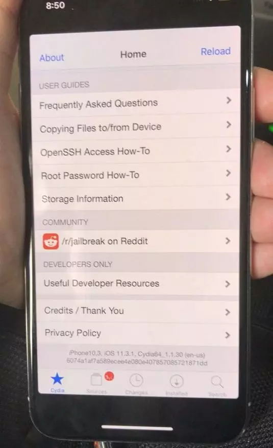

图片中很明显已经成功安装 Cydia 破解组件，但这已经不是什么稀奇事儿了。

毕竟在去年韩国举行的 POC 2017 大会上，科恩实验室的研究人员 Liang Chen 就已经用 iPhone X 展示过 iOS 11.1.1 越狱成果，但具体的漏洞细节和越狱插件，并未公布。

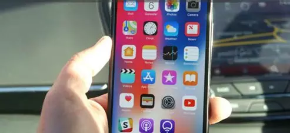

阿里安全潘多拉实验室的小伙伴也曾公开过越狱的 iOS 11.1 系统。

但无论是科恩实验室还是潘多拉实验室都表示，我们就是给你们看看我们已经越狱了，但是公布越狱插件？不可能！这辈子都不可能！

但这对于越狱主流的那些年来说，这都只是很正常的操作~毕竟当初很多的小伙伴，宁可保修不了，也一定要越狱。

虽然现在越狱已经凉了，但有些历史依旧值得缅怀，那么哎妹今天就来跟大家唠一唠苹果越狱的趣事儿。

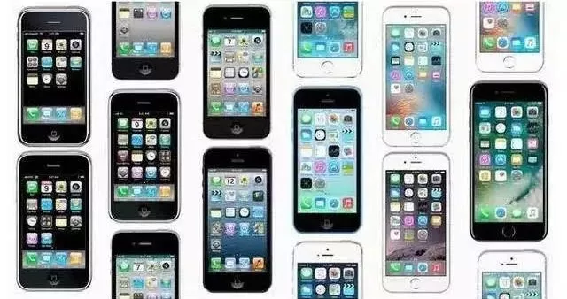

而苹果的越狱史，其实就是黑客与苹果的相爱相杀史。

那么故事就得从2007年说起了，那时候的手机江湖那是各种花样都有，直板、滑盖、翻盖和全键盘啥样的都有。

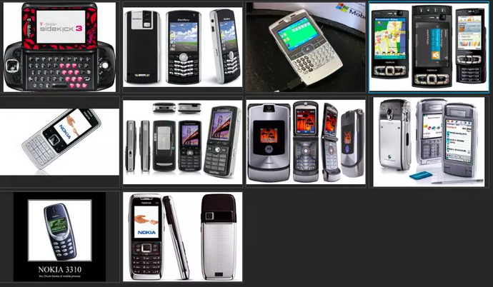

接着乔帮主的 iPhone 横空出世，直接颠覆手机行业。你们都别搞了，跟着我混就可以啦！

一整块大玻璃屏，两根手指就能搞定所有操作，直接惊呆了众手机厂商。

很快，苹果席卷整个江湖，单挑 Boss 怒刷装备，完成大一统，从此成为了江湖界的一哥？

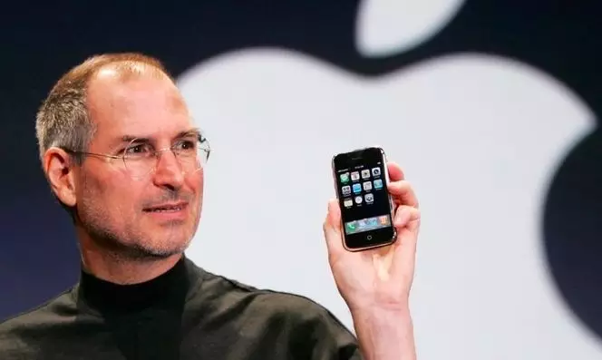

不存在的，实际上的**初代 iPhone 其实相当难用！**

苹果越狱的不归路其实也正是由初代 iPhone 的各种槽点开始的……

**裤子都 tuo 了这么久，咱们来尬一尬正事儿吧！**

「越狱」鼻祖神奇小子

首先登场的是一位黑客大神，名叫乔治·霍兹（ George hotz ），初代 iPhone 诞生时，他年方十七。

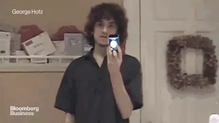

话说那年苹果公司由于战略合作考虑，跟美国最大的电信运营商 AT&T （大概是美版中国移动）签署了独家协议，导致**初代 iPhone 只能用 AT&T 的网络**。

**你没有看错，初代 iPhone 是合约机，充话费送手机的那种。**

霍兹知道这事以后当场炸毛，他在社交网络上发话：「**简直是胡扯！**」。

社会我霍哥，人狠话不多。直接搞来螺丝刀和吉他拨片，一口气倒腾了足足500个小时……

两个月后，霍兹在博客宣布已破解 iPhone ，让它支持除了 AT&T 以外的任何运营商的网络，这脸打得啪啪响啊。

更让苹果和 AT&T 头疼的是，这货自嗨就算了，还直接把破解方法做成视频和公布了，视频的点击量很快就突破了200万，紧接着几百万人都学会了**把合约机变成全网通**的办法。

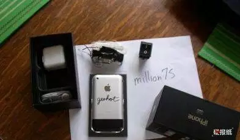

第一台「越狱」苹果

出来混嘛，我霍哥那是相当有经济头脑，他把自己破解的 iPhone 放在网上拍卖，当时的价格炒到**一亿美元**以上，但最后他很低调的只用这台手机换了**一辆跑车**和**三部未破解的 iPhone** 。

或许是尝到了破解 iPhone 的甜头，在2009年 iPhone 3GS 推出没多久，他又发布了首款 iPhone 3GS 越狱软件 — **purplera1n** ，也就是大名鼎鼎的“紫雨。

这两战奠定了霍兹在 iPhone 越狱史上不可替代的地位。

**越狱居然反向推动苹果进步？**

**第二个向我们走来的越狱神人叫 Jay freeman （杰·弗里曼）。**

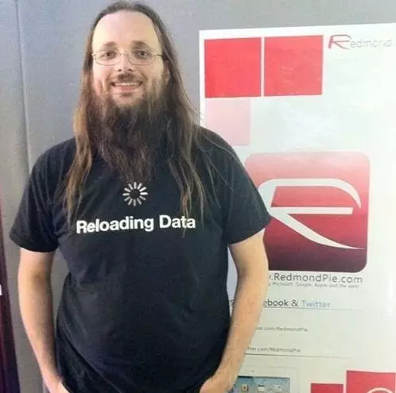

刚才讲到，初代 iPhone 并没有我们想象当中的那么好用。其实合约机只是其中一个小小槽点，**别的槽点更过分**。

比如，**初代 iPhone 上市时还没有 App Store ，用户只能用手机出厂自带的软件**。想聊天？不好意思脸书推特都没做，微信 QQ 微博更没有，还是发自带的聊天程序或者短信吧！

而且，当时 iOS 系统没有多任务（按下 Home 键就直接退出），聊天程序不能后台运行接收消息，必须一直开着才能收消息。

想玩游戏？出厂自带的平衡球游戏，要别的没有！

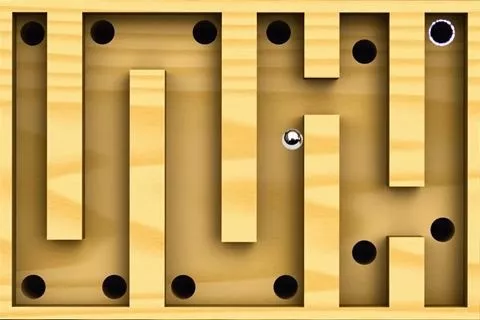

再比如，不能换电池。（现在看来很平常，但在当时简直是反人类）

那时充电宝还不流行，电池优化也做的不够好，早上带个 iPhone 出门经常扛不到晚上回家（跟现在也差不多嘛）。

包括复制粘贴功能都没有！（反正就是要啥没啥了）

而当时诺基亚的塞班系统虽然没有手指滑动缩放这样的骚操作，但各种软件倒挺齐全的，功能上也没有什么缺陷，而且又硬又持久（我说的是外壳坚硬电量持久）。

总之，当时很多人根本用不惯 iPhone ，依然美滋滋地用着五颜六色的诺基亚，**弗里曼就是其中一个。**

那时朋友们常跟他谈起 iPhone 是多么多么酷，弗里曼的内心始终波澜不惊，甚至还想笑：「**这么个破玩意敢卖到600美元，简直是抢钱。**」

**显然，他当时对自己的诺基亚 6340i 是真爱，根本没料到自己会成为苹果越狱的骨灰级人物。**

直到有一天，好朋友告诉他「越狱」这么一回事儿。

并且，他发现初代 iPhone 的**配置完爆当时的主流手机**，堪称手机里的珠穆朗玛峰，于是他有了一个**大胆的想法**……

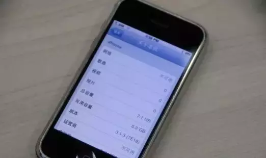

十年前的 iPhone 存储容量有 7.1G ，那可是十年前……

弗里曼心想：「如果能破解 iPhone，让开发者可以自行植入软件和更改系统设置，肯定会比现在好用多了（至少不会白瞎了这么好的配置）……」

他和朋友折腾了几个月，做出一个图形界面的平台 **Cydia** 。

后来， Cydia 也成为了苹果越狱成功的标志，几乎所有越狱苹果机都会装上它。如果你想简单判断一台 iPhone 是否越狱，看它装没装 Cydia 就行。

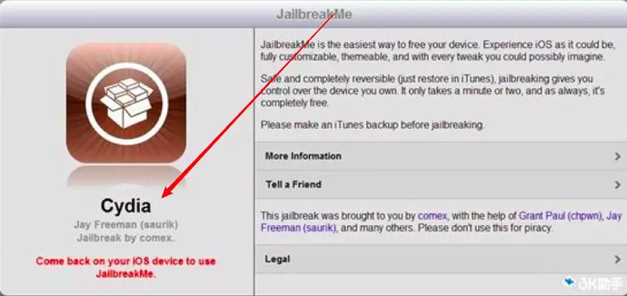

Cydia 英文本义是一种苹果蠹虫，专门在苹果和梨子里打洞。

iPhone 越狱之后安装 Cydia 可以达到进一步控制，并下载安装第三方软件。

弗里曼后来还引入了一个购买机制：**开发者在 Cydia 中出售软件，用户可以在里面自由购买想要的软件，所有的软件购买记录都保存在一个账号内。**

平台的用户数很快就超过了200万。

直到2011年4月， Cydia 年营业额已经达到1000万美元，每周都有450万用户使用 Cydia 。直接就成为了苹果官方商店以外最大的第三方应用商店。

碳素！你要是以为 Cydia 是个翻版的 App Store 那就大错特错了！

人家 Cydia 推出的时间可是2008年2月28日，比2008年7月1日才发布的 App Store 早了整整五个月。  

**如果非要掰扯一下的话，那么可能是 Cydia 逼着苹果公司推出了自己的应用商店。**

不得不说，其实越狱对苹果生态反倒提供了不少推动。

因为**苹果手机后来出现的很多功能都是在越狱插件里先出现后，才被苹果借鉴过来的。**

**最典型的就是****第三方输入法****，**最早的 iPhone 是不支持第三方输入法的，当很多小伙伴为了用上搜狗、百度、讯飞这类的第三方输入法才开始踏上了越狱的道路。

这很显然挑衅了苹果的权威，既然你们想用，就只能开放第三方输入法呗。

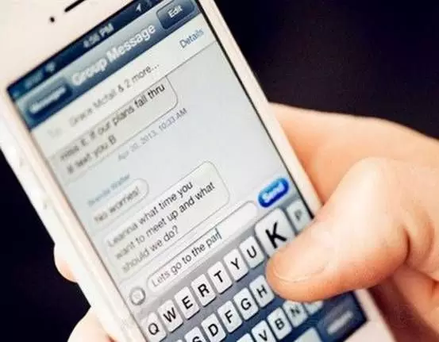

接着就是**多****任务功能**、**更换壁纸**、**保存 Gif 图片**、甚至是**省电功能**这些很基础的功能**，**都是先出现在越狱插件中的：

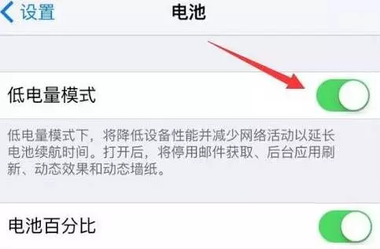

在中国， Cydia 的影响就更大了。

但早些年国内互联网并没有付费习惯，所以用苹果的小伙伴，为了不花钱基本上都会选择越狱。

**看图就知道那时候越狱有多夸张了**

**越狱****成为了和****刷机****、****贴膜****并驾齐驱的三巨头，支撑了多少摊贩的事业啊喂！**

反正 Cydia 就是席卷了全球，那是苹果之外的世界，长满了各种各样的好吃的，肯定得疯狂进去采摘啊。当苹果开发人员看到这一幕后，也赶紧搞了点种子种在自家院子里，慢慢地苹果的菜园子种类也多了起来。

越狱江湖

**说完弗里曼创造 Cydia 的故事，下面给大家介绍一大票黑客。**

Cydia 火起来之后带动了一大票狂热的开发者、普通用户，越来越多的黑客团体开始在越狱社区涌现，像接力棒一样维系着越狱工作：

> iOS 5 时代， **Chronic Dev Team** 开发出了一键完美越狱工具。
> 
> iOS 6 时代， **evasi0n** 越狱梦之队开始成为主力军。

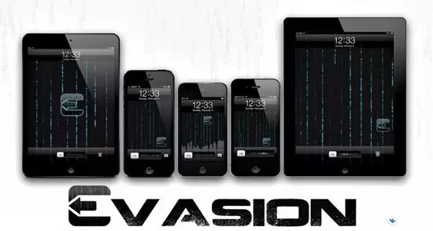

据说 evasi0n 是由 pod2g 、 planetbeing 、 pimskeks 、肌肉男四名黑客组成，**所以人们亲切地称他们为****「 3P 肌肉男」**

慢慢地，这些越狱团队之间也形成了一种默契，只要某个团队率先发出一个版本的越狱工具，其他团队就不再发布。

因为**每个越狱工具背后都对应着一个或者多个苹果系统漏洞**，这些漏洞非常珍贵，**一旦用来做公开的越狱工具，苹果公司就会很快修补它**，为了不浪费漏洞，越狱团队就只能这样做。

有江湖就会有大佬，越狱江湖的大佬就是 **Stefan Esser** ，由于头像是个**树人**，所以江湖人称「**树人**」。

正所谓**十年树木百年树人**，树人老师傅曾在 iOS 4.x 、 iOS 5.0 和 iOS 5.1.1 推出完美越狱而一战成名，没想到有一天，他竟然**金盆洗手**了，搞了个**越狱培训班**。

每次苹果发布新版本不久，他就挂出「**我已成功越狱，速来我处培训**」的旗号开班培训，后面很多知名的越狱团队都上过他的课，包括一会儿会讲到的盘古团队。

**中国越狱团队崭露头角**

话说，越狱的江湖风起云涌，但在 iOS 7 之前，越狱社区里还少有中国人的身影。

直到 iOS 7.0.6 越狱工具发布时，人们才首次在 iOS 越狱领域看到了一个中国团队的名字 — **太极团队**。

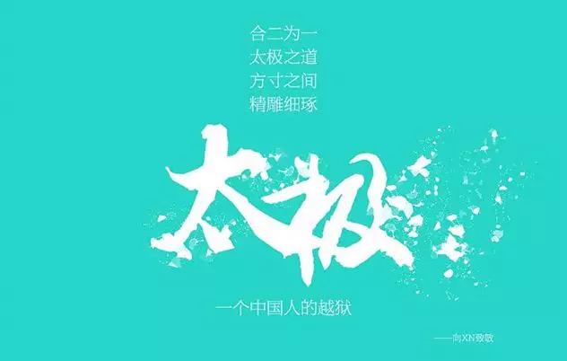

彼时太极团队联合前面说到的「 3P 肌肉男」一起发布了越狱工具，但双方发生了一些不愉快的情况，太极团队后来才开始独立研究越狱。

与此同时，国内另一支名叫**「盘古」**的团队也已投入研究。

从0到1并不容易，由于之前越狱都是国外安全研究人员在做，国内没有先例可以交流，研究资料非常匮乏，学习和研究难度都很大。

中国团队一开始研究时， iOS 版本已经是第7个大版本了，漏洞越来越难挖。

眼看着盘古团队就要做出 iOS 7.11 完美越狱工具，团队成员 TB 在微博上发了截图和视频，迎来的居然不是称赞，而是谩骂！大部分的人都在说他们是骗子。

等到越狱正式发布后，有人质疑漏洞或者越狱是花钱买来的，为此他写了一篇微博长文回应。

甚至，**还有些老外开始质疑中国人开发的程序是否有后门**。

盘古团队气不过，可是又没法跟他们一个个讲道理。

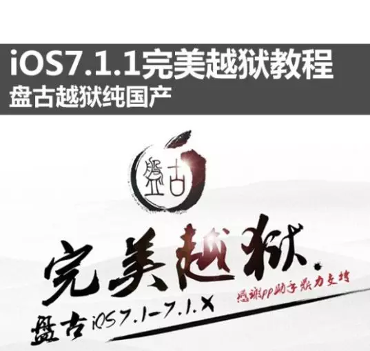

不过，那次越狱也确实引起了很大争议。

据说当时盘古一开始发布的越狱工具用到了树人老师傅培训课里讲到的一个「仅供学习交流之用」的漏洞，但是当时培训并没有签署任何保密协议，这才闹出了误会。

因为那件事，盘古团队的成员最终还是在 Twitter 上给树人道了歉，也发了声明。

可是即便发了声明，还是有不少吃瓜群众以为这个中国团队是为了炫耀又实力不够，才偷了树人的漏洞。

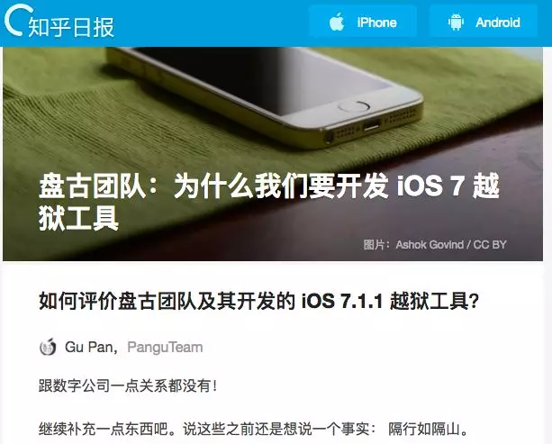

当时盘古团队发的声明，图片截取自知乎日报

后来，盘古团队很快就用自己挖的另一个漏洞替换掉了树人的漏洞，**不为别的，就为了给自己的越狱工具和技术实力正名。**

从那之后，中国越狱团队开始了开挂之旅，向全世界人民证明了自己的实力。

> iOS 8 ：众多国外黑客都无计可施的情况下，盘古团队完成了 iOS 8.0~8.1 的完美越狱工作。
> 
> iOS 8.1.1 ：太极越狱'震惊世界'，率先发布了完美越狱工具。
> 
> iOS 8.1.2 ：苹果正式发布更新后仅仅几小时，太极团队又迅速发出 iOS 8.1.2 系统的完美越狱工具，效率之高让世界惊讶。
> 
> iOS 8.3、8.4上，太极团队也很快发布完美越狱工具。
> 
> 到了 2015 年，盘古团队联合**科恩实验室****首次破解 iOS 9** **。**
> 
> iOS 9.2-9.3.3时，盘古不仅率先推出越狱工具，还使用了开创性的越狱模式，可以一键切换越狱和非越狱状态。

越狱最火的一段时间，大家都在坐等着越狱团队们发布越狱工具。每当苹果发出新版本后，成千上万吃瓜群众就开始掐表坐等他们发布新的越狱工具。

荣耀、谩骂和转变

越狱工具为越狱团队们带来了什么？有荣誉和名望，也有谩骂和非议。

当然吃瓜群众肯定是秉承着看热闹不嫌事儿大的操作，所以等越狱的吃瓜群众里也有这么一群**伸手党喷子**。

没有及时找到或发现最新 iOS 漏洞？喷！不能及时发出越狱工具？喷！发出来的越狱工具不够完美？喷！

比如 iOS 10 时期，有个叫 **Lucas** 的小哥哥率先推出了工具一战成名。但没过多久，他就宣布「隐退」，其原因就是**喷子们**过分了！（就像每天在后台没事儿就骂人的那些人，大家都不容易，哎妹全家是招你惹你了？）

有次 Lucas 发布了一个不太稳定的测试版越狱工具，并在推文里明确说了这是测试版，极其不稳定，还是给研究人员的，普通用户谨慎尝试。

结果很多小白用户主动下载尝试，当手机「变砖」后，就开始在 Lucas 的推特账号下疯狂谩骂。

一开始 Lucas 还会在评论区回击，可后来喷子越来越多，语言越来越脏，甚至还有人专门制作了视频来骂他。

Lucas 一气之下，宣布 iOS 10.2 之后不再发布越狱工具，你们赢了！会喷！我认怂还不行？

没想到喷子们还在继续：

> 呵呵，又不是只有你一个人会越狱，没了你还有别人！
> 
> 大神又不止卢卡斯你一个，真不明白为什么你这么狂妄自大？”  
> 
> Xddddd 好像说的全世界就你能攻破 iOS 系统越狱，你退出吧！以后10.2.1没有你卢卡斯也一样可以攻破。

这样的话让 Lucas 是真的扎心了，差点就让越狱社区少了一位大神。

当然，盘古和太极团队也常常被喷，

据说在 iOS 9.x 的某个版本，盘古团队的越狱工作遇到了一些困难，结果微博上**一千多条评论**骂盘古（由于实在有点脏，我就不放出来了，有兴趣可以自己查查看，高血压心脏病肝火旺的谨慎查看），最后他们特地到推特上发布了声明。

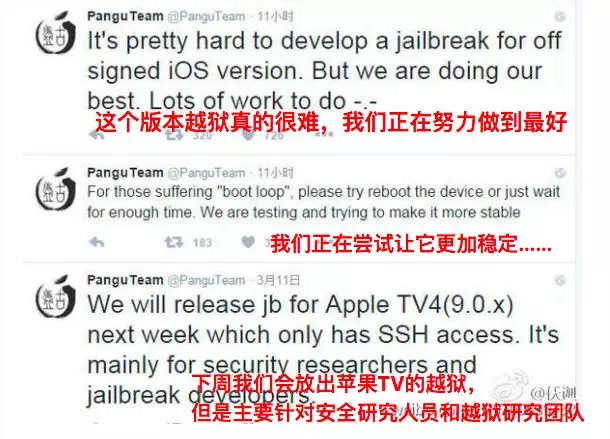

可能有些人的人心，还是肉长的吧，他们也觉得自己过分了，渐渐开始力挺越狱团队，接着就开始了双方对骂。

某网友：刚发布9.3.3，新版本不需要各种机型适配，不需要调试吗？我要是盘古，我就不发，泼妇模式已开启的请继续。

一方面，越狱团队顶着各方面压力，另一方面，越狱需要用的 iOS 漏洞也变得越来越难挖，价值越来越高，渐渐地，越狱社区逐渐冷淡下来。

**制作越狱工具对他们来说毕竟只是兴趣爱好，后来他们大多把精力转向了自己真正热爱的事业。**

比如太极团队创始人谢雷后来去创业做了载人飞行器，而盘古团队也在2017年正式发布了自己的 **Janus 移动安全平台**，他们试图利用大数据 情报分析技术，帮助应用市场分析成千上万个安全风险。并且利用他们在移动安全方面的技术，帮助企业改善信息安全状况。

虽然，他们偶尔也会对外展示一下某个 iOS 版本的越狱，但很少再像之前定期公开越狱工具了。

在一次接受采访时，盘古团队成员 TB 表示自己做越狱是**「为名而不是为利」**，初心是为了**证明国人的技术实力**，而如今这个目的已经达到了，也是时候投入更多精力到安全研究上了。

果粉们折腾不动了，越狱团队自然也就不折腾了。

现在 iPhone 功能已经越来越完善，安全性也越来越高，人们也逐渐习惯了购买正版软件，越狱变得不那么必要了。

其实一直到现在，安全技术研究者们也没有停止对 iOS 的安全研究和破解：

> 2017年4月，盘古发布 Janus 移动安全平台时，顺带公开演示了对当时最新的 iOS 10.3.1 的越狱。
> 
> 2017年6月， KEEN 实验室在盘古主办的 MOSEC 移动安全大会上展示了当时最新的 iOS 10.3.2 的越狱。
> 
> 2017年11月，苹果刚刚推出 iOS 11 没几天， KEEN 就发出了越狱展示图片和视频。
> 
> **2018年5月，也就是前几天，**科恩实验室又宣布越狱了最新 iPhone X 的 iOS 11.3.1 系统。

只是，他们都不再公开发布越狱工具，**越狱已经逐渐从「民用」变成了一种纯粹展现技术实力的方式**。

一群喷子又追到科恩实验室以及其研究员陈良的推特下面谩骂，质问他们为什么不公开漏洞和越狱工具。

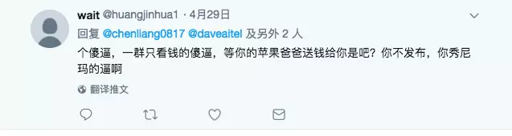

图片截取自 twitter 下的评论

这些喷子们自然不会知道，一个 iOS 品相好的漏洞已经变得多么难得，价值多大。

他们也不会知道，以往国内的安全团队都会在国际破解大赛 Pwn2Own 上大展风采（中国队伍前几年一直盘踞冠亚军），从今年开始，国内各大团队也开始不再参加 Pwn2Own 破解大赛。

在国家战略层面， iOS 漏洞也已经慢慢变成了『网络武器库』一样的存在，是一种重要的战略资源。

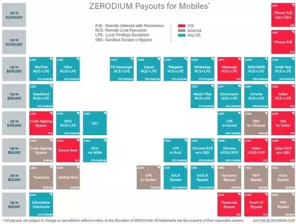

在漏洞军火商 zerodium 的价格单里， iOS 漏洞（红色）也是最高  

和 Lucas 不一样的是，他没有回应那些喷子。

那到底是什么原因，科恩实验室陈良的回答或许能帮他解释了：

> 我只关心技术本身的突破，商业上的那些东西并不感兴趣。

越狱尾声

2017，越来越多的越狱软件提供源网站因为经营问题而关闭，对于这件事，大部分人并不惊讶，甚至当初一手打造 Cydia 的弗里曼也不惊讶，他说：

> 想越狱的人越来越少，那些关注一些有趣事情的开发者就会越来越少，这意味着人们越狱的理由就会变少（因为不有趣了），越狱的人就更少了，然后再导致开发者不愿意去破解。
> 
> 如此循环，越狱也就慢慢地死去了。

越狱停留在上一个时代了吗？是的，但在我看来这很正常。

越狱之所以会出现，是因为那时人们需要它。

越狱之所以消亡，也是因为人们现在不再需要它。  

仅此而已。

所幸的是，安全研究者们对技术的追求依然没有改变，依然保持着对 iOS 的破解和交流。

**越狱，始于纯粹的黑客精神里，那种对技术的追求和对束缚的突破，如今似乎又回到了这种情况。**

**从某种程度上，我觉得这是一种回归，是对上一个时代最好的交代。**

**本文与浅黑科技联合发布**，浅黑科技是哎妹几个很酷的朋友做的，实不相瞒他们平时就和黑客互撩，不仅能撩到各路黑客、技术大神，还能把难懂的技术用通俗有趣的语言讲给你听,偶尔还行侠仗义揭露这个世界的黑暗，如果你喜欢新奇探索，不妨关注一波~
