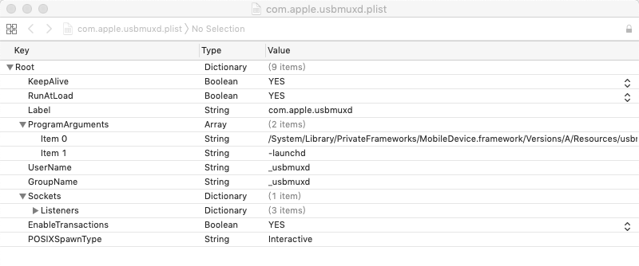
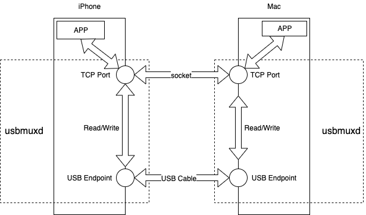
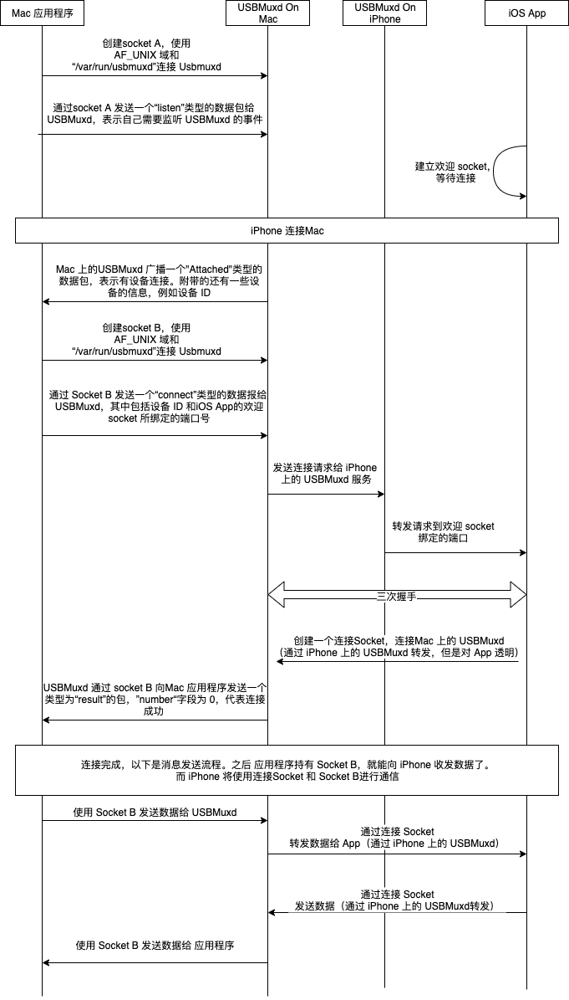

转载自: [对 usbmuxd 的一点研究](https://reetyo.github.io/2019/04/09/2019-04-09/)

# 对 usbmuxd 的一点研究

# USBMuxd

当 iTunes 和 iPhone 连接时，它们之间会通过 USBMux 进行连接。USBMux 用于在 USB 协议上实现多路 TCP 连接。USBMuxd 能够实现 USB-TCP 协议的转换，将 USB 的端口映射到本机的 TCP 端（基于 Unix Domain Socket），将 USB 通信抽象为 TCP 通信。苹果的 iTunes , XCode 都使用了这个服务。

根据 [iphonewiki.com](https://www.theiphonewiki.com/wiki/Usbmux) 所说的，USBMuxd 程序存放在 Mac 系统下的 `/System/Library/PrivateFrameworks/MobileDevice.framework/Resources`路径中。并且由 plist 文件 `/System/Library/LaunchDaemons/com.apple.usbmuxd.plist` 可知，USBMuxd 是一个开机启动的服务。

由于 iOS 系统也具有 USBMuxd 服务，所以 iPhone 和 Mac 就能通过 USB 进行 TCP 通信。更进一步的是，只要实现了 USBMuxd，非 OSX 系统也能与iPhone 系统进行通信，例如 Windows 和 Linux。

github 上也存在一个名为 USBMuxd 的项目，这是一个跨平台的开源项目，实现了 usbmux 的功能，支持 MAC/Linux/Windows 平台。

# usbmuxd连接流程

以下是Mac应用程序、App与 USBMuxd 的连接流程和数据收发流程。

有几个地方是需要留意的：

*   应用程序需要创建两个 Socket ， 一个用于监听 USBMuxd 广播包，以便应用程序得知 iOS 设备的连接与断连；另一个 Socket 用于在得知 iOS 设备连接后请求连接，如果 iOS 设备同意连接，后续的数据传输将通过这个 Socket 进行。
*   App 也需要创建两个 Socket，一个为欢迎 Socket，另一个为连接 Socket，这和普通的服务器端套接字流程一样。对于App，USBMuxd 服务是透明的。
*   USBMuxd 的广播包使用自己的一套协议，需要按照该协议生成数据包来和 USBMuxd 进行数据传输。
*   当应用程序与 iOS 设备连接后，应用程序和 iOS 进行数据传输的协议由我们自己决定。

# peertalk

[peertalk](https://github.com/rsms/peertalk)是一个使用了 usbmuxd 的实例程序，实现了 iOS 设备和 Mac 通讯的功能。

[这个工程](https://github.com/reetyo/usbmuxdTest)是我对 peertalk Mac 版本的一个简化，代码量较少，能比较清楚地看出 Mac 应用是如何通过 usbmuxd 与 iOS 设备通讯的。

## 参考

1.  [Understanding usbmux and the iOS lockdown service](https://medium.com/@jon.gabilondo.angulo_7635/understanding-usbmux-and-the-ios-lockdown-service-7f2a1dfd07ae)
2.  [什么是usbmuxd? iDevice通过USB与桌面系统通信原理小科普](http://bbs.iosre.com/t/usbmuxd-idevice-usb/1482)
