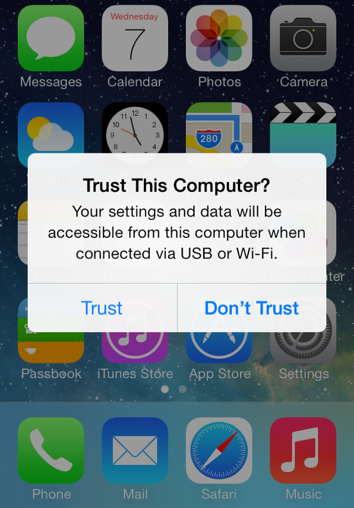
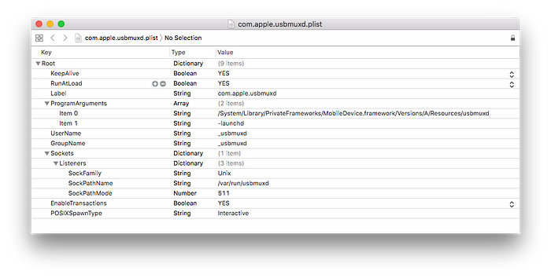
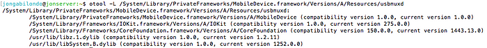
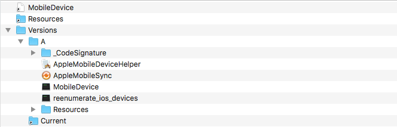
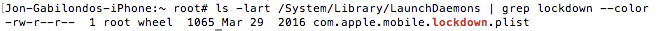
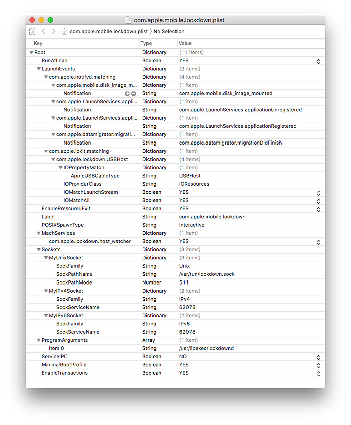
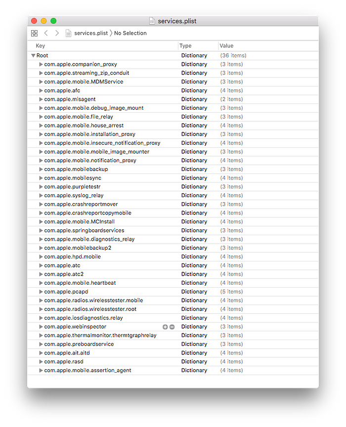
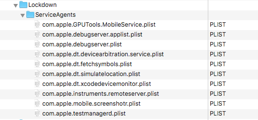

转载自: [Understanding usbmux and the iOS lockdown service](https://jon-gabilondo-angulo-7635.medium.com/understanding-usbmux-and-the-ios-lockdown-service-7f2a1dfd07ae)

# Understanding usbmux and the iOS lockdown service

If you have ever been intrigued by how iTunes and Xcode communicate with devices and moreover how non Apple code like [_libimobiledevice_](https://github.com/libimobiledevice/libimobiledevice) is able to control them, here you have a hands on compilation of the knowledge about the matter with some personal research.



## The usbmux

The usbmux is the first player in this matter, let’s see what the iphonewiki.com, say about it:

[Usbmux - The iPhone Wiki](https://www.theiphonewiki.com/wiki/Usbmux?source=post_page-----7f2a1dfd07ae---------------------------------------)

> During normal operations, [iTunes](https://www.theiphonewiki.com/wiki/ITunes) communicates with the [iPhone](https://www.theiphonewiki.com/wiki/List_of_iPhones) using something called "usbmux" — this is a system for multiplexing several "connections" over one USB pipe. Conceptually, it provides a TCP-like system — processes on the host machine open up connections to specific, numbered ports on the mobile device.

Apple has built an "usb multiplexer" for host applications to communicate with the iDevices. Obviously Apple has developed it for his own applications, not for the community. Apple provides _usbmux_ in OSX and Windows to support iTunes. There is an open source project to replicate usbmux for Mac/Linux/Windows, it is called _usbmuxd_.

iphonewiki.com provides information about the location of the original usbmux program in the Mac platform and how it is launched:

> On the Mac, this is handled by /System/Library/PrivateFrameworks/MobileDevice.framework/Resources/usbmuxd, a daemon that is started by launchd (see /System/Library/LaunchDaemons/com.apple.usbmuxd.plist **Catalina**: /Library/Apple/System/Library/LaunchDaemons/com.apple.usbmuxd.plist)

We can confirm the usbmuxd and the daemon plist are still there in OS X 10.13.6 :


The contents of the usbmux daemon plist are:



Notice the interesting information in the plist about Unix sockets. The usbmuxd daemon opens a Unix socket at _/var/run/usbmuxd_. More precisely, it is an Inter Process Communication file descriptor for processes to connect and communicate with the iPhone.

> The usbmuxd .. creates a listening UNIX Domain Socket at /var/run/usbmuxd. usbmuxd then watches for [iPhone](https://www.theiphonewiki.com/wiki/List_of_iPhones) connections via USB; when it detects an [iPhone](https://www.theiphonewiki.com/wiki/List_of_iPhones) running in [normal mode](https://www.theiphonewiki.com/wiki/Normal_Mode) (as opposed to [recovery mode](https://www.theiphonewiki.com/wiki/Recovery_Mode_(Protocols))), it will connect to it and then start relaying requests that it receives via /var/run/usbmuxd — this is to say, usbmuxd is the only thing that actually speaks USB to the [iPhone](https://www.theiphonewiki.com/wiki/List_of_iPhones). This means that third-party applications which wish to talk to the [iPhone](https://www.theiphonewiki.com/wiki/List_of_iPhones) must either do so through usbmuxd, or usbmuxd must be replaced.

In other words, iTunes and Xcode talk to iDevices through the _/var/run/usbmuxd_ socket. We can confirm that the socket is there:


So far we know that this socket exists and implements a TCP "like" protocol. Since its for Apple only to use, we can guess that they didn't have to be TCP compliant and probably they have done their "TCP like" way for higher efficiency.

The dependencies of the _usbmuxd_ executable are not many. There is one that looks like a fundamental part for the communication with devices, MobileDevice.framework. We will find out later on what does the framework provide.



There is an interesting modification you can apply to the usbmuxd.plist in order to get the Debug logs of usbmuxd in the console. Adding a simple DebugLevel key with value 7 will set enable the debug logs. This article explains how to do it :

[Learn how iOS devices sync over USB by enabling usbmuxd's debug logs](https://worthdoingbadly.com/usbmuxdebug/?source=post_page-----7f2a1dfd07ae---------------------------------------)

## The usbmuxd Project

Further diving into usbmux brings us to "_libimobiledevice/usbmuxd_", which is pretty well explained in:

[usbmuxd](https://cocoapods.org/pods/usbmuxd?source=post_page-----7f2a1dfd07ae---------------------------------------)

[_libimobiledevice/usbmuxd_](https://github.com/libimobiledevice/usbmuxd) is an open source project to simulate the OS X usbmux system on Mac, Linux and Windows. Except for Linux, the original Apple usbmux is available in Mac and Windows when installing iTunes/Xcode, therefore you may not need to use the open source project. However if you don’t want to install Apple’s iTunes on Windows you may use it.

> When usbmuxd is running (normally started, or stopped as a result of "udev"  
> auto-insertion messages or by systemd) it provides a socket interface in  
> "/var/run/usbmuxd" that is designed to be compatible with the socket interface  
> that is provided on Mac OS X.

This usbmuxd open source exposes all you may want to know about the usbmux TCP "like" protocol. You can find there all about the ports, endpoints, layers, packet sizes, checksums, negotiations ...

We can confirm the information we got about the Unix socket _/var/run/usbmuxd_ in the source file [main.c](https://github.com/libimobiledevice/usbmuxd/blob/08d9ec01cf59c7bb3febe3c4600e9efeb81901e3/src/main.c). This is the code of the socket creation, with "_chmod 0666",_ meaning that all users can read and write:

```cpp
static const char *socket_path = "/var/run/usbmuxd";
static const char *lockfile = "/var/run/usbmuxd.pid";

// ...

if(unlink(socket_path) == -1 && errno != ENOENT) 
{
    usbmuxd_log(LL_FATAL, "unlink(%s) failed: %s", socket_path, strerror(errno));
    return -1; 
}

// ...

listenfd = socket(AF_UNIX, SOCK_STREAM, 0);

// ...

bzero(&bind_addr, sizeof(bind_addr)); 
bind_addr.sun_family = AF_UNIX; 
strcpy(bind_addr.sun_path, socket_path); 

if (bind(listenfd, (struct sockaddr*)&bind_addr, sizeof(bind_addr)) != 0) {
    usbmuxd_log(LL_FATAL, "bind() failed: %s", strerror(errno));  
    return -1; 
}  

// Start listening 
if (listen(listenfd, 5) != 0) {
    usbmuxd_log(LL_FATAL, "listen() failed: %s", strerror(errno));  
    return -1; 
}  
chmod(socket_path, 0666);
```

## usbmux and Device Pairing

Another important task of the usbmux is to detect device connections and perform pairing. The counterpart on the iOS side is the **lockdown** service, which we will cover later on. The pairing is not a transparent process, it requires users approval, this why we get the "Trust" dialog. It happens only once per Host and it didn’t exist until iOS7.

According to my tests on Mac, the _Trust_ dialog and the pairing doesn’t take place unless iTunes, Xcode or Photos are running. The usbmux daemon itself dos not launch the Trust process, it seems to manage to stablish a non fully trusted basic communication with the device to gather basic information. It is when an Application in the host wants to access the device that the Trust dialog and the pairing occurs. On Linux instead, the usbmuxd does force the Trust dialog. This means there is some difference between Apple’s and the open source project regarding when to perform the pairing.

During this process, sets of pairing records are exchanged between the iOS device and computer. Using pairing mechanism computer establishes a trusted relation with iPhone. The pairing records are kept in the folder _/var/db/lockdown_. You can see the pairing records by listing the directory:

```shell
$ sudo ls /var/db/lockdown
```

Deleting its contents will cause the Trust dialog to appear in the next connection.

The pairing record is a file named after the UDID of the iDevice and would look like this:

```xml
<?xml version="1.0" encoding="UTF-8"?>
<!DOCTYPE plist PUBLIC "-//Apple//DTD PLIST 1.0//EN" "http://www.apple.com/DTDs/PropertyList-1.0.dtd">
<plist version="1.0">
    <dict>
        <key>DeviceCertificate</key>
        <data>LS0tLS1CRUdJTiBDRVJUSUZJQ0FURS0tLS0tCk1JSUN1akNDQWFLZ0F3SUJBZ0lCQURB…</data>
        This certificate is unique to each device.

        <key>EscrowBag</key>
        <data>hXUjlCIlve6v92….=</data>
        The keybag of EscrowBag contains class keys used to decrypt the device.

        <key>HostCertificate</key>
        <data>LS0tLS1CRUdJTiBDRVJUSUZJQ0FURS0tLS0tCk1JSUN1akNDQWFLZ0F3SUJBZ0lCQURB…</data>
        This certificate is for the host who's paired with iOS devices (usually, the same for all files that you've paired devices with, on your computer).

        <key>HostID</key>
        <string>5D9462DF-AB7D-486E-823F-B5C19BF3BF80</string>
        This is a generated ID for the host.

        <key>HostPrivateKey</key>
        <data>LS0tLS1CRUdJTiBQUklWQVRFIEtFWS0tLS0tCk1JSUV2Z0lCQURBTkJna3Foa2lHOXcwQkFRRUZBQVND..</data>
        This is the private key for your Mac (should be the same in all files on a given computer).

        <key>RootCertificate</key>
        <data>LS0tLS1CRUdJTiBDRVJUSUZJQ0FURS0tLS0tCk1JSUNyVENDQVpXZ0F3SUJBZ0lCQURB..</data>
        This is the certificate used to generate keys (should be the same in all files on a given computer)

        <key>RootPrivateKey</key>
        <data>LS0tLS1CRUdJTiBQUklWQVRFIEtFWS0tLS0tCk1JSUV2UUlCQURBTkJna3Foa2lHOXcw..</data>
        This is the private key of the computer that runs iTunes for that device.

        <key>SystemBUID</key>
        <string>B0911AB5–84F7–436F-936E-DEA460F6EA3A</string>
        This refers to the ID of the computer that runs iTunes.

        <key>WiFiMACAddress</key>
        <string>e0:33:8e:b1:d7:d9</string>
    </dict>
</plist>

This is the Mac address of the Wi-Fi interface of the device that is paired to the computer. If you do not have an active Wi-Fi interface, MAC is still used while pairing.
```

On the device side, the pairing records are kept in "_/var/root/Library/ Lockdown/pair_records/"_. Multiple pairing records are contained if the device is paired with multiple computers. The pairing record contains the SystemBUID, HostID, RootDertificate, DeviceCertificate and HostCertificate.

With all that information in the device and in the host, the pairing process can find out if the device and the host have alreay been paired (trusted). This trusted relationship grants privileged access to download personal data, install applications, or perform other such tasks on an iOS device.

On the device side we see another type of records next to the pairing records, the scrow_records, located in "/private/var/root/Library/Lockdown/escrow_records/".

Here we find an explanation for the escrow pairing [https://resources.infosecinstitute.com/ios-forensics/#gref](https://resources.infosecinstitute.com/ios-forensics/#gref)

> iTunes can back up and sync with the iPhone even in a locked state using Escrow keybag. It is a copy of class keys and system bag which is used for the encryption in IOS. Access to all classes of data on the device without entering the password can be achieved by keybag.
> 
> Newly generated key computed from the key 0x835 is protected with Escrow keybag and saved in escrow record on the phone. It is also plist file and located at /private/var/root/Library/Lockdown/escrow_records/
> 
> These records are protected with UntilFirstUserAuthentication protection class. It further encrypts to user’s passcode. Hence device passcode needs to be entered while first time syncing the phone to iTunes.

## Sniffing usbmuxd Unix Socket

We learned that when a process on the host machine wants to talk to the iPhone, it opens up a connection to the Unix socket _/var/run/usbmuxd_. How about sniffing it ? We actually can using _socat_:

```shell
$ sudo mv /var/run/usbmuxd /var/run/usbmuxd_real
$ sudo socat -t100 -x -v UNIX-LISTEN:/var/run/usbmuxd,mode=777,reuseaddr,fork UNIX-CONNECT:/var/run/usbmux_realWhen you are done do not forget to:
$ sudo mv /var/run/usbmuxd_real /var/run/usbmuxd
```

Socat will print in the terminal the full communication.To dump the log to a file do the following:

```shell
$ sudo socat -t100 -x -v UNIX-LISTEN:/var/run/usbmuxd,mode=777,reuseaddr,fork UNIX-CONNECT:/var/run/usbmux_real > /tmp/usbmuxd.log 2>&1
```

When a device is connected, the usbmuxd starts by sending a "Connect" request with an specific port number. The port always seems to be **32498** (which in correct endian is : 62078) :

```xml
<?xml version="1 .0" encoding="UTF-8"?>
<!DOCTYPE plist PUBLIC "-//Apple//DTD PLIST 1.0//EN" "http://www.apple.com/DTDs/PropertyList1.0.dtd">
<plist version="1.0">
    <dict>
        <key>ClientVersionString</key>
        <string>usbmuxd-423.206.4</string>
        <key>DeviceID</key>
        <integer>4</integer>
        <key>MessageType</key>
        <string>Connect</string>
        <key>PortNumber</key>
        <integer>32498</integer> /* htonl 62078 */
        <key>ProgName</key>
        <string>usbmuxd</string>
    </dict> 
</plist>
```

The DeviceID is always an integer that usbmuxd has asigned to the device. During an earlier transaction, the usbmuxd has informed about the connected devices, their UDIDs and DeviceIDs. That value will be used later for this Connect command.

The response from the device would be a "Result 0" if the connection has been accepted:

```xml
<plist version="1.0">
<dict>
<key>MessageType</key>
<string>Result</string>
<key>Number</key>
<integer>0</integer>
</dict>
</plist>
```

A series of Request and Answers follow up :

```plain
REQ: QueryType
RESP: com.apple.mobile.lockdownREQ: ReadBUID
RESP: The BUIDREQ: ReadPairRecord PairRecorID "a recordID"
RESP: PairRecordData with the Data (PairRecord={DeviceCertificate=xxxx,HostCertificate=xxxx,HostID=xxxx,RootCertificate=xxxx})REQ: StartSessionfor Host ID
RESP: EnableSessionSSL with Session IDREQ: Connect to Port Number 32498 /* htonl 62078 */
RESP: Result value 0 if OKREQ: QueryType
RESP: com.apple.mobile.lockdownREQ: GetValue ProductVersion
RESP: the iOS version number e.g. 11.4.1REQ: Connect to Port Number
RESP: Result value 0 if OKREQ: GetValue ProductName
RESP: "iPhone OS"
```

Notice that StartSession requires to stablish an SSL protocol.

We have learned that the communication is based on plist (xml) records and that it is encrypted, which makes the UNIX socket sniffing not valid for getting the information to reverse engineer the protocol.

This was an output for an already paired device, let’s see what would be the protocol when the device is not paired. As we said we can force the the host to forget the devices by removing its pairing record in _/var/db/lockdown, this way:_

```shell
$ sudo rm /var/db/lockdown/udid-of-the-device.plist
```

Only when iTunes or Xcode is running, the connection process will get to the pairing request and the device will respond with a _PairingDialogResponsePending,_ this is when the _Trust_ dialog will appear in the screen:

```plain
REQ: GetValue DevicePublicKey
RESP: The Public Key dataREQ: Pair with arguments:<PairingOptions ExtendedPairingErrors><DeviceCertificate data> <HostCertificate data><HostID id> <RootCertificate data><SystemBUID id> 
RESP: Error PairingDialogResponsePendingThe "Trust" Dialog shows on the device screen. Accept.RESP: Command RelayNotification com.apple.mobile.lockdown.request_pairREQ: Connect to Port 32498 /* 62078 */
RESP: Result value 0
```

## usbmuxd and iPhone Charging

It is amusing, to say the least, that usbmuxd and charging are related. Stoping the usbmuxd deamon will cause that the connected iPhones will not get charged.

Apple must have decided that any USB connection which does not perform a approved connection and pairing with the device, it will not be accepted, not even the icomming electricity is welcome.

You may experience it yourself. To stop the usbmuxd daemon on Mac:

```shell
$ sudo launchctl unload /System/Library/LaunchDaemons/com.apple.usbmuxd.plistCatalina:
$ sudo launchctl unload /Library/Apple/System/Library/LaunchDaemons/com.apple.usbmuxd.plist
```

To start the usbmuxd back:

```shell
$ sudo launchctl load -w /System/Library/LaunchDaemons/com.apple.usbmuxd.plistCatalina:
$ sudo launchctl load -w /Library/Apple/System/Library/LaunchDaemons/com.apple.usbmuxd.plist
```

## The MobileDevice.framework and libusbmuxd

After this introduction to the fundamentals of usbmux, a programmer’s logic tells that there must be an API for Applications to communicate through the usbmux. Once again the iphonewiki.com gives information a about a library that seems to be the API we are looking for:

> MobileDevice Library is used by [iTunes](https://www.theiphonewiki.com/wiki/ITunes) to transfer data between iPhone and computer over both USB and WiFi connections.

Having a look at the composition of MobileDevice we find that it is a framework composed of several binaries, with a main dylib and some utility executables. Some of those applications can actually be executed in the terminal, but we are going to focus in the _MobileDevice_ dylib.



We can find a reverse engeneered MobileDevice.h at [https://pewpewthespells.com/media/MobileDevice.h](https://pewpewthespells.com/media/MobileDevice.h) and does seem to contain the functions that iTunes would need to connect and communicate with an iDevice. Here some of the functions:

```c++
mach_error_t AMDeviceConnect(struct am_device *device);
	
int AMDeviceIsPaired(struct am_device *device);
	
mach_error_t AMDeviceValidatePairing(struct am_device *device);
	
mach_error_t AMDeviceStartSession(struct am_device *device);
	
mach_error_t AMDeviceStartService(struct am_device *device, CFStringRef service_name, service_conn_t *handle, unsigned int *unknown);
	
mach_error_t AMDeviceStartHouseArrestService(struct am_device *device, CFStringRef identifier, void *unknown, service_conn_t *handle, unsigned int *what);
	
mach_error_t AMDeviceStopSession(struct am_device *device);

int socketForPort(struct am_restore_device *rdev, unsigned int portnum);

int sendCommandToDevice(struct am_recovery_device *rdev, CFStringRef cfs, int block);

int sendFileToDevice(struct am_recovery_device *rdev, CFStringRef filename);
```

There is actually an open source project that uses the undocumented API of MobileDevice.framework to build command lines tools to communicate with the devices, this project is called _mobiledevice_: [imkira/mobiledevice](https://github.com/imkira/mobiledevice?source=post_page-----7f2a1dfd07ae---------------------------------------)  

This project uses the MobileDevice.framework therefore is only Mac compatible. This open source counterpart and crossplarform sulution is libusbmuxd: [libimobiledevice/libusbmuxd](https://github.com/libimobiledevice/libusbmuxd?source=post_page-----7f2a1dfd07ae---------------------------------------)  

So far we have seen the two basic building blocks of the communciation with iDevices, the system usb multiplexer daemon (usbmuxd) that implements a TCP like protocol trhough the USB, and the API to build host applications that would operate the divices (libusbmuxd). We know as well that the protocol is based in xml messages.

At this point we could start writing applications that could communicate with the devices, given we’d know what messages to send.

## The Lockdown Service

Now that we know what is on the host side, it is time to find out what is on the device side.

**lockdownd** is a the iOS daemon process in charge of providing iOS system information and access to services. It runs with root privilege.

We can find the daemon declaration in _/System/Library/LaunchDaemons._ The plist is:



And this is its content:



com.apple.mobile.lockdown.plist

From that information we can deduce that it opens a TCP socket in _localhost:62078_, and an UNIX socket in _/var/run/lockdown.sock_. Those are the ports for clients processes to talk to the lockdown service. The binary is _/usr/libexec/lockdown._

Actually now we can understand why the Connect phase we saw earlier was connecting to port 62078. The Connect command requests to open a connection to lockdown port 62078 in a given DeviceID. Once the connection is granted we can continue communicating with the device.

Looking in the plist, the UNIX socket seems to be created with privileges 511, which means only root will be able to write to it.

We can confirm that the port 62078 is open:


As mentioned, the **lockdown** service is a gateway to other iOS services. The list of services it offers is described in a _/System/Library/Lockdown/Services.plist_ file. These are the services:



Lockdown services list.

There are other services added when the developer image is mounted:



Services added by the Developer Image.

## Connecting to iOS Services

The iOS services provided by the lockdown are those that applications like iTunes or Xcode need to perform their actions. Once the device pairing is performed, the programs request to the lockdown access to different services to communicate with them.

Here some examples of services:

```plain
com.apple.mobile.house_arrest
    house_arrest is used by iTunes to transfer documents to and from an iOS device for apps that support this functionality. This is also used by Xcode to assist in the transfer of test data to a device while an app is in development.

com.apple.mobile.installation_proxy
    To install unistall apps on the device.
    
com.apple.debugserver
    Launch iOS apps in debug mode.

com.apple.mobile.screenshotr
    Service to request screenshots.

com.apple.mobilesync
    Used by iTunes to transfer address book, Safari bookmarks, notes, and other information that the user has selected to sync with their desktop machine.

com.apple.afc
    This service is often used to access the user’s camera reel, photo album, music, and other content stored in the/ var/mobile/Media folder on the device.

And others you can details in the great article:https://www.zdziarski.com/blog/wp-content/uploads/2014/08/Zdziarski-iOS-DI-2014.pdf
```

Let’s see an example of how Xcode requests a connection to the installation proxy service:

```xml
<?xml version="1.0" encoding="UTF-8"?>
<!DOCTYPE plist PUBLIC "-//Apple//DTD PLIST 1.0//EN" "http://www.apple.com/DTDs/PropertyList-1.0.dtd">
<plist version="1.0">
<dict>
<key>Label</key>
<string>xcodebuild</string>
<key>ProtocolVersion</key>
<string>2</string>
<key>Request</key>
<string>StartService</string>
<key>Service</key> <string>com.apple.mobile.installation_proxy</string>
</dict>
</plist>
```

Bellow is the response from the lockdown service, the service has been started and the socket port it has opened is **50261 (=**21956)**.** Subsequent requests to the installation_proxy must be performed in that port.

```xml
<?xml version="1.0" encoding="UTF-8"?>
<!DOCTYPE plist PUBLIC "-//Apple//DTD PLIST 1.0//EN" "http ://www.apple.com/DTDs/PropertyList-1.0.dtd">
<plist version="1.0">
<dict>
<key>Port</key>
<integer>50261</integer> /*21956*/
<key>Request</key>
<string>StartService</string>
<key>Service</key>
<string>com.apple.mobile.installation_proxy</string>
</dict>
</plist>
```

**50261(=**21956**)**is actually a TCP port that has been created in the iOS device. We can stablish a communication with that port from an external computer sending the Connect command we saw earlier, specifying the port and the device ID.

## Connecting to Our Own iOS Apps Via usbmuxd

If we see the "Connect" command as a generic tool to connect to any iOS port, it opens up some interesting possibilities.

In practice it is possible to create a socket server in a free port from an iOS App and to connect to it from the host machine sending the following command via the /var/run/usbmuxd Unix socket (File Descriptor):

```xml
<?xml version="1 .0" encoding="UTF-8"?>
<!DOCTYPE plist PUBLIC "-//Apple//DTD PLIST 1.0//EN" "http://www.apple.com/DTDs/PropertyList1.0.dtd">
<plist version="1.0">
<dict>
<key>ClientVersionString</key>
<string>usbmuxd-423.206.4</string>
<key>DeviceID</key>
<integer>4</integer>
<key>MessageType</key>
<string>Connect</string>
<key>PortNumber</key>
<integer>My port</integer>  <--- The port number (with endian transform htonl)
<key>ProgName</key>
<string>usbmuxd</string>
</dict> 
</plist>
```

## Thanks !

If you liked it, you can Star the [_Organismo-iOS-Driver_](https://github.com/JonGabilondoAngulo/Organismo-iOS-Driver) Github [repository](https://github.com/JonGabilondoAngulo/Organismo-iOS-Driver) and this article. :)
