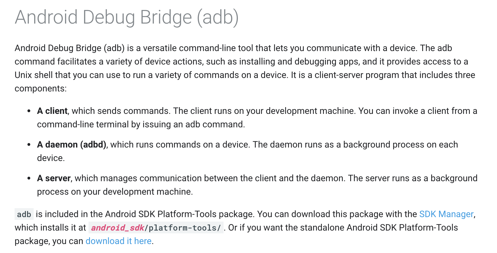
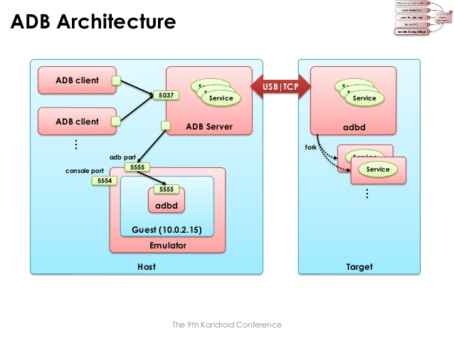
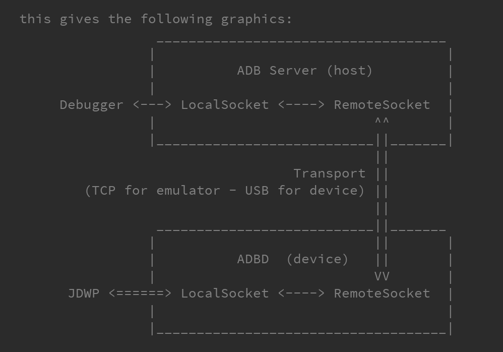
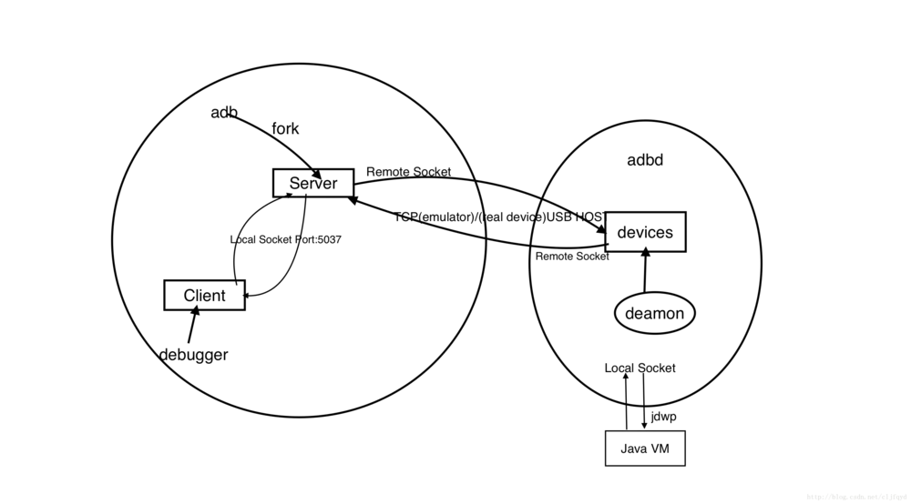
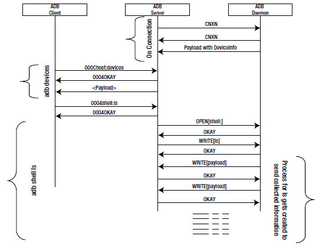
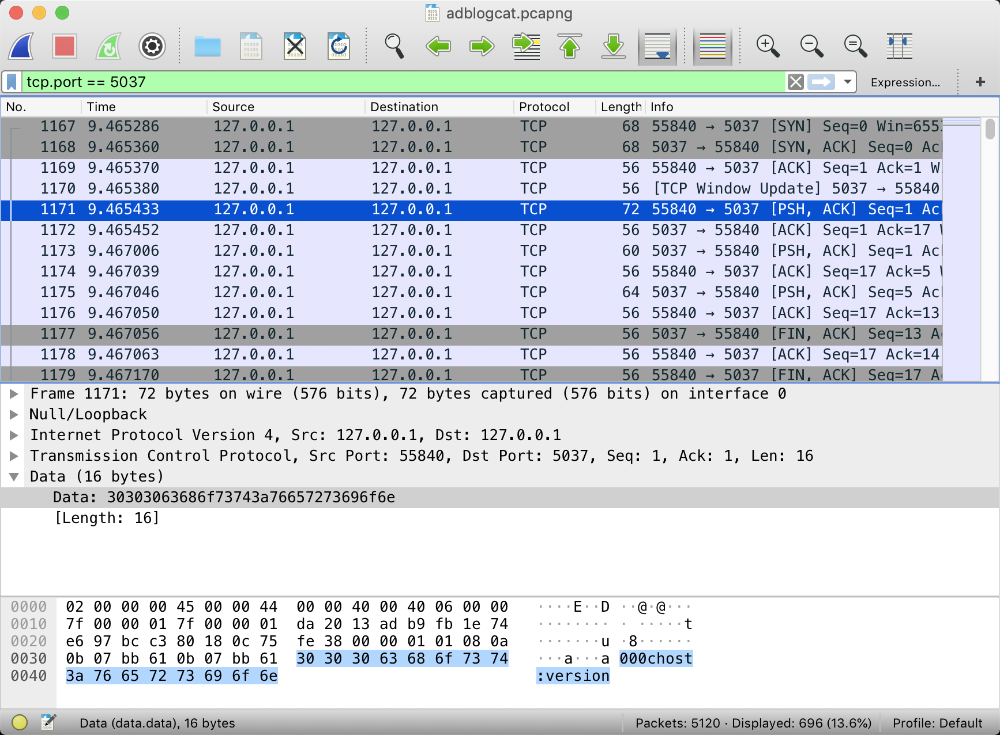
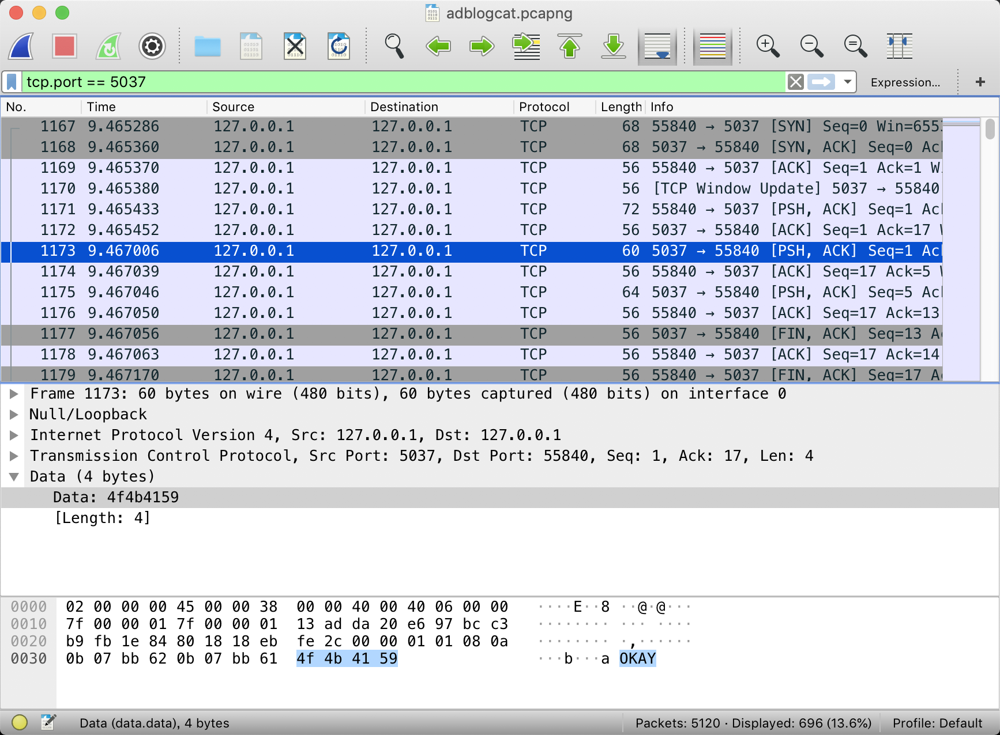
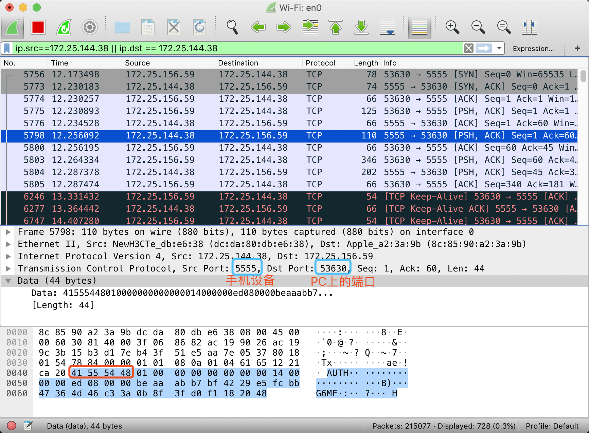

转载自: [【android】adb工具原理探究 | iTimeTraveler](https://itimetraveler.github.io/2019/06/07/Android%20ADB%E5%8E%9F%E7%90%86%E6%8E%A2%E7%A9%B6/)

# 【android】adb工具原理探究 | iTimeTraveler

# ADB简介

> [](https://itimetraveler.github.io/gallery/android_common/ADB-feature.png)

Android Debug Bridge (adb) 是一个Android的命令行工具。可以用来连接模拟器或实际的移动设备。比如 adb logcat, adb shell。Dalvik Debug Monitor Server(DDMS) 后台也是运行的adb来实现监控调试移动设备。

总体而言，adb有两个用途：

*   **监控连接设备** ：adb会监控所有已经连接设备(包括模拟器)，譬如设备所处的状态：ONLINE，OFFLINE, BOOTLOADER或RECOVERY。
*   **提供操作命令** ：adb提供了很多命令(`adb shell`，`adb pull`)，来实现对设备的操控。这些操作命令在adb的体系里面，都称为“服务”。

# ADB 实现原理

Adb的全称为 Android Debug Bridge：Android调试桥，下图为Android官方对adb的介绍：

[](https://itimetraveler.github.io/gallery/android_common/adb-introduce.png)

Android Debug Bridge (adb) 是一个通用命令行工具，其允许我们与模拟器或连接的 Android 设备进行通信。它可为各种设备操作提供便利，如安装和调试应用，并提供对 Unix shell（可用来在模拟器或连接的设备上运行各种命令）的访问。该工具是一个C/S架构实现的程序，包括三个组件：

*   **ADB Client**：运行在PC上，通过在命令行执行adb，就启动了ADB Client程序
*   **ADB Server**：运行于PC的后台进程，用于管理ADB Client和Daemon间的通信
*   **ADB Daemon** (即adbd) ：运行在模拟器或移动设备上的后台服务。当Android系统启动时，由init程序启动adbd。如果adbd挂了，则adbd会由init重新启动。

您可以在 `android_sdk/platform-tools/` 中找到 `adb` 工具。

[](https://itimetraveler.github.io/gallery/android_common/adb_architecture.png)

## ADB 源码

adb的源码在 [system/core/adb](https://itimetraveler.github.io/2019/06/07/Android%20ADB%E5%8E%9F%E7%90%86%E6%8E%A2%E7%A9%B6/[http://androidxref.com/8.1.0_r33/xref/system/core/adb/](http://androidxref.com/8.1.0_r33/xref/system/core/adb/) 目录下，adb和adbd两个二进制程序都是从这个目录下的代码中编译出来的，可以参考 [`Android.mk`](http://androidxref.com/8.1.0_r33/xref/system/core/adb/Android.mk) 文件，通过宏编译开关**ADB\_HOST**来控制：

### Client 和 Server 调用的是 adb

ADB\_HOST=1

```makefile
LOCAL_CFLAGS += \
    $(ADB_COMMON_CFLAGS) \
    -D_GNU_SOURCE \
    -DADB_HOST=1 \

LOCAL_CFLAGS_windows := \
    $(ADB_COMMON_windows_CFLAGS)

LOCAL_CFLAGS_linux := \
    $(ADB_COMMON_linux_CFLAGS) \

LOCAL_CFLAGS_darwin := \
    $(ADB_COMMON_darwin_CFLAGS) \
    -Wno-sizeof-pointer-memaccess -Wno-unused-parameter \

LOCAL_MODULE := adb
```

### 而 emulator/device 调用 adbd

ADB\_HOST=0

```makefile
LOCAL_CFLAGS := \
    $(ADB_COMMON_CFLAGS) \
    $(ADB_COMMON_linux_CFLAGS) \
    -DADB_HOST=0 \
    -D_GNU_SOURCE \
    -Wno-deprecated-declarations \

LOCAL_CFLAGS += -DALLOW_ADBD_NO_AUTH=$(if $(filter userdebug eng,$(TARGET_BUILD_VARIANT)),1,0)

ifneq (,$(filter userdebug eng,$(TARGET_BUILD_VARIANT)))
LOCAL_CFLAGS += -DALLOW_ADBD_DISABLE_VERITY=1
LOCAL_CFLAGS += -DALLOW_ADBD_ROOT=1
endif

LOCAL_MODULE := adbd
```

1、 在PC HOST端，`adb`会fork出一个守护进程（不是adbd），即ADB Server，而父进程（ADB Client）继续处理Client请求，所有的Client通过TCP端口号5037进行与Server通信，而Server创建 local socket 与 remote socket，前者用于和Client通信，后者用与远端进行通信，emulator通过TCP，real device则通过usb。

2、在emulator/device端，`adbd`也创建 local socket 和 remote socket，前者与通过 jdwp 与Java虚拟机进程通信，后者通过 TCP/USB 与 PC HOST通信。

[](https://itimetraveler.github.io/gallery/android_common/daemon_server.png)

Client和Server虽然是同一个执行程序，但在命令行输入一条`adb`命令后，实际上完成了一次通信。在Server启动的时候，会将自己绑定到本地的`5037`端口，当Client有请求到来时，便通过TCP连接Server的5037端口。

通过以下命令，可以看到server的启动日志：

```bash
$ adb kill-server && adb devices
* daemon not running. starting it now on port 5037 *
* daemon started successfully *
```

通过以下命令，可以看到TCP的5037端口，在侦听连接：

```bash
$ netstat -l | grep 5037
Proto Recv-Q Send-Q    Local Address   Foreign Address     State
tcp        0      0    127.0.0.1:5037  0.0.0.0:*           LISTEN
```

当我们执行一些常用的adb命令时，譬如`adb devices`、`adb shell`，server就自动启动了，也可以通过`adb start-server`来启动；如果想要停止server的运行，可以通过`adb kill-server`来杀掉server进程。

## PC上命令行输入adb命令后发生了什么

[](https://itimetraveler.github.io/gallery/android_common/5521037-139ea4a56038e33e.webp)

1.  Client 调用某个 `adb` 命令
2.  adb 进程 fork 出一个子进程作为 Server
3.  Server 查找当前连接的 emulator/device
4.  Server 接收到来自 Client 请求
5.  Server 处理请求，将本地处理不了的请求发给 emulator/device
6.  位于 emulator/device 的 `adbd`拿到请求后交给对应的java虚拟机进程。
7.  adbd 将结果发回给 Server
8.  Server 将结果发回给 Client

[](https://itimetraveler.github.io/gallery/android_common/adb_communication.png)

# ADB Protocol 通信协议

## 1. ADB Client 和 ADB Server 间的通信

这个数据通道是一个本地TCP连接，ADB Server启动以后，在本地的5037端口侦听。ADB Client通过本地的随机端口与5037端口建立连接。

在这个通道上，Client向Server发送的命令都遵循如下格式：

1.  **命令的长度(Length)**，由四位的十六进制表示
2.  **实际的命令(Payload)**，通过ASCII编码

Client 和 Server 间传输的命令定义源码在 [/system/core/adb/SERVICES.TXT](http://androidxref.com/8.1.0_r33/xref/system/core/adb/SERVICES.TXT) 文件中，截取部分命令如下。

```plain
This file tries to document all requests a client can make
to the ADB server of an adbd daemon. See the OVERVIEW.TXT document
to understand what's going on here.

HOST SERVICES:

host:version
    Ask the ADB server for its internal version number.

    As a special exception, the server will respond with a 4-byte
    hex string corresponding to its internal version number, without
    any OKAY or FAIL.

host:kill
    Ask the ADB server to quit immediately. This is used when the
    ADB client detects that an obsolete server is running after an
    upgrade.

host:devices
host:devices-l
    Ask to return the list of available Android devices and their
    state. devices-l includes the device paths in the state.
    After the OKAY, this is followed by a 4-byte hex len,
    and a string that will be dumped as-is by the client, then
    the connection is closed

// 以下省略...
```

譬如，查看adb当前的版本，Client会发起如下命令：

```c
000Chost:version
```

000C：表示”host:version”这条命令的长度为12个字节；

host前缀：是为了区分其他类型的命令(后面还会看到shell前缀的命令)；

[](https://itimetraveler.github.io/gallery/android_common/adbclient_hostversion.png)

Server收到Client的请求后，返回的数据遵循如下格式：

1.  如果成功，则返回四个字节的字符串”**OKAY**“
2.  如果失败，则返回四个字节的字符串”**FAIL**“和**出错原因**
3.  如果异常，则返回**错误码**

当Client收到Server返回的”**OKAY**“后，就可以发继续发起其他操作命令了。

[](https://itimetraveler.github.io/gallery/android_common/adbclient_OKAY.png)

## 2. ADB Daemon 和 ADB Server 间的通信 — transport协议

Android 源码中关于 transport 协议的定义在 [system/core/adb/protocol.txt](https://itimetraveler.github.io/2019/06/07/Android%20ADB%E5%8E%9F%E7%90%86%E6%8E%A2%E7%A9%B6/[http://androidxref.com/8.1.0_r33/xref/system/core/adb/protocol.txt](http://androidxref.com/8.1.0_r33/xref/system/core/adb/protocol.txt) 文件中。下面是 message header 的格式，共占用24字节，分为6个字段（即每个字段占用4字节）：

```c
The transport layer deals in "messages", which consist of a 24 byte
header followed (optionally) by a payload.  The header consists of 6
32 bit words which are sent across the wire in little endian format.

struct message {
    unsigned command;       /* command identifier constant (A_CNXN, ...) */
    unsigned arg0;          /* first argument                            */
    unsigned arg1;          /* second argument                           */
    unsigned data_length;   /* length of payload (0 is allowed)          */
    unsigned data_crc32;    /* crc32 of data payload                     */
    unsigned magic;         /* command ^ 0xffffffff                      */
};
```

并且定义了7种 command，以及每种指令后携带的参数含义 ：

```c
--- message command constants ------------------------------------------

#define A_SYNC 0x434e5953
#define A_CNXN 0x4e584e43
#define A_AUTH 0x48545541
#define A_OPEN 0x4e45504f
#define A_OKAY 0x59414b4f
#define A_CLSE 0x45534c43
#define A_WRTE 0x45545257
```

[](https://itimetraveler.github.io/gallery/android_common/adbtransport_auth.png "使用TCP连接的ADB抓到的包（同一wifi下）")使用TCP连接的ADB抓到的包（同一wifi下）

# 几个问题

一、**PC上为什么要有一个ADB Server，而不是ADB Client 和 ADB Daemon 直接通信呢？**

因为 ADB 是一个需要支持多对多架构的工具，一个PC可以连接多台手机设备或虚拟机，一个手机也可以同时连接多台PC。就需要一个统一的Sever管理多个设备的连接。

# 参考资料

*   [【android】Android ADB工具 adb,adbd,client,server之间的关系](https://www.jianshu.com/p/bf58b58afb1d)
*   [adb介绍](https://duanqz.github.io/2015-05-21-Intro-adb)
