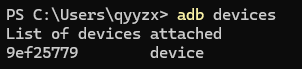
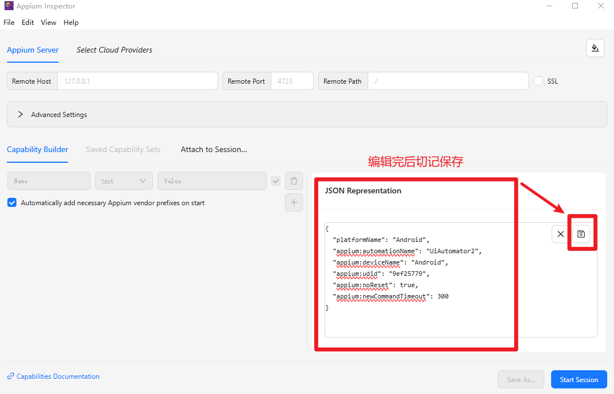

# Android 15 ：如何使用 Appium Inspector 抓取 UI 层级（最完整踩坑指南）

随着 Android 14/15 的持续安全增强，Google 已逐步废弃 UiAutomatorViewer
许多开发者发现无法再通过传统方式抓取 UI 层级，甚至部分手机会直接空白

🔥 Appium Inspector + UiAutomator2 是我自己经过实践之后的一个可用方案

本文将手把手带你在 Windows 上安装、配置并成功连接 Android 15 设备，完成 UI 结构分析

文章内容基于真实踩坑总结，非常适合：
- Android 工程师
- QA 自动化测试
- 逆向 & 自动化开发
- UI 层级分析（如 WhatsApp / 微信 / 系统设置）

## 一、为什么 Android 15 UI 抓取变得困难？

从 Android 12 开始，Google 开始逐步限制下面的权限
- 【系统 UI 布局访问权限】
- 【无障碍层级读取】
- 【截图 & dump 权限】

Android 14/15 上 UiAutomatorViewer 基本不可用（dump 不到层级），同时某些 app 被强制隔离（尤其微信、系统设置）

## 二、环境准备 - Windows
请确保这四个条件已经满足：
（1）Node.js（建议 Node 20）
（2）Android SDK（随 Android Studio 或 cmdline-tools）
（3）Java（JDK 8 或 11）
（4）已开启 USB 调试的 Android 15 手机

确认Android设备已经连接：
```bash
adb devices
```



## 三、安装 Appium + Appium Inspector

安装 Appium
```bash
npm install -g appium
```

启动
```bash
appium
```

看到如下输出表示成功
```bash
[Appium] Welcome to Appium v3.1.0
[Appium] The autodetected Appium home path: C:\Users\qyyzx\.appium
[Appium] Attempting to load driver uiautomator2...
[Appium] Requiring driver at C:\Users\qyyzx\.appium\node_modules\appium-uiautomator2-driver\build\index.js
[Appium] AndroidUiautomator2Driver has been successfully loaded in 0.870s
[Appium] Appium REST http interface listener started on http://0.0.0.0:4723
[Appium] You can provide the following URLs in your client code to connect to this server:
        http://172.22.0.1:4723/
        http://192.168.50.10:4723/
        http://192.168.74.1:4723/
        http://127.0.0.1:4723/ (only accessible from the same host)
[Appium] Available drivers:
[Appium]   - uiautomator2@6.1.0 (automationName 'UiAutomator2')
```

安装 Appium Inspector（官方新版 GUI）

下载地址（官方）：https://github.com/appium/appium-inspector/releases

## 四、配置 Android SDK 环境变量（最关键）

Appium 无法找到 Android SDK 会直接报错：
```bash
Error: Neither ANDROID_HOME nor ANDROID_SDK_ROOT was exported
```

设置环境变量（PowerShell 管理员执行!!!）
```bash
setx ANDROID_HOME "C:\Users\<你的用户名>\AppData\Local\Android\Sdk" /M
```

```bash
setx ANDROID_SDK_ROOT "C:\Users\<你的用户名>\AppData\Local\Android\Sdk" /M
```

```bash
setx PATH "$env:PATH;C:\Users\<你的用户名>\AppData\Local\Android\Sdk\platform-tools" /M
```

验证：
```bash
echo $env:ANDROID_HOME
```

✅ 有输出 → 正常

❌ 无输出 → Appium 无法运行

## 五、安装 uiautomator2 驱动（Android 必须）
```bash
appium driver install uiautomator2
```
如果输出如下：
```bash
AndroidUiautomator2Driver has been successfully loaded
```
说明驱动 OK ✅

## 六、Appium Inspector 中填写 Desired Capabilities（最关键步骤）

⚠️ 请不要用左侧 Capability Builder（容易生成 undefined 字段）
✅ 用右侧 JSON 编辑器直接粘贴：
```json
{
  "platformName": "Android",
  "appium:automationName": "UiAutomator2",
  "appium:deviceName": "Android",
  "appium:udid": "你的 adb 序列号",
  "appium:noReset": true,
  "appium:newCommandTimeout": 300
}
```

查看设备序列号：
```bash
adb devices
```

界面如下



## 七、成功连接 Android 15 并抓取 UI 结构

点击 Start Session
Appium inspector 会开始：
- ✅ 自动安装 uiautomator2 server
- ✅ 自动启动 instrumentation
- ✅ 自动抓取当前界面 UI 层级
- ✅ 在界面左侧显示控件树
- ✅ 右侧显示控件属性（resource-id、text、bounds 等）

从此你可以分析任意 app UI、编写自动化脚本、逆向布局结构、研究业务 app（微信 / WhatsApp / 设置）

## 八、常见错误与解决方案（真实踩坑）

| 错误 | 原因 | 解决方案 |
|-|-|-|
|ANDROID_HOME error                 | 未设置环境变量	    | 设置 ANDROID_HOME、SDK_ROOT|
|connectHardwareKeyboard warning    | iOS 专用字段          | 删除即可|
|empty UI Tree                      | 部分应用有安全限制    | 需改用无障碍服务|
|cannot install uiautomator2 APK    | 小米 / OPPO 权限限制  | 打开 USB 安装权限|