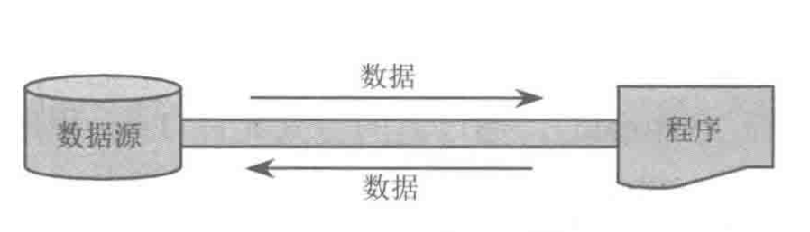
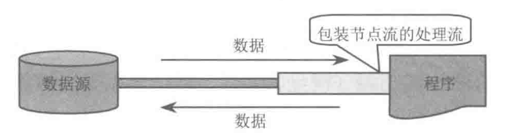
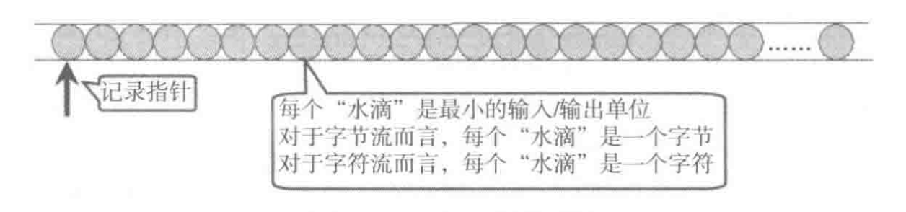
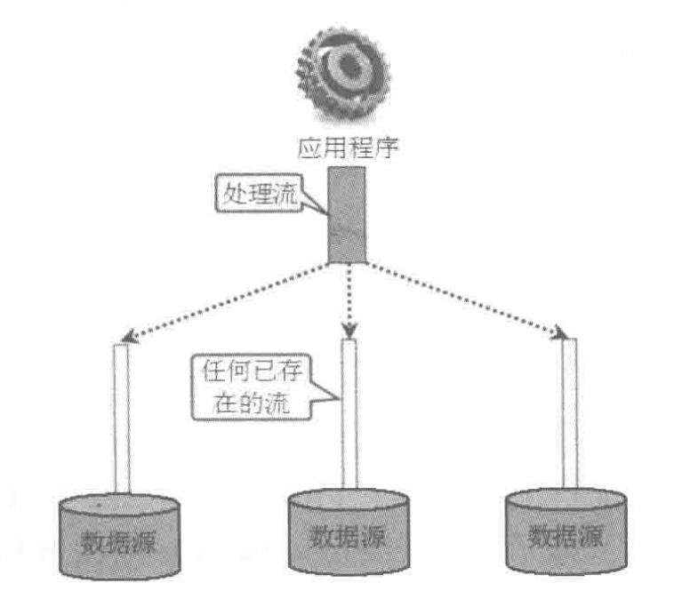
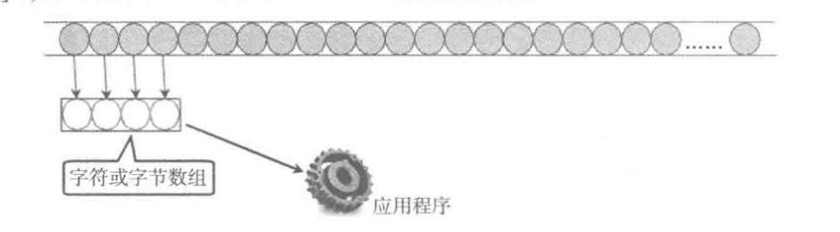
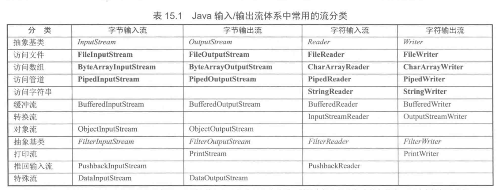
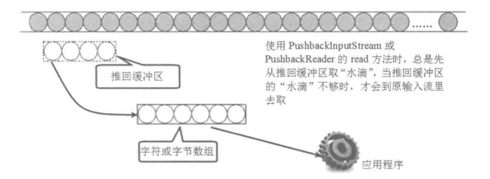

笔记来源：[Java疯狂讲义](https://item.jd.com/12518025.html)

输入机制：允许程序读取外部数据（包括硬盘等存储设备上的数据）、用户输入数据等

输出机制：允许程序记录运行状态，将程序数据输出到磁盘、光盘等

Java的IO操作通过`java.io`包下的类和接口来实现，主要包括输入、输出两种IO流。每种输入输出流又可以分为字节流和字符流。Java的IO流还使用了装饰器设计模式，他将IO流分为` 底层节点流`和` 上层处理流`。

### 一、File类

File类是java.io包下与平台无关的文件和目录，如果希望在程序中操作文件和目录，可以通过它来实现：新建、删除、重命名文件和目录。File不能访问文件内容本身，须通过输入输出流来操作文件内容本身。

#### 1、访问文件和目录

##### a、访问文件名

```java
File file = new File("/Users/mr.stark/Desktop/test.txt");
//返回文件名
System.out.println(file.getName());
//File对象对应的路径名
System.out.println(file.getPath());
//File对象的绝对路径
System.out.println(file.getAbsolutePath());
//File对象的父目录
System.out.println(file.getParent());
//重命名文件对象（目录或者文件）
file.renameTo(new File("/Users/mr.stark/Desktop/Hello.txt"));
```

##### b、文件检测

```java
//文件是否存在
file.exists();
//文件是否可写
file.canWrite();
//判断是否是一个文件（非目录）
file.isFile();
//判断是否是一个目录（非文件）
file.isDirectory();
//判断该对象对应的文件或目录是否是绝对路径
file.isAbsolute();
```

##### c、获取常规文件信息

```java
//文件最后修改时间
System.out.println(file.lastModified());
//文件内容长度
System.out.println(file.length());
```

##### d、文件操作

```java
//创建
file.createNewFile();
//删除
file.delete();
//创建临时文件
File.createTempFile("temp-test", "txt");
//注册一个删除钩子，Java虚拟机退出时删除File文件对应的文件或目录
file.deleteOnExit();
```

##### e、目录操作

```java
//创建FIle对象对应的目录
file.mkdir();
//列出File对象所有的子文件名称
String[] strings = file.list();
//列出File对象所有的子文件路径
File[] files = file.listFiles();
```

有一点需注意，当使用相对路径的File对象来获取父路径时可能引起错误。

#### 2、文件过滤器

File类的` list()`方法可以接收一个FilenameFilter参数，通过该参数可以列出符合条件的文件。

```java
File f = new File(".");
//使用lambda表达式实现文件过滤
String[] nameList = f.list(
  //如果是java文件或者是一个目录就通过
  (dir, name) -> name.endsWith(".java") || new File(name).isDirectory()
);
for (String s : nameList) {
  System.out.println(s);
}
```


### 二、Java的IO流

Java的IO流是实现输入、输出的基础。Java中将不同的输入输出源（键盘、文件、网络连接）抽象描述为“流”（stream），通过“流”的方式允许Java程序使用相同的方式访问不同的输入输出源。

> 由于Java提供了IO流的抽象，所以开发者可以使用一致的IO代码去读写不同的IO流结点

#### 1、流的分类

##### a、输入流和输出流

- 输入流：只能从中读取数据，而不能写入数据。
- 输出流：只能从中写入数据，而不能读取数据。

这里的输入输出是从程序运行所在内存角度来划分的，如数据从内存到硬盘，就是一个输出流。

Java的输入流主要由` InputStream `和` Reader `作为基类，而输出流则由` OutputStream `和` Writer `作为基类

##### b、字节流和字符流

两者几乎一样，字节流操作的数据单元是8位的字节，字符流操作的数据单元是16位的字节。

- 字节流主要由InputStream和OutputStream作为基类
- 字符流主要由Reader和Writer作为基类

##### c、节点流和处理流

- 节点流：向一个特定的IO设备（如磁盘、网络）读写数据的流，也称谓低级流（Low Level Stream）



- 处理流：对一个已存在的流进行连接或封装，通过封装后的流来实现数据读写功能，也称为高级流



> 实际上，Java使用处理流来包装节点流是一种典型的装饰器设计模式

#### 2、流的概念模型

Java将所有设备里的有序数据抽象成流模型，简化了输入输出处理，理解了流的概念模型也就理解了JavaIO。

Java的IO流共涉及到40多个类，彼此之间有着非常紧密的联系。Java的40多个类都是从下面四个抽象基类派生出来的：

- InputStream/Reader：所有输入流的基类，前字节流，后字符流
- OutputStream/Writer：所有输出流的基类，前字节流，后字符流

对于InputStream和Reader而言，可以将输入设备看成一个“水管”，水管里的“水滴”依次排列，如下图：



输出流与输入流类似，它们将输出设备抽象成一个“水管”，只是这个水管里没有任何“水滴”，如下图：


还有一个就是` 处理流`，能够嫁接在任何已存在的流的基础之上，这就允许使用相同的Java代码来访问不同的输入输出设备的数据流，如下所示：




### 三、字符流和字节流

#### 1、InputStream和Reader

InputStream和Reader是所有输入流的抽象基类，是所有其他输入流的模板。

##### InputStream方法：

- int read()

  从输入流中读取单个字节，返回读取的字节数据

- int read(byte[] b)

  从输入流中读取最多读取` b.length() `个字节的数据，将其存储在字节数组b中，返回实际读取的字节数

- int read(byte[] b, int off, int len)

  从输入流中最多读取len个字节的数据，将其存储在字节数组b中（并不是从数组起点开始，而是从off位置开始），返回实际读取的字节数

##### Reader方法：

- int read()

  从输入流中读取单个字符，返回读取的字符数据

- int read(char[] b)

  从输入流中读取最多读取` b.length() `个字符的数据，将其存储在字符数组b中，返回实际读取的字符数

- int read(char[] b, int off, int len)

  从输入流中最多读取len个字符的数据，将其存储在字符数组b中（并不是从数组起点开始，而是从off位置开始），返回实际读取的字符数

这两个基类的基本功能是一样的，从输入流中取数据：



InputStream和Reader都是抽象类，本身不能创建实例，但它们有一种用于读取文件的输入流：FIleInputStream和FileReader，它们都是节点流，下面代码展示了使用FileInputStream读取自身的效果：

```java
public class FileInputStreamTest {
  public static void main(String[] args) throws IOException {
    //创建字节输入流
    InputStream fis = new FileInputStream("/src/main/java/file/JY_File.java");
    //创建一个长度为1024的容器来取东西
    byte[] bbuf = new byte[1024];
    //用于保存实际读取的字节数
    int hasRead = 0;
    //循环读取数据
    while ((hasRead = fis.read(bbuf)) > 0) {
      //将读取的字节数组转换成字符串输入
      System.out.println(new String(bbuf));
    }
  }
}
```


#### 2、OutputStream和Writer

##### OutputStream方法：

- void writer(int c)

  将指定的字节/字符输出到输出流中去，c即可以代表字节，也可以代表字符

- void writer(byte[]/char[] buff)

  将字节/字符数组输出到输出流中去

- void writer(byte[]/char[] buff, int off, int len)

  将字节/字符数组从off位置开始，长度为len的字节/字符数组输出到指定输出流中去

##### Writer方法：

- void writer(String str)

  将字符串输出到输出流中

- void writer(String str, int off, int len)

  将str字符串从off位置开始，长度为len的字符输出到指定流中去

代码如下：

```java
public class FileOutputStream {
  public static void main(String[] args) {
    try {
      //创建字节输入流
      InputStream fis = new FileInputStream("/Users/mr.stark/Desktop/Hello.java");
      //创建字节输出流
      OutputStream fos = new java.io.FileOutputStream("/Users/mr.stark/Desktop/Hello2.java");
      byte[] bbuf = new byte[32];
      int hasRead = 0;
      //循环取数据
      while ((hasRead = fis.read(bbuf)) > 0) {
        //每读取一次，即写入文件流，读多少写多少
        fos.write(bbuf, 0, hasRead);
      }
    } catch (FileNotFoundException e) {
      e.printStackTrace();
    } catch (IOException e) {
      e.printStackTrace();
    }
  }
}
```

> 使用Java的IO流执行输出时，不要忘记关闭输出流，关闭输出流除了可以保障流的物理资源被回收之外，还可以将输出流缓冲区里的数据flush到物理节点里面（close方法执行之前会自动执行flush方法）

如果希望直接输出字符串的内容，使用Writer会更好。


### 四、输入输出流体系

上述四个基类用起来会比较繁琐，这时候可以使用处理流。

#### 1、处理流的用法

` 处理流 `可以隐藏底层设备上节点流的差异，对外提供一个更加方便的输入输出方法。使用处理流的思路是：使用处理流来包装节点流，通过处理流来执行输入输出的功能，让节点流与底层设备交互。

识别处理流：只要流的构造器参数不是一个物理节点，而是已经存在的流。

如下使用PrintStream处理流来包装OutputStream：

```java
public class PrintStreamTest {
  public static void main(String[] args) throws FileNotFoundException {
    OutputStream fos = new FileOutputStream("test.txt");
    PrintStream ps = new PrintStream(fos);
    //使用PrintStream执行输出
    ps.println("普通字符串");
    //直接使用PrintStream输出对象
    ps.println(new FileInputStreamTest());
  }
}
```

> PrintStream非常强大，像之前的` System.out `就是PrintStream类型。一般来说，如果要输出文本，都应该包装成PrintStream后输出。
>
> 在使用了处理流包装了底层节点之后，关闭输入输出资源时，只需关闭最上层的处理流即可。

#### 2、输入输出体系

下面将其按功能分类：



通常来说，字节流的功能比字符流更加强大，因为计算机里的数据都是二进制存放，字节流可以处理所有的二进制文件---如果用字节流来处理文本文件，将字节转化为字符增加了编程难度。故：文本内容-->字符流；二进制内容-->字节流。

#### 4、转换流

输入/输出体系中还提供了两个转换流，这两个转换流用于将字节流转换成字符流：

- InputStreamReader

  将字节输入流转化成字符输入流

- PutputStreamWriter

  将字节输出流转化为字符输出流

> Java不提供将字符流转化为字节流的转换流，因为如果一个流是字符流，它用起来会更方便，没必要转换成为字节流。

下面以获取键盘输入为例：Java使用` System.in `代表标准输入（键盘输入），这个标准类是`InputStream`的实例，用起来不方便，于是使用`InputStreamReader`将其包装为字符输入流。普通的`Reader`读取输入内容时依然不太方便，将`InputStreamReader`包装为`BufferedReader`，可以使用它的` readline() `一次读取一行内容。

```java
public class KeyinTest {
  public static void main(String[] args) {
    try (
      //将System.in对象转换成Reader对象
      InputStreamReader reader = new InputStreamReader(System.in);
      //将普通的Reader包装成BufferedReader
      BufferedReader br = new BufferedReader(reader)
      //BufferedReader具有缓冲功能，一次读取一行内容（以换行符为标志），如果没有读到换行符，程序阻塞。
    ) {
      String line;
      //采用循环方式逐行读取
      while ( (line = br.readLine()) != null ) {
        //如果读取到的字符是"exit"
        if (line.equals("exit")) {
          System.exit(1);
        }
        //打印读取内容
        System.out.println(line);
      }
    } catch (IOException e) {
      e.printStackTrace();
    }
  }
}
```

#### 4、推回输入流

在输入/输出体系中，有两个特殊的流与众不同，就是` PushbackInputStream `和` PushbackReader `，提供了如下三个方法：

- void unread(byte[]/char[] buf)

  将一个字节/字符数组内容推到缓冲区里，从而允许重复读取刚刚读取的内容。

- void unread(byte[]/char[] buf, int off, int len)

  将一个字节/字符数组内容（从off开始，长度为len）推到缓冲区里，从而允许重复读取刚刚读取的内容。

- void unread(int b)

  将一个字节/字符推到缓冲区里，从而允许重复读取刚刚读取的内容。

这俩推回输入流都带有一个推回缓冲区，当调用` unread() `方法时，系统会将指定的数组内容推回到该缓冲区，当调用` read() `方法时，总是会先从该推回缓冲区读取，只有完全读取了推回缓冲区的内容但还没有装满` read() `所需的数组大小时才会从原输入流中读取：



如下示例代码（将指定内容推回缓冲区，再调用`read()`方法读取缓冲区的部分内容）：

```java
public class PushbackTest {
    public static void main(String[] args) {
        try(//创建一个PushbackReader对象，指定推回缓冲区的长度为64
            PushbackReader pr = new PushbackReader(
                        new FileReader("/Users/mr.stark/Desktop/test.java"), 64) ) {
            char[] buf = new char[32];
            //用以保存上次读取的字符串内容
            String lastContent = "";
            int hasRead = 0;
            while ( (hasRead = pr.read(buf)) > 0 ) {
                //将读取的内容转换成字符串
                String content = new String(buf, 0, hasRead);
                int targetIndex = 0;
                //将上次读取的字符串和本次读取的字符串拼起来
                //看看是否包含目标字符串
                if ((targetIndex = (lastContent + content)
                        .indexOf("new PushbackReader")) > 0) {
                    //将本次内容和上次内容一起推回到缓冲区
                    pr.unread((lastContent + content).toCharArray());
                    //重新定义一个长度为targetIndex的char数组
                    if (targetIndex > 32) {
                        buf = new char[targetIndex];
                    }
                    //再次读取指定的内容
                    pr.read(buf, 0, targetIndex);
                    //打印读取的内容
                    System.out.print(new String(buf, 0, targetIndex));
                    System.exit(0);
                } else {
                    //打印上次读到的内容
                    System.out.print(lastContent);
                    //将字符串内容设为上次读取的内容
                    lastContent = content;
                }
            }
        } catch (FileNotFoundException e) {
            e.printStackTrace();
        } catch (IOException e) {
            e.printStackTrace();
        }
    }
}
```


### 五、重定向标准输入输出

Java的标准输入、输出分别通过` System.in `和` System.out `来代表，默认情况下分别代表键盘和显示器。

在System类里提供了如下三个重定向标准标准输入/输出的方法，如下：

- ```java
  //重定向“标准”错误输入流
  static void setErr(PrintStream err)
  ```

- ```java
  //重定向“标准”输入流
  static void setIn(InputStream in)
  ```

- ```java
  //重定向“标准”输出流
  static void setOut(PrintStream out)
  ```

  下面通过程序通过重定向标准输出流将` System.out `重定向到文件输出：

  ```java
  public class RedirectOut {
      public static void main(String[] args) {
          try {
              //一次性创建PrintStream输出流
              PrintStream ps = new PrintStream(new FileOutputStream("out.txt"));
              //将标准输出重定向到ps输出流
              System.setOut(ps);
              //向标准输出输出一个字符串
              System.out.println("疯狂Java讲义");
              //向标准输出输出一个对象
              System.out.println(new RedirectOut());
          } catch (FileNotFoundException e) {
              e.printStackTrace();
          }
      }
  }
  ```

  上述代码将系统的标准输出重定向到该PrintStream输出流，咱们再来看一个将` System.in `重定向栗子：

  ```java
  public class RedirectIn {
      public static void main(String[] args) {
          try {
              FileInputStream fis = new FileInputStream("/Users/mr.stark/Desktop/test.java");
              //将标准输入重定向到fis输入流
              System.setIn(fis);
              //使用System.in创建Scanner对象，用于获取标准输入
              Scanner sc = new Scanner(System.in);
              //增加下面一行将回车作为分隔符
              sc.useDelimiter("\n");
              //判断是否有下一个输入项
              while (sc.hasNext()) {
                  //输出输入项
                  System.out.println(sc.next());
              }
          } catch (FileNotFoundException e) {
              e.printStackTrace();
          }
      }
  }
  ```

### 六、Java虚拟机读写其他进程的数据

Runtime对象的` exec()`可以运行平台上的其他程序，该方法产生一个Process对象，代表该Java程序启动的子进程。该类提供了以下三个方法用于让程序与其他子进程通信：

- ```java
  //获取子进程的输入流
  public abstract InputStream getInputStream();
  ```

- ```java
  //获取子进程的错误流
  public abstract InputStream getErrorStream();
  ```

- ```java
  //获取子进程的输出流
  public abstract OutputStream getOutputStream();
  ```

> 此处输入流、输出流很容易让人混淆，如果试图让子进程读取程序中的数据，应该用输入流还是输出流？不是输入流，而输出流。要站在Java程序员的角度考虑问题，要让Java程序把数据输出到子进程中，所以是输出流。

下面的这个程序演示了读取其他进程的输出信息：

```java
public class ReadFromProcess {
    public static void main(String[] args) throws IOException {
        //运行javac命令，返回运行该命令的子进程
        Process p = Runtime.getRuntime().exec("javac");
        //以p进程的错误流创建BufferedReader对象，这个错误流对本程序是输入流，对启动的进程是输出流
        BufferedReader br = new BufferedReader(new InputStreamReader(p.getInputStream()));
        //循环读取p进程的错误输出
        String buff;
        while ( (buff = br.readLine()) != null ) {
            System.out.println(buff);
        }
    }
}
```

上面程序中的` Process p = Runtime.getRuntime().exec("javac");`启动了javac程序。

### 七、RandomAccessFile


### 八、Java9改进的对象序列化

> 对象序列化的目标是将对象保存在磁盘中或者在网络中传输。对象序列化机制允许把内存中的Java对象转换成与平台无关的二进制流，从而允许把这种二进制流持久的保存在磁盘上或者通过网络传输。其他程序获得了这种二进制流之后可以将其恢复为Java对象。

#### 1、序列化的含义与意义

序列化机制允许将实现序列化的Java对象转化为字节序列（从而方便存储在磁盘上或者在网络节点间传输），以备以后恢复成Java对象。序列化机制就使得对象可以脱离程序运行而独立存在。

对象序列化（Serialize）只将一个Java对象写入IO流中，与之对应，反序列化（Deserialize）则指从IO流中恢复对象。

Java9增强了对象序列化机制，允许对读入的序列化数据进行过滤，这种过滤可在反序列化之前对数据进行校验，从而提高程序健壮性和安全性。要让某个类是可序列化的，需实现下面两个接口之间的一个：

- Serializable
- Externalizable

Java很多类已经实现了Serializable，这是一个标记接口，实现该接口无需实现任何方法，他只是表明该类的实例是可以序列化的。

所有可能在网络上传输的对象的类都应该是可序列化的，否则程序将出现异常，如RMI（Remote Method Invoke，即远程方法调用）过程中的参数与返回值；所有需要保存到磁盘里的对象的类都必须可以序列化。例如Web应用中需要保存到HttpSession或ServletContext属性的Java对象。

#### 2、使用对象流实现序列化

一旦某个类实现了Serializable接口，他就是可序列化的，下面通过程序来看看：

```java
//---------------------------------------Person对象---------------------------------------
@Data
public class Person implements Serializable {
    private String name;
    private int age;
    //这里没有提供无参构造器
    public Person(String name, int age) {
        this.name = name;
        this.age = age;
    }
}

//---------------------------------------TestSerializable---------------------------------------
public class TestSerializable {
    public static void main(String[] args) throws IOException {
        //创建一个ObjectOutputStream输出流
        ObjectOutputStream oos = new ObjectOutputStream(new FileOutputStream("object.txt"));
        //将一个Person对象输出到输出流中
        Person per = new Person("xty", 18);
        oos.writeObject(per);
    }
}
```

如果Person没有实现Serializable接口，则会报错：` java.io.NotSerializableException`异常。

接下来我们尝试将` object.txt`恢复为一个Java对象：

```java
public class ReadObject {
    public static void main(String[] args) throws IOException, ClassNotFoundException {
        //创建一个ObjectInputStream输入流
        ObjectInputStream ois = new ObjectInputStream(new FileInputStream("object.txt"));
        //读取Java对象并强转为Person对象
        Person p = (Person) ois.readObject();
        //输出该对象
        System.out.println(p);
    }
}
```

上述代码使用` Person p = (Person) ois.readObject();`读取了Java对象。须注意的是：反序列读的仅仅是Java对象的数据，而非Java类，因此采用反序列化恢复数据时必须提供Java对象所属的Class文件，否则会引发` ClassNotFoundException `异常。

当一个可序列化对象有多个父类时（包括直接父类和间接父类），这些父类要么有无参构造器，要么也是可序列化的-否则会抛出` InvalidClassException `异常。如果父类只是带有无参数的构造器，则父类中的成员变量是不会序列化到二进制流中去的。

#### 3、对象引用的序列化

