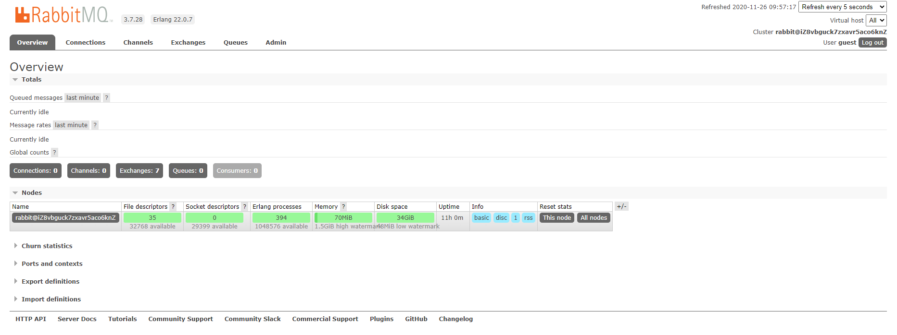

> 这几天和几个小伙伴写活动平台的项目 有消息通知的功能需求 故学习一下RabbitMQ

### 一、RabbitMQ是什么？

RabbitMQ是流行的开源消息队列系统，是AMQP（Advanced Message Queuing Protocol高级消息队列协议）的标准实现，用erlang语言开发。RabbitMQ据说具有良好的性能和时效性，同时还能够非常好的支持集群和负载部署，非常适合在较大规模的分布式系统中使用。


### 二、RabbitMQ安装步骤

> 由于RabbitMQ是基于Erlang（面向高并发的语言）语言开发，所以在安装RabbitMQ之前，需要先安装Erlang

#### 安装Erlang和socat(失败安装)

> 我们安装最新版本的Erlang到服务器中。 Erlang在默认的YUM存储库中不可用，因此需要安装EPEL存储库。 

```bash
# 先执行第一个命令安装EPEL存储库
[root@iZ8vbguck7zxavr5aco6knZ ~]# yum -y install epel-release

Loaded plugins: fastestmirror                                                                             | 3.6 kB  00:00:00     
......

Installed:
  epel-release.noarch 0:7-13                                                                                                    

Complete!

# 再执行第二个命令安装Erlang和socat
[root@iZ8vbguck7zxavr5aco6knZ ~]# yum -y install erlang socat

Complete!

```

> 安装完之后看看版本

```bash
[root@iZ8vbguck7zxavr5aco6knZ ~]# erl -version

Erlang (SMP,ASYNC_THREADS,HIPE) (BEAM) emulator version 5.10.4
```

#### 安装RabbitMQ

> 可以去官网下载rpm包 [点此前往下载](https://www.rabbitmq.com/download.html) 3.8版安装之后没有config文件 [点此下载旧版本](https://github.com/rabbitmq/rabbitmq-server/releases/download/v3.7.28/rabbitmq-server-3.7.28-1.el7.noarch.rpm)

```bash
[root@iZ8vbguck7zxavr5aco6knZ RabbitMQ]# ls

rabbitmq-server-3.8.9-1.el7.noarch.rpm rabbitmq-server-3.7.28-1.el7.noarch.rpm
```

> 执行安装程序，这里发生了错误，由于安装的rabbitmq需要的erlang版本得 >= 21.3，而我们是 5.10.4，故erlang得重新安装

```bash
[root@iZ8vbguck7zxavr5aco6knZ RabbitMQ]# yum install rabbitmq-server-3.8.9-1.el7.noarch.rpm

Error: Package: rabbitmq-server-3.8.9-1.el7.noarch (/rabbitmq-server-3.8.9-1.el7.noarch)
           Requires: erlang >= 21.3
           Installed: erlang-R16B-03.18.el7.x86_64 (@epel)
               erlang = R16B-03.18.el7
 You could try using --skip-broken to work around the problem
 You could try running: rpm -Va --nofiles --nodigest
 
 [root@iZ8vbguck7zxavr5aco6knZ ~]# erl -version
 
Erlang (SMP,ASYNC_THREADS,HIPE) (BEAM) emulator version 5.10.4
```

#### 重新安装Erlang和socat(又一次失败了)

> 接下来我们使用脚本更新yum存储库，以下命令均不会有提示消息

```bash
# 导入将从2018年12月1日（GMT）开始使用的新PackageCloud密钥
[root@iZ8vbguck7zxavr5aco6knZ RabbitMQ]# rpm --import https://packagecloud.io/rabbitmq/rabbitmq-server/gpgkey

# 导入将在2018年12月1日（GMT）停止使用的旧PackageCloud密钥
[root@iZ8vbguck7zxavr5aco6knZ RabbitMQ]# rpm --import https://packagecloud.io/gpg.key

# 导入RabbitMQ签名密钥 这使RPM工具信任存储库中提供的软件包上的签名。为此，以超级用户身份运行rpm --import
[root@iZ8vbguck7zxavr5aco6knZ RabbitMQ]# rpm --import https://github.com/rabbitmq/signing-keys/releases/download/2.0/rabbitmq-release-signing-key.asc
```

> 然后发现更新yum存储库以后安装erlang时没有安装包，没办法，apm安装包安装吧！[官网下载](https://www.erlang.org/downloads)

```bash
[root@iZ8vbguck7zxavr5aco6knZ RabbitMQ]# sudo yum install erlang-22.2.1-1.el7.x86_64

No package erlang-22.2.1-1.el7.x86_64 available.
```

> 有可能下载比较慢，需要科学上网

```bash
[root@iZ8vbguck7zxavr5aco6knZ RabbitMQ]# ls

otp_src_23.1.tar.gz  rabbitmq-server-3.8.9-1.el7.noarch.rpm
```

> 开始安装前准备

解压

```bash
tar -xzvf otp_src_23.1.tar.gz 
```

创建安装目录

```bash
mkdir /opt/erlang_23.1
```

安装各种依赖

```bash
yum -y install gcc-c++
```

```bash
yum -y install ncurses-devel
```

```bash
yum -y install openssl
```

```bash
yum -y install openssl-devel
```

```bash
yum -y install unixODBC-devel
```

进入otp_src_23.1进行configure，会有警告，忽略即可

```bash
[root@iZ8vbguck7zxavr5aco6knZ otp_src_23.1]# ./configure --prefix=/opt/erlang_23.1/

......
#以下为警告信息
*********************************************************************
**********************  APPLICATIONS INFORMATION  *******************
*********************************************************************

wx             : No OpenGL headers found, wx will NOT be usable
No GLU headers (glu.h) found, wx will NOT be usable
wxWidgets not found, wx will NOT be usable

*********************************************************************
*********************************************************************
**********************  DOCUMENTATION INFORMATION  ******************
*********************************************************************

documentation  : 
                 fop is missing.
                 Using fakefop to generate placeholder PDF files.

*********************************************************************
```

现在就可以进行安装啦！

```
make && make install
```

然鹅装好以后，配置环境变量之后，还是老版本

```bash
[root@iZ8vbguck7zxavr5aco6knZ RabbitMQ]# erl -version

Erlang (SMP,ASYNC_THREADS,HIPE) (BEAM) emulator version 5.10.4
```

#### 彻底卸载erlang

> 首先直接删除安装文件

```bash
rm -rf /opt/erlang_23.1
```

> 然后执行下面三条命令，基本就可以删除了

```bash
[root@iZ8vbguck7zxavr5aco6knZ RabbitMQ]# yum list | grep erlang
[root@iZ8vbguck7zxavr5aco6knZ RabbitMQ]# yum -y remove erlang-*
[root@iZ8vbguck7zxavr5aco6knZ RabbitMQ]# yum remove erlang.x86_64
```

#### 最后试试官方的方法(成功安装最新erlang)

> [官方](https://github.com/rabbitmq/erlang-rpm)的方法，先创建一个文件

```bash
vim /etc/yum.repos.d/rabbitmq-erlang.repo
```

> 在其中添加以下内容

```bash
# In /etc/yum.repos.d/rabbitmq_erlang.repo
[rabbitmq_erlang]
name=rabbitmq_erlang
baseurl=https://packagecloud.io/rabbitmq/erlang/el/7/$basearch
repo_gpgcheck=1
gpgcheck=1
enabled=1
# PackageCloud's repository key and RabbitMQ package signing key
gpgkey=https://packagecloud.io/rabbitmq/erlang/gpgkey
       https://dl.bintray.com/rabbitmq/Keys/rabbitmq-release-signing-key.asc
sslverify=1
sslcacert=/etc/pki/tls/certs/ca-bundle.crt
metadata_expire=300

[rabbitmq_erlang-source]
name=rabbitmq_erlang-source
baseurl=https://packagecloud.io/rabbitmq/erlang/el/7/SRPMS
repo_gpgcheck=1
gpgcheck=0
enabled=1
# PackageCloud's repository key and RabbitMQ package signing key
gpgkey=https://packagecloud.io/rabbitmq/erlang/gpgkey
       https://dl.bintray.com/rabbitmq/Keys/rabbitmq-release-signing-key.asc
sslverify=1
sslcacert=/etc/pki/tls/certs/ca-bundle.crt
metadata_expire=300
```

> 执行安装命令

```bash
yum install erlang
```


### 安装RabbitMQ

> rpm安装即可

```bash
[root@iZ8vbguck7zxavr5aco6knZ RabbitMQ]# rpm -ivh rabbitmq-server-3.7.28-1.el7.noarch.rpm

Preparing...                          ################################# [100%]
Updating / installing...
   1:rabbitmq-server-3.7.28-1.el7     ################################# [100%]
```

> 默认安装完成后配置文件模板在:/usr/share/doc/rabbitmq-server-3.7.28/rabbitmq.config.example目录中,需要将配置文件复制到/etc/rabbitmq/目录中,并修改名称为rabbitmq.config

```bash
cp /usr/share/doc/rabbitmq-server-3.7.28/rabbitmq.config.example /etc/rabbitmq/rabbitmq.config
```

至此，安装完成！！！


### 三、RabbitMQ基本使用

> 启动RabbitMQ的服务

```bash
systemctl start rabbitmq-server
```


> 停止RabbitMQ的服务

```bash
systemctl stop rabbitmq-server
```


> 重启RabbitMQ的服务

```bash
systemctl restart rabbitmq-server
```


> 查看RabbitMQ服务状态

```bash
systemctl status rabbitmq-server
```


> 插件管理命令

```bash
rabbitmq-plugins enable|list|disable 
```


> 在浏览器访问 http://ip:15672/ ，会出现以下界面，记得要开放15672端口，或者关闭防火墙


> 通过此用户进入系统  username:  guest    password:  guest，显示如下界面





### 四、RabbitMQ彻底删除

> 依次执行下面三条语句

```bash
# 停止RabbitMQ
[root@iZ8vbguck7zxavr5aco6knZ RabbitMQ]# systemctl stop rabbitmq-server
[root@iZ8vbguck7zxavr5aco6knZ RabbitMQ]# yum list | grep rabbitmq
[root@iZ8vbguck7zxavr5aco6knZ RabbitMQ]# yum -y remove rabbitmq-server.noarch
```

> 找出所有文件，赶尽杀绝，在根目录下执行下面这条语句(切记！！！)找出来后后依次删除即可

```bash
find / -name rabbit*
```


### 五、总结

折腾了快一天，写几个点防止后人踩雷吧

- erlang 和 rabbitMQ 的版本一定要对应，如之前我使用 23.1的erlang 和 3.7.28 的RabbitMQ ，结果 RabbitMQ 不能启动
- 我目前安装的最新的版本如 3.8.9 的 RabbitMQ 安装以后 /usr/share/doc/rabbitmq-server-3.8.9/ 下没有配置模板文件
- yum 安装的 erlang 版本一般都比较低，可以去看看官方教程安装最新版
- erlang 和 rabbitMQ 的版本一定要对应！！！切记！！！具体可以去 rabbitMQ 官网查看