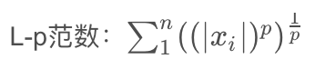

机器学习、深度学习的基础除了编程语言之外, 还有一个就是应用数学。一般包括`线性代数`、`概率论与信息论`、`概率图`、`数值计算与最优化`等。

## 一、标量、向量、矩阵和张量

### 1、标量(scalar)

一个标量是一个单独的数, 一般用小写的变量名称表示, 如a、z等

### 2、向量(vector)

向量就是一列数或者一个一维数组, 我们可以把向量看作空间里的点, 如下: a可以看作一个一维数组

```python
import numpy as np

a = np.array([1, 2, 3, 8])
print(a.size)
print(a[0], a[-1])
```

### 3、矩阵(matrix)

就是一个二维数组, 具体操作见上一篇笔记

```python
import numpy as np

A = np.array([[1, 2, 3], [4, 5, 6]])
print(A)
print(A.size)       # 显示矩阵元素总个数
print(A.shape)      # 显示矩阵的行数和列数
print(A[0, 0], A[0, 1])
print(A[1, :])      # 打印矩阵第二行
```

矩阵还可以用嵌套向量生成, 和向量一样。

### 4、张量(tensor)

张量是向量和矩阵的推广, 标量-->零阶张量, 矩阵-->二阶张量, 以此类推。如一张图片就是一个三阶张量, 三个维度分别代表图片的高度、宽度和色彩数据。

```python
import numpy as np

# np.arange(num)---生成一个从0到num-1步数为1的一维数组
# ndarray.reshape((N,M,...))---将ndarray转化为N*M*...的多维数组
B = np.arange(16).reshape((2, 2, 4))    # 生成一个2*2*4的三阶矩阵
print(B)
print(B.size)       # 显示B的元素总数
print(B.shape)      # 显示B的维度
print(B[0, 0, 0])
```

### 5.转置(transpose)

转置就是以主对角线(左上到右下)为轴进行镜像操作, 通俗来说就是行列互换, 如下所示:

```python
import numpy as np

C = np.array([[1, 2, 3], [4, 5, 6]])
CT = C.T
print(C)
print(CT)
```


## 二、矩阵和向量运算


## 三、特殊矩阵与向量

### 1、可逆矩阵

𝐴⁻¹𝐴=𝐼𝘯 (其中𝐼𝘯为单位矩阵)

### 2、对角矩阵

只有对角线上的元素为非零元素, 其余全为零

### 3、对称矩阵

𝐴=𝐴ᵀ

### 4、单位向量

任意给定的向量𝘷, 若其𝙇²范数为, 即`||𝘷||₂=1`, 则𝘷为单位向量

### 5、正交向量

𝐴𝐴ᵀ=𝐴ᵀ𝐴=𝐼 (单位向量)


## 四、线性相关性及向量空间

由多个同维度的的列向量构成的集合称为向量组

### 1、线性组合

### 2、线性相关

### 3、向量组的秩


## 五、范数

我们通过范数(Norm)来衡量向量的大小, 定义如下:



如何使用上代码:

```python
import numpy as np
import numpy.linalg as LA   # 导入Numpy的线性代数库

x = np.arange(0, 1, 0.1)    # 生成步长为0.1的十个数
print(x)

x1 = LA.norm(x, 1)          # 计算1的范式
x2 = LA.norm(x, 2)          # 计算2的范式
xa = LA.norm(x, np.inf)     # 计算无穷范式

print(x1)
print(x2)
print(xa)
```


## 六、特征值分解

特征分解是使用最广的矩阵分解之一，将矩阵分解为一组特征向量和特征值。下面来看看他们的概念，设A是一个n阶方阵，如果存在实数$\lambda$和n维的非零向量x，满足：

$Ax=\lambda x$

那么$\lambda$称为方阵A的特征值，向量x为矩阵A对应特征值$\lambda$的特征向量

假设矩阵A有n个线性无关的特征向量{v¹, v², v³, ···, vⁿ}，他们对应的特征值为{$\lambda$₁, $\lambda$₂, $\lambda$₃, ···, $\lambda$𝓃}，把这n个线性无关的特征向量构成一个新方阵，每一列就是一个特征向量

$V=[v¹, v², v³, ···, vⁿ]$

用特征值构成一个n阶对角矩阵，对角线的元素都是特征值

$diag(\lambda)=[v¹, v², v³, ···, vⁿ]ᵀ$

那么，A的特征分解可表示为：

$A=Vdiag(\lambda)V⁻¹$

注意：并非所有的方阵都能进行特征值分解，一个方阵能进行特征值分解的充要条件是它含有n个线性无关的特征向量

下面我们来展示下求方阵的特征向量与特征值：

```python
import numpy as np

# np.linalg.eigvals(a)---计算矩阵的特征值
# np.linalg.eig(a)---返回包含特征值和对应特征向量的元组
a = np.array([[1, 2], [3, 4]])  # 示例矩阵
A1 = np.linalg.eigvals(a)       # 得到特征值
A2, V1 = np.linalg.eig(a)       # 其中A2也是特征值，B为特征向量
print(A1)
print(A2)
print(V1)
```


## 七、奇异值分解


## 八、迹运算

迹运算返回的是矩阵对角元素的的和：

$Tr(A)=\sum_{i}A_{i,i}$

迹运算在某些场合非常有用，若不使用求和符号，某些矩阵运算很难描述。例如，迹运算提供了一种描述矩阵Frobenius范数的方式：

$||A||_{F}=\sqrt{Tr(AAᵀ)}$

利用NumPy对矩阵求迹同样方便，上代码

```python
import numpy as np

C = np.array([[1, 2, 3], [4, 5, 6], [7, 8, 9]])
TrC = np.trace(C)

D = C - 2
TrCT = np.trace(C.T)
TrCD = np.trace(np.dot(C, D))
TrDC = np.trace(np.dot(D, C))

print(TrC)
print(TrCT)
print(TrCD)
print(TrDC)
```


## 九、用Python实现主成分分析

