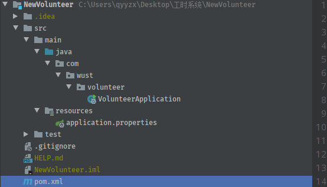
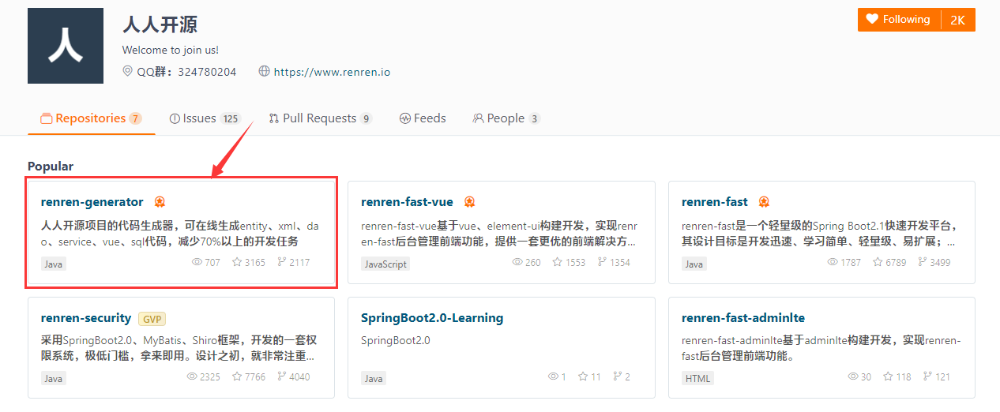
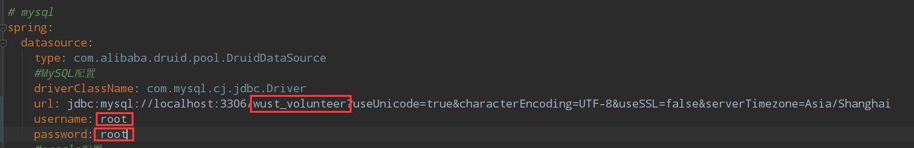
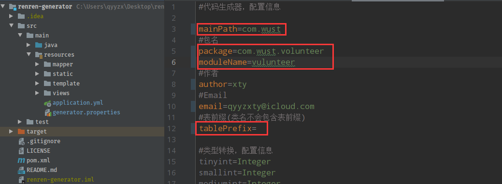
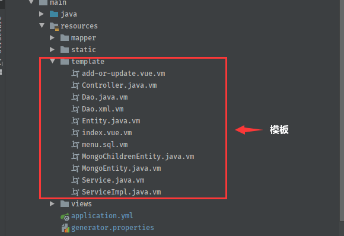
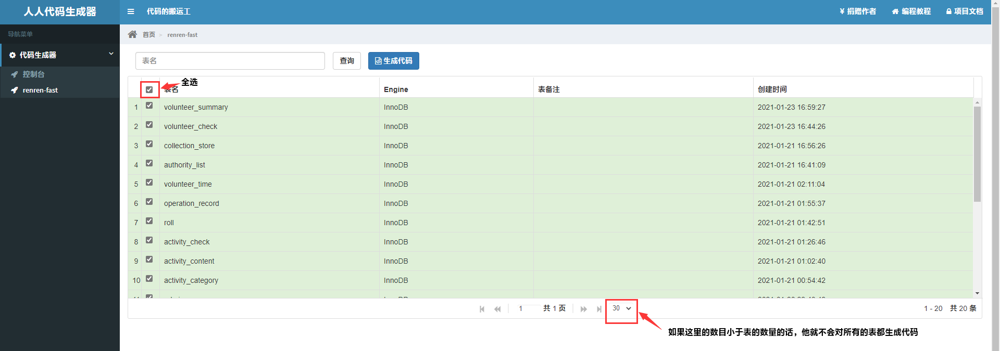

> renren-fast是一个轻量级的Spring Boot2.1快速开发平台，它能快速帮我们搭建好一个项目以及生成一些基本的增删改查代码，介样的话我们就能更好地专注于我们自己的一些业务，真香！！！

那么下面我们就开始吧！

### 一、创建springboot项目

我们要先自己创建好数据库，由于自己刚好要写项目，于是我自己就创建的下面这一个springboot项目：



### 二、克隆renren-fast代码

人人开源官方gitee地址：[人人开源](https://gitee.com/renrenio)

来到官方网址以后，咱找到仓库里的`renren-generator`（如下），将他的项目整个clone到我们自己的电脑上。可以看到他有好几个开源项目，之后我们都可以去试试他们



### 三、修改配置文件

- 数据库

我们先用IDEA打开我们刚刚下载好的项目，打开我们的`application.yml`配置文件，修改url、username、password



- 代码生成配置

我们再来到`generator.properties`中，跟据自己的项目来修改即可



- 修改模板

来到`/resource/template`下（如下图），其实模板里面就是对应着代码的生成规则（controller、dao、entity等），我们将`Controller.java.vm`里的这段代码`@RequiresPermissions("${moduleName}:${pathName}:list")`注释掉，记得有5个！然后删除`import org.apache.shiro.authz.annotation.RequiresPermissions;`就可以啦！



### 四、生成代码

激动的心，颤抖的手终于可以生成代码了嘿嘿嘿，我们先来启动我们的项目，并在浏览器中访问[localhost](http://localhost/)



生成的压缩包，直接把main文件夹复制粘贴到自己的项目就好啦！

### 五、修改代码

自动生成的代码我们还要进行亿点点修改

- 导入依赖

```xml
<!-- spring-web框架 -->
<dependency>
    <groupId>org.springframework</groupId>
    <artifactId>spring-web</artifactId>
    <version>5.3.1</version>
</dependency>
<!-- mybatis-plus持久层框架 -->
<dependency>
    <groupId>com.baomidou</groupId>
    <artifactId>mybatis-plus</artifactId>
    <version>3.4.2</version>
</dependency>
<!-- lombok -->
<dependency>
    <groupId>org.projectlombok</groupId>
    <artifactId>lombok</artifactId>
    <version>1.18.16</version>
</dependency>
```

